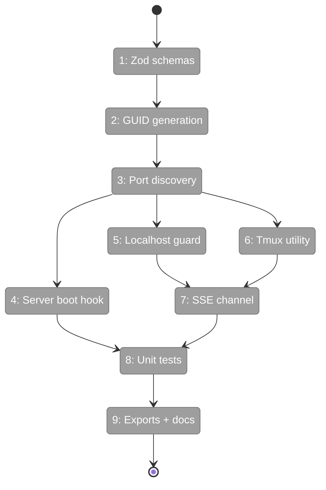
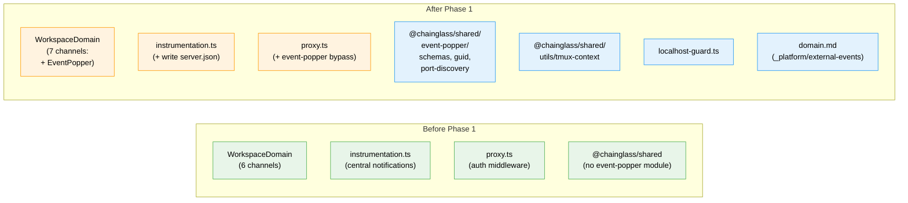

# Flight Plan: Phase 1 — Event Popper Infrastructure

**Plan**: [plan.md](../../plan.md)
**Phase**: Phase 1: Event Popper Infrastructure (`_platform/external-events`)
**Generated**: 2026-03-07
**Status**: Landed

---

## Departure → Destination

**Where we are**: The codebase has a mature SSE broadcasting system (`_platform/events`), global state system (`_platform/state`), and auth middleware (`proxy.ts`). No external event system exists — there's no way for CLI tools or agents to communicate with the web UI outside of workflow graphs. Tmux context is embedded in agents/terminal code with no shared utility.

**Where we're going**: After Phase 1, shared infrastructure exists for any future Event Popper concept: generic Zod envelope schemas, a port discovery mechanism (CLI can find the running server), a localhost-only API guard (secure unauthed access), a reusable tmux detection utility, and an SSE channel registered for event popper notifications. A developer can import `@chainglass/shared/event-popper` and build a new concept (questions, approvals, notifications) on top.

---

## Domain Context

### Domains We're Changing

| Domain | What Changes | Key Files |
|--------|-------------|-----------|
| `_platform/external-events` (NEW) | Create domain: envelope schemas, GUID, port discovery, tmux utility | `packages/shared/src/event-popper/*`, `packages/shared/src/utils/tmux-context.ts` |
| `_platform/events` (additive) | Add `EventPopper` SSE channel constant | `packages/shared/src/features/027-central-notify-events/workspace-domain.ts` |

### Domains We Depend On (no changes)

| Domain | What We Consume | Contract |
|--------|----------------|----------|
| `_platform/events` | SSE channel naming convention | `WorkspaceDomain` const object |

---

## Flight Status

<!-- Updated by /plan-6-v2: pending → active → done. Use blocked for problems/input needed. -->

**Legend**: grey = pending | yellow = active | red = blocked/needs input | green = done

---

## Stages

<!-- Updated by /plan-6-v2 during implementation: [ ] → [~] → [x] -->

- [x] **Stage 1: Define envelope schemas** — `EventPopperRequest` and `EventPopperResponse` Zod schemas with `.strict()` (`schemas.ts` — new file)
- [x] **Stage 2: Implement GUID generation** — timestamp + random suffix, filesystem-safe (`guid.ts` — new file)
- [x] **Stage 3: Build port discovery** — read/write `.chainglass/server.json` with stale PID detection (`port-discovery.ts` — new file)
- [x] **Stage 4: Hook server boot** — write port file in `instrumentation.ts`, cleanup on SIGTERM/SIGINT (`instrumentation.ts` — modify)
- [x] **Stage 5: Create localhost guard** — reject non-localhost, bypass auth in `proxy.ts` (`localhost-guard.ts` — new file, `proxy.ts` — modify)
- [x] **Stage 6: Extract tmux utility** — `detectTmuxContext()` + `getTmuxMeta()` shared helper (`tmux-context.ts` — new file)
- [x] **Stage 7: Register SSE channel** — add `EventPopper` to `WorkspaceDomain` (`workspace-domain.ts` — modify)
- [x] **Stage 8: Write unit tests** — all utilities tested: schemas, GUID, port, guard, tmux (`infrastructure.test.ts` — new file)
- [x] **Stage 9: Barrel exports + domain doc** — exports via index.ts, domain.md created (`index.ts` — new file, `domain.md` — new file)

---

## Architecture: Before & After

**Legend**: existing (green, unchanged) | changed (orange, modified) | new (blue, created)

---

## Acceptance Criteria

- [x] `EventPopperRequest` schema validates `{ version: 1, type, source, payload, meta? }` and rejects extra fields
- [x] `EventPopperResponse` schema validates `{ version: 1, status, respondedAt, respondedBy, payload, meta? }` and rejects extra fields
- [x] `generateEventId()` produces unique, chronologically sortable IDs with no filesystem-unsafe characters
- [x] `.chainglass/server.json` is written on server boot and removed on graceful shutdown
- [x] CLI can read `server.json` to discover port; returns null when file missing or PID stale
- [x] Non-localhost requests to `/api/event-popper/*` get 403 Forbidden
- [x] Localhost requests to `/api/event-popper/*` bypass auth middleware
- [x] `detectTmuxContext()` returns session/window/pane when in tmux, undefined when not
- [x] `WorkspaceDomain.EventPopper` exists as `'event-popper'`
- [x] All utilities importable via `@chainglass/shared/event-popper`

## Goals & Non-Goals

**Goals**: Generic Event Popper infrastructure — schemas, GUID, port discovery, localhost guard, tmux utility, SSE channel
**Non-Goals**: Question-specific types (Phase 2), API routes (Phase 3), CLI commands (Phase 4), UI (Phase 5)

---

## Checklist

- [x] T001: Define EventPopperRequest and EventPopperResponse Zod schemas
- [x] T002: Implement generateEventId() GUID generation
- [x] T003: Port discovery read/write utility with stale PID detection
- [x] T004: Write server.json on Next.js boot, cleanup on shutdown
- [x] T005: Localhost-only guard middleware + proxy.ts auth bypass
- [x] T006: Tmux detection shared utility (detectTmuxContext, getTmuxMeta)
- [x] T007: Add WorkspaceDomain.EventPopper channel constant
- [x] T008: Unit tests for all utilities
- [x] T009: Barrel exports + domain documentation
