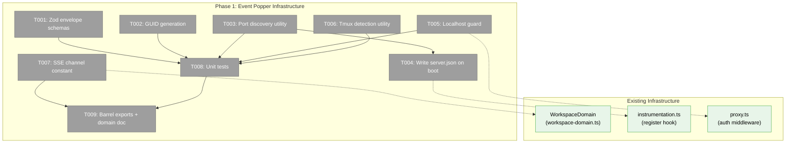
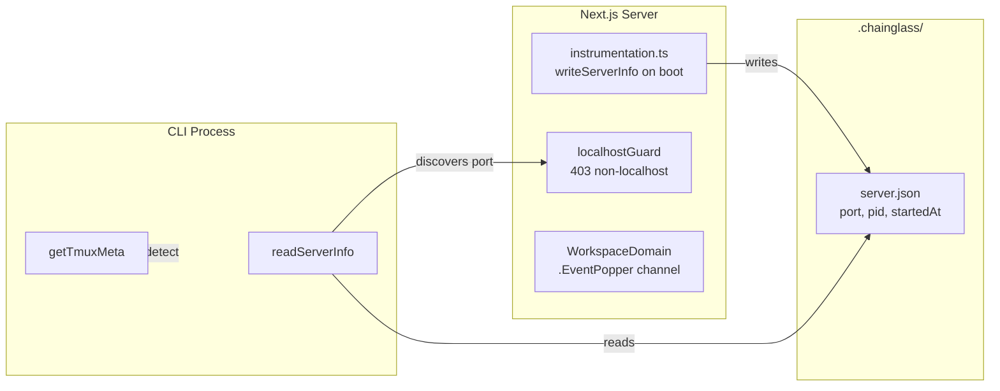
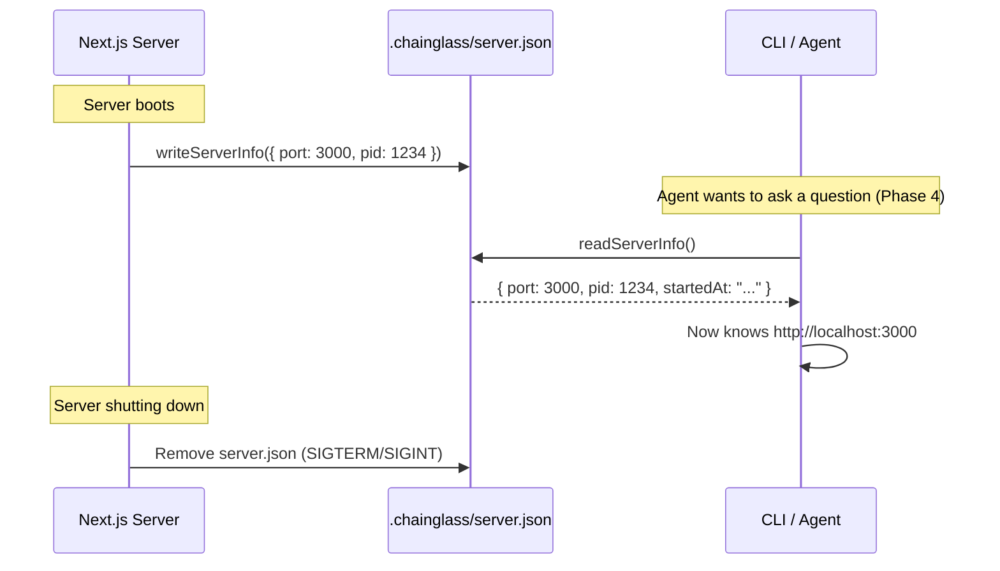

# Phase 1: Event Popper Infrastructure — Tasks

**Plan**: [plan.md](../../plan.md)
**Phase**: Phase 1: Event Popper Infrastructure (`_platform/external-events`)
**Domain**: `_platform/external-events` (NEW infrastructure)
**ACs**: AC-01, AC-02
**Testing**: TDD — schemas and utilities are pure functions

---

## Executive Briefing

**Purpose**: Build the generic Event Popper infrastructure layer — the shared plumbing that Question Popper (Phase 2+) and future event poppers will build on. This phase delivers: Zod envelope schemas, GUID generation, server port discovery (write on boot / read from CLI), a localhost-only API guard, tmux context detection, and an SSE channel constant.

**What We're Building**: Pure infrastructure utilities in `packages/shared` and two small server-side hooks (`instrumentation.ts` for port file, `proxy.ts` for auth bypass). No business logic, no UI, no CLI commands — just the foundation.

**Goals**:
- ✅ Generic `EventPopperRequest` / `EventPopperResponse` Zod schemas with `version: 1`
- ✅ GUID generation that is unique, timestamp-sortable, and filesystem-safe
- ✅ Port discovery: server writes `.chainglass/server.json` on boot; CLI reads it to find the server
- ✅ Localhost-only guard: middleware that rejects non-localhost requests and bypasses auth
- ✅ Reusable `detectTmuxContext()` / `getTmuxMeta()` shared utility
- ✅ `WorkspaceDomain.EventPopper` SSE channel constant
- ✅ TDD: all utilities tested before implementation proceeds

**Non-Goals**:
- ❌ Question-specific payload schemas (Phase 2)
- ❌ `IQuestionPopperService` or any business service (Phase 2)
- ❌ API routes (Phase 3)
- ❌ CLI commands (Phase 4)
- ❌ UI components (Phase 5)

---

## Prior Phase Context

_Phase 1 — no prior phases._

---

## Pre-Implementation Check

| File | Exists? | Domain Check | Notes |
|------|---------|-------------|-------|
| `packages/shared/src/event-popper/schemas.ts` | ❌ create | ✅ | Parent dir `event-popper/` does not exist — create it |
| `packages/shared/src/event-popper/guid.ts` | ❌ create | ✅ | Same parent dir |
| `packages/shared/src/event-popper/port-discovery.ts` | ❌ create | ✅ | Same parent dir |
| `packages/shared/src/event-popper/index.ts` | ❌ create | ✅ | Same parent dir |
| `packages/shared/src/utils/tmux-context.ts` | ❌ create | ✅ | Parent `utils/` exists (has `validate-agent-id.ts`) |
| `apps/web/instrumentation.ts` | ✅ modify | ✅ | 22 lines; calls `startCentralNotificationSystem()` in `register()` |
| `apps/web/src/lib/localhost-guard.ts` | ❌ create | ✅ | Parent `lib/` exists |
| `apps/web/proxy.ts` | ✅ modify | ✅ | 22 lines; auth matcher excludes `login`, `api/health`, `api/auth` |
| `packages/shared/src/features/027-central-notify-events/workspace-domain.ts` | ✅ modify | ✅ | 35 lines; 6 channels defined, values ARE SSE channel names |
| `test/unit/event-popper/infrastructure.test.ts` | ❌ create | ✅ | Parent `test/unit/event-popper/` does not exist — create it |
| `docs/domains/_platform/external-events/domain.md` | ❌ create | ✅ | Parent `_platform/external-events/` does not exist — create it |

**Concept duplication check**: No conflicts. Event popper schemas, GUID generation, port discovery, and localhost guard are all genuinely new. Tmux detection exists embedded in agents/terminal but has no extracted shared utility — we're creating one.

**Harness**: No agent harness configured. Implementation will use standard testing approach.

---

## Architecture Map



---

## Tasks

| Status | ID | Task | Domain | Path(s) | Done When | Notes |
|--------|-----|------|--------|---------|-----------|-------|
| [x] | T001 | Define `EventPopperRequest` and `EventPopperResponse` Zod schemas with `.strict()` and `version: 1`. Request: `{ version, type, source, payload, meta? }`. Response: `{ version, status, respondedAt, respondedBy, payload, meta? }`. Export inferred TypeScript types. | `_platform/external-events` | `packages/shared/src/event-popper/schemas.ts` | Schemas parse valid data and reject invalid/extra fields. Types exported and usable. | Workshop 001 defines the exact shapes. `payload` is `z.record(z.unknown())` at this layer — concept-specific schemas validate it in Phase 2. |
| [x] | T002 | Implement `generateEventId()` returning `{ISO-timestamp}_{6-char-random}` format. Timestamp uses hyphens instead of colons for filesystem safety. | `_platform/external-events` | `packages/shared/src/event-popper/guid.ts` | IDs are unique across 1000 rapid calls, sort chronologically, contain no filesystem-unsafe chars. | Follows existing convention from workflow-events (IA-03 in research). |
| [x] | T003 | Port discovery: `readServerInfo(worktreePath)` reads `.chainglass/server.json`, returns `{ port, pid, startedAt }` or `null` if missing/stale. `writeServerInfo(worktreePath, info)` writes it atomically. `ServerInfo` Zod schema for validation. **PID recycling guard**: checks PID is alive AND cross-checks `startedAt` against process start time — if PID alive but started after recorded timestamp, it's a different process → return null. | `_platform/external-events` | `packages/shared/src/event-popper/port-discovery.ts` | Read returns parsed info when file exists, null when missing. Write creates file. Stale PID detection: if PID not running OR PID recycled (start time mismatch), return null. | CLI will call `readServerInfo()` to discover server. Atomic write via temp+rename. |
| [x] | T004 | In `apps/web/instrumentation.ts`, after `startCentralNotificationSystem()`, call `writeServerInfo()` to write `.chainglass/server.json` with current port (`process.env.PORT ?? 3000`), PID (`process.pid`), and timestamp. Register `process.on('SIGTERM')` and `process.on('SIGINT')` to clean up the file on shutdown. Guard with globalThis flag to prevent HMR double-writes. | `_platform/external-events` | `apps/web/instrumentation.ts` | Server writes port file on boot; file is removed on graceful shutdown. HMR-safe (no double writes). | Needs worktree path — resolve from CWD or config. Follow existing pattern in instrumentation.ts. |
| [x] | T005 | Create `isLocalhostRequest(request: NextRequest): boolean` that checks `request.ip` for localhost variants (`127.0.0.1`, `::1`, `localhost`, `[::1]`) AND **rejects any request with `X-Forwarded-For` header** (proxy bypass prevention — presence of this header means a proxy is involved, so source cannot be trusted). Create `localhostGuard(request: NextRequest): NextResponse | null` that returns 403 JSON error if not localhost or if `X-Forwarded-For` is present, null if OK. Update `proxy.ts` matcher to exclude `api/event-popper` from auth: add `api/event-popper` to the exclusion regex. | `_platform/external-events` | `apps/web/src/lib/localhost-guard.ts`, `apps/web/proxy.ts` | Non-localhost requests to `/api/event-popper/*` get 403. Proxied requests (with X-Forwarded-For) get 403. Direct localhost requests pass through. Auth is bypassed for these routes. | Accepted loopback: `127.0.0.1`, `::1`, `localhost`. Response: `{ error: "Forbidden: localhost only" }` status 403. |
| [x] | T006 | Implement `detectTmuxContext(): TmuxContext | undefined` — checks `$TMUX` env var, calls `tmux display-message -p "#S"` and `"#I"` for session/window, reads `$TMUX_PANE` for pane. Returns undefined when not in tmux. Wraps in try/catch for safety. Also `getTmuxMeta(): { tmux: TmuxContext } | undefined` for easy spreading into `meta`. Export `TmuxContext` type. | `_platform/external-events` | `packages/shared/src/utils/tmux-context.ts` | Returns session name + window index + pane when in tmux. Returns undefined outside tmux. Does not crash if tmux command fails. | Verified live: session="067-question-popper", window="0", pane="%31". Future features (agents, activity-log) can import this. |
| [x] | T007 | Add `EventPopper: 'event-popper'` to `WorkspaceDomain` const object. Follow existing JSDoc comment pattern: `/** SSE channel: 'event-popper' — matches /api/events/event-popper subscription path (Plan 067) */`. | `_platform/events` (additive) | `packages/shared/src/features/027-central-notify-events/workspace-domain.ts` | New channel constant exists. `WorkspaceDomainType` union includes it. No existing channels broken. | Per DYK-03: value IS the SSE channel name. Additive-only change. |
| [x] | T008 | Unit tests for all Phase 1 utilities: (a) Schema tests: valid data passes, extra fields rejected, missing required fields rejected. (b) GUID tests: uniqueness across 1000 calls, chronological sort, no colons/spaces. (c) Port discovery tests: write→read round-trip, missing file returns null, stale PID returns null, **recycled PID (alive but different start time) returns null**. (d) Localhost guard tests: localhost IPs pass, non-localhost rejected with 403, **requests with X-Forwarded-For header rejected with 403**, edge cases (IPv6). (e) Tmux tests: returns context when $TMUX set, returns undefined when unset, handles command failure. | `_platform/external-events` | `test/unit/event-popper/infrastructure.test.ts` | All tests pass. TDD: write tests alongside each task above, collected here for tracking. | Use FakeFileSystem for port discovery tests (no real disk). Mock env vars for tmux tests via process.env override (not vi.mock — just set/unset the var). |
| [x] | T009 | Create barrel `packages/shared/src/event-popper/index.ts` exporting all schemas, types, utilities. Add export section to `packages/shared/src/index.ts`. Create `docs/domains/_platform/external-events/domain.md` with Purpose, Boundary (owns/excludes), Contracts table, Composition table, Dependencies. | `_platform/external-events` | `packages/shared/src/event-popper/index.ts`, `packages/shared/src/index.ts` (modify), `docs/domains/_platform/external-events/domain.md` | All public APIs importable via `@chainglass/shared/event-popper`. Domain doc exists with complete contract table. | Follow barrel pattern from existing modules (e.g., `workflow-events/index.ts`). |

---

## Context Brief

### Key Findings from Plan

- **Finding 4**: Can call `notifier.emit()` and `stateService.publish()` from API route handlers — confirms the HTTP API architecture works with existing SSE infrastructure (Phase 1 just registers the channel; Phase 2-3 will emit)
- **Finding 5**: Auth middleware bypass via `proxy.ts` config.matcher exclusion — exactly what T005 implements
- **Finding 6**: Server port not currently written to disk — T003/T004 create this mechanism
- **Finding 7**: Tmux context auto-detectable from `$TMUX` env var — verified live, T006 implements

### Domain Dependencies

| Domain | Concept | Entry Point | What We Use It For |
|--------|---------|-------------|-------------------|
| `_platform/events` | SSE channel identity | `WorkspaceDomain` const | Register `EventPopper` channel name (T007) |
| (none else) | — | — | Phase 1 is self-contained infrastructure; no other domain dependencies |

### Domain Constraints

- `_platform/external-events` code lives in `packages/shared/src/event-popper/` (shared across CLI and web)
- Server-specific code (instrumentation, localhost guard) lives in `apps/web/` — not in shared
- Port discovery utility is in shared (both CLI and server use it)
- `WorkspaceDomain` modification is additive only — never remove or rename existing channels
- Tmux utility has no dependencies beyond Node.js `child_process` — keep it zero-dep

### Harness Context

No agent harness configured. Agent will use standard testing approach from plan (`just fft` before commit).

### Reusable from Prior Phases

_Phase 1 — nothing prior. However, existing codebase provides:_
- `FakeFileSystem` in `packages/shared/src/fakes/` — use for port discovery tests
- `vitest.config.ts` test setup with `fileParallelism: false` — already configured
- Existing `WorkspaceDomain` const pattern — follow exactly for T007

### System Flow Diagram



### Sequence Diagram



---

## Discoveries & Learnings

_Populated during implementation by plan-6._

| Date | Task | Type | Discovery | Resolution | References |
|------|------|------|-----------|------------|------------|

---

## Directory Layout

```
docs/plans/067-question-popper/
  ├── plan.md
  ├── question-popper-spec.md
  ├── research-dossier.md
  ├── workshops/
  │   └── 001-external-event-schema.md
  └── tasks/
      └── phase-1-event-popper-infrastructure/
          ├── tasks.md                  ← this file
          ├── tasks.fltplan.md          ← flight plan (below)
          └── execution.log.md          ← created by plan-6
```
