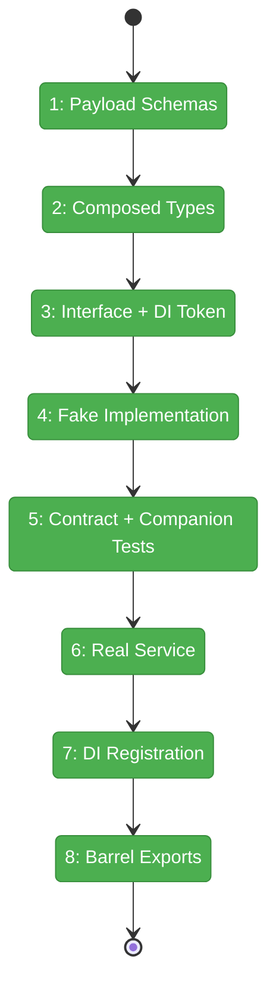
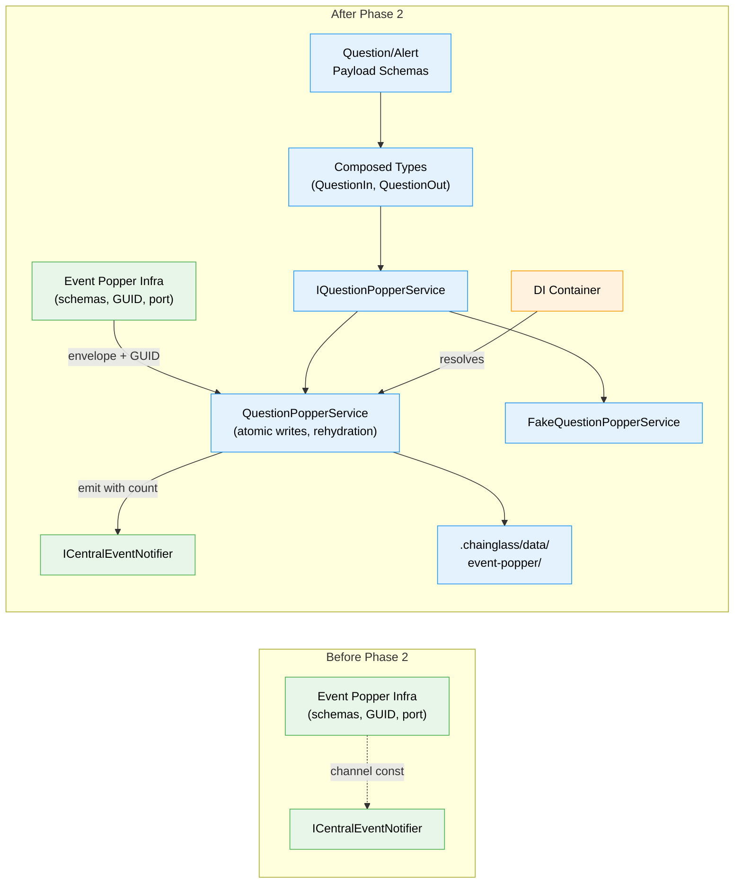

# Flight Plan: Phase 2 — Question Concept: Types, Schemas, Service

**Plan**: [plan.md](../../plan.md)
**Phase**: Phase 2: Question Concept — Types, Schemas, Service
**Generated**: 2026-03-07
**Status**: Landed

---

## Departure → Destination

**Where we are**: Phase 1 complete — generic Event Popper infrastructure exists: Zod envelope schemas, GUID generation, port discovery, localhost guard, tmux detection, SSE channel constant. 32 tests passing. All review fixes applied. The plumbing is laid but no concept-specific logic exists yet — no question schemas, no service, no persistence.

**Where we're going**: A developer can instantiate `QuestionPopperService`, ask a question, answer it, dismiss it, send an alert, and acknowledge it — all with type-safe schemas, disk persistence, SSE broadcasting, and state publishing. Contract tests verify the full lifecycle against both fake and real implementations. The service rehydrates after restart with zero phantom counts.

---

## Domain Context

### Domains We're Changing

| Domain | What Changes | Key Files |
|--------|-------------|-----------|
| `question-popper` (NEW) | Create entire domain: payload schemas, composed types, service interface, fake, real implementation, contract tests, DI registration, barrel exports | `packages/shared/src/question-popper/*`, `packages/shared/src/interfaces/question-popper.interface.ts`, `packages/shared/src/fakes/fake-question-popper.ts`, `apps/web/src/features/067-question-popper/lib/question-popper.service.ts` |

### Domains We Depend On (no changes)

| Domain | What We Consume | Contract |
|--------|----------------|----------|
| `_platform/external-events` | Envelope schemas, GUID, SSE channel | `EventPopperRequestSchema`, `generateEventId()`, `WorkspaceDomain.EventPopper` |
| `_platform/events` | SSE broadcasting | `ICentralEventNotifier.emit(domain, eventType, data)` |

---

## Flight Status

<!-- Updated by /plan-6-v2: pending → active → done. Use blocked for problems/input needed. -->

**Legend**: grey = pending | yellow = active | red = blocked/needs input | green = done

---

## Stages

<!-- Updated by /plan-6-v2 during implementation: [ ] → [~] → [x] -->

- [x] **Stage 1: Define payload schemas** — QuestionPayload, AnswerPayload, ClarificationPayload, AlertPayload with Zod `.strict()` (`schemas.ts`)
- [x] **Stage 2: Build composed types** — QuestionIn, QuestionOut, AlertIn, StoredQuestion, StoredAlert, status enums (`types.ts`)
- [x] **Stage 3: Define service interface** — IQuestionPopperService with all lifecycle methods + DI token (`question-popper.interface.ts`, `di-tokens.ts`)
- [x] **Stage 4: Build fake implementation** — FakeQuestionPopperService with inspection helpers (`fake-question-popper.ts`)
- [x] **Stage 5: Write contract + companion tests** — 9+ lifecycle contract tests + B01-style SSE emission companion tests (`question-popper.contract.ts`)
- [x] **Stage 6: Build real service** — QuestionPopperService with disk persistence, SSE emission, atomic writes, rehydration with error isolation (`question-popper.service.ts`)
- [x] **Stage 7: Wire DI** — Register in container with notifier + worktreePath (`di-container.ts`)
- [x] **Stage 8: Create barrel exports** — index.ts + package.json subpath + fakes/interfaces barrels (`index.ts`, `package.json`)

---

## Architecture: Before & After

**Legend**: existing (green, unchanged) | changed (orange, modified) | new (blue, created)

---

## Acceptance Criteria

- [x] AC-03: Two event types (question + alert) with strict Zod schemas
- [x] AC-04: Four question variants (text, single, multi, confirm) with answer/clarification/dismiss
- [x] Contract tests pass for: ask→answer, ask→dismiss, ask→clarification, alert→acknowledge
- [x] Companion tests verify SSE emission from real service (B01-style with FakeCentralEventNotifier)
- [x] Outstanding count tracked in-memory, emitted via SSE with every lifecycle event
- [x] Service rehydrates from disk on construction — per-entry try/catch, skip malformed entries (DYK-03)
- [x] Rehydration filters on type discriminator — skips unknown event types (DYK-05)
- [x] Answer writes use atomic rename (tmp→final) + first-write-wins (DYK-02)
- [x] SSE emitted on all lifecycle events via `ICentralEventNotifier` (no `IStateService` — DYK-01)
- [x] DI token registered and service resolvable from container
- [x] All public APIs importable via `@chainglass/shared/question-popper`

## Goals & Non-Goals

**Goals**:
- ✅ Complete question-popper domain schemas and types
- ✅ Full lifecycle service with disk persistence
- ✅ SSE integration for real-time UI updates (outstanding count in event data)
- ✅ TDD with contract tests + SSE companion tests

**Non-Goals**:
- ❌ API routes (Phase 3)
- ❌ CLI commands (Phase 4)
- ❌ UI components (Phase 5)
- ❌ Client-side state domain registration (Phase 5 — IStateService is client-side only)

---

## Checklist

- [x] T001: QuestionPayloadSchema (text, single, multi, confirm variants)
- [x] T002: AnswerPayloadSchema + ClarificationPayloadSchema
- [x] T003: AlertPayloadSchema
- [x] T004: Composed types (QuestionIn, QuestionOut, AlertIn, StoredQuestion, StoredAlert)
- [x] T005: IQuestionPopperService interface + DI token
- [x] T006: FakeQuestionPopperService with inspection helpers
- [x] T007: Contract tests (≥9 lifecycle) + SSE companion tests (≥3 B01-style)
- [x] T008: QuestionPopperService (real — disk, SSE, atomic writes, rehydration with error isolation)
- [x] T009: DI registration in container (notifier + worktreePath, no IStateService)
- [x] T010: Barrel exports + package.json subpath
