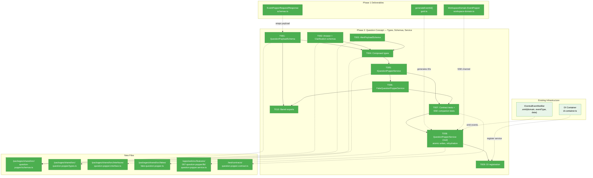
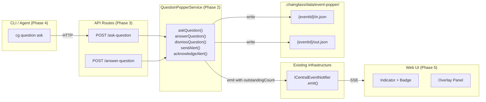
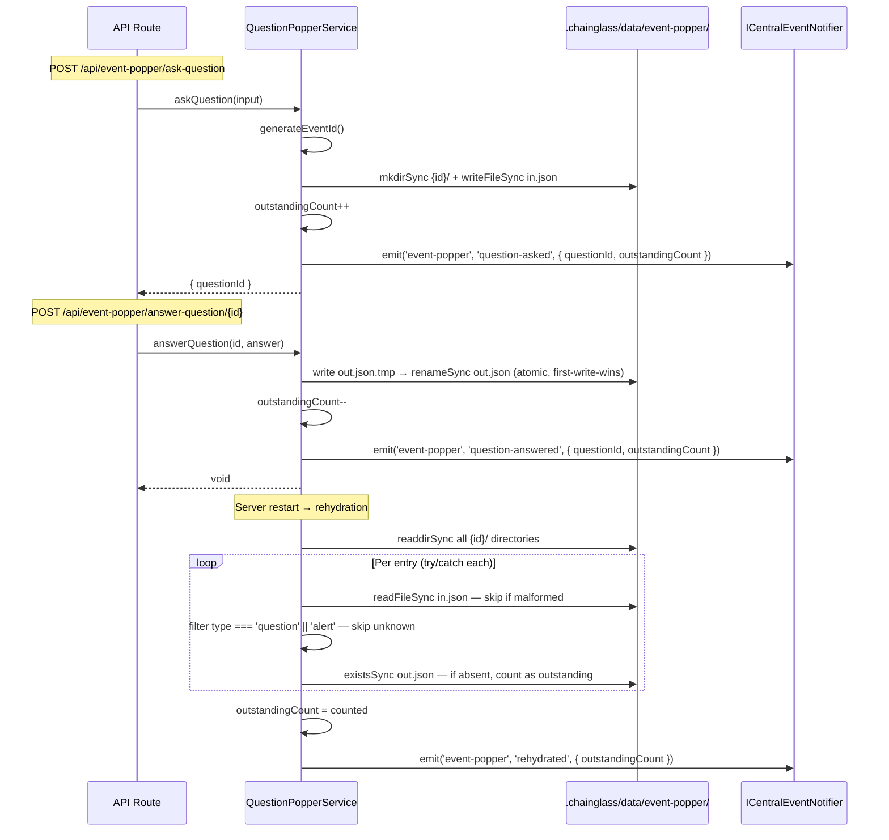

# Phase 2: Question Concept — Types, Schemas, Service

**Plan**: [plan.md](../../plan.md)
**Phase**: Phase 2: Question Concept — Types, Schemas, Service
**Domain**: `question-popper` (NEW business)
**ACs**: AC-03, AC-04
**Testing**: TDD — interface first, fake second, tests third, implementation fourth
**Mocks**: Fakes only (Constitution Principle 4)

---

## Executive Briefing

**Purpose**: Build the first-class question-and-answer concept on top of the Phase 1 Event Popper infrastructure. This phase delivers: Zod payload schemas for questions, answers, clarifications, and alerts; composed convenience types; the `IQuestionPopperService` interface; a `FakeQuestionPopperService` test double; contract tests for the full question lifecycle; and the real `QuestionPopperService` implementation backed by disk persistence with SSE and state publishing.

**What We're Building**: The complete server-side domain logic for Question Popper — everything between "a question arrives via API" and "the answer is stored and broadcast." After this phase, the service can store questions, deliver answers, dismiss questions, send alerts, acknowledge alerts, and broadcast all lifecycle events via SSE + global state. No API routes, no CLI, no UI — just the domain core.

**Goals**:
- ✅ `QuestionPayloadSchema`, `AnswerPayloadSchema`, `ClarificationPayloadSchema`, `AlertPayloadSchema` — strict Zod schemas
- ✅ `QuestionIn`, `QuestionOut`, `AlertIn` — ergonomic composed types for callers
- ✅ `IQuestionPopperService` interface with full lifecycle methods
- ✅ `FakeQuestionPopperService` with inspection helpers for testing
- ✅ Contract tests covering: ask→answer, ask→dismiss, ask→needs-clarification→follow-up, alert→acknowledge
- ✅ `QuestionPopperService` real implementation backed by `.chainglass/data/event-popper/`
- ✅ Service emits SSE via `ICentralEventNotifier` with outstanding count in event data (no server-side `IStateService` — client bridges SSE→state in Phase 5)
- ✅ Service rehydrates from disk on construction with per-entry error isolation (no phantom-zero after restart, no crash on malformed entries)
- ✅ Atomic rename + first-write-wins for `out.json` to prevent answer race conditions
- ✅ DI registration
- ✅ Barrel exports via `@chainglass/shared/question-popper`

**Non-Goals**:
- ❌ API route handlers (Phase 3)
- ❌ CLI commands (Phase 4)
- ❌ UI components, hooks, overlay (Phase 5)
- ❌ Question chaining UI resolution (Phase 6)
- ❌ Domain documentation (Phase 7)

---

## Prior Phase Context

### Phase 1: Event Popper Infrastructure — COMPLETE

**A. Deliverables**:

| File | Purpose |
|------|---------|
| `packages/shared/src/event-popper/schemas.ts` | `EventPopperRequestSchema`, `EventPopperResponseSchema` (Zod `.strict()`, `version: 1`) |
| `packages/shared/src/event-popper/guid.ts` | `generateEventId()` — monotonic, filesystem-safe, chronologically sortable |
| `packages/shared/src/event-popper/port-discovery.ts` | `readServerInfo()`, `writeServerInfo()`, `removeServerInfo()` with PID recycling guard |
| `packages/shared/src/event-popper/index.ts` | Barrel exports for `@chainglass/shared/event-popper` |
| `packages/shared/src/utils/tmux-context.ts` | `detectTmuxContext()`, `getTmuxMeta()`, `TmuxContext` |
| `apps/web/src/lib/localhost-guard.ts` | `localhostGuard()`, `isLocalhostRequest()` — fail-closed, rejects X-Forwarded-For |
| `apps/web/instrumentation.ts` | Writes `.chainglass/server.json` on boot, SIGTERM/SIGINT cleanup |
| `apps/web/proxy.ts` | Auth bypass for `/api/event-popper` routes |
| `packages/shared/src/features/027-central-notify-events/workspace-domain.ts` | `WorkspaceDomain.EventPopper: 'event-popper'` SSE channel |
| `test/unit/event-popper/infrastructure.test.ts` | 32 tests (schemas, GUID, port discovery, localhost guard, tmux) |

**B. Dependencies Exported** (Phase 2 consumes):

| Export | Signature | Phase 2 Usage |
|--------|-----------|---------------|
| `EventPopperRequestSchema` | Zod schema (version, type, source, payload, meta?) | Wrap question/alert payloads in generic envelope |
| `EventPopperResponseSchema` | Zod schema (version, status, respondedAt, respondedBy, payload, meta?) | Wrap answer/acknowledgment in generic envelope |
| `generateEventId()` | `() => string` | Generate question/alert IDs |
| `WorkspaceDomain.EventPopper` | `'event-popper'` const | SSE channel for `notifier.emit()` |

**C. Gotchas & Debt**:
- Zod v4 requires `z.record(z.string(), z.unknown())` — single-arg crashes with `_zod undefined`
- PID recycling guard macOS/Linux only — `getProcessStartTime()` returns null on other platforms
- Schema `.strict()` rejects extra fields — payload extensibility happens INSIDE `payload`, not at envelope level

**D. Incomplete Items**: None — Phase 1 fully complete (32/32 tests, all review fixes applied).

**E. Patterns to Follow**:
- Zod `.strict()` on all wire contracts
- ISO-8601 strings for all datetime fields (not Date objects)
- `generateEventId()` for all event IDs (not UUID)
- Barrel exports with subpath in `package.json`
- Atomic writes for shared config (temp + rename)
- HMR-safe globalThis guards in instrumentation
- Graceful degradation (return undefined, not throw)
- Contract test factory pattern from `test/contracts/` (see `centralEventNotifierContractTests`)

---

## Pre-Implementation Check

| File | Exists? | Domain Check | Notes |
|------|---------|-------------|-------|
| `packages/shared/src/question-popper/schemas.ts` | ❌ create | ✅ `question-popper` | Parent dir `question-popper/` does not exist — create it |
| `packages/shared/src/question-popper/types.ts` | ❌ create | ✅ `question-popper` | Same parent dir |
| `packages/shared/src/question-popper/index.ts` | ❌ create | ✅ `question-popper` | Same parent dir |
| `packages/shared/src/interfaces/question-popper.interface.ts` | ❌ create | ✅ `question-popper` | Parent `interfaces/` exists (16 interface files) |
| `packages/shared/src/fakes/fake-question-popper.ts` | ❌ create | ✅ `question-popper` | Parent `fakes/` exists (16 fake files) |
| `apps/web/src/features/067-question-popper/lib/question-popper.service.ts` | ❌ create | ✅ `question-popper` | Parent dir `067-question-popper/lib/` does not exist — create it |
| `test/contracts/question-popper.contract.ts` | ❌ create | ✅ `question-popper` | Parent `test/contracts/` exists (26+ contract tests) |
| `test/contracts/question-popper.contract.test.ts` | ❌ create | ✅ `question-popper` | Runner for contract tests |
| `apps/web/src/lib/di-container.ts` | ✅ modify | ✅ | ~800 lines; register `IQuestionPopperService` |
| `packages/shared/src/di-tokens.ts` | ✅ modify | ✅ | Add `QUESTION_POPPER_SERVICE` to `WORKSPACE_DI_TOKENS` |
| `packages/shared/package.json` | ✅ modify | ✅ | Add `./question-popper` subpath export |

**Concept duplication check**: No conflicts. `IWorkflowEvents` in workflow-events handles in-graph Q&A — completely separate system with zero shared code (Finding 3). No existing question/answer service outside of workflows.

**State connector note (DYK-01)**: `IStateService` is client-side only (lives in React context, not DI container). The `QuestionPopperService` follows the `WorkUnitStateService` pattern: constructor takes `(worktreePath, notifier: ICentralEventNotifier)` — no `IStateService`. The service emits SSE events with `{ outstandingCount }` in the data payload. The Phase 5 UI hook receives SSE events and bridges them to client-side state. No `state-connector.tsx` modification needed in Phase 2. State domain registration deferred to Phase 5.

**Harness**: No agent harness configured. Implementation will use standard testing approach (`just fft`).

---

## Architecture Map



---

## Tasks

| Status | ID | Task | Domain | Path(s) | Done When | Notes |
|--------|-----|------|--------|---------|-----------|-------|
| [x] | T001 | Define `QuestionPayloadSchema` with Zod `.strict()`: `questionType` (enum: text, single, multi, confirm), `text` (string, min 1), `description` (string nullable), `options` (array of strings, nullable), `default` (string or boolean, nullable), `timeout` (number, int, min 0, default 600), `previousQuestionId` (string nullable). Export inferred `QuestionPayload` type. | `question-popper` | `packages/shared/src/question-popper/schemas.ts` | Schema parses all 4 question types correctly; rejects extra fields; `previousQuestionId` optional for chaining. Types exported. | Workshop 001 defines exact shape. Use `z.record(z.string(), z.unknown())` pattern from Phase 1 if needed. |
| [x] | T002 | Define `AnswerPayloadSchema` with `.strict()`: `answer` (union: string, boolean, array of strings — nullable), `text` (string nullable). Define `ClarificationPayloadSchema` with `.strict()`: `text` (string, min 1). Export inferred types. | `question-popper` | `packages/shared/src/question-popper/schemas.ts` | Answer schema accepts string/boolean/string[] answers; clarification requires text. Both reject extra fields. | `answer` is nullable to support dismiss-without-answer patterns. `text` always available for freeform commentary. |
| [x] | T003 | Define `AlertPayloadSchema` with `.strict()`: `text` (string, min 1), `description` (string nullable). Export inferred `AlertPayload` type. | `question-popper` | `packages/shared/src/question-popper/schemas.ts` | Schema parses valid alerts; rejects extra fields. Simpler than question (no options, no answer). | Alerts are fire-and-forget — no AnswerPayload needed. Acknowledgment is just a status change. |
| [x] | T004 | Define composed convenience types: `QuestionIn` (what callers create — combines source, meta, timeout, questionType, text, etc.), `QuestionOut` (what callers receive — questionId, status, answer, respondedAt), `AlertIn` (what callers create — source, meta, text, description), `QuestionStatus` (enum: pending, answered, needs-clarification, dismissed), `AlertStatus` (enum: unread, acknowledged). Also define `StoredQuestion` and `StoredAlert` — the full on-disk records including envelope + payload + response. | `question-popper` | `packages/shared/src/question-popper/types.ts` | All types compile. `QuestionIn` maps cleanly to `EventPopperRequest` + `QuestionPayload`. `QuestionOut` provides ergonomic read access. `StoredQuestion`/`StoredAlert` represent complete on-disk state. | These are the types that API routes and CLI will use — not raw schemas. Keep them ergonomic. |
| [x] | T005 | Define `IQuestionPopperService` interface: `askQuestion(input: QuestionIn): Promise<{ questionId: string }>`, `getQuestion(id: string): Promise<StoredQuestion \| null>`, `answerQuestion(id: string, answer: AnswerPayload): Promise<void>`, `dismissQuestion(id: string): Promise<void>`, `listQuestions(filter?: { status?: QuestionStatus }): Promise<StoredQuestion[]>`, `sendAlert(input: AlertIn): Promise<{ alertId: string }>`, `acknowledgeAlert(id: string): Promise<void>`, `getAlert(id: string): Promise<StoredAlert \| null>`, `listAll(): Promise<Array<StoredQuestion \| StoredAlert>>`, `getOutstandingCount(): number`. Add JSDoc for every method. Add DI token `QUESTION_POPPER_SERVICE` to `WORKSPACE_DI_TOKENS` in `di-tokens.ts`. | `question-popper` | `packages/shared/src/interfaces/question-popper.interface.ts`, `packages/shared/src/di-tokens.ts` (modify) | Interface compiles. All methods documented. DI token registered. Follows existing interface conventions (`{concept}.interface.ts`). | Pattern: see `state.interface.ts`, `workflow-events.interface.ts`. Method names align with API route names from Phase 3 plan. |
| [x] | T006 | Implement `FakeQuestionPopperService` implementing `IQuestionPopperService`. In-memory Map-based storage. Inspection helpers: `getPendingQuestions()`, `getAnsweredCount()`, `getAlertCount()`, `simulateAnswer(id, answer)`, `simulateAcknowledge(id)`, `reset()`. Follow existing fake patterns (shared entries array, full interface implementation). | `question-popper` | `packages/shared/src/fakes/fake-question-popper.ts` | Fake implements all interface methods. Inspection helpers enable test assertions without accessing internals. `reset()` clears state between tests. | Pattern: see `fake-state-system.ts`, `fake-workflow-events.ts`. Fakes go in `packages/shared/src/fakes/`. |
| [x] | T007 | Contract tests for question lifecycle using factory pattern. Tests: (a) Ask question → status pending, (b) Answer question → status answered + answer stored, (c) Dismiss question → status dismissed, (d) Ask with needs-clarification response → ClarificationPayload stored, (e) Alert → unread → acknowledge → acknowledged, (f) Outstanding count reflects pending questions + unread alerts, (g) List filters by status, (h) `getQuestion` returns null for unknown ID, (i) Previously asked question chain via `previousQuestionId`. Create runner file that runs against FakeQuestionPopperService. **Also add B01-style companion tests**: instantiate real `QuestionPopperService` with `FakeCentralEventNotifier`, exercise each lifecycle method, assert correct SSE events emitted (channel=`event-popper`, eventType, data including `outstandingCount`). Real service needs a temp dir for disk I/O. | `question-popper` | `test/contracts/question-popper.contract.ts`, `test/contracts/question-popper.contract.test.ts` | All lifecycle tests pass with fake. Companion tests verify SSE emission from real service. Contract function exported for reuse. ≥12 test cases (9 contract + 3 companion). | Pattern: follow `centralEventNotifierContractTests` + B01/B04 companion pattern exactly. |
| [x] | T008 | Implement `QuestionPopperService` — real implementation. Constructor takes `worktreePath: string`, `notifier: ICentralEventNotifier` (no `IStateService` — DYK-01). Tracks outstanding count as in-memory counter. Disk persistence: `.chainglass/data/event-popper/{eventId}/in.json` and `out.json`. Uses `node:fs` (synchronous, server-only, following `WorkUnitStateService` F003 pattern). On `askQuestion()`: generate ID via `generateEventId()`, `mkdirSync(recursive)`, write `in.json` with `EventPopperRequest` envelope, increment counter, emit SSE `question-asked` with `{ questionId, outstandingCount }`. On `answerQuestion()`: **atomic rename** — write to `out.json.tmp`, check `out.json` doesn't already exist, `renameSync(tmp, final)` — first-write-wins prevents double-answer race (DYK-02). Decrement counter, emit SSE `question-answered`. On `dismissQuestion()`: same atomic pattern, status `dismissed`, emit SSE. On `sendAlert()`: write `in.json` with type `alert`, increment counter, emit SSE `alert-sent`. On `acknowledgeAlert()`: atomic write `out.json`, decrement counter, emit SSE `alert-acknowledged`. **Rehydration on construction (DYK-03, DYK-05)**: scan `.chainglass/data/event-popper/` directories. Per-entry try/catch — `JSON.parse` failures logged via `console.warn` and skipped (no crash on malformed entries). Only count entries where `type === 'question' \|\| type === 'alert'` — skip unknown types. Emit initial SSE with rehydrated count. | `question-popper` | `apps/web/src/features/067-question-popper/lib/question-popper.service.ts` | Service persists questions/alerts to disk. SSE emitted on all lifecycle events with outstandingCount. Rehydration works after restart (no phantom-zero). Malformed entries skipped, not crashed. Concurrent answer writes handled atomically. Contract tests pass against real implementation. | Uses `generateEventId()` from Phase 1. Uses `WorkspaceDomain.EventPopper` for SSE channel. `mkdir -p` for event directories. Per Finding 4: can call `notifier.emit()` from server-side service. |
| [x] | T009 | Register `IQuestionPopperService` in `createProductionContainer()` in `di-container.ts`. Factory resolves `ICentralEventNotifier` via `WORKSPACE_DI_TOKENS.CENTRAL_EVENT_NOTIFIER` and `worktreePath` from `resolvedWorktreePath`. Singleton pattern (cache instance like `WorkUnitStateService`). No `IStateService` needed (DYK-01). | `question-popper` | `apps/web/src/lib/di-container.ts` (modify) | Service resolvable from container. Dependencies correctly wired (notifier + worktreePath). Singleton — same instance returned on repeated resolve. | Follow `WorkUnitStateService` registration pattern (lines 787-798). Cache via `let questionPopperInstance: IQuestionPopperService \| null = null`. |
| [x] | T010 | Create barrel `packages/shared/src/question-popper/index.ts` exporting all schemas, types, and interface. Add `./question-popper` subpath export to `packages/shared/package.json`. Export `FakeQuestionPopperService` from `packages/shared/src/fakes/index.ts`. Export `IQuestionPopperService` from `packages/shared/src/interfaces/index.ts`. | `question-popper` | `packages/shared/src/question-popper/index.ts`, `packages/shared/package.json` (modify), `packages/shared/src/fakes/index.ts` (modify), `packages/shared/src/interfaces/index.ts` (modify) | All public APIs importable via `@chainglass/shared/question-popper`. Fake importable via `@chainglass/shared/fakes`. Interface importable via `@chainglass/shared/interfaces`. | Follow existing barrel patterns. `package.json` needs `"./question-popper": { "import": "./dist/question-popper/index.js", "types": "./dist/question-popper/index.d.ts" }`. |

---

## Context Brief

### Key Findings from Plan

- **Finding 1**: All infrastructure exists — `ICentralEventNotifier`, overlay pattern, toast, SSE → Phase 2 emits via `notifier.emit(WorkspaceDomain.EventPopper, eventType, data)` with `outstandingCount` included in event payload
- **Finding 2**: Activity-log (Plan 065) is closest structural template → follow its `lib/`, `hooks/`, `components/` directory layout under `apps/web/src/features/067-question-popper/`
- **Finding 3**: Workflow-events Q&A is completely separate → zero imports from workflow-events. `IWorkflowEvents` is for in-graph Q&A; `IQuestionPopperService` is for external CLI/agent Q&A
- **Finding 4**: Can call `notifier.emit()` from server-side service → the `QuestionPopperService` emits SSE directly, no adapters needed
- **DYK-01 (Phase 2)**: `IStateService` is client-side only (React context). Service takes `(worktreePath, notifier)` — matching `WorkUnitStateService` pattern exactly. Client-side state domain registration deferred to Phase 5
- **DYK-02 (Phase 2)**: Answer writes need atomic rename + first-write-wins to prevent double-answer race condition
- **DYK-03 (Phase 2)**: Rehydration must wrap each entry in try/catch — one malformed JSON file must not crash the service
- **DYK-04 (Phase 2)**: Contract tests verify CRUD but not SSE emission — need B01-style companion tests with FakeCentralEventNotifier
- **DYK-05 (Phase 2)**: Rehydration must filter on `type === 'question' || 'alert'` — skip unknown types for future-proofing

### Domain Dependencies

| Domain | Concept | Entry Point | What We Use It For |
|--------|---------|-------------|-------------------|
| `_platform/external-events` | Event envelope | `EventPopperRequestSchema`, `EventPopperResponseSchema` | Wrap question/alert payloads in generic envelope for disk persistence |
| `_platform/external-events` | Event ID generation | `generateEventId()` | Generate unique IDs for questions and alerts |
| `_platform/external-events` | SSE channel identity | `WorkspaceDomain.EventPopper` | Channel name for `notifier.emit()` calls |
| `_platform/events` | SSE broadcasting | `ICentralEventNotifier.emit()` | Broadcast lifecycle events (question-asked, question-answered, etc.) to connected web UI clients |

### Domain Constraints

- `question-popper` schema/type files live in `packages/shared/src/question-popper/` (shared across CLI and web)
- `IQuestionPopperService` interface lives in `packages/shared/src/interfaces/` (shared)
- `FakeQuestionPopperService` lives in `packages/shared/src/fakes/` (shared)
- Real `QuestionPopperService` lives in `apps/web/src/features/067-question-popper/lib/` (server-only)
- Service uses `node:fs` directly (server-only, following `WorkUnitStateService` pattern)
- Cross-domain imports: `question-popper` → `_platform/external-events` contracts only (schemas, GUID, channel)
- Cross-domain imports: `question-popper` → `_platform/events` contracts only (`ICentralEventNotifier`)
- Service does NOT import from `_platform/state` — outstanding count tracked in memory, emitted via SSE (DYK-01)
- Never import from `workflow-events`

### Harness Context

No agent harness configured. Agent will use standard testing approach from plan (`just fft` before commit).

### Reusable from Prior Phases

- `generateEventId()` — use for all question/alert ID generation
- `EventPopperRequestSchema` / `EventPopperResponseSchema` — use as envelope around concept payloads
- `WorkspaceDomain.EventPopper` — SSE channel constant
- Phase 1 test patterns — schema validation (happy path + rejection), lifecycle assertions
- Contract test factory pattern from `test/contracts/central-event-notifier.contract.ts`
- Fake patterns from `packages/shared/src/fakes/` (shared entries, `reset()`, inspection helpers)
- DI registration pattern from `WorkUnitStateService` (singleton factory with cached instance, takes `worktreePath` + `notifier`)

### System Flow Diagram



### Sequence Diagram



---

## Discoveries & Learnings

_Populated during implementation by plan-6._

| Date | Task | Type | Discovery | Resolution | References |
|------|------|------|-----------|------------|------------|
| 2026-03-07 | T007 | gotcha | `listAll` sort unstable when all timestamps are identical (same-ms in-memory fake) | Added `b.id.localeCompare(a.id)` as tiebreaker — fake IDs are monotonic | fake-question-popper.ts:167 |
| 2026-03-07 | T007 | insight | Contract tests run against BOTH fake and real in same runner — 12×2 = 24 tests | Pattern from central-event-notifier.contract.test.ts works perfectly | question-popper.contract.test.ts |
| 2026-03-07 | T010 | decision | Created barrel exports early (before T007) so contract test imports resolve | No issue — just task ordering flexibility | — |

---

## Directory Layout

```
docs/plans/067-question-popper/
  ├── plan.md
  ├── question-popper-spec.md
  ├── research-dossier.md
  ├── workshops/
  │   └── 001-external-event-schema.md
  └── tasks/
      ├── phase-1-event-popper-infrastructure/
      │   ├── tasks.md
      │   ├── tasks.fltplan.md
      │   └── execution.log.md
      └── phase-2-question-concept-types-schemas-service/
          ├── tasks.md                  ← this file
          ├── tasks.fltplan.md          ← flight plan (below)
          └── execution.log.md          ← created by plan-6
```
