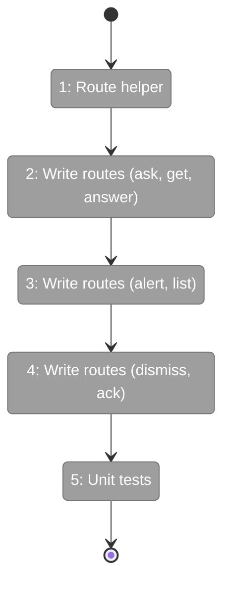
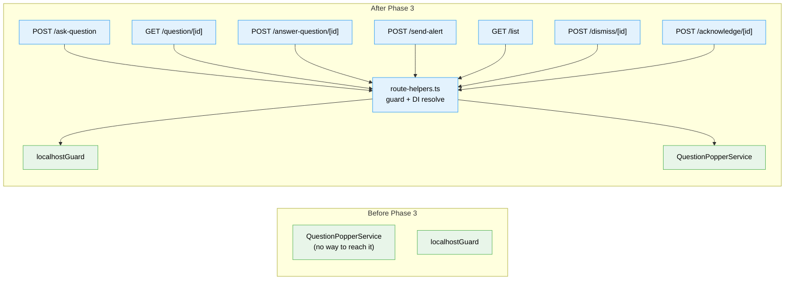

# Flight Plan: Phase 3 — Server API Routes

**Plan**: [plan.md](../../plan.md)
**Phase**: Phase 3: Server API Routes
**Generated**: 2026-03-07
**Status**: Ready for takeoff

---

## Departure → Destination

**Where we are**: Phase 2 complete — `QuestionPopperService` handles the full question/alert lifecycle with disk persistence, SSE emission, and rehydration. `FakeQuestionPopperService` available in test container. But there's no way for external processes (CLI, scripts) to reach the service — no HTTP endpoints exist yet.

**Where we're going**: A CLI tool can `POST /api/event-popper/ask-question` with a JSON body and get back `{ questionId }`, then poll `GET /api/event-popper/question/{id}` until the status changes to `answered`. The web UI can `POST /api/event-popper/answer-question/{id}` to submit answers. All 7 endpoints are localhost-only, Zod-validated, and consistently formatted.

---

## Domain Context

### Domains We're Changing

| Domain | What Changes | Key Files |
|--------|-------------|-----------|
| `question-popper` | 7 new API route handlers + shared route helper | `apps/web/app/api/event-popper/*/route.ts`, `apps/web/src/features/067-question-popper/lib/route-helpers.ts` |

### Domains We Depend On (no changes)

| Domain | What We Consume | Contract |
|--------|----------------|----------|
| `question-popper` | Service lifecycle | `IQuestionPopperService` via DI |
| `question-popper` | Payload validation | `QuestionPayloadSchema`, `AnswerPayloadSchema`, `AlertPayloadSchema` |
| `_platform/external-events` | Request security | `localhostGuard()` |

---

## Flight Status

**Legend**: grey = pending | yellow = active | red = blocked/needs input | green = done

---

## Stages

- [ ] **Stage 1: Route helpers** — dual-auth, JSON parsing, error mapping, injectable handler pattern (`route-helpers.ts`)
- [ ] **Stage 2: Question routes** — ask-question (POST, CLI-only), question/[id] (GET, shared), answer-question/[id] (POST, shared)
- [ ] **Stage 3: Alert + list routes** — send-alert (POST, CLI-only), list (GET, shared, ?limit=N)
- [ ] **Stage 4: Action routes** — dismiss/[id] (POST, shared), clarify/[id] (POST, shared), acknowledge/[id] (POST, shared)
- [ ] **Stage 5: Unit tests** — ≥13 tests, handler functions tested with fakes, no vi.mock

---

## Architecture: Before & After

---

## Acceptance Criteria

- [ ] AC-01: Server stores questions via API, returns questionId
- [ ] AC-02: Answers retrievable via API, CLI can poll for status
- [ ] 8 routes return consistent JSON error format
- [ ] Routes return QuestionOut/AlertOut (ergonomic), not raw StoredQuestion/StoredAlert
- [ ] CLI-only routes (ask, send-alert) apply localhostGuard — non-localhost gets 403
- [ ] Shared routes (get, answer, list, dismiss, clarify, ack) accept localhost OR authenticated sessions
- [ ] Full request body validation via AskQuestionRequestSchema / SendAlertRequestSchema (source + meta + payload)
- [ ] Zod validation on all POST bodies — invalid payloads get 400, malformed JSON gets 400
- [ ] Not-found gets 404, already-resolved gets 409
- [ ] List supports `?limit=N` (default 100)
- [ ] ≥13 unit tests passing with fakes only (no vi.mock)

## Goals & Non-Goals

**Goals**:
- ✅ 8 API endpoints: 2 CLI-only + 6 shared (localhost OR auth)
- ✅ Consistent error handling and response format
- ✅ Thin routes — handler functions testable with injectable fakes
- ✅ Unit tested without vi.mock

**Non-Goals**:
- ❌ CLI commands (Phase 4)
- ❌ UI components (Phase 5)
- ❌ SSE streaming endpoint (already exists)

---

## Checklist

- [ ] T001: Route helpers (dual-auth, JSON parse, error map, injectable pattern)
- [ ] T002: POST /api/event-popper/ask-question (CLI-only)
- [ ] T003: GET /api/event-popper/question/[id] (shared)
- [ ] T004: POST /api/event-popper/answer-question/[id] (shared)
- [ ] T005: POST /api/event-popper/send-alert (CLI-only)
- [ ] T006: GET /api/event-popper/list (shared, ?limit=N)
- [ ] T007: POST /api/event-popper/dismiss/[id] (shared)
- [ ] T008: POST /api/event-popper/clarify/[id] (shared — DYK-03 split)
- [ ] T009: POST /api/event-popper/acknowledge/[id] (shared)
- [ ] T010: Unit tests (≥13, handler functions with fakes, verify QuestionOut/AlertOut shape)
