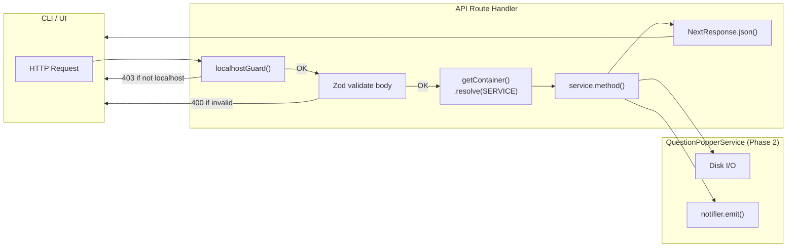
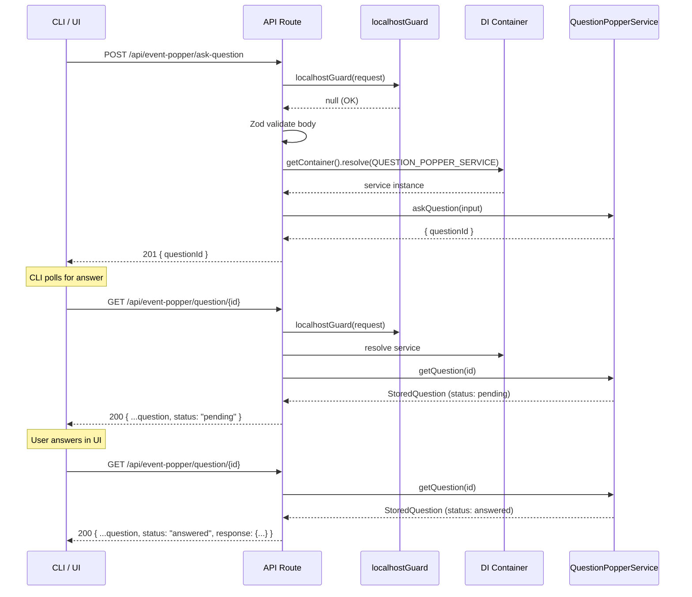

# Phase 3: Server API Routes — Tasks

**Plan**: [plan.md](../../plan.md)
**Phase**: Phase 3: Server API Routes
**Domain**: `question-popper` (server layer)
**ACs**: AC-01, AC-02
**Testing**: TDD for route handlers using FakeQuestionPopperService
**Mocks**: Fakes only (Constitution Principle 4)

---

## Executive Briefing

**Purpose**: Build the 7 localhost-only HTTP API endpoints that the CLI (Phase 4) and UI (Phase 5) call to interact with the Question Popper service. These are the "front door" — thin route handlers that validate input, apply the localhost guard, resolve the service from DI, call the appropriate method, and return JSON.

**What We're Building**: 7 Next.js API route handlers under `/api/event-popper/*`, a shared route helper to reduce boilerplate, and unit tests verifying HTTP plumbing (status codes, validation, guard rejection). All business logic lives in `QuestionPopperService` (Phase 2) — routes are glue code.

**Goals**:
- ✅ `POST /api/event-popper/ask-question` — accept question, return `{ questionId }`
- ✅ `GET /api/event-popper/question/[id]` — poll for question status + answer
- ✅ `POST /api/event-popper/answer-question/[id]` — submit answer from UI
- ✅ `POST /api/event-popper/send-alert` — accept alert, return `{ alertId }`
- ✅ `GET /api/event-popper/list` — list all questions + alerts
- ✅ `POST /api/event-popper/dismiss/[id]` — dismiss question without answering
- ✅ `POST /api/event-popper/acknowledge/[id]` — mark alert as read
- ✅ All routes: localhost guard first, no auth, Zod validation, consistent error format
- ✅ Unit tests with FakeQuestionPopperService

**Non-Goals**:
- ❌ CLI commands (Phase 4)
- ❌ UI hooks or components (Phase 5)
- ❌ SSE streaming endpoint (already exists at `/api/events/[channel]`)
- ❌ Service logic changes (Phase 2 complete)

---

## Prior Phase Context

### Phase 1: Event Popper Infrastructure — COMPLETE

**Deliverables used by Phase 3**:
- `localhostGuard(request)` from `apps/web/src/lib/localhost-guard.ts` — applied to every route
- Auth bypass in `apps/web/proxy.ts` — `api/event-popper` excluded from auth matcher
- `WorkspaceDomain.EventPopper` — SSE channel (service emits, routes don't need to)

**Patterns**: Fail-closed localhost guard. No auth needed for event-popper routes.

### Phase 2: Question Concept — Types, Schemas, Service — COMPLETE

**Deliverables used by Phase 3**:
- `IQuestionPopperService` interface — resolved from DI via `WORKSPACE_DI_TOKENS.QUESTION_POPPER_SERVICE`
- `QuestionPopperService` — real implementation registered in production container
- `FakeQuestionPopperService` — registered in test container
- `QuestionPayloadSchema`, `AnswerPayloadSchema`, `AlertPayloadSchema` — Zod validation for request bodies
- `StoredQuestion`, `StoredAlert`, `StoredEvent` — response types
- `QuestionIn`, `AlertIn` — input types for service methods
- DI token: `WORKSPACE_DI_TOKENS.QUESTION_POPPER_SERVICE`

**Gotchas**: Service methods are async. `answerQuestion`/`dismissQuestion`/`requestClarification`/`acknowledgeAlert` throw on not-found or already-resolved — routes must catch and return 404/409.

**Patterns**: Service emits SSE on all lifecycle events automatically — routes don't need to emit anything. Outstanding count included in SSE payloads.

---

## Pre-Implementation Check

| File | Exists? | Domain Check | Notes |
|------|---------|-------------|-------|
| `apps/web/app/api/event-popper/ask-question/route.ts` | ❌ create | ✅ `question-popper` | Parent dir `event-popper/ask-question/` does not exist |
| `apps/web/app/api/event-popper/question/[id]/route.ts` | ❌ create | ✅ `question-popper` | Dynamic segment `[id]` |
| `apps/web/app/api/event-popper/answer-question/[id]/route.ts` | ❌ create | ✅ `question-popper` | Dynamic segment `[id]` |
| `apps/web/app/api/event-popper/send-alert/route.ts` | ❌ create | ✅ `question-popper` | |
| `apps/web/app/api/event-popper/list/route.ts` | ❌ create | ✅ `question-popper` | |
| `apps/web/app/api/event-popper/dismiss/[id]/route.ts` | ❌ create | ✅ `question-popper` | Dynamic segment `[id]` |
| `apps/web/app/api/event-popper/clarify/[id]/route.ts` | ❌ create | ✅ `question-popper` | Dynamic segment `[id]` — DYK-03 split from dismiss |
| `apps/web/app/api/event-popper/acknowledge/[id]/route.ts` | ❌ create | ✅ `question-popper` | Dynamic segment `[id]` |
| `apps/web/src/features/067-question-popper/lib/route-helpers.ts` | ❌ create | ✅ `question-popper` | Shared helper for guard + DI resolution |
| `test/unit/question-popper/api-routes.test.ts` | ❌ create | ✅ `question-popper` | Parent dir `test/unit/question-popper/` does not exist |

**Concept duplication check**: No conflicts. No existing event-popper API routes. The `/api/events/[channel]` SSE route is the existing SSE streaming endpoint — separate concern.

**Harness**: No agent harness configured. Standard testing approach.

---

## Architecture Map

```mermaid
flowchart TD
    classDef pending fill:#9E9E9E,stroke:#757575,color:#fff
    classDef completed fill:#4CAF50,stroke:#388E3C,color:#fff
    classDef existing fill:#E8F5E9,stroke:#4CAF50,color:#000

    subgraph Phase3["Phase 3: Server API Routes"]
        T001["T001: Route helper"]:::pending
        T002["T002: POST ask-question"]:::pending
        T003["T003: GET question/[id]"]:::pending
        T004["T004: POST answer-question/[id]"]:::pending
        T005["T005: POST send-alert"]:::pending
        T006["T006: GET list"]:::pending
        T007["T007: POST dismiss/[id]"]:::pending
        T008["T008: POST acknowledge/[id]"]:::pending
        T009["T009: Unit tests"]:::pending

        T001 --> T002
        T001 --> T003
        T001 --> T004
        T001 --> T005
        T001 --> T006
        T001 --> T007
        T001 --> T008
        T002 --> T009
        T003 --> T009
        T004 --> T009
        T005 --> T009
        T006 --> T009
        T007 --> T009
        T008 --> T009
    end

    subgraph Phase2["Phase 2 Deliverables"]
        SVC["IQuestionPopperService<br/>(DI container)"]:::completed
        SCHEMAS["QuestionPayloadSchema<br/>AnswerPayloadSchema<br/>AlertPayloadSchema"]:::completed
    end

    subgraph Phase1["Phase 1 Deliverables"]
        GUARD["localhostGuard()"]:::completed
    end

    subgraph Existing["Existing Infrastructure"]
        BOOTSTRAP["getContainer()<br/>bootstrap-singleton.ts"]:::existing
        PROXY["proxy.ts<br/>auth bypass"]:::existing
    end

    T001 -.-> GUARD
    T001 -.-> BOOTSTRAP
    T002 -.-> SVC
    T002 -.-> SCHEMAS
```



---

## Tasks

| Status | ID | Task | Domain | Path(s) | Done When | Notes |
|--------|-----|------|--------|---------|-----------|-------|
| [ ] | T001 | Create shared route helpers in `route-helpers.ts`. (a) `authorizeRequest(request, mode: 'cli-only' \| 'shared')`: in `cli-only` mode, `localhostGuard()` only. In `shared` mode, try `localhostGuard()` first (fast, sync — DYK-R2-04), fall back to `auth()` (async) only if guard fails. Returns `null` (authorized) or `NextResponse` (403). (b) `resolveService(request, mode)`: calls `authorizeRequest`, then resolves `IQuestionPopperService` from DI. Returns service or Response. (c) `parseJsonBody<T>(request, schema)`: wraps `request.json()` in try/catch (returns 400 on SyntaxError — DYK-04), then validates with Zod schema (returns 400 on validation failure). Returns parsed `T` or Response. (d) `eventPopperErrorResponse(error, context)`: maps service errors to HTTP status — "not found" → 404, "already" → 409, else 500. (e) `toQuestionOut(stored)` and `toAlertOut(stored)`: map `StoredQuestion`/`StoredAlert` → `QuestionOut`/`AlertOut` for ergonomic API responses (DYK-R2-01). (f) `AskQuestionRequestSchema` and `SendAlertRequestSchema`: compose payload schemas with `source: z.string().min(1)` and `meta: z.record(...).optional()` for full body validation (DYK-R2-02). (g) All handler functions take `(request, service)` as params for testability (DYK-02). | `question-popper` | `apps/web/src/features/067-question-popper/lib/route-helpers.ts` | Dual auth with mode param. Localhost checked first. JSON/Zod errors → 400. Service errors mapped. Response mappers produce QuestionOut/AlertOut. Full request schemas validate source+meta. | DYK-01, DYK-02, DYK-04, DYK-R2-01 through R2-04. |
| [ ] | T002 | `POST /api/event-popper/ask-question` — CLI-only route (`mode: 'cli-only'`). Parse body with `parseJsonBody(request, AskQuestionRequestSchema)` (validates source + meta + payload — DYK-R2-02), build `QuestionIn`, call `service.askQuestion(input)`, return `{ questionId }` with 201. Handler `handleAskQuestion(request, service)` exported. | `question-popper` | `apps/web/app/api/event-popper/ask-question/route.ts` | POST valid → 201 + questionId. Invalid → 400. Non-localhost → 403. | CLI-only. AskQuestionRequestSchema validates full body including source. |
| [ ] | T003 | `GET /api/event-popper/question/[id]` — shared route (`mode: 'shared'`). Await params, call `service.getQuestion(id)`, map via `toQuestionOut(stored)` (DYK-R2-01), return `QuestionOut` or 404. Handler `handleGetQuestion(request, service, id)` exported. | `question-popper` | `apps/web/app/api/event-popper/question/[id]/route.ts` | GET returns `QuestionOut` (flat, ergonomic). 404 for unknown. | Shared: CLI polls, UI reads. Returns QuestionOut not StoredQuestion. |
| [ ] | T004 | `POST /api/event-popper/answer-question/[id]` — shared route. Await params, parse body with `parseJsonBody(request, AnswerPayloadSchema)`, call `service.answerQuestion(id, answer)`. Return 200 + `toQuestionOut(updated)`. 404/409 errors. | `question-popper` | `apps/web/app/api/event-popper/answer-question/[id]/route.ts` | Correct status codes. Returns updated QuestionOut on success. | Shared: UI answers. |
| [ ] | T005 | `POST /api/event-popper/send-alert` — CLI-only route. Parse body with `parseJsonBody(request, SendAlertRequestSchema)` (DYK-R2-02), build `AlertIn`, call `service.sendAlert(input)`, return `{ alertId }` with 201. | `question-popper` | `apps/web/app/api/event-popper/send-alert/route.ts` | POST → 201 + alertId. Invalid → 400. Non-localhost → 403. | CLI-only. SendAlertRequestSchema validates source + meta + payload. |
| [ ] | T006 | `GET /api/event-popper/list` — shared route. Call `service.listAll()`, map each via `toQuestionOut`/`toAlertOut` (DYK-R2-01), support `?status=pending` filter and `?limit=N` (default 100 — DYK-05). Return ergonomic array. | `question-popper` | `apps/web/app/api/event-popper/list/route.ts` | Returns mapped QuestionOut/AlertOut array. Filter + limit work. | Shared. Returns ergonomic types, not raw StoredEvent. |
| [ ] | T007 | `POST /api/event-popper/dismiss/[id]` — shared route. Await params, call `service.dismissQuestion(id)`. 200 + `toQuestionOut(updated)`. 404/409 errors. Single-purpose (DYK-03). | `question-popper` | `apps/web/app/api/event-popper/dismiss/[id]/route.ts` | POST dismisses. Returns updated QuestionOut. 404/409 for errors. | Shared. Dismiss only. |
| [ ] | T008 | `POST /api/event-popper/clarify/[id]` — shared route. Await params, parse body (`{ text: z.string().min(1) }`), call `service.requestClarification(id, text)`. 200 + `toQuestionOut(updated)`. 404/409 errors. | `question-popper` | `apps/web/app/api/event-popper/clarify/[id]/route.ts` | POST requests clarification. Body: `{ text }`. Returns updated QuestionOut. | Shared. Separate from dismiss (DYK-03). |
| [ ] | T009 | `POST /api/event-popper/acknowledge/[id]` — shared route. Await params, call `service.acknowledgeAlert(id)`. 200 + `toAlertOut(updated)`. 404/409 errors. | `question-popper` | `apps/web/app/api/event-popper/acknowledge/[id]/route.ts` | POST acknowledges. Returns updated AlertOut. 404/409 for errors. | Shared. Simplest route. |
| [ ] | T010 | Unit tests for all route handlers. Test extracted handler functions directly with `FakeQuestionPopperService` — no vi.mock (DYK-02). Tests: (a) ask-question valid → 201 + questionId, (b) ask-question missing source → 400, (c) ask-question invalid JSON → 400, (d) ask-question non-localhost → 403, (e) answer-question → 200 + QuestionOut, (f) answer not-found → 404, (g) answer already-resolved → 409, (h) send-alert → 201, (i) list with limit, (j) dismiss → 200 + QuestionOut, (k) clarify → 200, (l) acknowledge → 200 + AlertOut, (m) shared route: non-localhost + unauthenticated → 403. | `question-popper` | `test/unit/question-popper/api-routes.test.ts` | ≥13 tests. Handler functions with fakes. Response shape verified (QuestionOut/AlertOut). | DYK-02: injectable fakes. DYK-R2-01: verify ergonomic response shape. |

---

## Context Brief

### Key Findings from Plan

- **Finding 4**: Service emits SSE on all lifecycle calls → routes don't emit anything
- **Finding 5**: Auth bypass via `proxy.ts` → `api/event-popper` excluded from auth middleware
- **DYK-01 (Phase 3)**: Dual auth — CLI-only routes use `localhostGuard()`, shared routes use `localhostGuard() || auth()`. CLI passes via localhost, browser passes via session.
- **DYK-02 (Phase 3)**: Handler functions take `(request, service)` for testability. Route.ts files are one-line wrappers. Tests call handlers directly with `FakeQuestionPopperService`.
- **DYK-03 (Phase 3)**: Dismiss and clarify are separate endpoints. One job per route.
- **DYK-04 (Phase 3)**: Route helper wraps `request.json()` in try/catch. Malformed JSON → 400, not 500.
- **DYK-R2-01 (Phase 3)**: Routes return `QuestionOut`/`AlertOut` (ergonomic), not `StoredQuestion`/`StoredAlert` (internal). Mapper functions in route-helpers.
- **DYK-R2-02 (Phase 3)**: `AskQuestionRequestSchema` and `SendAlertRequestSchema` validate full body (source + meta + payload). No piecemeal extraction.
- **DYK-R2-03 (Phase 3)**: `authorizeRequest(request, mode)` — explicit `'cli-only' | 'shared'` param. No ambiguity.
- **DYK-R2-04 (Phase 3)**: Shared mode: localhostGuard first (sync, fast), auth fallback only if guard fails (async, slow). CLI polling stays fast.
- **DYK-R2-05 (Phase 3)**: Phase 3 satisfies AC-01/AC-02 (API accepts/returns data). AC-15/28/29 (toast, SSE indicator, real-time) are Phase 5.

### Domain Dependencies

| Domain | Concept | Entry Point | What We Use It For |
|--------|---------|-------------|-------------------|
| `question-popper` | Question lifecycle | `IQuestionPopperService` (DI) | All 7 routes resolve and call this service |
| `question-popper` | Payload validation | `QuestionPayloadSchema`, `AnswerPayloadSchema`, `AlertPayloadSchema` | Validate POST request bodies |
| `_platform/external-events` | Localhost guard | `localhostGuard()` | Applied at start of every route handler |

### Domain Constraints

- All route files live under `apps/web/app/api/event-popper/` (Next.js App Router convention)
- Route helper lives in `apps/web/src/features/067-question-popper/lib/` (server-only)
- Import `getContainer` from `@/lib/bootstrap-singleton` (relative path varies by route depth)
- Every route: `export const dynamic = 'force-dynamic'` (required for DI container access)
- **CLI-only routes** (ask-question, send-alert): `localhostGuard()` only — no auth fallback
- **Shared routes** (get, answer, list, dismiss, clarify, acknowledge): `localhostGuard() || auth()` — CLI or browser
- Dynamic params: `params: Promise<{ id: string }>` — must `await params` (Next.js 16)
- Error format: `{ error: string, message?: string }` with appropriate HTTP status
- Handler functions exported separately for testing — route.ts is a one-line wrapper

### Harness Context

No agent harness configured. Agent will use standard testing approach from plan (`just fft` before commit).

### Reusable from Prior Phases

- `localhostGuard()` — Phase 1, import from `@/lib/localhost-guard`
- `QuestionPayloadSchema` / `AnswerPayloadSchema` / `AlertPayloadSchema` — Phase 2, import from `@chainglass/shared/question-popper`
- `WORKSPACE_DI_TOKENS.QUESTION_POPPER_SERVICE` — Phase 2, DI token
- `FakeQuestionPopperService` — Phase 2, registered in test container
- `getContainer()` — existing infrastructure, `@/lib/bootstrap-singleton`
- `createTestContainer()` — existing infrastructure, `@/lib/di-container`
- Route handler patterns from `apps/web/app/api/agents/` — structure, error handling, params

### System Flow Diagram



### Sequence Diagram



---

## Discoveries & Learnings

_Populated during implementation by plan-6._

| Date | Task | Type | Discovery | Resolution | References |
|------|------|------|-----------|------------|------------|

---

## Directory Layout

```
docs/plans/067-question-popper/
  ├── plan.md
  ├── question-popper-spec.md
  └── tasks/
      ├── phase-1-event-popper-infrastructure/
      ├── phase-2-question-concept-types-schemas-service/
      └── phase-3-server-api-routes/
          ├── tasks.md                  ← this file
          ├── tasks.fltplan.md          ← flight plan (below)
          └── execution.log.md          ← created by plan-6
```
