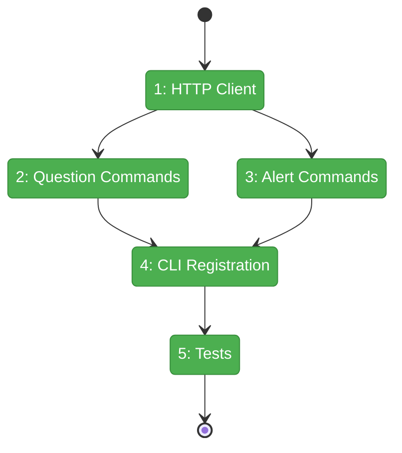
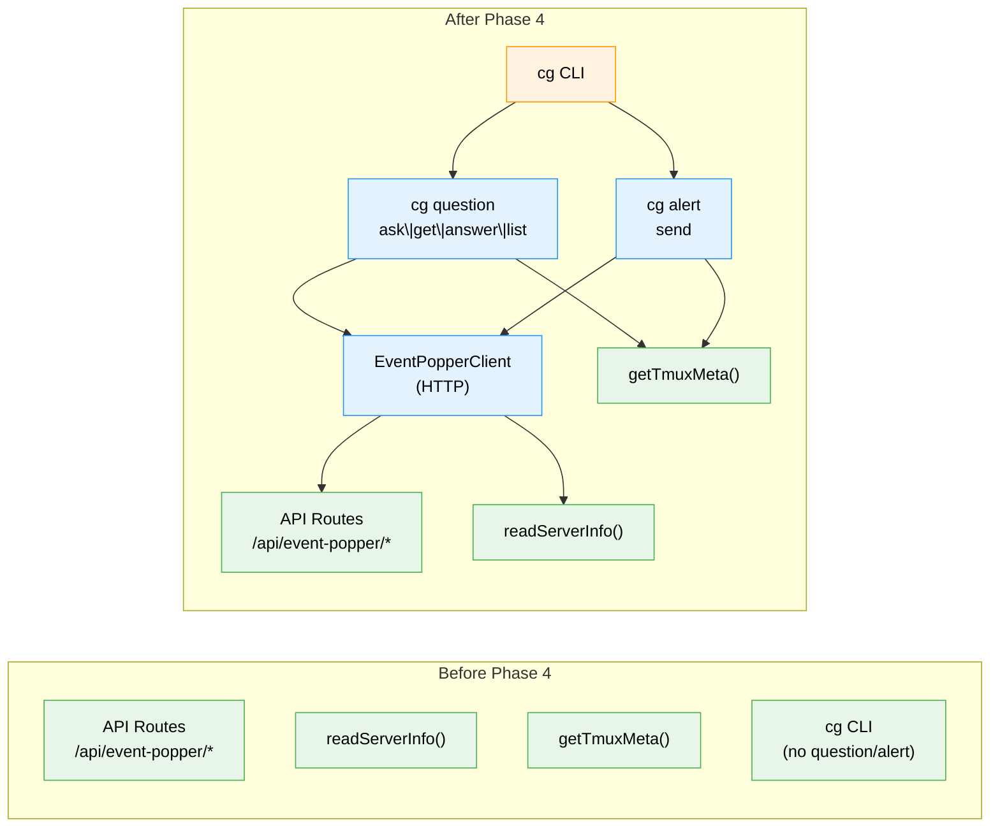

# Flight Plan: Phase 4 — CLI Commands

**Plan**: [plan.md](../../plan.md)
**Phase**: Phase 4: CLI Commands
**Generated**: 2026-03-07
**Status**: Landed

---

## Departure → Destination

**Where we are**: Phases 1-3 complete. The server has 7 API endpoints under `/api/event-popper/*` that accept questions and alerts, return JSON, and emit SSE events. Port discovery writes `.chainglass/server.json` on boot. Tmux context detection is a shared utility. But there's no way for an agent or script to call these endpoints — no CLI commands exist yet.

**Where we're going**: A developer (or AI agent) can run `cg question ask --text "Deploy to production?" --type confirm` from the terminal, the command blocks until the question is answered in the web UI (or times out), and the answer is printed as JSON to stdout. Agents can also send fire-and-forget alerts with `cg alert send --text "Build complete"`. The `--help` text is comprehensive enough that an agent reading it can fully use the system without any other documentation.

---

## Domain Context

### Domains We're Changing

| Domain | What Changes | Key Files |
|--------|-------------|-----------|
| `question-popper` | New CLI commands (question + alert) and HTTP client | `apps/cli/src/commands/question.command.ts`, `alert.command.ts`, `event-popper-client.ts` |

### Domains We Depend On (no changes)

| Domain | What We Consume | Contract |
|--------|----------------|----------|
| `_platform/external-events` | Port discovery, tmux detection | `readServerInfo()`, `getTmuxMeta()` |
| `question-popper` (server) | HTTP API endpoints | 5 routes under `/api/event-popper/*` |

---

## Flight Status

<!-- Updated by /plan-6-v2: pending → active → done. Use blocked for problems/input needed. -->

**Legend**: grey = pending | yellow = active | red = blocked/needs input | green = done

---

## Stages

<!-- Updated by /plan-6-v2 during implementation: [ ] → [~] → [x] -->

- [x] **Stage 1: HTTP client + fake** — Create `IEventPopperClient`, real fetch impl, `FakeEventPopperClient`, server discovery (`event-popper-client.ts`)
- [x] **Stage 2: Question commands** — `cg question` group with `ask` (blocking/poll), `get`, `answer`, `list` subcommands + help text (`question.command.ts`)
- [x] **Stage 3: Alert commands** — `cg alert` group with `send` subcommand + help text (`alert.command.ts`)
- [x] **Stage 4: CLI registration** — Import + register in `cg.ts`, export from `index.ts`
- [x] **Stage 5: Tests** — Unit tests with fake client (21 passing), integration tests with subprocess (describe.skip)

---

## Architecture: Before & After

**Legend**: existing (green, unchanged) | changed (orange, modified) | new (blue, created)

---

## Acceptance Criteria

- [x] AC-05: `cg question ask` blocks and returns answer JSON on success
- [x] AC-06: Default timeout 600s, prints `{ questionId, status: "pending" }` on expiry
- [x] AC-07: `--timeout 0` returns immediately with GUID
- [x] AC-08: `cg question get {id}` returns answer or pending status
- [x] AC-09: `cg question list` shows type, status, source, text, age
- [x] AC-10: `cg question answer {id} --answer "yes"` submits answer
- [x] AC-11: `cg alert send` returns immediately with alertId
- [x] AC-12: Alerts show in list alongside questions
- [x] AC-13: Tmux context auto-detected and included in meta
- [x] AC-14: System works identically without tmux
- [ ] AC-33: Minimal agent prompt (deferred to Phase 7)
- [x] AC-34: `cg question --help` is comprehensive and agent-oriented
- [x] AC-35: `cg alert --help` is comprehensive and agent-oriented

## Goals & Non-Goals

**Goals**: CLI commands for agents/scripts to ask questions and send alerts via localhost API, with blocking/poll, tmux detection, and self-documenting help.

**Non-Goals**: UI components, question chaining UI, CLAUDE.md prompt, interactive TTY prompts.

---

## Checklist

- [x] T001: Event Popper HTTP client + fake
- [x] T002: `cg question` group + help text
- [x] T003: `cg question ask` (blocking/poll)
- [x] T004: `cg question get`
- [x] T005: `cg question answer`
- [x] T006: `cg question list`
- [x] T007: `cg alert` group + help text
- [x] T008: `cg alert send`
- [x] T009: Register in CLI entry point
- [x] T010: Unit tests (≥13) — 21/21 passing
- [x] T011: Integration tests (describe.skip)
