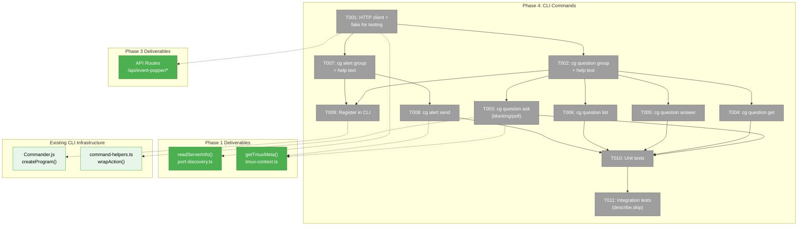
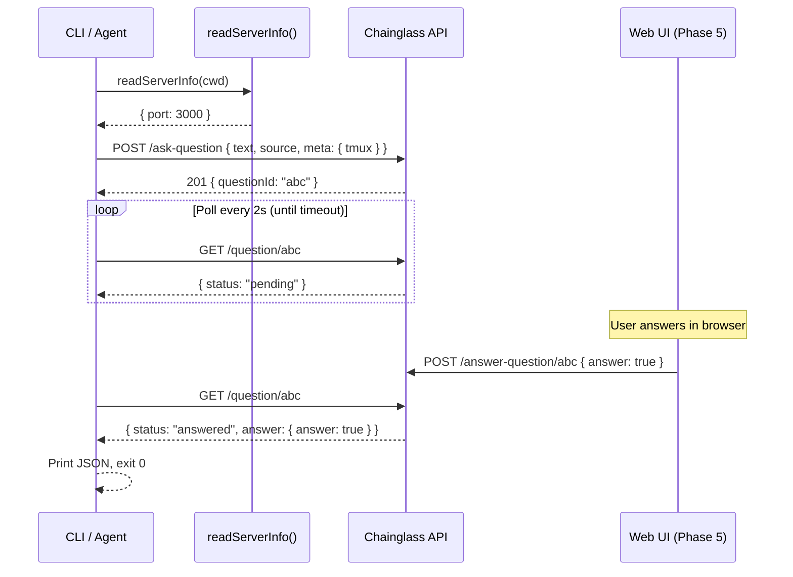

# Phase 4: CLI Commands — Tasks

**Plan**: [plan.md](../../plan.md)
**Phase**: Phase 4: CLI Commands
**Domain**: `question-popper` (CLI layer)
**ACs**: AC-05, AC-06, AC-07, AC-08, AC-09, AC-10, AC-11, AC-12, AC-13, AC-14, AC-33, AC-34, AC-35
**Testing**: Unit tests for handlers with fake HTTP client; integration tests for blocking/timeout (describe.skip)
**Mocks**: Fakes only (Constitution Principle 4)

---

## Executive Briefing

**Purpose**: Build the CLI commands (`cg question` and `cg alert`) that agents, scripts, and humans use to interact with the Question Popper system from the terminal. These are the primary agent interface — an agent runs `cg question ask`, blocks until answered, and gets JSON back. The CLI discovers the running Chainglass server via `.chainglass/server.json`, calls the localhost API (Phase 3), and handles blocking/polling/timeout.

**What We're Building**: Two Commander.js command groups (`cg question` with 4 subcommands + `cg alert` with 1 subcommand), an HTTP client wrapper for the event-popper API, a blocking poll loop, and comprehensive agent-oriented `--help` text that serves as the primary documentation for AI agents.

**Goals**:
- ✅ `cg question ask` — post question, block until answered or timeout, return JSON
- ✅ `cg question get {id}` — check question status, return JSON
- ✅ `cg question answer {id}` — submit answer from CLI (scripting/testing)
- ✅ `cg question list` — list all questions and alerts with status
- ✅ `cg alert send` — fire-and-forget alert, return immediately
- ✅ Auto-detect tmux context (session, window, pane) — no flags needed
- ✅ Self-documenting `--help` text detailed enough for agents to fully understand the system
- ✅ Server discovery via `readServerInfo()` with clear error when server not running
- ✅ All output as JSON to stdout for machine consumption

**Non-Goals**:
- ❌ UI components (Phase 5)
- ❌ Question chaining UI (Phase 6)
- ❌ CLAUDE.md agent prompt fragment (Phase 7 — only makes sense after CLI ships)
- ❌ Interactive prompts (CLI must work in non-TTY environments for agents)

---

## Prior Phase Context

### Phase 1: Event Popper Infrastructure — COMPLETE

**Deliverables used by Phase 4**:
- `readServerInfo(worktreePath)` from `@chainglass/shared/event-popper` — discovers server port + validates PID
- `getTmuxMeta()` from `@chainglass/shared/event-popper` — returns `{ tmux: { session, window, pane } }` or undefined
- `ServerInfo = { port, pid, startedAt }` — what port discovery returns

**Gotchas**: PID recycling guard uses OS-specific commands (`ps -o lstart=` on macOS, `/proc/{pid}/stat` on Linux). Returns `null` if stale. CLI must handle null gracefully.

### Phase 2: Question Concept — Types, Schemas, Service — COMPLETE

**Deliverables used by Phase 4**:
- `QuestionIn`, `AlertIn` types — shape of request bodies the CLI sends
- `QuestionOut`, `AlertOut` types — shape of responses the CLI receives
- `QuestionStatus`, `AlertStatus` — status enums for display
- `AskQuestionRequestSchema`, `SendAlertRequestSchema` — from Phase 3 route-helpers, define full body validation

**Gotchas**: `source` is required in all requests (min 1 char). `description` defaults to null. `timeout` defaults to 600. CLI must provide sensible defaults.

### Phase 3: Server API Routes — COMPLETE

**Deliverables used by Phase 4** (these are the HTTP endpoints the CLI calls):

| Method | URL | Body | Response | Status |
|--------|-----|------|----------|--------|
| POST | `/api/event-popper/ask-question` | `AskQuestionRequestSchema` | `{ questionId }` | 201 |
| GET | `/api/event-popper/question/{id}` | — | `QuestionOut` | 200/404 |
| POST | `/api/event-popper/answer-question/{id}` | `AnswerPayloadSchema` | `QuestionOut` | 200/404/409 |
| GET | `/api/event-popper/list?status=X&limit=N` | — | `{ items, total }` | 200 |
| POST | `/api/event-popper/send-alert` | `SendAlertRequestSchema` | `{ alertId }` | 201 |

**Error format**: `{ error: string, message?: string }` with HTTP status 400/403/404/409/500.

**Patterns**: CLI-only routes (ask-question, send-alert) use localhost guard only. All responses are JSON.

---

## Pre-Implementation Check

| File | Exists? | Domain Check | Notes |
|------|---------|-------------|-------|
| `apps/cli/src/commands/question.command.ts` | ❌ create | ✅ `question-popper` | New file for `cg question` group |
| `apps/cli/src/commands/alert.command.ts` | ❌ create | ✅ `question-popper` | New file for `cg alert` group |
| `apps/cli/src/commands/event-popper-client.ts` | ❌ create | ✅ `question-popper` | HTTP client + fake for testing |
| `apps/cli/src/commands/index.ts` | ✅ modify | ✅ | Add exports for new register functions |
| `apps/cli/src/bin/cg.ts` | ✅ modify | ✅ | Import + call register functions |
| `test/unit/question-popper/cli-commands.test.ts` | ❌ create | ✅ `question-popper` | Unit tests with fake client |
| `test/integration/question-popper/cli-blocking.test.ts` | ❌ create | ✅ `question-popper` | Integration tests (describe.skip) |

**Concept duplication check**: No existing event-popper CLI commands. The `resolveOrOverrideContext()` helper in `command-helpers.ts` resolves workspace paths — useful pattern but not directly needed (we use `readServerInfo(process.cwd())` for port discovery).

**Harness**: No agent harness configured. Standard testing approach.

---

## Architecture Map



---

## Tasks

| Status | ID | Task | Domain | Path(s) | Done When | Notes |
|--------|-----|------|--------|---------|-----------|-------|
| [x] | T001 | Create Event Popper HTTP client. (a) `IEventPopperClient` interface with typed methods: `askQuestion(body)`, `getQuestion(id)`, `answerQuestion(id, body)`, `listAll(params?)`, `sendAlert(body)`. (b) `createEventPopperClient(baseUrl)` — real implementation using native `fetch()`. Maps HTTP errors to thrown Error with status info. (c) `FakeEventPopperClient` — test double with canned response control. (d) `discoverServerUrl(worktreePath?)` — uses `readServerInfo()`, returns `http://localhost:{port}` or throws with clear "server not running" message. **DYK-02**: Poll-facing methods (`getQuestion`) must NOT throw on transient connection errors — wrap fetch in try/catch, return a sentinel or rethrow with `transient: true` flag so the poll loop can distinguish retryable from fatal errors. | `question-popper` | `apps/cli/src/commands/event-popper-client.ts` | Client calls all 5 API endpoints. Fake supports canned responses. Server discovery with clear error message. Transient errors distinguishable from fatal. | Constitution P4: fake, not mock. Interface enables testing without vi.mock. DYK-02: transient error handling. |
| [x] | T002 | Create `cg question` command group with agent-oriented `--help` text (AC-34). Register subcommands: `ask`, `get`, `answer`, `list`. The help text must explain: purpose of the system, semantics of each subcommand, all options with examples, blocking/timeout mechanics, how to handle each response status (`answered`, `needs-clarification`, `dismissed`, `pending`), follow-up question chaining via `--previous-question-id`, and when to use `cg question ask` vs `cg alert send`. | `question-popper` | `apps/cli/src/commands/question.command.ts` | `cg question --help` is self-documenting for agents. All subcommands registered. | AC-34: Help text detailed enough for agents to fully understand without other docs. |
| [x] | T003 | Implement `cg question ask` handler (AC-05, AC-06, AC-07, AC-13, AC-14). Options: `--type <text\|single\|multi\|confirm>` (default: text), `--text <question>` (required), `--description <markdown>`, `--options <choices...>` (for single/multi), `--default <value>`, `--timeout <seconds>` (default: 600), `--previous-question-id <id>`, `--source <name>` (default: auto-detect `cg-question:${USER}`). Auto-detect tmux via `getTmuxMeta()`. POST to `/api/event-popper/ask-question`. If `--timeout 0`: return immediately with `{ questionId }`. Otherwise: poll `GET /question/{id}` every 2 seconds via `Promise.race` with timeout. On answer: print answer JSON to stdout, exit 0. On timeout: print `{ questionId, status: "pending" }`, exit 0. **DYK-01**: Register SIGINT/SIGTERM handler that prints `{ questionId, status: "interrupted" }` to stdout before exiting, so agents can recover the questionId on cancellation. | `question-popper` | `apps/cli/src/commands/question.command.ts` | `cg question ask --type confirm --text "Deploy?"` blocks until answered. `--timeout 0` returns immediately. Tmux auto-detected. SIGINT prints questionId. | AC-05 (blocking), AC-06 (timeout 600s), AC-07 (--timeout 0), AC-13/14 (tmux). Poll interval: 2s. DYK-01: SIGINT recovery. |
| [x] | T004 | Implement `cg question get` handler (AC-08). Argument: `<id>` (required). GET `/api/event-popper/question/{id}`. If answered: print full QuestionOut JSON. If pending: print `{ questionId, status: "pending" }`. If not found: print error, exit 1. | `question-popper` | `apps/cli/src/commands/question.command.ts` | `cg question get {id}` returns answer JSON or pending status. 404 handled gracefully. | AC-08. |
| [x] | T005 | Implement `cg question answer` handler (AC-10). Arguments: `<id>` (required). Options: `--answer <value>` (required), `--text <freeform>`. **DYK-04**: GET the question first to determine `questionType`, then coerce `--answer` value: `"true"/"false"` → boolean for confirm, comma-separated → `string[]` for multi, raw string for text/single. POST to `/api/event-popper/answer-question/{id}` with coerced `{ answer, text }`. Print updated QuestionOut to stdout. Handle 404/409 gracefully. | `question-popper` | `apps/cli/src/commands/question.command.ts` | `cg question answer {id} --answer "yes"` submits answer with type coercion. Error handling for not-found and already-resolved. | AC-10. DYK-04: type coercion based on questionType. |
| [x] | T006 | Implement `cg question list` handler (AC-09, AC-12). Options: `--status <filter>`, `--limit <N>` (default: 20), `--json`. GET `/api/event-popper/list?status=X&limit=N`. Default output: human-readable table with type, status, source, text (truncated), and time ago. `--json`: raw JSON output. Alerts display alongside questions distinguished by type column. | `question-popper` | `apps/cli/src/commands/question.command.ts` | `cg question list` shows table. `--json` for machine output. Alerts visible alongside questions. | AC-09, AC-12. Default limit 20 for CLI readability (API default 100). |
| [x] | T007 | Create `cg alert` command group with agent-oriented `--help` text (AC-35). Register `send` subcommand. Help text explains: when to use alerts vs questions, fire-and-forget semantics, examples. | `question-popper` | `apps/cli/src/commands/alert.command.ts` | `cg alert --help` is self-documenting for agents. Explains alert vs question distinction. | AC-35. |
| [x] | T008 | Implement `cg alert send` handler (AC-11, AC-13, AC-14). Options: `--text <message>` (required), `--description <markdown>`, `--source <name>` (default: auto-detect `cg-alert:${USER}`). Auto-detect tmux via `getTmuxMeta()`. POST to `/api/event-popper/send-alert`. Return immediately (fire-and-forget) with `{ alertId }`. Exit 0. | `question-popper` | `apps/cli/src/commands/alert.command.ts` | `cg alert send --text "Build done"` returns immediately with alertId. Tmux auto-detected. | AC-11 (fire-and-forget), AC-13/14 (tmux). |
| [x] | T009 | Register both command groups in CLI entry point. (a) Add `registerQuestionCommands` import + call in `cg.ts`. (b) Add `registerAlertCommands` import + call in `cg.ts`. (c) Export both from `commands/index.ts`. | `question-popper` | `apps/cli/src/bin/cg.ts`, `apps/cli/src/commands/index.ts` | `cg question` and `cg alert` show in `cg --help`. Commands parse correctly. | Follow existing registration pattern (registerXyzCommands). |
| [~] | T010 | Unit tests for all CLI handlers. Use `FakeEventPopperClient` — no vi.mock. Tests: (a) ask-question valid → prints questionId JSON, (b) ask-question with --timeout 0 → returns immediately, (c) ask-question poll → answer received → prints answer, (d) ask-question poll → timeout → prints pending, (e) get-question found → prints QuestionOut, (f) get-question not found → error exit, (g) answer-question → prints updated QuestionOut, (h) answer-question 409 → error, (i) list → prints items, (j) list --json → raw JSON, (k) send-alert → prints alertId, (l) discoverServerUrl when server not running → throws, (m) tmux meta included in ask request. ≥13 tests. | `question-popper` | `test/unit/question-popper/cli-commands.test.ts` | ≥13 tests with FakeEventPopperClient. No vi.mock. Handler functions tested directly. | Constitution P4. Test handler functions not Commander wrappers. |
| [~] | T011 | Integration tests for blocking/timeout scenarios (describe.skip). Use subprocess spawning to run actual `cg question ask` in a child process, validate stdout JSON, test timeout behavior. Skipped by default (requires running server). (a) `cg question ask` blocks and returns on answer, (b) `cg question ask --timeout 1` times out after ~1s, (c) `cg question ask --timeout 0` returns immediately. | `question-popper` | `test/integration/question-popper/cli-blocking.test.ts` | 3 integration tests in describe.skip. Test structure correct, assertions reasonable. | Skipped — requires running server. Can be unskipped manually for E2E validation. |

---

## Context Brief

### Key Findings from Plan

- **Finding 4**: Service emits SSE on all lifecycle calls → CLI doesn't need to trigger notifications
- **Finding 5**: Auth bypass via `proxy.ts` → CLI calls from localhost pass localhostGuard automatically
- **CLI is agent-primary**: Output JSON to stdout. Human-readable format only for `list` subcommand default
- **Commander.js v13**: Use `.command()`, `.option()`, `.argument()`, `.action()` pattern
- **testMode**: `createProgram({ testMode: true })` prevents `process.exit()` — use for parser tests
- **wrapAction**: Existing helper wraps async handlers with try-catch — use for all action handlers

### Domain Dependencies

| Domain | Concept | Entry Point | What We Use It For |
|--------|---------|-------------|-------------------|
| `_platform/external-events` | Port discovery | `readServerInfo()` via `@chainglass/shared/event-popper` | Discover running server port |
| `_platform/external-events` | Tmux detection | `getTmuxMeta()` via `@chainglass/shared/event-popper` | Auto-include tmux context in meta |
| `question-popper` | API routes | `http://localhost:{port}/api/event-popper/*` | All 5 HTTP endpoints |
| `question-popper` | Type definitions | `QuestionOut`, `AlertOut` via `@chainglass/shared/question-popper` | Type-check API responses |

### Domain Constraints

- CLI files live under `apps/cli/src/commands/` (command convention)
- Import shared types from `@chainglass/shared/question-popper` and `@chainglass/shared/event-popper`
- CLI build bundles workspace dependencies via esbuild — shared package imports resolve at build time
- No `@/` alias in CLI (that's web-only) — use relative imports for CLI-internal files, package imports for shared
- Commander.js registration: `export function registerXyzCommands(program: Command): void`
- All async action handlers wrapped with `wrapAction()` from `command-helpers.ts`
- JSON output to stdout. Errors to stderr. Exit code 0 on success, 1 on error.

### Harness Context

No agent harness configured. Agent will use standard testing approach from plan (`just fft` before commit).

### Reusable from Prior Phases

- `readServerInfo()` — Phase 1, import from `@chainglass/shared/event-popper`
- `getTmuxMeta()` — Phase 1, import from `@chainglass/shared/event-popper`
- `wrapAction()` — existing CLI helper from `command-helpers.ts`
- `FakeQuestionPopperService` — Phase 2 (not directly used in CLI tests, but same fake pattern)
- `AskQuestionRequestSchema` / `SendAlertRequestSchema` — Phase 3 (for reference, not imported — CLI sends raw JSON)
- `QuestionOut` / `AlertOut` types — Phase 2 (for typing CLI responses)

### System Flow Diagram

```mermaid
flowchart LR
    subgraph Terminal["Terminal / Agent"]
        CLI["cg question ask<br/>--text 'Deploy?'"]
    end

    subgraph Discovery["Port Discovery"]
        JSON[".chainglass/<br/>server.json"]
        PORT["readServerInfo()"]
    end

    subgraph Server["Chainglass Server"]
        API["POST /api/event-popper/<br/>ask-question"]
        POLL["GET /api/event-popper/<br/>question/{id}"]
    end

    subgraph UI["Web UI"]
        OVERLAY["Question Overlay<br/>(Phase 5)"]
    end

    CLI -->|1. discover port| PORT
    PORT -->|reads| JSON
    CLI -->|2. POST question| API
    API -->|3. { questionId }| CLI
    CLI -->|4. poll every 2s| POLL
    OVERLAY -->|5. user answers| API
    POLL -->|6. { status: answered }| CLI
    CLI -->|7. print JSON, exit 0| Terminal
```

### Sequence Diagram



---

## Discoveries & Learnings

_Populated during implementation by plan-6._

| Date | Task | Type | Discovery | Resolution | References |
|------|------|------|-----------|------------|------------|

---

## Critical Insights (2026-03-07)

| # | Insight | Decision |
|---|---------|----------|
| 1 | SIGINT during blocking poll loses the questionId — agent can't recover | Register SIGINT/SIGTERM handler that prints `{ questionId, status: "interrupted" }` before exit |
| 2 | fetch() throws on connection refused — server restart during 10-min poll kills the CLI | Wrap each poll in try/catch, retry on transient errors, abort after 5 consecutive failures |
| 3 | Default `--source "cg-question"` is useless when multiple agents ask simultaneously | Auto-enrich default to `cg-question:${USER}` / `cg-alert:${USER}` |
| 4 | Commander.js delivers --answer as string — boolean/array answers stored as wrong type | GET question first to check questionType, then coerce value before POST |
| 5 | Text as optional positional argument for ergonomics | Rejected — KISS/YAGNI, keep --text flag only |

Action items: DYK-01 applied to T003, DYK-02 applied to T001, DYK-03 applied to T003+T008, DYK-04 applied to T005

---

## Directory Layout

```
docs/plans/067-question-popper/
  ├── plan.md
  ├── question-popper-spec.md
  └── tasks/
      ├── phase-1-event-popper-infrastructure/
      ├── phase-2-question-concept-types-schemas-service/
      ├── phase-3-server-api-routes/
      └── phase-4-cli-commands/
          ├── tasks.md                  ← this file
          ├── tasks.fltplan.md          ← flight plan (below)
          └── execution.log.md          ← created by plan-6
```
