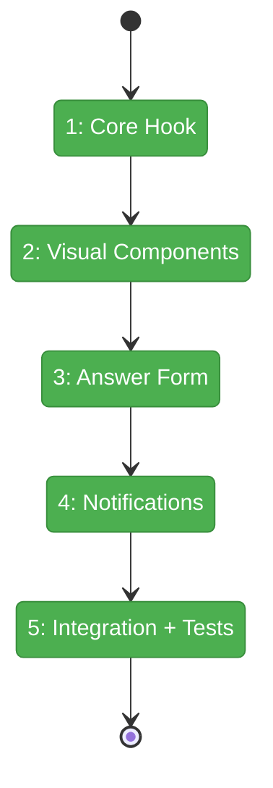
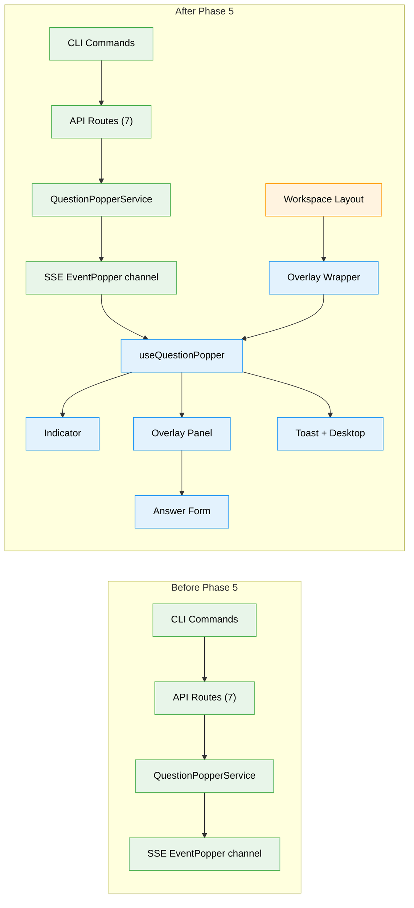

# Flight Plan: Phase 5 — Overlay UI

**Plan**: [plan.md](../../plan.md)
**Phase**: Phase 5: Overlay UI — Indicator, Panel, Answer Form
**Generated**: 2026-03-07
**Status**: Landed

---

## Departure → Destination

**Where we are**: Phases 1-4 complete. Infrastructure (schemas, GUID, port discovery, localhost guard), service (IQuestionPopperService with disk persistence + SSE emission), API routes (7 endpoints), and CLI commands (`cg question ask|get|answer|list`, `cg alert send`) are all implemented and reviewed. The server stores questions, emits SSE events, and exposes HTTP endpoints. The CLI can ask questions and poll for answers. But there is no web UI — questions asked by agents go unseen and unanswered.

**Where we're going**: A human with the Chainglass web UI open will see a glowing green question mark indicator when a question arrives. Clicking it opens an overlay panel showing the question with its markdown context. They answer via a type-appropriate form (text input, radio buttons, checkboxes, or yes/no), dismiss it, or request clarification — all without leaving their current workflow. Toast and desktop notifications ensure they notice questions even when focused in another app.

---

## Domain Context

### Domains We're Changing

| Domain | What Changes | Key Files |
|--------|-------------|-----------|
| `question-popper` | Add UI layer: hook, 5 components, notification bridge, overlay wrapper, workspace mount | `hooks/use-question-popper.tsx`, `components/*.tsx`, `lib/desktop-notifications.ts`, `question-popper-overlay-wrapper.tsx`, `layout.tsx` |

### Domains We Depend On (no changes)

| Domain | What We Consume | Contract |
|--------|----------------|----------|
| `_platform/external-events` | SSE channel name | `WorkspaceDomain.EventPopper` |
| `_platform/events` | SSE subscription pattern | `useSSE` hook |
| `question-popper` (prior phases) | Types, API endpoints, SSE events | `QuestionOut`, `AlertOut`, `AnswerPayload`, API routes |

---

## Flight Status

<!-- Updated by /plan-6-v2: pending → active → done. Use blocked for problems/input needed. -->

**Legend**: grey = pending | yellow = active | red = blocked/needs input | green = done

---

## Stages

<!-- Updated by /plan-6-v2 during implementation: [ ] → [~] → [x] -->

- [x] **Stage 1: Core Hook** — `useQuestionPopper` with SSE subscription, API fetch, overlay state, mutual exclusion (`use-question-popper.tsx`)
- [x] **Stage 2: Visual Components** — Indicator with glow/badge, overlay panel with item list, question card with markdown, alert card (`*-indicator.tsx`, `*-overlay-panel.tsx`, `question-card.tsx`, `alert-card.tsx`)
- [x] **Stage 3: Answer Form** — Type-appropriate inputs (text/single/multi/confirm), freeform text, Submit/Needs More Info/Dismiss (`answer-form.tsx`)
- [x] **Stage 4: Notifications** — Toast via sonner, desktop via Notification API, permission request (`desktop-notifications.ts`)
- [x] **Stage 5: Integration + Tests** — Wrapper (provider + error boundary + dynamic import), mount in workspace layout, component tests (`question-popper-overlay-wrapper.tsx`, `layout.tsx`, `ui-components.test.tsx`)

---

## Architecture: Before & After

**Legend**: existing (green, unchanged) | changed (orange, modified) | new (blue, created)

---

## Acceptance Criteria

- [x] AC-15: Toast + desktop notification on new question/alert SSE event
- [x] AC-16: Question mark indicator — large green glow when outstanding, small gray when none
- [x] AC-17: Badge count includes unanswered questions + unread alerts
- [x] AC-18: Click indicator opens overlay; newest outstanding item shown first
- [x] AC-19: Overlay doesn't take over page; participates in mutual exclusion
- [x] AC-20: Question renders text + markdown description + tmux badge; alert similar without answer form
- [x] AC-21: Answer form matches question type (text/single/multi/confirm) + freeform text
- [x] AC-22: "Needs More Information" option on every question
- [x] AC-23: "Mark Read" button on alerts calls acknowledge API
- [x] AC-28: Real-time updates — indicator/overlay sync on answer/acknowledge events
- [x] AC-29: New items appear in open overlay in real time
- [x] AC-30: Desktop notification via Notifications API (if permission granted)
- [x] AC-31: Dismiss question without answering; badge decrements
- [x] AC-32: Dismissed question visible in history with "dismissed" status

## Goals & Non-Goals

**Goals**:
- Human can see and respond to questions from CLI agents in real time
- Non-intrusive notification (toast + desktop + indicator, no page takeover)
- Type-appropriate answer forms for all 4 question types
- Overlay mutual exclusion with agents, terminal, activity-log

**Non-Goals**:
- Question chaining / conversation threading (Phase 6)
- Historical list with expandable detail (Phase 6)
- Keyboard shortcut for overlay toggle (Phase 7)
- Agent prompt / CLAUDE.md (Phase 7)

---

## Checklist

- [x] T001: `useQuestionPopper` hook — SSE + API fetch + overlay state + mutual exclusion
- [x] T002: `QuestionPopperIndicator` — question mark icon, green glow, badge count
- [x] T003: `QuestionPopperOverlayPanel` — fixed-position panel, item list, Escape to close
- [x] T004: `QuestionCard` — text, markdown description, tmux badge, time-ago
- [x] T005: `AlertCard` — text, markdown description, "Mark Read"
- [x] T006: `AnswerForm` — 4 input variants, freeform text, Submit/NMI/Dismiss
- [x] T007: Toast + desktop notification bridge
- [x] T008: `QuestionPopperOverlayWrapper` — provider + error boundary + dynamic import
- [x] T009: Mount wrapper in workspace layout
- [x] T010: Component tests
