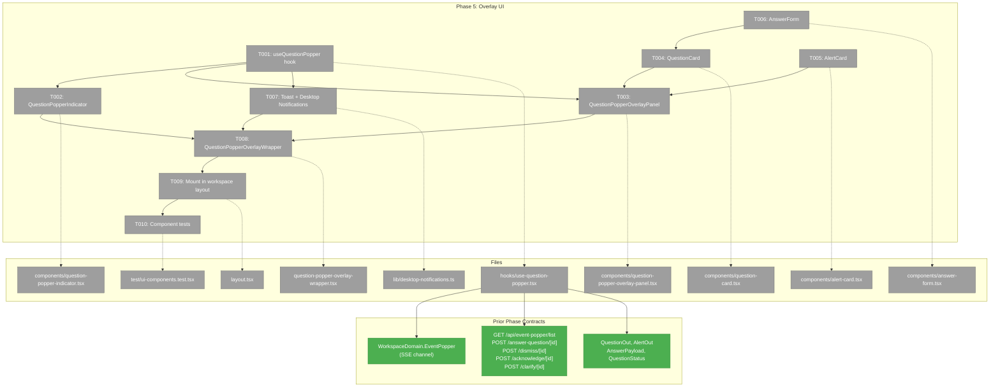
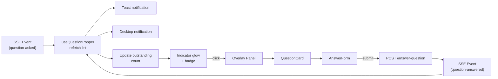
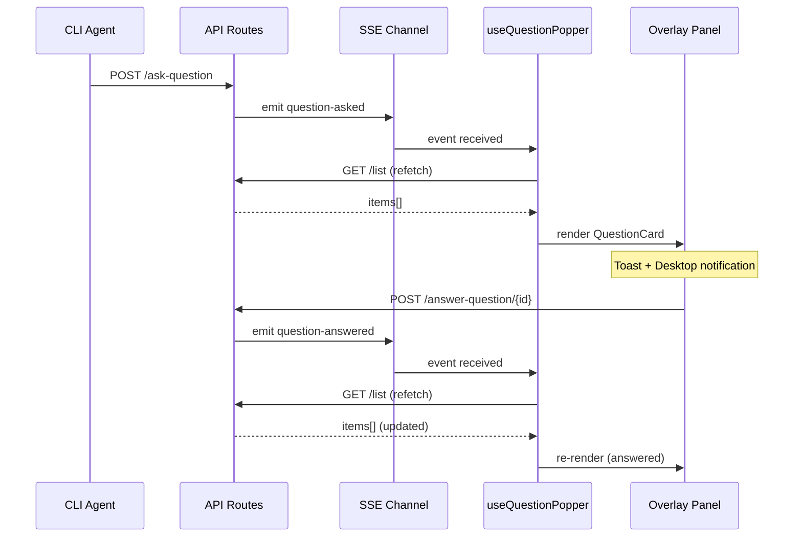

# Phase 5: Overlay UI — Indicator, Panel, Answer Form

## Executive Briefing

- **Purpose**: Build the web UI that lets humans see and respond to questions/alerts from CLI tools and agents. This phase delivers the full user-facing experience: a glowing indicator, overlay panel, answer form, toast/desktop notifications.
- **What We're Building**: A `QuestionPopperOverlayWrapper` (provider + SSE hook + error boundary) mounted in the workspace layout that renders a fixed-position indicator and overlay panel. The panel lists outstanding and historical items, renders markdown descriptions, and provides type-appropriate answer forms.
- **Goals**: ✅ Human can see new questions/alerts arrive in real time ✅ Human can answer questions via type-appropriate form ✅ Human can dismiss questions, mark alerts read ✅ Desktop + toast notifications alert the human even when focused elsewhere ✅ Overlay participates in mutual exclusion with agents/terminal/activity-log
- **Non-Goals**: ❌ Question chaining / conversation threading (Phase 6) ❌ Historical list with expandable detail (Phase 6) ❌ Agent integration / CLAUDE.md (Phase 7) ❌ SDK keyboard shortcut for overlay toggle (Phase 7)

---

## Prior Phase Context

### Phase 1: Event Popper Infrastructure ✅

**A. Deliverables**: `@chainglass/shared/event-popper` barrel — envelope schemas, `generateEventId()`, port discovery (`readServerInfo`/`writeServerInfo`), `detectTmuxContext()`. `localhostGuard()` in `apps/web/src/lib/`. `WorkspaceDomain.EventPopper` SSE channel. Auth bypass for `/api/event-popper` in `proxy.ts`. Server.json write in `instrumentation.ts`. 30 tests.

**B. Dependencies Exported**: `EventPopperRequest/Response` schemas/types, `generateEventId()`, `WorkspaceDomain.EventPopper = 'event-popper'` (SSE channel name), `localhostGuard()`, `isLocalhostRequest()`, `detectTmuxContext()`, `TmuxContext` type.

**C. Gotchas**: Zod v4 `z.record(z.unknown())` crashes — use `z.record(z.string(), z.unknown())`. PID recycling guard is OS-specific (macOS/Linux). Schema `.strict()` blocks payload extensibility — extend inside payload.

**D. Incomplete**: None.

**E. Patterns**: HMR-safe globalThis guards. ISO-8601 strings for datetime. Secondary sort key for deterministic ordering.

### Phase 2: Question Concept — Types, Schemas, Service ✅

**A. Deliverables**: `@chainglass/shared/question-popper` barrel — payload schemas, composed types, `IQuestionPopperService`, `FakeQuestionPopperService`. `QuestionPopperService` real implementation in `apps/web/src/features/067-question-popper/lib/`. Contract tests (15 contracts × 2 impls + 5 SSE companions). DI registration in `di-container.ts`.

**B. Dependencies Exported**: `IQuestionPopperService` (10 methods), `QuestionIn/Out`, `AlertIn/Out`, `StoredQuestion/Alert/Event`, `QuestionStatus/AlertStatus`, `QuestionPayloadSchema`, `AnswerPayloadSchema`, `FakeQuestionPopperService`, `WORKSPACE_DI_TOKENS.QUESTION_POPPER_SERVICE`.

**C. Gotchas**: `listAll()` sort instability — use secondary sort by ID. Per-entry error isolation in rehydration. State domain (`IStateService`) intentionally deferred — count comes via SSE payload. Service constructor takes `(worktreePath, notifier: ICentralEventNotifier)`.

**D. Incomplete**: None.

**E. Patterns**: Interface-first, fake-second, contract-tests-third, impl-last. SSE events: `{concept}-{action}` naming. Outstanding count included in every SSE event payload. Notification-fetch pattern: SSE sends thin notification, consumer fetches full data via API.

### Phase 3: Server API Routes ✅

**A. Deliverables**: `route-helpers.ts` (auth, validation, error mapping, response mappers). 7 route files under `apps/web/app/api/event-popper/*`. 41 handler unit tests.

**B. Dependencies Exported**: `toQuestionOut(StoredQuestion) → QuestionOut`, `toAlertOut(StoredAlert) → AlertOut`. API endpoints: `POST ask-question`, `GET question/[id]`, `POST answer-question/[id]`, `POST send-alert`, `GET list`, `POST dismiss/[id]`, `POST clarify/[id]`, `POST acknowledge/[id]`. Handler functions exported for testing.

**C. Gotchas**: Next.js 16 params are `Promise<{id: string}>` — must await. `export const dynamic = 'force-dynamic'` required for DI container access. Shared routes: localhost-first auth, fallback to session auth for browser.

**D. Incomplete**: None.

**E. Patterns**: `authorizeRequest(request, 'cli-only' | 'shared')` dual-auth. Handler functions take `(request, service)` for testability. `parseJsonBody(request, schema)` for validation. `eventPopperErrorResponse(error, context)` for error mapping.

### Phase 4: CLI Commands ✅

**A. Deliverables**: `event-popper-client.ts` (`IEventPopperClient`, real fetch, `FakeEventPopperClient`, `discoverServerUrl`). `question.command.ts` (ask/get/answer/list + `CliIO` interface). `alert.command.ts` (send). 22 unit tests + 3 integration tests (skip).

**B. Dependencies Exported**: `IEventPopperClient`, `FakeEventPopperClient`, `CliIO` interface, `discoverServerUrl()`. CLI output format: JSON to stdout.

**C. Gotchas**: SIGINT handler prints `{ questionId, status: "interrupted" }` for agent recovery. Poll loop retries transient errors (5 consecutive failures → abort). `--answer` coerced based on `questionType` from server. Commander.js delivers all option values as strings.

**D. Incomplete**: Integration tests are `describe.skip`.

**E. Patterns**: Injectable `CliIO` seam (log, error, sleep) — no `vi.spyOn`. `FakeEventPopperClient` with canned responses — no `vi.mock`.

---

## Pre-Implementation Check

| File | Exists? | Domain Check | Notes |
|------|---------|-------------|-------|
| `apps/web/src/features/067-question-popper/hooks/` | ❌ No | `question-popper` ✅ | Create directory |
| `apps/web/src/features/067-question-popper/components/` | ❌ No | `question-popper` ✅ | Create directory |
| `apps/web/src/features/067-question-popper/lib/desktop-notifications.ts` | ❌ No | `question-popper` ✅ | New file |
| `apps/web/app/(dashboard)/workspaces/[slug]/question-popper-overlay-wrapper.tsx` | ❌ No | `question-popper` ✅ | New file |
| `apps/web/app/(dashboard)/workspaces/[slug]/layout.tsx` | ✅ Yes | `question-popper` ✅ | Modify — add wrapper to nesting chain |
| `test/unit/question-popper/ui-components.test.tsx` | ❌ No | `question-popper` ✅ | New file |
| `react-markdown` dependency | ✅ Installed | — | v10.1.0 + `remark-gfm` v4.0.1 available |
| `sonner` toast dependency | ✅ Installed | — | Already mounted via `<Toaster />` in providers layout |

**Concept search**: No existing "question popper" or "event popper" UI components found. This is new greenfield UI.

**Harness**: No agent harness configured. Agent will use standard testing approach from plan.

---

## Architecture Map



---

## Tasks

| Status | ID | Task | Domain | Path(s) | Done When | Notes |
|--------|-----|------|--------|---------|-----------|-------|
| [x] | T001 | `useQuestionPopper` hook: SSE subscription to `EventPopper` channel, API fetch for list, outstanding count, overlay open/close with mutual exclusion, action methods (answer, dismiss, clarify, acknowledge) | `question-popper` | `apps/web/src/features/067-question-popper/hooks/use-question-popper.tsx` | Hook provides items list, outstanding count, overlay toggle, and API action methods. SSE events trigger refetch. Mutual exclusion via `overlay:close-all`. | Finding 4: notification-fetch pattern — SSE sends thin event, hook refetches full list. Follow `useAgentOverlay` pattern for overlay state + `isOpeningRef` guard. CS-3. |
| [x] | T002 | `QuestionPopperIndicator`: Round question mark icon, large+green glow when outstanding > 0, small+gray when 0. Badge shows count. Click toggles overlay. | `question-popper` | `apps/web/src/features/067-question-popper/components/question-popper-indicator.tsx` | Indicator renders with correct visual state based on outstanding count. Click calls `toggleOverlay()`. Green glow animation via CSS/Tailwind. | AC-16. Follow `AgentStatusIndicator` pattern for badge styling. Fixed position top-right via wrapper. CS-1. |
| [x] | T003 | `QuestionPopperOverlayPanel`: Fixed-position panel showing outstanding items (newest first). When no outstanding items, show recent history. Close button, Escape key handler. | `question-popper` | `apps/web/src/features/067-question-popper/components/question-popper-overlay-panel.tsx` | Panel opens/closes correctly, shows item list, newest first. Closes on Escape. | AC-18, AC-19. Follow `AgentOverlayPanel` pattern for positioning (fixed bottom-right, z-45). Scrollable item list. CS-2. |
| [x] | T004 | `QuestionCard`: Render question text prominently, scrollable markdown description (via `react-markdown` + `remark-gfm`), tmux session/window badge (from `meta.tmux`), time-ago display, status badge. | `question-popper` | `apps/web/src/features/067-question-popper/components/question-card.tsx` | Question text, markdown description, tmux badge, and time-ago all render correctly. Markdown supports GFM. | AC-20. `react-markdown` v10.1.0 is installed. Use `date-fns` `formatDistanceToNow()` for time-ago if available, or simple relative time helper. CS-2. |
| [x] | T005 | `AlertCard`: Render alert text, scrollable markdown description, tmux badge, time-ago, status. "Mark Read" button calls `acknowledgeAlert()`. | `question-popper` | `apps/web/src/features/067-question-popper/components/alert-card.tsx` | Alert renders with text, description, tmux badge. "Mark Read" calls API and updates state. | AC-20, AC-23. Simpler than QuestionCard — no answer form. Share markdown/time-ago patterns with T004. CS-1. |
| [x] | T006 | `AnswerForm`: Type-appropriate input — textarea for `text`, radio buttons for `single`, checkboxes for `multi`, Yes/No buttons for `confirm`. Always includes freeform text field. Submit, Needs More Info, Dismiss buttons. | `question-popper` | `apps/web/src/features/067-question-popper/components/answer-form.tsx` | Form renders correct input type per `questionType`. Submit calls `answerQuestion()`. "Needs More Info" shows clarification text input and calls `requestClarification()`. "Dismiss" calls `dismissQuestion()`. | AC-21, AC-22, AC-31. Answer types: `string` (text), `string` (single), `string[]` (multi), `boolean` (confirm). Freeform `text` field sent alongside typed `answer`. CS-3. |
| [x] | T007 | Toast + desktop notifications: On SSE event arrival, show toast ("Question from {source}: {text}") and trigger desktop notification via Notifications API. Request notification permission on first interaction. | `question-popper` | `apps/web/src/features/067-question-popper/lib/desktop-notifications.ts` | Toast appears on new question/alert. Desktop notification fires (if permission granted). Permission requested on first overlay open. | AC-15, AC-30. Toast: `import { toast } from 'sonner'`. Desktop: `new Notification(title, { body })`. Need permission check: `Notification.permission`. CS-2. |
| [x] | T008 | `QuestionPopperOverlayWrapper`: Provider component + error boundary + renders indicator + panel + toast bridge. Dynamic import for panel (`ssr: false`). | `question-popper` | `apps/web/app/(dashboard)/workspaces/[slug]/question-popper-overlay-wrapper.tsx` | Wrapper provides context to indicator, panel, and toast bridge. Error boundary catches panel errors without crashing workspace. | Follow `ActivityLogOverlayWrapper` pattern exactly: Provider wraps children, panel + bridge rendered alongside. Indicator rendered here (fixed position). CS-1. |
| [x] | T009 | Mount wrapper in workspace layout: Add `QuestionPopperOverlayWrapper` to the nesting chain in workspace layout. | `question-popper` | `apps/web/app/(dashboard)/workspaces/[slug]/layout.tsx` (modify) | Wrapper appears in nesting chain, overlay functional in workspace. | Insert wrapper around `WorkspaceAgentChrome` (or adjacent to `ActivityLogOverlayWrapper`). Single-line addition. CS-1. |
| [x] | T010 | Component tests: Hook behavior (SSE → refetch, overlay toggle, mutual exclusion), answer form (submit per type, needs-more-info, dismiss), indicator (glow state, badge count). | `question-popper` | `test/unit/question-popper/ui-components.test.tsx` | Tests pass covering hook SSE handling, answer form submission, indicator visual states. | Lightweight per plan. Use `@testing-library/react` if available, otherwise Vitest + JSDOM. FakeQuestionPopperService for API mocking pattern. CS-2. |

---

## Context Brief

### Key Findings from Plan

- **Finding 1**: All infrastructure exists — `ICentralEventNotifier`, overlay pattern, toast, SSE. Integration exercise only.
- **Finding 2**: Activity-log (Plan 065) is closest structural template — follow its overlay pattern.
- **Finding 4**: Can call `notifier.emit()` from API route handlers — server-side real-time updates already wired (Phase 2).

### SSE Events on `EventPopper` Channel

The service emits these event types (from Phase 2):

| Event Type | Payload | Trigger |
|-----------|---------|---------|
| `question-asked` | `{ questionId, outstandingCount }` | New question submitted |
| `question-answered` | `{ questionId, outstandingCount }` | Answer recorded |
| `question-dismissed` | `{ questionId, outstandingCount }` | Question dismissed |
| `question-clarification` | `{ questionId, outstandingCount }` | Clarification requested |
| `alert-sent` | `{ alertId, outstandingCount }` | New alert submitted |
| `alert-acknowledged` | `{ alertId, outstandingCount }` | Alert marked read |
| `rehydrated` | `{ outstandingCount }` | Service init (page load) |

**Pattern**: SSE events are thin notifications. The hook should refetch the full list via `GET /api/event-popper/list` when any event arrives (notification-fetch pattern).

### API Endpoints for UI

| Endpoint | Method | Purpose | Response |
|----------|--------|---------|----------|
| `/api/event-popper/list` | GET | Fetch all items | `{ items: (QuestionOut \| AlertOut)[] }` |
| `/api/event-popper/answer-question/[id]` | POST | Submit answer | `{ questionId, status: 'answered' }` |
| `/api/event-popper/dismiss/[id]` | POST | Dismiss question | `{ questionId, status: 'dismissed' }` |
| `/api/event-popper/clarify/[id]` | POST | Request clarification | `{ questionId, status: 'needs-clarification' }` |
| `/api/event-popper/acknowledge/[id]` | POST | Mark alert read | `{ alertId, status: 'acknowledged' }` |

All shared routes accept localhost OR authenticated browser requests.

### Domain Dependencies

- `question-popper`: `QuestionOut`, `AlertOut`, `AnswerPayload`, `QuestionStatus`, `AlertStatus` types — render items and form inputs
- `_platform/external-events`: `WorkspaceDomain.EventPopper` — SSE channel name for subscription
- `_platform/events`: `useSSE` hook pattern — SSE subscription with auto-reconnection
- `_platform/state`: Not used — outstanding count comes from SSE event payloads, not IStateService

### Domain Constraints

- All new files go under `apps/web/src/features/067-question-popper/` (hooks/ and components/)
- Wrapper file goes in `apps/web/app/(dashboard)/workspaces/[slug]/`
- Client components only (`'use client'`) — all Phase 5 files are interactive
- Import types from `@chainglass/shared/question-popper` (public contract)
- No imports from `question-popper.service.ts` (server-only internal)
- No `vi.mock` — use fakes/injection (Constitution Principle 4)

### Overlay Mutual Exclusion Pattern

Every overlay follows this exact pattern (from `useAgentOverlay`, `useActivityLogOverlay`, `useTerminalOverlay`):

```tsx
const isOpeningRef = useRef(false);

const open = useCallback(() => {
  isOpeningRef.current = true;
  window.dispatchEvent(new CustomEvent('overlay:close-all'));
  isOpeningRef.current = false;
  setState({ isOpen: true });
}, []);

useEffect(() => {
  const handler = () => {
    if (isOpeningRef.current) return; // Guard: don't close self
    close();
  };
  window.addEventListener('overlay:close-all', handler);
  return () => window.removeEventListener('overlay:close-all', handler);
}, [close]);
```

### Notification-Fetch Pattern

SSE events contain only IDs and counts (thin). When an event arrives, the hook fetches the full item list via API. This prevents large payloads over SSE and ensures consistency.

```tsx
// In useQuestionPopper hook
useEffect(() => {
  if (sseMessages.length > 0) {
    refetchList(); // GET /api/event-popper/list
    clearMessages();
  }
}, [sseMessages]);
```

### Reusable from Prior Phases

- `FakeQuestionPopperService` — for testing hook API calls
- `QuestionOut` / `AlertOut` types — render data shapes
- `AnswerPayloadSchema` — validate answer form before submission
- `useSSE` hook (`/src/hooks/useSSE.ts`) — generic SSE subscription
- `toast` from `sonner` — mounted in providers layout
- `react-markdown` + `remark-gfm` — markdown rendering
- `overlay:close-all` event pattern — proven in 3 existing overlays
- `AgentOverlayProvider` / `ActivityLogOverlayWrapper` — structural templates

### Answer Form Input Mapping

| `questionType` | Input Element | `answer` Type | Default |
|---------------|--------------|---------------|---------|
| `text` | `<textarea>` | `string` | question.default (string) |
| `single` | Radio buttons for `question.options[]` | `string` (selected option) | question.default (string) |
| `multi` | Checkboxes for `question.options[]` | `string[]` (selected options) | — |
| `confirm` | Yes / No buttons | `boolean` | question.default (boolean) |

All types include an additional freeform `<textarea>` for the `text` field (optional commentary alongside the typed answer).

### Mermaid Flow Diagram — User Interaction



### Mermaid Sequence Diagram — Answer Flow



---

## Discoveries & Learnings

_Populated during implementation by plan-6._

| Date | Task | Type | Discovery | Resolution | References |
|------|------|------|-----------|------------|------------|

---

## Directory Layout

```
docs/plans/067-question-popper/
  ├── plan.md
  ├── question-popper-spec.md
  └── tasks/phase-5-overlay-ui/
      ├── tasks.md          ← this file
      ├── tasks.fltplan.md  ← generated next
      └── execution.log.md  ← created by plan-6
```
