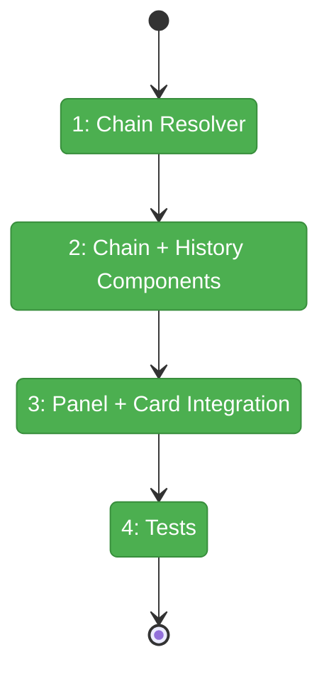
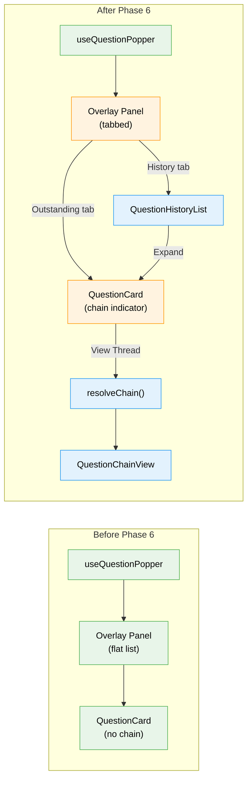

# Flight Plan: Phase 6 — Question Chaining + History

**Plan**: [plan.md](../../plan.md)
**Phase**: Phase 6: Question Chaining + History
**Generated**: 2026-03-07
**Status**: Landed

---

## Departure → Destination

**Where we are**: Phases 1-5 complete. The full stack works: CLI agents can ask questions, the server stores them and emits SSE events, and the web UI shows a glowing indicator, overlay panel, type-appropriate answer form, and toast/desktop notifications. Outstanding and historical items are visible. But follow-up questions linked via `previousQuestionId` render as isolated cards with no visible relationship, and the history view has no expand/collapse — it's a flat list.

**Where we're going**: When an agent asks a follow-up question linked to a previous one, the UI renders the conversation as a threaded timeline showing each turn from oldest to newest. The overlay has clear tabs for "Outstanding" (actionable items) and "History" (all past items). Clicking any historical item expands it to show full detail including its conversation chain.

---

## Domain Context

### Domains We're Changing

| Domain | What Changes | Key Files |
|--------|-------------|-----------|
| `question-popper` | Add chain resolution, chain view component, history list with expand, tabbed overlay, chain indicator on question card | `lib/chain-resolver.ts`, `components/question-chain-view.tsx`, `components/question-history-list.tsx`, `components/question-popper-overlay-panel.tsx` (modify), `components/question-card.tsx` (modify) |

### Domains We Depend On (no changes)

| Domain | What We Consume | Contract |
|--------|----------------|----------|
| `question-popper` (prior phases) | `QuestionOut.question.previousQuestionId`, `useQuestionPopper().items`, `GET /api/event-popper/question/[id]` | Types, hook, API |

---

## Flight Status

**Legend**: grey = pending | yellow = active | red = blocked/needs input | green = done

---

## Stages

- [x] **Stage 1: Chain Resolver** — Pure function to walk `previousQuestionId` links, local-first with API fallback (`chain-resolver.ts`)
- [x] **Stage 2: Chain + History Components** — `QuestionChainView` (conversation timeline) + `QuestionHistoryList` (expandable items) (`question-chain-view.tsx`, `question-history-list.tsx`)
- [x] **Stage 3: Panel + Card Integration** — Tabbed overlay panel + chain indicator on QuestionCard (`question-popper-overlay-panel.tsx`, `question-card.tsx` — modify)
- [x] **Stage 4: Tests** — Chain resolver unit tests + component rendering tests (`chain-resolver.test.tsx`)

---

## Architecture: Before & After

**Legend**: existing (green, unchanged) | changed (orange, modified) | new (blue, created)

---

## Acceptance Criteria

- [x] AC-24: Chain renders as conversation thread
- [x] AC-25: Follow-up questions trigger independent notifications (already satisfied — verified)
- [x] AC-26: History view shows all past items
- [x] AC-27: Clicking historical item expands to show full detail including chain

## Goals & Non-Goals

**Goals**:
- Conversation chains render as visual timelines with turn connectors
- History is always accessible via tab (not just when no outstanding items)
- Expandable detail on historical items
- Chain resolution is robust (handles missing links, circular refs)

**Non-Goals**:
- Chain depth limits or pagination
- Server-side chain resolution API endpoint
- Agent integration / CLAUDE.md (Phase 7)
- SDK keyboard shortcut (Phase 7)

---

## Checklist

- [~] T001: `resolveChain()` — walk `previousQuestionId`, local-first + API fallback
- [ ] T002: `QuestionChainView` — conversation timeline component
- [ ] T003: `QuestionHistoryList` — expandable history with full detail
- [ ] T004: Enhance overlay panel with Outstanding / History tabs
- [ ] T005: Update QuestionCard with chain indicator + "View Thread"
- [ ] T006: Chain resolver + component tests
