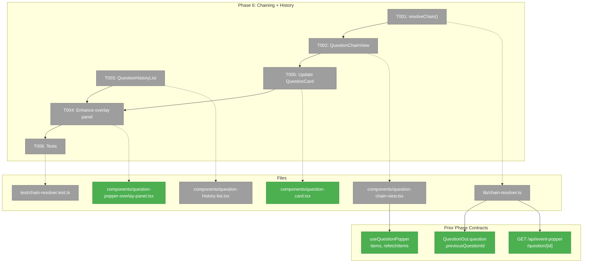
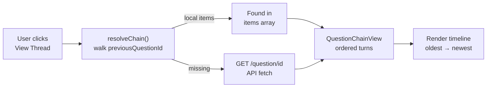
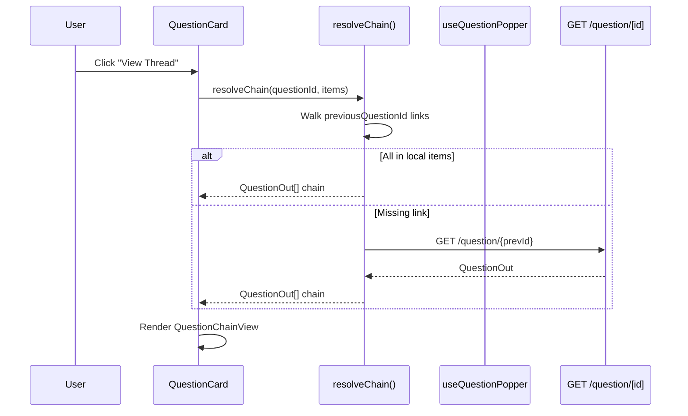

# Phase 6: Question Chaining + History

## Executive Briefing

- **Purpose**: Add conversation threading and historical browsing to the Question Popper overlay. When an agent asks a follow-up question linked to a previous one, the UI renders them as a conversation thread. Users can also browse all past questions and alerts with expandable detail.
- **What We're Building**: A `resolveChain()` utility that walks `previousQuestionId` links, a `QuestionChainView` component rendering conversation turns, a tabbed overlay with "Outstanding" / "History" views, and expandable item detail in history.
- **Goals**: ✅ Conversation chains render as sequential turns ✅ Follow-up questions trigger independent notifications (AC-25) ✅ History tab shows all past items, expandable with full detail + chain ✅ Chain resolution handles items already in memory and fetches missing links via API
- **Non-Goals**: ❌ Agent integration / CLAUDE.md (Phase 7) ❌ SDK keyboard shortcut (Phase 7) ❌ Chain depth limits or pagination (YAGNI) ❌ Server-side chain resolution (client-side is sufficient)

---

## Prior Phase Context

### Phase 5: Overlay UI ✅

**A. Deliverables**: `useQuestionPopper` hook (SSE subscription, API fetch, overlay state, mutual exclusion), `QuestionPopperIndicator` (glow + badge), `QuestionPopperOverlayPanel` (fixed bottom-right, outstanding vs history toggle), `QuestionCard` (markdown description, tmux badge, time-ago), `AlertCard` (Mark Read), `AnswerForm` (4 input types + freeform + dismiss + NMI), `desktop-notifications.ts` (toast + Notifications API), `QuestionPopperOverlayWrapper` (provider + error boundary + dynamic import), mounted in workspace layout. 13 component tests.

**B. Dependencies Exported**: `useQuestionPopper()` hook with `{ items, outstandingItems, outstandingCount, isOverlayOpen, toggleOverlay, answerQuestion, dismissQuestion, requestClarification, acknowledgeAlert, refetchItems }`. Type guards: `isQuestionItem()`, `isAlertItem()`. `EventPopperItem` union type. Notification utilities.

**C. Gotchas**: Inline `timeAgo()` utility (no date-fns). `<section>` instead of `<div role="dialog">` per Biome a11y. SSE reconnect max 5 attempts. Confirm questions submit immediately on Yes/No click.

**D. Incomplete**: None — all 10 tasks complete.

**E. Patterns to Follow**: Notification-fetch pattern (SSE → refetch full list). Mutual exclusion via `overlay:close-all`. Provider + hook split. Type guards first. Dynamic import for panel (ssr: false). Error boundary on wrapper.

---

## Pre-Implementation Check

| File | Exists? | Domain Check | Notes |
|------|---------|-------------|-------|
| `apps/web/src/features/067-question-popper/lib/chain-resolver.ts` | ❌ No | `question-popper` ✅ | New file — pure function |
| `apps/web/src/features/067-question-popper/components/question-chain-view.tsx` | ❌ No | `question-popper` ✅ | New file — conversation thread UI |
| `apps/web/src/features/067-question-popper/components/question-history-list.tsx` | ❌ No | `question-popper` ✅ | New file — expandable history list |
| `apps/web/src/features/067-question-popper/components/question-popper-overlay-panel.tsx` | ✅ Yes | `question-popper` ✅ | Modify — add tabs (Outstanding / History) |
| `apps/web/src/features/067-question-popper/components/question-card.tsx` | ✅ Yes | `question-popper` ✅ | Modify — add chain indicator |
| `test/unit/question-popper/chain-resolver.test.ts` | ❌ No | `question-popper` ✅ | New file |

**Key finding**: `previousQuestionId` already exists in `QuestionPayload` schema and is stored by the service. It's accessible via `questionOut.question.previousQuestionId`. No type changes to `QuestionOut` are needed — the chain resolver reads from the nested payload.

**Harness**: No agent harness configured. Agent will use standard testing approach from plan.

---

## Architecture Map



---

## Tasks

| Status | ID | Task | Domain | Path(s) | Done When | Notes |
|--------|-----|------|--------|---------|-----------|-------|
| [x] | T001 | `resolveChain(questionId, items, fetchQuestion)` + `buildChainIndex(items)`: Build bidirectional chain index (DYK-01: single O(N) scan creates `Map<parentId, childId[]>` + `Map<childId, parentId>`). Walk backwards to root, then forward to leaves. Local items first, API fetch fallback for missing links. Pure function + async. Circular ref protection (visited set). Simple `useRef<Map>` cache in hook cleared on refetch (DYK-04). Loading state for async resolution (DYK-05). | `question-popper` | `apps/web/src/features/067-question-popper/lib/chain-resolver.ts` | Chain returns ordered `QuestionOut[]` root→leaf. Bidirectional index enables discovery from any node. Handles missing links, circular refs. | DYK-01: bidirectional index. DYK-04: ref cache in hook. DYK-05: accept sequential fallback, show loading. CS-2. |
| [x] | T002 | `QuestionChainView`: Render a chain as sequential conversation turns. Each turn shows question text, answer (if resolved), status badge, time-ago. Visual turn connectors (vertical line + dots). Current question highlighted. Loading state while chain resolves (DYK-05). Scrollable. | `question-popper` | `apps/web/src/features/067-question-popper/components/question-chain-view.tsx` | Chain renders as vertical timeline with turn connectors. Current question highlighted. Loading spinner while resolving. | AC-24. Purpose-built UI (DYK-02). CS-2. |
| [x] | T003 | `QuestionHistoryList` with compact `HistoryItemRow`: Purpose-built compact rows (DYK-02) — one line per item showing source badge, truncated text, type pill, status dot, time-ago. Click expands to show full detail (text, markdown description, answer/status, conversation chain). Collapsible. Not a reuse of QuestionCard — designed for scanning. | `question-popper` | `apps/web/src/features/067-question-popper/components/question-history-list.tsx` | Compact scannable list. Expand reveals full detail + chain. Purpose-built, not QuestionCard reuse. | AC-26, AC-27. DYK-02: design for scanning. CS-2. |
| [x] | T004 | Enhance `QuestionPopperOverlayPanel`: Add tab toggle ("Outstanding" / "History"). Smart tab default (DYK-03): open to Outstanding if `outstandingCount > 0`, else preserve last tab. Outstanding tab shows current cards. History tab shows `QuestionHistoryList`. | `question-popper` | `apps/web/src/features/067-question-popper/components/question-popper-overlay-panel.tsx` (modify) | Panel has two tabs. Smart default tab. Easy to tweak. | AC-26. DYK-03: smart tab default. CS-1. |
| [x] | T005 | Update `QuestionCard`: When question has `previousQuestionId`, show chain indicator (link icon + "Follow-up" label). "View Thread" button expands `QuestionChainView` inline. Chain resolution uses hook cache (DYK-04). | `question-popper` | `apps/web/src/features/067-question-popper/components/question-card.tsx` (modify) | Chain indicator on follow-ups. "View Thread" expands chain. Uses cached resolution. | AC-24. DYK-04: hook cache avoids duplicate resolution. CS-1. |
| [x] | T006 | Tests: Chain resolver unit tests (linear chain, single question, missing links, circular ref, bidirectional index). Component tests for chain view + history expand/collapse. All with Test Docs. | `question-popper` | `test/unit/question-popper/chain-resolver.test.ts` | Tests pass covering bidirectional resolution, edge cases, component rendering. | Lightweight. @testing-library/react for components. CS-2. |

---

## Context Brief

### Key Findings from Plan

- **Finding 2**: Activity-log overlay is closest structural template — Phase 5 followed it. Phase 6 enhances the panel with tabs.
- **Notification-fetch pattern**: SSE events trigger refetch; items list is the single source of truth. Chain resolver should work from local items first.
- **`previousQuestionId` already stored**: Accessible via `questionOut.question.previousQuestionId` — no type or schema changes needed.

### Domain Dependencies

- `question-popper` (prior phases): `QuestionOut.question.previousQuestionId` (chain link), `useQuestionPopper().items` (full item list), `GET /api/event-popper/question/[id]` (fetch individual for missing chain links)
- `_platform/external-events`: `WorkspaceDomain.EventPopper` SSE channel — follow-up questions emit same events as first-time questions (AC-25 already satisfied by Phase 2 service)

### Domain Constraints

- All new files under `apps/web/src/features/067-question-popper/` (existing domain)
- Client components only (`'use client'`) — all UI
- No `vi.mock` — use fakes/injection (Constitution Principle 4)
- Chain resolver is a pure function (testable without React) + async fetch fallback for missing links

### AC-25 Note

AC-25 says follow-up questions trigger their own notifications. This is **already satisfied** — the service treats every `askQuestion()` call identically regardless of `previousQuestionId`. The SSE event fires, the notification bridge toasts. No Phase 6 work needed for this AC.

### Reusable from Prior Phases

- `timeAgo()` utility (inline in question-card.tsx — extract to shared utils or duplicate)
- `QuestionCard` + `AlertCard` components — rendered in history expanded view
- `AnswerForm` — rendered within chain view for pending questions
- `isQuestionItem()` / `isAlertItem()` type guards
- `makeQuestion()` / `makeAlert()` test fixtures from ui-components.test.tsx

### Chain Resolution Algorithm

```
resolveChain(targetId, items, fetchFn):
  1. Find target question in items (or fetch via API)
  2. Walk backwards: target → previous → ... → root
  3. Reverse to get oldest-first order
  4. Return QuestionOut[] chain
  
  Edge cases:
  - Single question (no previousQuestionId) → chain of 1
  - Missing link (deleted/purged question) → chain starts from first found
  - Circular reference protection → visited set, max depth 50
```

### Mermaid Flow Diagram



### Mermaid Sequence Diagram



---

## Discoveries & Learnings

_Populated during implementation by plan-6._

| Date | Task | Type | Discovery | Resolution | References |
|------|------|------|-----------|------------|------------|

---

## Critical Insights (DYK)

| ID | Insight | Decision | Impact |
|----|---------|----------|--------|
| DYK-01 | Chain resolver only walks backwards — can't discover follow-ups from older questions. | Build bidirectional `chainIndex` map with single O(N) scan: `Map<parentId, childId[]>` + `Map<childId, parentId>`. Enables discovery from any node in a chain. | T001: chain-resolver.ts |
| DYK-02 | History list using full QuestionCards creates a wall of large cards — AC-26 wants compact scannable rows. | Design purpose-built `HistoryItemRow` (compact one-liner) that expands on click. Don't reuse QuestionCard directly. Take design inspiration but build what's right. | T003: question-history-list.tsx |
| DYK-03 | Tab state across overlay open/close — should Outstanding or History be the default? | Smart default: open to Outstanding tab if `outstandingCount > 0`, else preserve last tab. Easy to tweak later. | T004: overlay panel |
| DYK-04 | Chain resolution in per-card state causes duplicate API calls for shared chains + lost state on tab switch. | Simple `useRef<Map<string, QuestionOut[]>>` cache in hook. Cleared on SSE refetch. ~10 lines of code. | T001/T005: hook + card integration |
| DYK-05 | Deep chains (5+ turns past limit=100) require sequential API round-trips — inherently can't parallelize. | Accept sequential nature (KISS). Add loading state to chain view. Fix with server-side endpoint only if it becomes a real problem. | T001/T002: resolver + chain view |

---

## Directory Layout

```
docs/plans/067-question-popper/
  ├── plan.md
  ├── question-popper-spec.md
  └── tasks/phase-6-question-chaining-history/
      ├── tasks.md          ← this file
      ├── tasks.fltplan.md  ← generated next
      └── execution.log.md  ← created by plan-6
```
