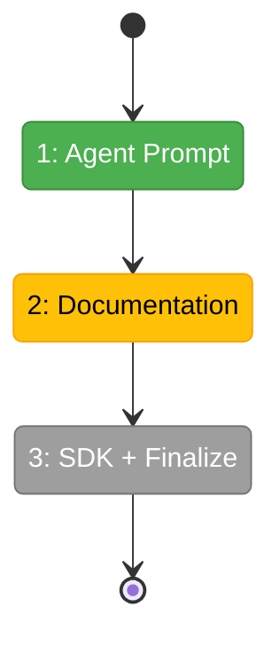

# Flight Plan: Phase 7 — Agent Integration + Domain Documentation

**Plan**: [plan.md](../../plan.md)
**Phase**: Phase 7: Agent Integration + Domain Documentation
**Generated**: 2026-03-08
**Status**: Ready for takeoff

---

## Departure → Destination

**Where we are**: Phases 1-6 complete. The full Event Popper / Question Popper system works end-to-end: CLI agents ask questions, the server stores and broadcasts via SSE, the web UI shows indicators/panels/answer forms/notifications, and conversation chains render as timelines. Domain docs have been maintained incrementally. But there's no CLAUDE.md entry for agents to discover the system, no integration guide for developers, and no keyboard shortcut for the overlay.

**Where we're going**: An AI agent reading CLAUDE.md discovers `cg question` and `cg alert` and knows to run `--help` for details. A developer reading `docs/how/question-popper.md` understands the full system with examples. A user can toggle the overlay with a keyboard shortcut. Domain documentation is finalized and verified consistent.

---

## Domain Context

### Domains We're Changing

| Domain | What Changes | Key Files |
|--------|-------------|-----------|
| `question-popper` | CLAUDE.md prompt, integration guide, SDK shortcut, domain doc finalize | `CLAUDE.md`, `docs/how/question-popper.md`, `sdk-contribution.ts` |
| `_platform/external-events` | Verify domain doc completeness | `docs/domains/_platform/external-events/domain.md` (verify only) |

### Domains We Depend On (no changes)

| Domain | What We Consume | Contract |
|--------|----------------|----------|
| `_platform/sdk` | Command + keybinding registration | `ICommandRegistry` |

---

## Flight Status

**Legend**: grey = pending | yellow = active | red = blocked/needs input | green = done

---

## Stages

- [x] **Stage 1: Agent Prompt** — CLAUDE.md minimal prompt fragment (AC-33)
- [~] **Stage 2: Documentation** — Integration guide (`docs/how/question-popper.md`)
- [ ] **Stage 3: SDK + Finalize** — Keyboard shortcut, domain doc verification, Phase 7 history entries

---

## Acceptance Criteria

- [ ] AC-33: CLAUDE.md tells agents about `cg question` and `cg alert`, directs to `--help`

## Goals & Non-Goals

**Goals**:
- Agents discover the system via CLAUDE.md
- Developers have an integration guide
- Keyboard shortcut toggles overlay
- Domain docs finalized

**Non-Goals**:
- Changing CLI help text (Phase 4)
- New features
- Refactoring

---

## Checklist

- [x] T001: CLAUDE.md prompt fragment (AC-33)
- [~] T002: Integration guide (docs/how/question-popper.md)
- [ ] T003: Finalize domain docs (verify + history entries)
- [ ] T004: SDK keyboard shortcut (question-popper.toggleOverlay)
