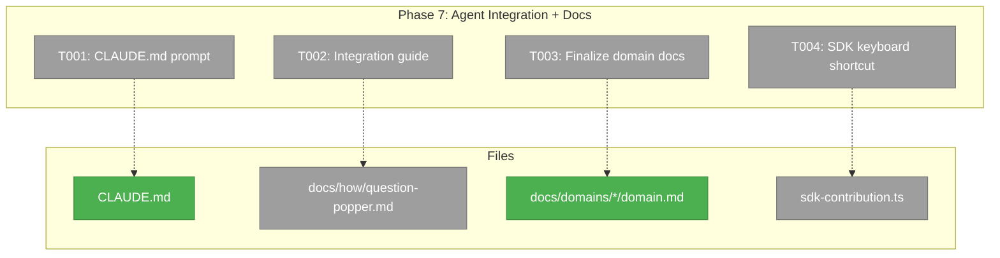

# Phase 7: Agent Integration + Domain Documentation

## Executive Briefing

- **Purpose**: Make the Event Popper / Question Popper system discoverable by AI agents and human developers. Add a minimal CLAUDE.md prompt fragment, write an integration guide, register a keyboard shortcut, and finalize domain documentation.
- **What We're Building**: CLAUDE.md prompt directing agents to `cg question --help`, a `docs/how/question-popper.md` integration guide, SDK keyboard shortcut for overlay toggle, and final domain doc polish.
- **Goals**: ✅ Agents discover the system via CLAUDE.md (AC-33) ✅ Developers have a how-to guide ✅ Keyboard shortcut to toggle overlay ✅ Domain docs finalized and consistent
- **Non-Goals**: ❌ Changing CLI help text (AC-34/35 done in Phase 4) ❌ New features ❌ Refactoring

---

## Prior Phase Context

### Phases 1-6 Summary

All prior phases complete and reviewed. Key deliverables available:
- **Phase 1**: Infrastructure — schemas, GUID, port discovery, localhost guard, SSE channel
- **Phase 2**: Service — `IQuestionPopperService`, schemas, types, contract tests, DI registration
- **Phase 3**: API — 7 endpoints under `/api/event-popper/*`, route-helpers
- **Phase 4**: CLI — `cg question ask|get|answer|list`, `cg alert send`, comprehensive `--help` (AC-34, AC-35)
- **Phase 5**: UI — Indicator, overlay panel, answer form, toast/desktop notifications
- **Phase 6**: Chaining — Chain resolver, chain view, history list, tabbed panel

**Domain docs current state**: `registry.md` and `domain-map.md` already have both domains. `external-events/domain.md` is complete. `question-popper/domain.md` updated through Phase 6.

---

## Pre-Implementation Check

| File | Exists? | Domain Check | Notes |
|------|---------|-------------|-------|
| `CLAUDE.md` | ✅ Yes | — | Modify — add prompt fragment to "Critical Patterns" |
| `docs/how/question-popper.md` | ❌ No | `question-popper` ✅ | New file |
| `docs/domains/_platform/external-events/domain.md` | ✅ Yes | ✅ Complete | Verify only — no changes expected |
| `docs/domains/question-popper/domain.md` | ✅ Yes | ✅ Current | Add Phase 7 history entry |
| `docs/domains/registry.md` | ✅ Yes | ✅ Has both | Verify only |
| `docs/domains/domain-map.md` | ✅ Yes | ✅ Has both | Verify only |
| `apps/web/src/features/067-question-popper/sdk-contribution.ts` | ❌ No | `question-popper` ✅ | New file — SDK keybinding |

---

## Architecture Map



---

## Tasks

| Status | ID | Task | Domain | Path(s) | Done When | Notes |
|--------|-----|------|--------|---------|-----------|-------|
| [ ] | T001 | Add minimal CLAUDE.md prompt fragment: tells agents `cg question` and `cg alert` exist, directs to `--help` for full usage. Place in "Critical Patterns" section after existing entries. | `question-popper` | `CLAUDE.md` (modify) | AC-33 satisfied. Agents reading CLAUDE.md discover question-popper. | Minimal — the CLI `--help` carries the heavy docs (AC-34/35 done in Phase 4). |
| [ ] | T002 | Create `docs/how/question-popper.md` integration guide: overview of Event Popper system, how to ask questions from CLI/scripts, how to send alerts, API endpoint reference, answer format per question type, chaining via `--previous`, UI overview. | `question-popper` | `docs/how/question-popper.md` | Guide exists with CLI examples, API reference, and UI description. | Follow `docs/how/` pattern. For developers, not agents. |
| [ ] | T003 | Finalize domain documentation: verify `external-events/domain.md` is complete, add Phase 7 history entry to `question-popper/domain.md`, verify `registry.md` and `domain-map.md` have both domains with current contracts. | both | `docs/domains/question-popper/domain.md` (modify), verify others | Domain docs reflect full implementation across all 7 phases. | Registry + domain-map already have entries — verify only. |
| [ ] | T004 | SDK keyboard shortcut: create `sdk-contribution.ts` with `question-popper.toggleOverlay` keybinding, register in SDK domain registrations. | `question-popper` | `apps/web/src/features/067-question-popper/sdk-contribution.ts` (new), `apps/web/src/lib/sdk/sdk-domain-registrations.ts` (modify) | Keyboard shortcut toggles overlay. Registered in SDK. | Follow `docs/how/sdk/publishing-to-sdk.md` pattern: contribution + register. |

---

## Context Brief

### Key Findings

- **AC-33 is minimal by design**: "tells agents that `cg question` and `cg alert` exist, and directs them to run `cg question --help`". No detailed usage in CLAUDE.md.
- **AC-34/35 already satisfied**: Phase 4 created comprehensive `--help` text for both commands.
- **Domain docs already current**: Registry and domain-map maintained through Phases 1-6. This phase is verification + final polish.

### Domain Dependencies

- `question-popper`: All prior phases — this phase documents what's built
- `_platform/sdk`: `ICommandRegistry` for keyboard shortcut registration

### SDK Registration Pattern

```typescript
// sdk-contribution.ts
export const questionPopperContribution = {
  commands: [
    { id: 'question-popper.toggleOverlay', title: 'Toggle Question Popper' },
  ],
  keybindings: [
    { key: '$mod+Shift+KeyQ', command: 'question-popper.toggleOverlay' },
  ],
};

// In register function:
sdk.commands.register(cmd.id, () => toggleOverlay());
sdk.keybindings.register(binding);
```

### Reusable from Prior Phases

- CLI help text (Phase 4) — reference in CLAUDE.md prompt and integration guide
- All component/hook exports — reference in integration guide
- Domain docs maintained through each phase — minimal updates needed

---

## Discoveries & Learnings

_Populated during implementation by plan-6._

| Date | Task | Type | Discovery | Resolution | References |
|------|------|------|-----------|------------|------------|

---

## Directory Layout

```
docs/plans/067-question-popper/
  ├── plan.md
  ├── question-popper-spec.md
  └── tasks/phase-7-agent-integration-docs/
      ├── tasks.md          ← this file
      ├── tasks.fltplan.md  ← generated next
      └── execution.log.md  ← created by plan-6
```
