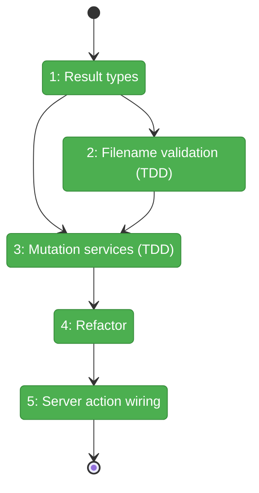
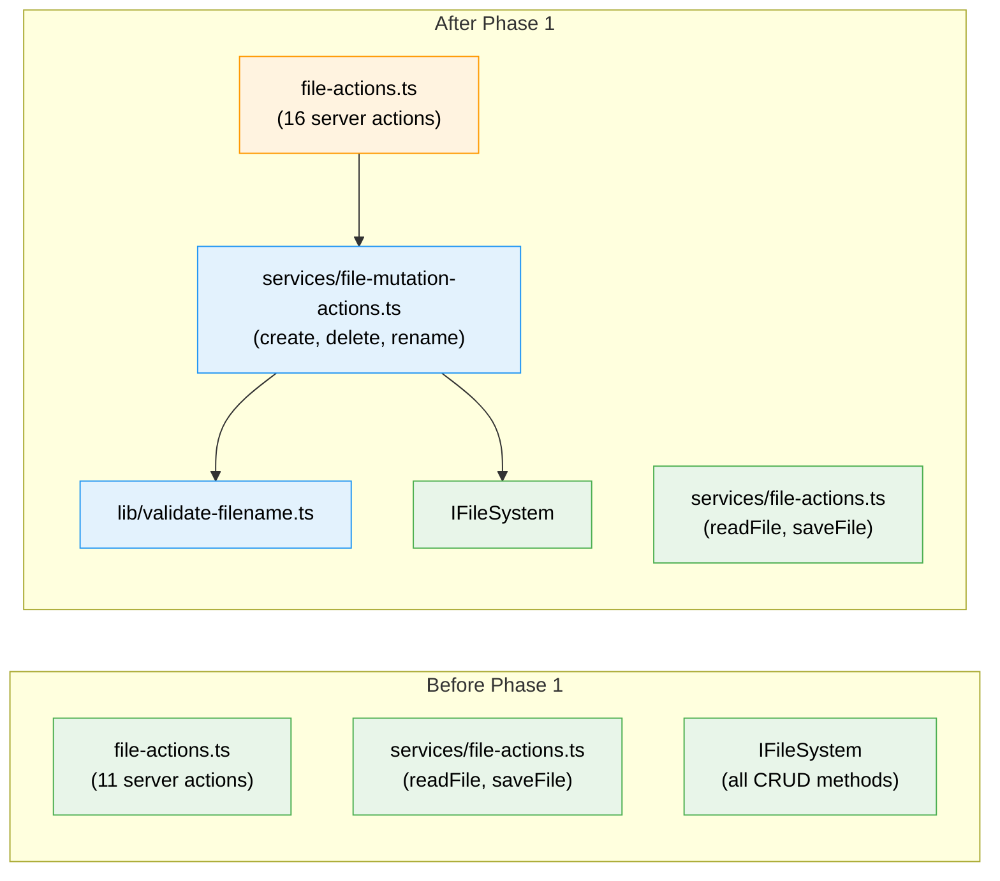

# Flight Plan: Phase 1 — Service Layer & Server Actions

**Plan**: [add-files-plan.md](../../add-files-plan.md)
**Phase**: Phase 1: Service Layer & Server Actions
**Generated**: 2026-03-07
**Status**: Landed

---

## Departure → Destination

**Where we are**: The file browser can read, edit, save, and upload files — but cannot create new files/folders, rename anything, or delete anything. IFileSystem already has all the CRUD methods (`mkdir`, `unlink`, `rmdir`, `rename`, `writeFile`) — they're just not wired to any server actions or services. No filename validation utility exists.

**Where we're going**: A developer implementing Phase 2 UI can call `createFile(slug, worktreePath, dir, name)`, `deleteItem(slug, worktreePath, path)`, `renameItem(slug, worktreePath, oldPath, newName)` server actions that validate names (git-portable), enforce path security, and return typed result objects. All backed by 15-20 unit tests using FakeFileSystem.

---

## Domain Context

### Domains We're Changing

| Domain | What Changes | Key Files |
|--------|-------------|-----------|
| file-browser | New service functions (create, delete, rename) + filename validator + 5 server actions + result types | `services/file-mutation-actions.ts`, `lib/validate-filename.ts`, `app/actions/file-actions.ts` |

### Domains We Depend On (no changes)

| Domain | What We Consume | Contract |
|--------|----------------|----------|
| _platform/file-ops | Filesystem CRUD + path security | IFileSystem (mkdir, unlink, rmdir, rename, writeFile, exists, stat, realpath), IPathResolver (resolvePath) |
| _platform/file-ops | Test doubles | FakeFileSystem, FakePathResolver |
| _platform/auth | Server action authentication | requireAuth() |

---

## Flight Status

<!-- Updated by /plan-6-v2: pending → active → done. Use blocked for problems/input needed. -->

**Legend**: grey = pending | yellow = active | red = blocked/needs input | green = done

---

## Stages

<!-- Updated by /plan-6-v2 during implementation: [ ] → [~] → [x] -->

- [x] **Stage 1: Define result types** — CreateResult, DeleteResult, RenameResult, ItemCountResult discriminated unions + options interfaces (`file-mutation-actions.ts` — new file)
- [x] **Stage 2: Filename validation TDD** — RED tests then GREEN implementation for git-portable name checking (`validate-filename.test.ts` — new file, `validate-filename.ts` — new file)
- [x] **Stage 3: Mutation services TDD** — RED tests (15-20 cases) then GREEN implementations for createFile, createFolder, deleteItem, renameItem (`file-mutation-actions.test.ts` — new file, `file-mutation-actions.ts`)
- [x] **Stage 4: Refactor** — Extract shared path-validation helper, clean error mapping (`file-mutation-actions.ts`)
- [x] **Stage 5: Wire server actions** — 4 new exports in existing file-actions.ts with requireAuth + DI (`file-actions.ts` — modify)

---

## Architecture: Before & After

**Legend**: existing (green, unchanged) | changed (orange, modified) | new (blue, created)

---

## Acceptance Criteria

- [x] AC-08: Path traversal and symlink escape rejected with security error
- [x] AC-09: Duplicate name shows "already exists" error without overwriting
- [x] AC-13: Invalid names (git-portable chars) rejected
- [x] All 15-20 unit tests pass with `just test`
- [x] `just fft` passes (lint, format, typecheck, test)
- [x] No changes to existing readFile/saveFile behavior (regression-free)

## Goals & Non-Goals

**Goals**:
- ✅ TDD service layer for all CRUD operations
- ✅ Git-portable filename validation (shared client + server)
- ✅ Path security on all operations
- ✅ 5 authenticated server actions
- ✅ Full test coverage with fakes

**Non-Goals**:
- ❌ No UI changes
- ❌ No context menu work
- ❌ No BrowserClient wiring
- ❌ No API route changes

---

## Checklist

- [x] T001: Define CRUD result types and options interfaces
- [x] T002: Write validate-filename tests (RED)
- [x] T003: Implement validate-filename (GREEN)
- [x] T004: Write mutation service tests (RED)
- [x] T005: Implement createFileService + createFolderService (GREEN)
- [x] T006: Implement deleteItemService (GREEN)
- [x] T007: Implement renameItemService (GREEN)
- [x] T008: Refactor service layer (REFACTOR)
- [x] T009: Add 4 server actions to file-actions.ts
