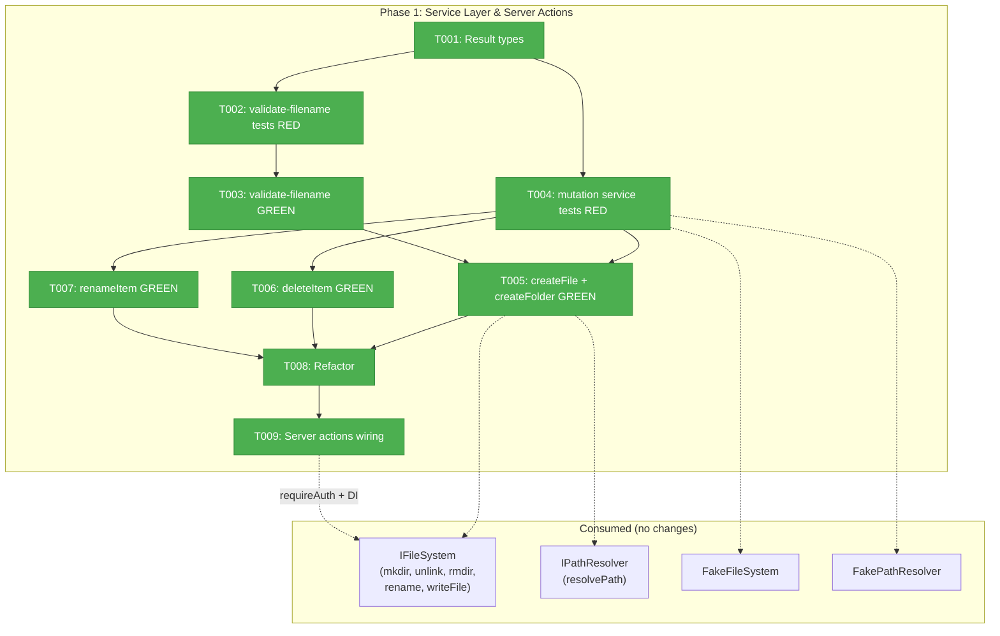
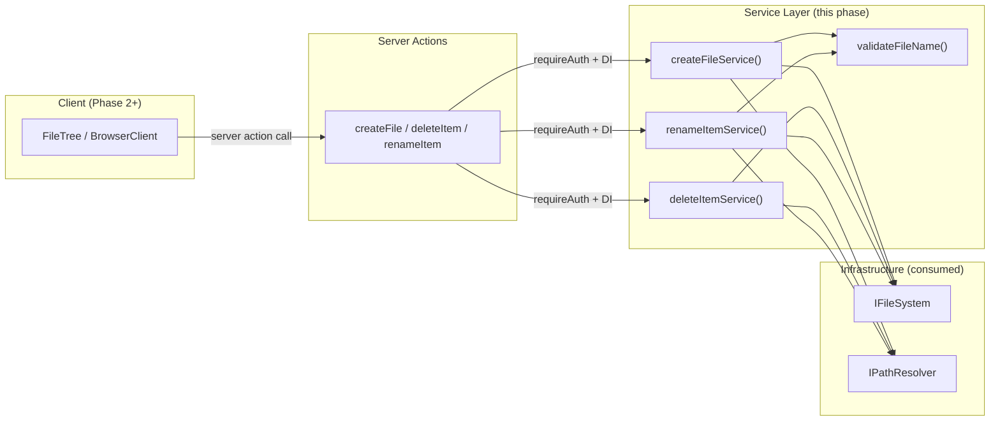
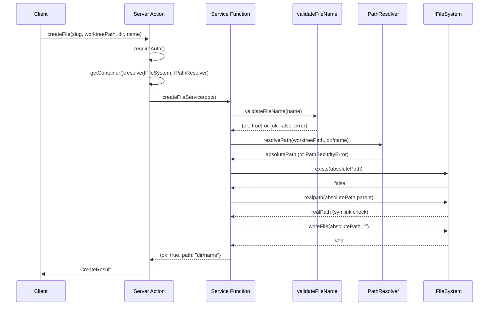

# Phase 1: Service Layer & Server Actions — Tasks

## Executive Briefing

**Purpose**: Build the backend file mutation operations (create, rename, delete) with full TDD coverage and path security. This phase delivers the trusted server-side foundation that Phase 2 (UI) and Phase 3 (wiring) will consume.

**What We're Building**: 4 service functions (`createFileService`, `createFolderService`, `deleteItemService`, `renameItemService`) with git-portable filename validation, path traversal prevention, symlink escape detection, and discriminated union result types. Plus 5 server actions wiring them to the DI container with authentication.

**Goals**:
- ✅ TDD service layer for all 4 CRUD operations (RED → GREEN → REFACTOR)
- ✅ Git-portable filename validation utility (reusable client + server)
- ✅ Path security on all operations (PathResolver + realpath)
- ✅ 5 authenticated server actions (createFile, createFolder, deleteItem, renameItem, getDirectoryItemCount)
- ✅ Full unit test coverage with FakeFileSystem + FakePathResolver

**Non-Goals**:
- ❌ No UI changes in this phase
- ❌ No context menu or inline edit work
- ❌ No BrowserClient wiring
- ❌ No new API routes (server actions only)

## Prior Phase Context

_Phase 1 — no prior phases to review._

## Pre-Implementation Check

| File | Exists? | Domain Check | Notes |
|------|---------|-------------|-------|
| `apps/web/src/features/041-file-browser/services/file-mutation-actions.ts` | ❌ NEW | ✅ Correct (services/) | Services dir has 11 existing files |
| `apps/web/src/features/041-file-browser/lib/validate-filename.ts` | ❌ NEW | ⚠️ `lib/` dir missing | Create `lib/` directory first |
| `test/unit/web/features/041-file-browser/file-mutation-actions.test.ts` | ❌ NEW | ✅ Correct (test dir exists) | Test dir has 29 existing test files |
| `test/unit/web/features/041-file-browser/validate-filename.test.ts` | ❌ NEW | ✅ Correct | |
| `apps/web/app/actions/file-actions.ts` | ✅ EXISTS | ✅ Server actions file | 223 lines, 11 existing exports — will add 5 more |

**Concept search**: No duplication found for validateFileName, createFile, deleteItem, or renameItem in the codebase.

**Harness**: No agent harness configured. Implementation will use standard testing only (`just fft`).

## Architecture Map



## Tasks

| Status | ID | Task | Domain | Path(s) | Done When | Notes |
|--------|-----|------|--------|---------|-----------|-------|
| [x] | T001 | Define CRUD result types and options interfaces | file-browser | `apps/web/src/features/041-file-browser/services/file-mutation-actions.ts` | `CreateResult`, `DeleteResult`, `RenameResult` types exported. Each is a discriminated union (`{ok: true, ...} \| {ok: false, error: '...'}`) with typed error codes. `DeleteResult` includes `'too-large'` error variant with `itemCount` field for server-side safety rejection. `CreateFileOptions`, `CreateFolderOptions`, `DeleteItemOptions`, `RenameItemOptions` interfaces exported. | Plan task 1.1. Types first — tests depend on these. Follow `ReadFileResult`/`SaveFileResult` pattern from `file-actions.ts`. DYK-02: dropped ItemCountResult — VS Code-style confirmation, count only on server rejection. |
| [x] | T002 | Write validate-filename tests (RED) | file-browser | `test/unit/web/features/041-file-browser/validate-filename.test.ts` | Tests exist for: each invalid char (`/ \ \0 : * ? " < > \|`), empty string, `.`, `..`, trailing spaces, leading dots (valid), normal names (valid). All tests FAIL (RED). All include Test Doc format. | Plan task 1.2. Create `lib/` directory first. |
| [x] | T003 | Implement validate-filename (GREEN) | file-browser | `apps/web/src/features/041-file-browser/lib/validate-filename.ts` | `validateFileName(name: string)` returns `{ok: true} \| {ok: false, error: 'empty' \| 'invalid-char' \| 'reserved', char?: string}`. All T002 tests pass (GREEN). | Plan task 1.3. Finding 01. Git-portable chars: `/ \ \0 : * ? " < > \|`. Reserved: `.`, `..`. Allow leading dots (hidden files like `.gitignore`). |
| [x] | T004 | Write mutation service tests (RED) | file-browser | `test/unit/web/features/041-file-browser/file-mutation-actions.test.ts` | 15-20 test cases covering: (a) createFile happy path, (b) createFolder happy path, (c) deleteFile happy path, (d) deleteFolder happy path, (e) renameFile happy path, (f) renameFolder happy path, (g) create rejects duplicate name, (h) rename rejects if destination exists, (i) path traversal rejected for each operation, (j) symlink escape rejected, (k) delete rejects non-existent path, (l) rename rejects non-existent source, (m) deleteFolder stat-check for large dirs, (n) createFile validates filename. All FAIL (RED). All include Test Doc. Uses FakeFileSystem + FakePathResolver. | Plan task 1.4. Target 15-20 cases. Follow `file-actions.test.ts` patterns. |
| [x] | T005 | Implement createFileService + createFolderService (GREEN) | file-browser | `apps/web/src/features/041-file-browser/services/file-mutation-actions.ts` | `createFileService(opts)` creates empty file via `writeFile`. `createFolderService(opts)` creates dir via `mkdir`. Both: validate name via `validateFileName`, resolve path via `pathResolver.resolvePath`, check `exists` before write (reject duplicates), symlink check via `realpath` on PARENT directory (target doesn't exist yet — DYK-01). Return `CreateResult`. Relevant tests pass (GREEN). | Plan task 1.5. DYK-01: realpath on parent dir, not target file. Pattern: resolvePath → exists check → realpath(dirname) check → writeFile/mkdir → return `{ok, path}`. |
| [x] | T006 | Implement deleteItemService (GREEN) | file-browser | `apps/web/src/features/041-file-browser/services/file-mutation-actions.ts` | `deleteItemService(opts)` deletes file (`unlink`) or folder (`rmdir({recursive: true})`). Resolves path, checks exists + type via `stat`, symlink check. For folders: server-side safety — quick `readDir` count, reject with `{ok: false, error: 'too-large', itemCount}` if direct children exceed 5000 (configurable). Returns `DeleteResult`. Relevant tests pass (GREEN). | Plan task 1.6. DYK-02: VS Code-style — no pre-flight count action. Count only surfaces in error response when folder is too large. |
| [x] | T007 | Implement renameItemService (GREEN) | file-browser | `apps/web/src/features/041-file-browser/services/file-mutation-actions.ts` | `renameItemService(opts)` renames file or folder. Validates new name via `validateFileName`. Resolves BOTH old and new paths. Checks source exists, destination does NOT exist. Symlink check on source. Calls `fileSystem.rename(oldAbsPath, newAbsPath)`. Returns `RenameResult` with `{ok: true, oldPath, newPath}`. Relevant tests pass (GREEN). | Plan task 1.7. Security: validate both source and destination paths. DYK-04: return both oldPath and newPath — result should be self-contained so consumers can detect if renamed file was active selection without external context. |
| [x] | T008 | Refactor service layer (REFACTOR) | file-browser | `apps/web/src/features/041-file-browser/services/file-mutation-actions.ts` | All 15-20 tests green after refactor. Extract shared `resolveAndValidatePath(worktreePath, filePath, fileSystem, pathResolver)` helper if path-validation is duplicated across services. Clean error mapping. No new test failures. | Plan task 1.8. TDD refactor step. |
| [x] | T009 | Add 4 server actions to file-actions.ts | file-browser | `apps/web/app/actions/file-actions.ts` | 4 new `'use server'` exports: `createFile(slug, worktreePath, dirPath, fileName)`, `createFolder(slug, worktreePath, dirPath, folderName)`, `deleteItem(slug, worktreePath, itemPath)`, `renameItem(slug, worktreePath, oldPath, newName)`. Each: `requireAuth()` → `getContainer()` → resolve IFileSystem + IPathResolver → call service → return result. | Plan task 1.9. DYK-02: dropped getDirectoryItemCount — VS Code-style dialog with server-side safety limit. |

## Context Brief

### Key findings from plan

- **Finding 01** (Critical): No filename validation utility exists. T002/T003 build it from scratch with git-portable rules.
- **Finding 06** (High): `rmdir({recursive: true})` has no file count limit — could silently delete 10k+ files. T006 adds stat-based pre-check.

### Domain dependencies (concepts and contracts this phase consumes)

- `_platform/file-ops`: **IFileSystem** (`packages/shared/src/interfaces/filesystem.interface.ts`) — `mkdir`, `writeFile`, `unlink`, `rmdir`, `rename`, `exists`, `stat`, `realpath`, `readDir`. All methods throw `FileSystemError` with code/path.
- `_platform/file-ops`: **IPathResolver** (`packages/shared/src/interfaces/path-resolver.interface.ts`) — `resolvePath(base, relative)` validates path containment. Throws `PathSecurityError{base, requested}`.
- `_platform/file-ops`: **FakeFileSystem** (`packages/shared/src/fakes/fake-filesystem.ts`) — In-memory test double with `setFile()`, `simulateError()`. Contract-tested parity with NodeFileSystemAdapter.
- `_platform/file-ops`: **FakePathResolver** (`packages/shared/src/fakes/fake-path-resolver.ts`) — Configurable test double with call tracking.
- `_platform/auth`: **requireAuth** (`apps/web/src/features/063-login/lib/require-auth.ts`) — Blocks unauthenticated server action calls.
- `_platform/file-ops`: **DI tokens** — `SHARED_DI_TOKENS.FILESYSTEM`, `SHARED_DI_TOKENS.PATH_RESOLVER`, resolved via `getContainer()`.

### Domain constraints

- All new service code lives in `apps/web/src/features/041-file-browser/` (file-browser domain boundary).
- Services import only from interfaces (`@chainglass/shared`), never from adapters directly.
- Server actions live in `apps/web/app/actions/file-actions.ts` — this is the one file outside the feature folder (Next.js convention).
- No mocking libraries — FakeFileSystem + FakePathResolver only (P4: Fakes Over Mocks).
- All tests include 5-field Test Doc (Why/Contract/Usage Notes/Quality Contribution/Worked Example).

### Harness context

No agent harness configured. Agent will use standard testing approach from plan (`just fft`).

### Reusable from prior phases

_Phase 1 — nothing from prior phases. But these existing patterns are reusable:_
- `readFileAction` / `saveFileAction` in `services/file-actions.ts` — path security pattern (resolvePath → realpath → containment check)
- `uploadFileService` in `services/upload-file.ts` — create pattern (mkdir recursive → atomic write → result)
- `ReadFileResult` / `SaveFileResult` — discriminated union result type pattern
- `ReadFileOptions` / `SaveFileOptions` — options interface pattern (dependencies injected as fields)

### Key signatures to consume

```typescript
// IFileSystem methods
mkdir(path: string, options?: { recursive?: boolean }): Promise<void>;
writeFile(path: string, content: string | Buffer): Promise<void>;
unlink(path: string): Promise<void>;
rmdir(path: string, options?: { recursive?: boolean }): Promise<void>;
rename(oldPath: string, newPath: string): Promise<void>;
exists(path: string): Promise<boolean>;
stat(path: string): Promise<FileStat>;  // {isFile, isDirectory, size, mtime}
realpath(path: string): Promise<string>;

// IPathResolver
resolvePath(base: string, relative: string): string;  // throws PathSecurityError
```

```typescript
// Path security pattern (from existing saveFileAction)
let absolutePath: string;
try {
  absolutePath = pathResolver.resolvePath(worktreePath, filePath);
} catch (e) {
  if (e instanceof PathSecurityError) {
    return { ok: false, error: 'security' };
  }
  throw e;
}
// Symlink check
const realPath = await fileSystem.realpath(absolutePath);
const normalizedRoot = worktreePath.endsWith('/') ? worktreePath : `${worktreePath}/`;
if (realPath !== worktreePath && !realPath.startsWith(normalizedRoot)) {
  return { ok: false, error: 'security' };
}
```

```typescript
// Server action pattern (from existing readFile)
export async function readFile(slug: string, worktreePath: string, filePath: string) {
  'use server';
  await requireAuth();
  const container = getContainer();
  const fileSystem = container.resolve<IFileSystem>(SHARED_DI_TOKENS.FILESYSTEM);
  const pathResolver = container.resolve<IPathResolver>(SHARED_DI_TOKENS.PATH_RESOLVER);
  return readFileAction({ worktreePath, filePath, fileSystem, pathResolver });
}
```

### System flow diagram



### Service interaction sequence



## Discoveries & Learnings

_Populated during implementation by plan-6._

| Date | Task | Type | Discovery | Resolution | References |
|------|------|------|-----------|------------|------------|

---

```
docs/plans/068-add-files/
  ├── add-files-spec.md
  ├── add-files-plan.md
  ├── exploration.md
  └── tasks/phase-1-service-layer-server-actions/
      ├── tasks.md
      ├── tasks.fltplan.md        # flight plan (below)
      └── execution.log.md        # created by plan-6
```
