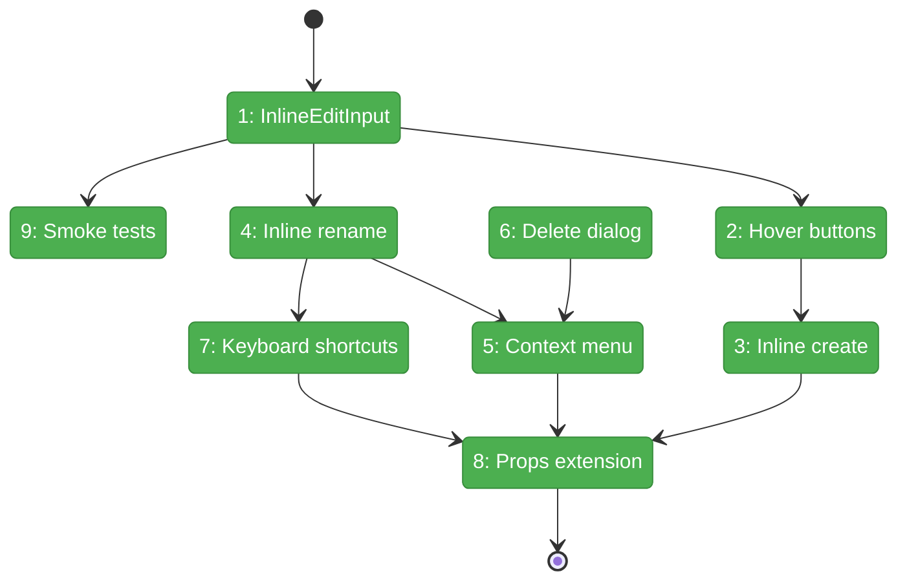
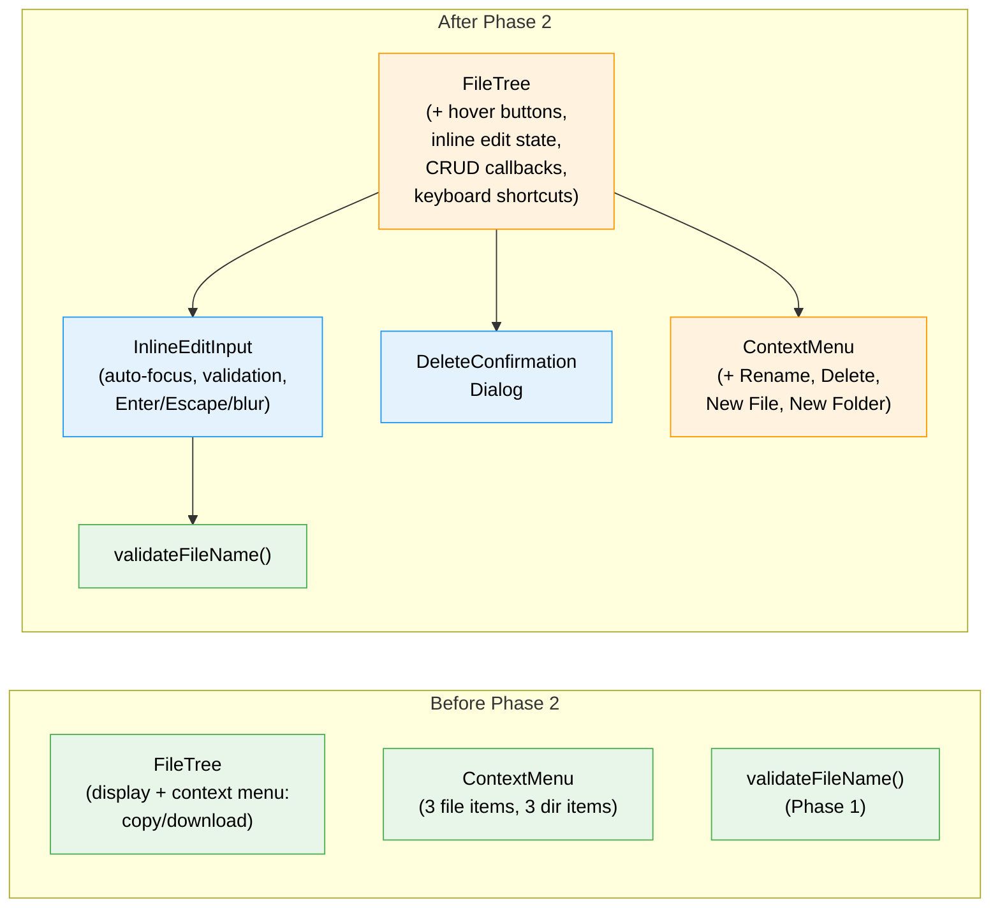

# Flight Plan: Phase 2 — FileTree UI Extensions

**Plan**: [add-files-plan.md](../../add-files-plan.md)
**Phase**: Phase 2: FileTree UI Extensions
**Generated**: 2026-03-07
**Status**: Landed

---

## Departure → Destination

**Where we are**: Phase 1 delivered 4 service functions, filename validation, and 4 server actions — all TDD-tested with 43 unit tests. The FileTree can display files/folders, expand/collapse directories, show a context menu for copy/download operations, and has a hover refresh button. But users cannot create, rename, or delete anything from the tree.

**Where we're going**: A user can hover over any folder to see New File / New Folder buttons, click to get an inline text input, type a name with live validation, and press Enter to trigger creation. They can press F2 or right-click → Rename to edit any item's name inline. They can right-click → Delete to get a VS Code-style confirmation dialog. All mutation UI is callback-driven — Phase 3 wires the actual server actions.

---

## Domain Context

### Domains We're Changing

| Domain | What Changes | Key Files |
|--------|-------------|-----------|
| file-browser | New InlineEditInput component, DeleteConfirmationDialog, FileTree extended with hover buttons, inline edit state, context menu items, keyboard shortcuts | `components/inline-edit-input.tsx` (new), `components/delete-confirmation-dialog.tsx` (new), `components/file-tree.tsx` (modify), `test/.../inline-edit-input.test.ts` (new) |

### Domains We Depend On (no changes)

| Domain | What We Consume | Contract |
|--------|----------------|----------|
| file-browser (Phase 1) | Client-side filename validation | `validateFileName()` from `lib/validate-filename.ts` |
| _platform/viewer | Context menu with destructive variant | `ContextMenu*` from `@/components/ui/context-menu` |
| _platform/viewer | Dialog for delete confirmation | `Dialog*` from `@/components/ui/dialog` |
| _platform/viewer | Button with destructive variant | `Button` from `@/components/ui/button` |

---

## Flight Status

<!-- Updated by /plan-6-v2: pending → active → done. Use blocked for problems/input needed. -->

**Legend**: grey = pending | yellow = active | red = blocked/needs input | green = done

---

## Stages

<!-- Updated by /plan-6-v2 during implementation: [ ] → [~] → [x] -->

- [x] **Stage 1: InlineEditInput component** — Reusable inline text input with auto-focus, validation, Enter/Escape, blur commit (`inline-edit-input.tsx` — new file)
- [x] **Stage 2: Hover buttons** — FilePlus + FolderPlus buttons on folder hover next to RefreshCw (`file-tree.tsx`)
- [x] **Stage 3: Inline create mode** — Edit state machine for create-file/create-folder, renders InlineEditInput at top of folder children (`file-tree.tsx`)
- [x] **Stage 4: Inline rename mode** — Edit state for rename, replaces item name with pre-filled InlineEditInput (`file-tree.tsx`)
- [x] **Stage 5: Context menu items** — Rename + Delete on files/folders, New File + New Folder on folders, destructive variant (`file-tree.tsx`)
- [x] **Stage 6: Delete dialog** — VS Code-style confirmation with file/folder messaging (`delete-confirmation-dialog.tsx` — new file)
- [x] **Stage 7: Keyboard shortcuts** — F2 and Enter trigger rename mode when tree has focus (`file-tree.tsx`)
- [x] **Stage 8: Props extension** — Optional CRUD callback props on FileTreeProps, gate mutation UI behind prop existence (`file-tree.tsx`)
- [x] **Stage 9: Smoke tests** — 3-5 tests for InlineEditInput: mount/focus, Enter, Escape, validation, blur (`inline-edit-input.test.ts` — new file)

---

## Architecture: Before & After

**Legend**: existing (green, unchanged) | changed (orange, modified) | new (blue, created)

---

## Acceptance Criteria

- [x] AC-01: Hover over folder → "New File" button visible → click → inline input appears at top of folder children
- [x] AC-02: Hover over folder → "New Folder" button visible → click → inline input appears
- [x] AC-03: Escape during inline create → input removed, nothing created
- [x] AC-04: Enter or F2 on selected file → inline rename input (pre-filled, text selected)
- [x] AC-05: Right-click → Rename → inline rename mode activates
- [x] AC-06: Right-click → Delete → confirmation dialog appears
- [x] AC-07: Delete dialog for folder says "and all its contents"
- [x] AC-13: Invalid names (git-portable chars) show inline error in real-time
- [x] InlineEditInput smoke tests pass (3-5 cases)
- [x] `just fft` passes (lint, format, typecheck, test)
- [x] No changes to existing read/save/copy/download behavior (regression-free)

## Goals & Non-Goals

**Goals**:
- ✅ InlineEditInput with focus lifecycle and inline validation
- ✅ Hover buttons (New File, New Folder) on folder rows
- ✅ Inline create and rename modes with state management
- ✅ Extended context menus with Rename + Delete
- ✅ DeleteConfirmationDialog
- ✅ F2 and Enter keyboard shortcuts
- ✅ CRUD callback props on FileTree
- ✅ Lightweight smoke tests

**Non-Goals**:
- ❌ No server action calls (Phase 3)
- ❌ No toast notifications (Phase 3)
- ❌ No URL/editor sync on rename/delete (Phase 3)
- ❌ No auto-refresh after mutations (Phase 3)
- ❌ No BrowserClient changes (Phase 3)

---

## Checklist

- [x] T001: Create InlineEditInput component
- [x] T002: Add hover buttons to folder rows in FileTree
- [x] T003: Add inline create mode to FileTree
- [x] T004: Add inline rename mode to FileTree
- [x] T005: Add Rename and Delete to context menus
- [x] T006: Create DeleteConfirmationDialog component
- [x] T007: Add F2 and Enter keyboard shortcuts to FileTree
- [x] T008: Extend FileTree props for CRUD callbacks
- [x] T009: Lightweight smoke tests for InlineEditInput
