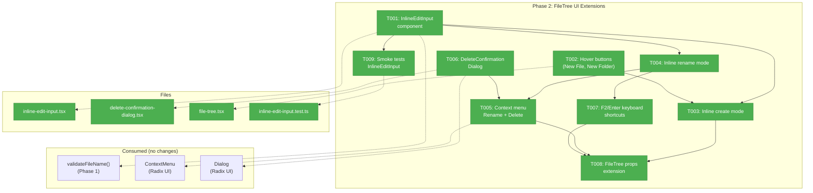
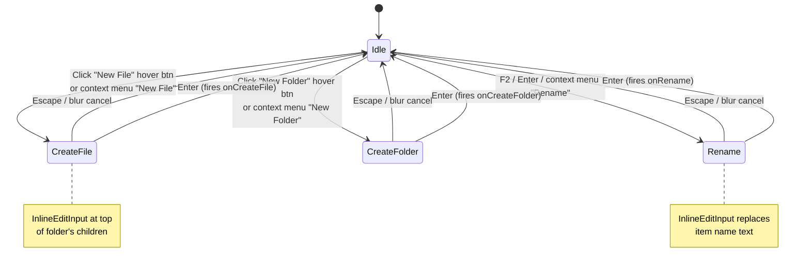
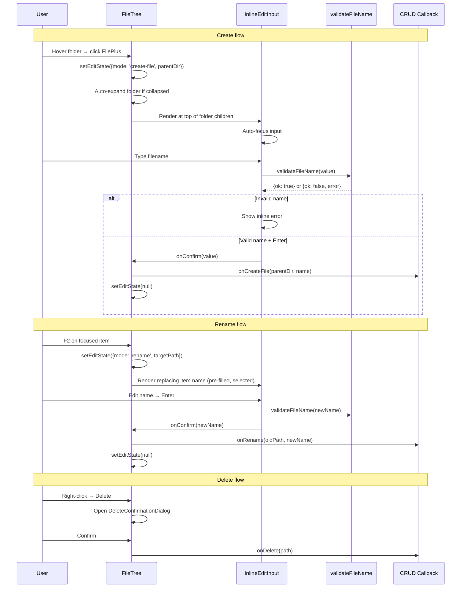

# Phase 2: FileTree UI Extensions — Tasks

## Executive Briefing

**Purpose**: Add inline file/folder creation, rename, and delete capabilities directly in the FileTree sidebar. This phase delivers all the UI components and interaction patterns that make the Phase 1 service layer visible to users — hover buttons for create, inline text input for naming, context menu for rename/delete, and a delete confirmation dialog.

**What We're Building**: An InlineEditInput component with auto-focus and validation, hover action buttons (New File, New Folder) on folder rows, inline create/rename modes with state management, extended context menus with Rename and Delete items, a DeleteConfirmationDialog, and F2/Enter keyboard shortcuts for rename. All callbacks are optional props — Phase 3 wires the actual server actions.

**Goals**:
- ✅ InlineEditInput component with auto-focus, Enter/Escape, blur commit, inline validation
- ✅ Hover buttons (New File, New Folder) on folder rows including root
- ✅ Inline create mode: insert input at top of folder children, Enter creates, Escape cancels
- ✅ Inline rename mode: replace item text with pre-filled input, Enter confirms, Escape restores
- ✅ Context menu: Rename + Delete on files/folders, New File + New Folder on folders
- ✅ DeleteConfirmationDialog with VS Code-style messaging
- ✅ F2 and Enter keyboard shortcuts for rename
- ✅ FileTree extended with optional CRUD callback props
- ✅ Lightweight smoke tests for InlineEditInput

**Non-Goals**:
- ❌ No server action calls (Phase 3 wires those via useFileMutations)
- ❌ No toast feedback (Phase 3 adds toasts in the hook)
- ❌ No URL sync or editor state handling (Phase 3)
- ❌ No auto-refresh after mutations (Phase 3)
- ❌ No BrowserClient changes

## Prior Phase Context

### Phase 1: Service Layer & Server Actions

**A. Deliverables**:
- `apps/web/src/features/041-file-browser/services/file-mutation-actions.ts` — 4 service functions (`createFileService`, `createFolderService`, `deleteItemService`, `renameItemService`) + shared `resolveAndValidatePath` helper + result types + options interfaces
- `apps/web/src/features/041-file-browser/lib/validate-filename.ts` — `validateFileName()` returning discriminated union `{ok: true} | {ok: false, error, char?}`
- `apps/web/app/actions/file-actions.ts` — 4 new server actions (`createFile`, `createFolder`, `deleteItem`, `renameItem`)
- `test/unit/web/features/041-file-browser/file-mutation-actions.test.ts` — 23 tests
- `test/unit/web/features/041-file-browser/validate-filename.test.ts` — 20 tests

**B. Dependencies Exported** (available for Phase 2+):
```typescript
// Server actions (app/actions/file-actions.ts)
export async function createFile(slug: string, dirPath: string, fileName: string): Promise<CreateResult>
export async function createFolder(slug: string, dirPath: string, folderName: string): Promise<CreateResult>
export async function deleteItem(slug: string, itemPath: string): Promise<DeleteResult>
export async function renameItem(slug: string, oldPath: string, newName: string): Promise<RenameResult>

// Client-importable validation (lib/validate-filename.ts)
export function validateFileName(name: string): ValidationResult
// ValidationResult = {ok: true} | {ok: false, error: 'empty' | 'invalid-char' | 'reserved', char?: string}

// Result types (services/file-mutation-actions.ts)
export type CreateResult = {ok: true, path: string} | {ok: false, error: 'exists' | 'invalid-name' | 'security' | 'unknown', message: string}
export type DeleteResult = {ok: true} | {ok: false, error: 'not-found' | 'security' | 'too-large' | 'unknown', message: string, itemCount?: number}
export type RenameResult = {ok: true, oldPath: string, newPath: string} | {ok: false, error: 'exists' | 'not-found' | 'invalid-name' | 'security' | 'unknown', message: string}
```

**C. Gotchas & Debt**:
- `realpath()` throws ENOENT on non-existent files — create operations realpath the PARENT directory (DYK-01)
- FakePathResolver enforces security by default — `../../` naturally throws PathSecurityError, no `setThrowOnResolve` needed
- FakeFileSystem `mkdir` needs parent directory to exist (realistic behavior)
- `MAX_DELETE_CHILDREN = 5000` — configurable in service, not a constant shared to client

**D. Incomplete Items**: None — all 9 tasks complete, code review fixes applied (FT-001 through FT-004).

**E. Patterns to Follow**:
- Discriminated union result types (`{ok: true, ...} | {ok: false, error: '...', message: string}`)
- Options interfaces with DI dependencies as fields
- `validateFileName()` returns structured errors — Phase 2 InlineEditInput should use this for inline validation
- Server actions accept `slug` (not raw `worktreePath`) for trusted root resolution

## Pre-Implementation Check

| File | Exists? | Domain Check | Notes |
|------|---------|-------------|-------|
| `apps/web/src/features/041-file-browser/components/inline-edit-input.tsx` | ❌ NEW | ✅ Correct (components/) | New standalone component |
| `apps/web/src/features/041-file-browser/components/delete-confirmation-dialog.tsx` | ❌ NEW | ✅ Correct (components/) | New dialog component |
| `apps/web/src/features/041-file-browser/components/file-tree.tsx` | ✅ EXISTS (~341 lines) | ✅ Correct | Heavy modification — hover buttons, inline edit state, context menu items, keyboard handlers |
| `test/unit/web/features/041-file-browser/inline-edit-input.test.ts` | ❌ NEW | ✅ Correct (test dir) | Lightweight smoke tests |

**Concept search**: No existing inline edit or inline rename patterns found in the codebase (confirmed by exploration Finding 03). DeleteConfirmationDialog follows established `WorkspaceRemoveButton` / `SampleDeleteButton` dialog patterns.

**Harness**: No agent harness configured. Implementation will use standard testing (`just fft`).

## Architecture Map



## Tasks

| Status | ID | Task | Domain | Path(s) | Done When | Notes |
|--------|-----|------|--------|---------|-----------|-------|
| [x] | T001 | Create InlineEditInput component | file-browser | `apps/web/src/features/041-file-browser/components/inline-edit-input.tsx` | Auto-focuses on mount. Enter confirms value. Escape cancels. Blur commits (configurable via `commitOnBlur` prop, default `false`). Validates name via `validateFileName()` on every keystroke. Shows inline error text for invalid names. Calls `onConfirm(value)` or `onCancel()`. Accepts optional `initialValue` for rename pre-fill. Restores focus to previous element on unmount. Matches tree item height/indent. | Findings 02, 03, 07. Reused by create (T003) and rename (T004). Import `validateFileName` from Phase 1. DYK-P2-01: Use `requestAnimationFrame(() => inputRef.current?.focus())` for auto-focus to avoid Radix ContextMenu focus restore race. DYK-P2-03: default `commitOnBlur={false}` (safe — cancels on blur). Inline error shown below input in `text-destructive text-xs`. |
| [x] | T002 | Add hover buttons to folder rows in FileTree | file-browser | `apps/web/src/features/041-file-browser/components/file-tree.tsx` | "New File" (FilePlus icon) and "New Folder" (FolderPlus icon) buttons appear on folder hover next to existing RefreshCw button. Buttons use existing `hidden group-hover:block` pattern. `e.stopPropagation()` prevents folder toggle. Root directory entries also get buttons. Each button calls the appropriate CRUD callback prop. DYK-P2-02: Add a thin root row at top of tree with New File + New Folder hover buttons for root-level creation (no folder row exists for the root directory itself). | Plan 2.2. Follow existing RefreshCw hover button at line 251-261. Add FilePlus + FolderPlus from lucide-react. Same `shrink-0 rounded p-0.5 text-muted-foreground hover:text-foreground` styling. Root row renders when CRUD callbacks are provided, shows folder icon + workspace root name or "." with same hover button pattern. |
| [x] | T003 | Add inline create mode to FileTree | file-browser | `apps/web/src/features/041-file-browser/components/file-tree.tsx` | Clicking "New File" or "New Folder" hover button inserts InlineEditInput at top of folder's children list. Enter creates item via `onCreateFile(parentDir, name)` or `onCreateFolder(parentDir, name)` callback. Escape removes input. Only one edit input active at a time (setting new edit state cancels existing). Folder auto-expands if collapsed when create is triggered. DYK-P2-03: Pass `commitOnBlur={false}` — blur cancels create (no half-typed filenames). | Plan 2.3. State: `editState: {mode: 'create-file' \| 'create-folder', parentDir: string} \| null`. Render InlineEditInput before children when editState.parentDir matches current dir. Root row create uses parentDir="" or ".". |
| [x] | T004 | Add inline rename mode to FileTree | file-browser | `apps/web/src/features/041-file-browser/components/file-tree.tsx` | Entering rename mode replaces item's name text with InlineEditInput pre-filled with current name (text selected via `input.select()`). Enter confirms rename via `onRename(oldPath, newName)` callback. Escape cancels and restores original text. Works for both files and folders. DYK-P2-03: Pass `commitOnBlur={true}` — blur commits rename (preserves user's edit). DYK-P2-04: Keep file/folder icon visible — replace only the `<span>` name text with InlineEditInput styled `flex-1 min-w-0`, not the entire button. | Plan 2.4. Finding 02: unmount the button element, render only icon + InlineEditInput in edit mode. State: `editState: {mode: 'rename', targetPath: string}`. When `editState.targetPath === entry.path`, render icon + InlineEditInput instead of full button. |
| [x] | T005 | Add Rename and Delete to context menus | file-browser | `apps/web/src/features/041-file-browser/components/file-tree.tsx` | **File context menu** gains: ContextMenuSeparator, "Rename" item (Pencil icon), "Delete" item (Trash2 icon, `variant="destructive"`). **Folder context menu** gains: "New File" item (FilePlus), "New Folder" item (FolderPlus), ContextMenuSeparator, "Rename" item (Pencil), "Delete" item (Trash2, `variant="destructive"`). "Rename" sets editState to rename mode. "Delete" sets deleteTarget state (DYK-P2-05: separate from editState). | Plan 2.5. Uses existing ContextMenuItem with `variant="destructive"` (confirmed available at line 115 of context-menu.tsx). DYK-P2-05: Delete sets `deleteTarget` state, not `editState` — these are orthogonal. Clear `editState` when opening delete for cleanliness. |
| [x] | T006 | Create DeleteConfirmationDialog component | file-browser | `apps/web/src/features/041-file-browser/components/delete-confirmation-dialog.tsx` | VS Code-style dialog: "Delete '{name}'?" for files, "Delete '{name}' and all its contents?" for folders. Confirm button uses `variant="destructive"` (red). Cancel closes dialog. Props: `open`, `onOpenChange`, `itemName`, `itemType: 'file' \| 'directory'`, `onConfirm`. If parent passes `tooLargeCount`, shows "Folder has too many items (N) to delete from the browser." instead. | Plan 2.6. Follow WorkspaceRemoveButton/SampleDeleteButton pattern: Dialog + DialogContent + DialogHeader + DialogFooter. No server action call — just fires `onConfirm()` callback. |
| [x] | T007 | Add F2 and Enter keyboard shortcuts to FileTree | file-browser | `apps/web/src/features/041-file-browser/components/file-tree.tsx` | F2 on focused tree item enters rename mode for that item. Enter on focused tree item enters rename mode (when NOT already in edit mode — if in edit mode, Enter is handled by InlineEditInput). Both only fire when FileTree has focus (not CodeMirror or search). Requires `tabIndex={0}` and `onKeyDown` handler on tree container or individual items. | Plan 2.7. Gate: check `document.activeElement` is within the tree, not editor/search. Finding 02: Enter key conflict — only trigger rename when no edit input is active. Use `data-tree-path` attribute to identify which item has focus. |
| [x] | T008 | Extend FileTree props for CRUD callbacks | file-browser | `apps/web/src/features/041-file-browser/components/file-tree.tsx` | New optional props on FileTreeProps: `onCreateFile?: (parentDir: string, name: string) => void`, `onCreateFolder?: (parentDir: string, name: string) => void`, `onRename?: (oldPath: string, newName: string) => void`, `onDelete?: (path: string) => void`. Inline edit state managed internally. When callback is undefined, corresponding UI triggers are hidden (hover buttons, context menu items, keyboard shortcuts). | Plan 2.8. Follows existing callback pattern (onSelect, onExpand, onCopyFullPath). Integration task — verify all T002-T007 features wire through these props correctly. Guard all mutation UI behind `if (onCreateFile)` etc. |
| [x] | T009 | Lightweight smoke tests for InlineEditInput | file-browser | `test/unit/web/features/041-file-browser/inline-edit-input.test.ts` | 3-5 test cases: (a) renders and auto-focuses on mount, (b) Enter calls onConfirm with input value, (c) Escape calls onCancel, (d) invalid name shows error message, (e) blur behavior (commits or cancels based on prop). Uses @testing-library/react + vitest. | Plan 2.9. Lightweight per constitution deviation (P3). Import pattern: `import { render, screen, fireEvent } from '@testing-library/react'`. Follow `file-viewer.test.tsx` patterns. |

## Context Brief

### Key findings from plan

- **Finding 02** (Critical): Enter key on tree item buttons fires onClick (select), conflicting with rename mode. **Action**: T004 unmounts the button element and renders only InlineEditInput when in edit mode — clean state swap, no key conflict.
- **Finding 03** (Critical): No inline edit pattern exists in codebase. **Action**: T001 builds InlineEditInput from scratch with full focus lifecycle management.
- **Finding 07** (High): Focus management for inline input needs explicit handling. **Action**: T001 uses `useRef` + `useEffect` for auto-focus on mount. On unmount (Escape/Enter/blur), restores focus to the tree item that triggered edit mode via saved ref.

### Domain dependencies (concepts and contracts this phase consumes)

- `file-browser` (Phase 1): **validateFileName** (`lib/validate-filename.ts`) — client-side name validation for InlineEditInput inline errors
- `_platform/viewer`: **ContextMenu** (`@/components/ui/context-menu`) — Radix ContextMenu with `variant="destructive"` support on ContextMenuItem
- `_platform/viewer`: **Dialog** (`@/components/ui/dialog`) — Radix Dialog for DeleteConfirmationDialog (Dialog, DialogContent, DialogHeader, DialogTitle, DialogDescription, DialogFooter, DialogClose)
- `_platform/viewer`: **Button** (`@/components/ui/button`) — variant="destructive" for delete confirm button
- `lucide-react`: **Icons** — FilePlus, FolderPlus, Pencil, Trash2 (all confirmed available in lucide-react ^0.562.0)

### Domain constraints

- All new components live in `apps/web/src/features/041-file-browser/components/` (file-browser domain boundary)
- InlineEditInput is a client component (`'use client'`) — needs useState, useRef, useEffect
- FileTree is already a client component (uses useState, useCallback, useEffect)
- DeleteConfirmationDialog is a client component (needs Dialog state)
- No server action calls in this phase — callbacks receive path-based arguments, Phase 3 wires them
- Mutation UI (hover buttons, context menu items, keyboard shortcuts) must be gated behind callback prop existence — if `onCreateFile` is undefined, don't show New File button

### Harness context

No agent harness configured. Agent will use standard testing approach from plan (`just fft`).

### Reusable from Phase 1

- `validateFileName(name)` — import directly for client-side validation in InlineEditInput
- Discriminated union result type pattern — Phase 2 doesn't return results but callbacks will receive them in Phase 3
- Test patterns from `validate-filename.test.ts` and `file-mutation-actions.test.ts` — describe/it/expect structure

### Reusable from existing codebase

- **RefreshCw hover button** (file-tree.tsx:251-261) — exact pattern to replicate for FilePlus/FolderPlus
- **group-hover CSS** — `hidden group-hover:block shrink-0 rounded p-0.5 text-muted-foreground hover:text-foreground`
- **ContextMenuItem destructive variant** — `variant="destructive"` on ContextMenuItem (context-menu.tsx:115)
- **Dialog pattern** — SampleDeleteButton (112 lines), WorkspaceRemoveButton (102 lines) — Dialog + open state + confirm/cancel
- **stopPropagation** — `onClick={(e) => { e.stopPropagation(); ... }}` on hover buttons
- **newlyAddedPaths animation** — `tree-entry-new` CSS class for green fade-in (reused in Phase 3)
- **Testing Library** — `@testing-library/react` ^16.3.2 + `@testing-library/user-event` ^14.6.1 + vitest
- **Toast** — `sonner` `toast.success/error/loading` (Phase 3 will use, not Phase 2)

### Key signatures to consume

```typescript
// FileTree current props (file-tree.tsx)
export interface FileTreeProps {
  entries: FileEntry[];
  selectedFile?: string;
  changedFiles?: string[];
  newlyAddedPaths?: Set<string>;
  onSelect: (filePath: string) => void;
  onExpand: (dirPath: string) => void;
  childEntries?: Record<string, FileEntry[]>;
  expandPaths?: string[];
  onExpandedDirsChange?: (dirs: string[]) => void;
  onCopyFullPath?: (path: string) => void;
  onCopyRelativePath?: (path: string) => void;
  onCopyContent?: (filePath: string) => void;
  onCopyTree?: (dirPath: string) => void;
  onDownload?: (filePath: string) => void;
}

// validateFileName (Phase 1 - client importable)
export function validateFileName(name: string):
  | { ok: true }
  | { ok: false; error: 'empty' | 'invalid-char' | 'reserved'; char?: string };

// Radix ContextMenu
import { ContextMenu, ContextMenuTrigger, ContextMenuContent,
  ContextMenuItem, ContextMenuSeparator } from '@/components/ui/context-menu';
// ContextMenuItem supports variant="destructive"

// Radix Dialog
import { Dialog, DialogContent, DialogHeader, DialogTitle,
  DialogDescription, DialogFooter, DialogClose } from '@/components/ui/dialog';

// Icons (lucide-react)
import { FilePlus, FolderPlus, Pencil, Trash2 } from 'lucide-react';
```

### Inline edit state machine



### UI interaction sequence



## Discoveries & Learnings

_Populated during implementation by plan-6._

| Date | Task | Type | Discovery | Resolution | References |
|------|------|------|-----------|------------|------------|
| 2026-03-07 | T001 | gotcha | DYK-P2-01: Radix ContextMenu restores focus to trigger after menu close, racing with InlineEditInput auto-focus | Use `requestAnimationFrame(() => inputRef.current?.focus())` instead of synchronous focus in useEffect | Radix ContextMenu focus behavior |
| 2026-03-07 | T002 | gap | DYK-P2-02: Root-level create has no folder row — FileTree renders entries directly with no root row | Add thin root row at top of tree with New File + New Folder hover buttons | Clarification Q7 confirmed root-level creation |
| 2026-03-07 | T003/T004 | decision | DYK-P2-03: Blur behavior should differ — create cancels (no half-typed files), rename commits (preserves edit) | Create: `commitOnBlur={false}`, Rename: `commitOnBlur={true}`, default `false` | VS Code behavior |
| 2026-03-07 | T004 | decision | DYK-P2-04: Rename must keep file/folder icon visible — replace only the name `<span>`, not entire button | Render icon + InlineEditInput in same flex row, input gets `flex-1 min-w-0` | VS Code rename visual |
| 2026-03-07 | T005/T006 | decision | DYK-P2-05: Delete dialog state must be independent of inline edit state — they're orthogonal interactions | Separate `editState` (create/rename) and `deleteTarget` (dialog) state variables | State machine design |

---

```
docs/plans/068-add-files/
  ├── add-files-spec.md
  ├── add-files-plan.md
  ├── exploration.md
  └── tasks/
      ├── phase-1-service-layer-server-actions/
      │   ├── tasks.md
      │   ├── tasks.fltplan.md
      │   └── execution.log.md
      └── phase-2-filetree-ui-extensions/
          ├── tasks.md              ← this file
          ├── tasks.fltplan.md      ← flight plan (below)
          └── execution.log.md      ← created by plan-6
```
