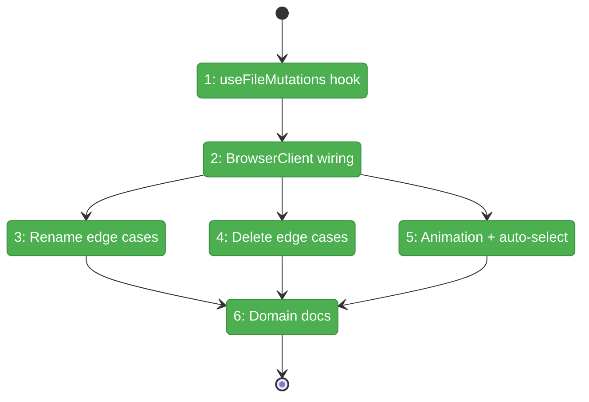
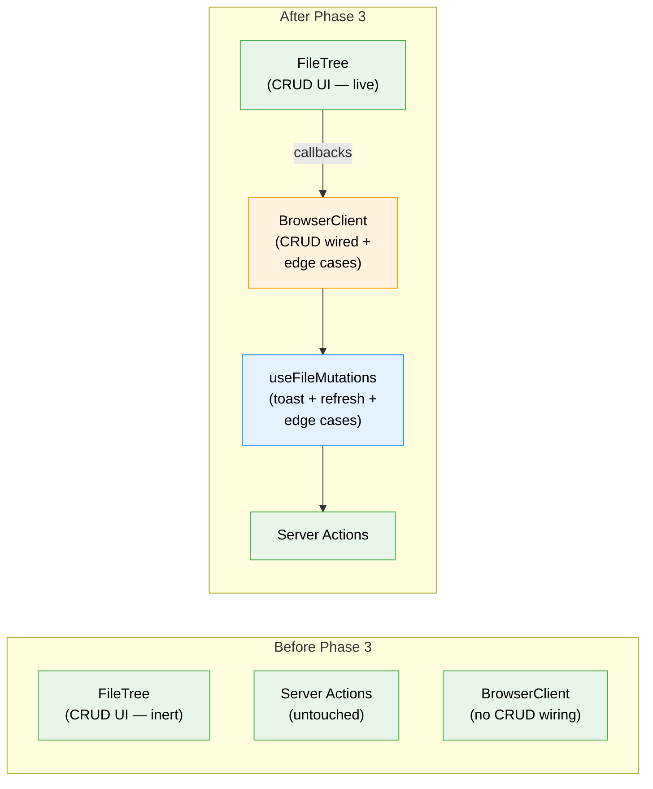

# Flight Plan: Phase 3 — BrowserClient Wiring & Integration

**Plan**: [add-files-plan.md](../../add-files-plan.md)
**Phase**: Phase 3: BrowserClient Wiring & Integration
**Generated**: 2026-03-07
**Status**: Landed

---

## Departure → Destination

**Where we are**: Phase 1 delivered 4 server actions for file CRUD with full TDD coverage and path security. Phase 2 delivered all the UI — InlineEditInput, hover buttons, context menus, keyboard shortcuts, and DeleteConfirmationDialog in the FileTree. But clicking "New File" and typing a name does nothing — the callbacks are unconnected. The CRUD UI is visible but inert.

**Where we're going**: A user hovers a folder → clicks New File → types `notes.md` → presses Enter → the file is created on disk, a success toast appears, the tree refreshes with a green fade-in animation, and the new file auto-opens in the viewer. Rename updates the URL and viewer. Delete clears the selection if the viewed file was removed. All operations give instant toast feedback.

---

## Domain Context

### Domains We're Changing

| Domain | What Changes | Key Files |
|--------|-------------|-----------|
| file-browser | New useFileMutations hook, BrowserClient wired with CRUD callbacks + edge case handling | `hooks/use-file-mutations.ts` (new), `browser-client.tsx` (modify), `domain.md` (modify) |

### Domains We Depend On (no changes)

| Domain | What We Consume | Contract |
|--------|----------------|----------|
| file-browser (Phase 1) | Server actions for CRUD | `createFile`, `createFolder`, `deleteItem`, `renameItem` |
| file-browser (Phase 2) | FileTree CRUD callback props | `onCreateFile`, `onCreateFolder`, `onRename`, `onDelete` |
| file-browser | Tree refresh + file selection | `handleRefreshDir`, `handleSelect` from useFileNavigation |
| file-browser | SSE-driven new paths | `newPaths` from useTreeDirectoryChanges |
| _platform/workspace-url | URL state | `fileBrowserParams`, `setParams` |

---

## Flight Status

<!-- Updated by /plan-6-v2: pending → active → done. Use blocked for problems/input needed. -->

**Legend**: grey = pending | yellow = active | red = blocked/needs input | green = done

---

## Stages

<!-- Updated by /plan-6-v2 during implementation: [ ] → [~] → [x] -->

- [x] **Stage 1: useFileMutations hook** — Server action calls with toast feedback, refreshDir on success (`use-file-mutations.ts` — new file)
- [x] **Stage 2: BrowserClient wiring** — Pass CRUD callbacks from hook to FileTree, immediate refresh (`browser-client.tsx`)
- [x] **Stage 3: Rename edge cases** — Detect renamed open file, sync URL/viewer (`use-file-mutations.ts`, `browser-client.tsx`)
- [x] **Stage 4: Delete edge cases** — Clear selection on delete of open file/folder, clean expanded state (`browser-client.tsx`)
- [x] **Stage 5: Animation + auto-select** — Local newlyAddedPaths with 1.5s timeout, auto-select/expand after create/rename (`browser-client.tsx`)
- [x] **Stage 6: Domain docs** — Update domain.md composition, history, source location (`domain.md`)

---

## Architecture: Before & After

**Legend**: existing (green, unchanged) | changed (orange, modified) | new (blue, created)

---

## Acceptance Criteria

- [x] AC-01: Hover New File → type name → Enter → file created + toast + green animation + auto-opens in viewer
- [x] AC-02: Hover New Folder → type name → Enter → folder created + toast + auto-expands
- [x] AC-06: Right-click Delete → confirm → item deleted + toast
- [x] AC-10: Rename currently-viewed file → URL updates, viewer shows new file
- [x] AC-11: Delete currently-viewed file → viewer clears to empty state
- [x] AC-12: Toast feedback on all operations (create/rename/delete, success/error)
- [x] `just fft` passes (lint, format, typecheck, test)
- [x] No changes to existing read/save/copy behavior (regression-free)

## Goals & Non-Goals

**Goals**:
- ✅ useFileMutations hook with toast feedback
- ✅ End-to-end CRUD wiring through BrowserClient
- ✅ Edge case handling (rename open file, delete open file/folder)
- ✅ Green fade-in animation for new items
- ✅ Auto-select/expand after create and rename
- ✅ Domain documentation updated

**Non-Goals**:
- ❌ No new UI components
- ❌ No service layer changes
- ❌ No FileTree modifications
- ❌ No new server actions

---

## Checklist

- [x] T001: Create useFileMutations hook
- [x] T002: Wire useFileMutations into BrowserClient
- [x] T003: Handle rename of currently-viewed file
- [x] T004: Handle delete of currently-viewed file
- [x] T005: Handle delete of expanded folder
- [x] T006: Add locally-created items to newlyAddedPaths
- [x] T007: Auto-select and auto-expand after create/rename
- [x] T008: Update file-browser domain.md
