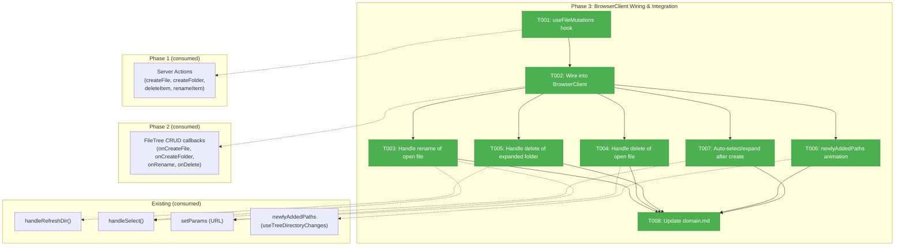
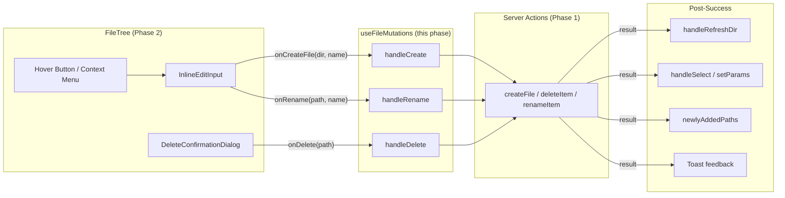
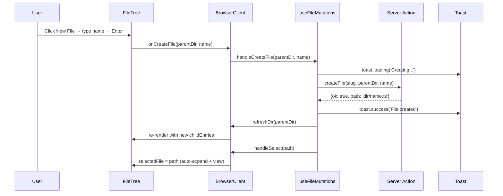

# Phase 3: BrowserClient Wiring & Integration — Tasks

## Executive Briefing

**Purpose**: Wire the Phase 1 server actions and Phase 2 FileTree CRUD UI end-to-end through a `useFileMutations` hook in BrowserClient. This phase makes the mutation UI functional — hover buttons create files, rename commits persist, delete confirmations actually remove items — with toast feedback, immediate tree refresh, and edge case handling for rename/delete of the currently-viewed file.

**What We're Building**: A `useFileMutations` hook that calls server actions with toast feedback (loading→success/error), wired into BrowserClient's FileTree via the 4 CRUD callback props from Phase 2. Plus edge case handling: renaming the open file syncs URL/viewer, deleting the open file clears selection, deleting expanded folders cleans up state, and newly created items get green fade-in animation with auto-select.

**Goals**:
- ✅ useFileMutations hook with server action calls + toast feedback
- ✅ BrowserClient passes CRUD callbacks to FileTree
- ✅ Immediate tree refresh after each mutation (handleRefreshDir)
- ✅ Rename of open file syncs URL params + re-fetches content
- ✅ Delete of open file/folder clears selection + shows empty state
- ✅ Delete of expanded folder cleans expandedDirs + childEntries cache
- ✅ Newly created items get green fade-in animation (newlyAddedPaths)
- ✅ Auto-select new files, auto-expand new folders, auto-select renamed items
- ✅ Updated file-browser domain.md

**Non-Goals**:
- ❌ No new UI components (Phase 2 delivered all UI)
- ❌ No service layer changes (Phase 1 is final)
- ❌ No FileTree component changes (callbacks are already wired)
- ❌ No new server actions

## Prior Phase Context

### Phase 1: Service Layer & Server Actions

**A. Deliverables**:
- `apps/web/src/features/041-file-browser/services/file-mutation-actions.ts` — 4 service functions + types
- `apps/web/src/features/041-file-browser/lib/validate-filename.ts` — `validateFileName()`
- `apps/web/app/actions/file-actions.ts` — 4 server actions (createFile, createFolder, deleteItem, renameItem)
- 23 service tests + 20 validation tests

**B. Dependencies Exported**:
```typescript
// Server actions (app/actions/file-actions.ts) — Phase 3 calls these
export async function createFile(slug: string, dirPath: string, fileName: string): Promise<CreateResult>
export async function createFolder(slug: string, dirPath: string, folderName: string): Promise<CreateResult>
export async function deleteItem(slug: string, itemPath: string): Promise<DeleteResult>
export async function renameItem(slug: string, oldPath: string, newName: string): Promise<RenameResult>

// Result types
type CreateResult = {ok: true, path: string} | {ok: false, error: 'exists' | 'invalid-name' | 'security' | 'unknown', message: string}
type DeleteResult = {ok: true} | {ok: false, error: 'not-found' | 'security' | 'too-large' | 'unknown', message: string, itemCount?: number}
type RenameResult = {ok: true, oldPath: string, newPath: string} | {ok: false, error: 'exists' | 'not-found' | 'invalid-name' | 'security' | 'unknown', message: string}
```

**C. Gotchas**: Server actions accept `slug` (not `worktreePath`) — trusted root resolved server-side. `deleteItem` returns `'too-large'` with `itemCount` for folders exceeding 5000 children.

**D. Incomplete Items**: None.

**E. Patterns**: Discriminated union results; dynamic import service functions in server actions.

### Phase 2: FileTree UI Extensions

**A. Deliverables**:
- `apps/web/src/features/041-file-browser/components/inline-edit-input.tsx` — InlineEditInput component
- `apps/web/src/features/041-file-browser/components/delete-confirmation-dialog.tsx` — DeleteConfirmationDialog
- `apps/web/src/features/041-file-browser/components/file-tree.tsx` — Extended with CRUD UI
- 10 smoke tests

**B. Dependencies Exported** (Phase 3 wires these):
```typescript
// FileTree CRUD callback props — Phase 3 passes these from useFileMutations
onCreateFile?: (parentDir: string, name: string) => void;
onCreateFolder?: (parentDir: string, name: string) => void;
onRename?: (oldPath: string, newName: string) => void;
onDelete?: (path: string) => void;
```

**C. Gotchas**: Per-callback gating — each UI affordance only shows when its specific callback exists. EditState/deleteTarget are separate state machines (DYK-P2-05). CommitOnBlur differs: false for create, true for rename (DYK-P2-03).

**D. Incomplete Items**: None — all 9 tasks + 7 review fixes complete.

**E. Patterns**: TreeMutationHandlers bundle; `data-tree-action` attribute on hover buttons; `requestAnimationFrame` for focus after Radix menu close.

## Pre-Implementation Check

| File | Exists? | Domain Check | Notes |
|------|---------|-------------|-------|
| `apps/web/src/features/041-file-browser/hooks/use-file-mutations.ts` | ❌ NEW | ✅ Correct (hooks/) | New hook alongside use-clipboard.ts |
| `apps/web/app/(dashboard)/workspaces/[slug]/browser/browser-client.tsx` | ✅ EXISTS (~581 lines) | ✅ Correct | Wire useFileMutations, pass callbacks to FileTree |
| `docs/domains/file-browser/domain.md` | ✅ EXISTS | ✅ Correct | Update history, composition |

**Concept search**: `useClipboard` is the closest existing pattern — same shape (hook returning handlers that call server actions + show toasts). No duplication concern for `useFileMutations`.

**Harness**: No agent harness configured. Implementation will use standard testing (`just fft`).

## Architecture Map



## Tasks

| Status | ID | Task | Domain | Path(s) | Done When | Notes |
|--------|-----|------|--------|---------|-----------|-------|
| [x] | T001 | Create `use-file-mutations.ts` hook | file-browser | `apps/web/src/features/041-file-browser/hooks/use-file-mutations.ts` | Returns `handleCreateFile(parentDir, name)`, `handleCreateFolder(parentDir, name)`, `handleRename(oldPath, newName)`, `handleDelete(path)`. Each calls server action, shows toast (loading→success/error), calls `refreshDir` callback on success. Accepts `slug` and `refreshDir` as config. | Plan 3.1. Follow useClipboard toast pattern: `toast.loading()` → `toast.success/error(msg, {id})`. Server actions accept slug only (not worktreePath — FT-001 from Phase 1). DYK-P3-05: await refreshDir before auto-select to avoid tree/viewer desync. |
| [x] | T002 | Wire useFileMutations into BrowserClient | file-browser | `apps/web/app/(dashboard)/workspaces/[slug]/browser/browser-client.tsx` | BrowserClient calls `useFileMutations({ slug, refreshDir: fileNav.handleRefreshDir })`. Passes `mutations.handleCreateFile` etc. to FileTree as `onCreateFile`, `onCreateFolder`, `onRename`, `onDelete` props. Tree refreshes immediately after success via handleRefreshDir. DYK-P3-01: Wrap `initialEntries` in `useState(initialEntries)` and add `handleRefreshRoot` for root-level creates (parentDir=''). | Plan 3.2. Finding 04: immediate refresh — call handleRefreshDir(parentDir) on success, SSE handles external changes as fallback. FileTree already renders CRUD UI when callbacks exist (Phase 2 T008). DYK-P3-01: `initialEntries` is a server prop with no client update mechanism — must promote to state for root refresh. |
| [x] | T003 | Handle rename of currently-viewed file | file-browser | `apps/web/src/features/041-file-browser/hooks/use-file-mutations.ts`, `apps/web/app/(dashboard)/workspaces/[slug]/browser/browser-client.tsx` | If renamed file path matches `selectedFile`: update URL params to new path via `setParams({file: newPath})` WITHOUT re-fetching (preserves unsaved edits). Only use `handleSelect(newPath)` if file was clean. `handleRename` receives `RenameResult.newPath` from server action and detects match. DYK-P3-02: Use `setParams` not `handleSelect` to preserve in-memory editor content through rename. | Plan 3.3. Finding 05. RenameResult returns `{oldPath, newPath}` (DYK-04 from Phase 1). VS Code preserves unsaved edits through rename — we should too. |
| [x] | T004 | Handle delete of currently-viewed file | file-browser | `apps/web/src/features/041-file-browser/hooks/use-file-mutations.ts`, `apps/web/app/(dashboard)/workspaces/[slug]/browser/browser-client.tsx` | If deleted path matches `selectedFile` or is an ancestor of `selectedFile`: clear file URL param via `setParams({file: ''})` → shows "Select a file to view" empty state. DYK-P3-03: Use `selectedFile.startsWith(deletedPath + '/')` for ancestor check (trailing slash prevents false matches like `src` matching `src-utils/`). | Plan 3.4. AC-11. Check both exact match AND prefix match with trailing slash for folder deletion containing the selected file. |
| [x] | T005 | Handle delete of expanded folder | file-browser | `apps/web/app/(dashboard)/workspaces/[slug]/browser/browser-client.tsx` | DYK-P3-04: This is a verification task, not an implementation task. After handleRefreshDir re-fetches the parent, the deleted folder disappears from childEntries naturally. The FileTree internal expanded Set harmlessly retains the stale path (nothing renders). Verify no visual artifacts after deleting an expanded folder. | Plan 3.5. Likely no-op — tree auto-reconciles when parent is re-fetched. Just verify and document. |
| [x] | T006 | Add locally-created items to newlyAddedPaths | file-browser | `apps/web/app/(dashboard)/workspaces/[slug]/browser/browser-client.tsx` | After successful create, add new item's path to a local `Set<string>` state, merge with SSE-driven `treeChanges.newPaths`, pass combined set to FileTree's `newlyAddedPaths`. Clear local paths after 1.5s timeout (matches CSS animation duration). | Plan 3.6. SSE newlyAddedPaths from `useTreeDirectoryChanges` is already wired (line 480). Local state supplements it for immediate feedback before SSE fires. |
| [x] | T007 | Auto-select and auto-expand after create/rename | file-browser | `apps/web/app/(dashboard)/workspaces/[slug]/browser/browser-client.tsx` | After creating a file: call `handleSelect(newPath)` to open it in viewer. After creating a folder: add to `expandPaths` to expand it. After rename: call `handleSelect(newPath)` to select renamed item (or `setParams` if dirty — see T003). DYK-P3-05: Must `await handleRefreshDir(parentDir)` before calling `handleSelect(newPath)` — otherwise tree may not have the entry yet when selection runs. | Plan 3.7. Uses existing `fileNav.handleSelect` and `setExpandPaths`. Build full path from parentDir + name for create. |
| [x] | T008 | Update file-browser domain.md | file-browser | `docs/domains/file-browser/domain.md` | Add useFileMutations to Composition table. Add Phase 3 entry to History. Update Source Location with new hook file. | Plan 3.8. Lightweight doc update. |

## Context Brief

### Key findings from plan

- **Finding 04** (High): File watcher SSE may lag ~200ms behind server action completion. **Action**: T001/T002 call `handleRefreshDir(parentDir)` immediately after successful server action. SSE serves as fallback for external changes.
- **Finding 05** (High): Rename of currently-viewed file must sync URL state, editor content, and mtime. **Action**: T003 detects `selectedFile` match via `RenameResult.newPath`, updates URL params, triggers re-fetch.

### Domain dependencies (concepts and contracts this phase consumes)

- `file-browser` (Phase 1): **Server actions** (`createFile`, `createFolder`, `deleteItem`, `renameItem`) — CRUD operations with trusted root resolution
- `file-browser` (Phase 2): **FileTree CRUD callbacks** (`onCreateFile`, `onCreateFolder`, `onRename`, `onDelete`) — UI triggers that fire on user confirm
- `file-browser`: **useFileNavigation** (`handleRefreshDir`, `handleSelect`, `editContent`, `setEditContent`) — immediate tree refresh and file selection
- `file-browser`: **useTreeDirectoryChanges** (`newPaths`) — SSE-driven newlyAddedPaths for green animation
- `file-browser`: **usePanelState** (`handleRefreshChanges`) — refresh changes panel after mutations
- `_platform/workspace-url`: **fileBrowserParams** (`setParams`) — URL state management for selected file
- `sonner`: **toast** — loading/success/error feedback pattern

### Domain constraints

- New hook lives in `apps/web/src/features/041-file-browser/hooks/` (file-browser domain)
- BrowserClient modifications in `apps/web/app/(dashboard)/workspaces/[slug]/browser/` (Next.js convention)
- Server actions accept `slug` only (not `worktreePath`) — trusted root resolution (FT-001)
- Toast patterns follow useClipboard: `toast.loading()` → replace with `toast.success/error(msg, {id})`
- No mocking — standard testing with `just fft`

### Harness context

No agent harness configured. Agent will use standard testing approach from plan (`just fft`).

### Reusable from prior phases

- **useClipboard** toast pattern — exact model for useFileMutations: call action → show toast → handle result
- **handleRefreshDir** — already wired in useFileNavigation, accepts dirPath, re-fetches from API
- **handleSelect** — already wired in useFileNavigation, updates URL + loads file content
- **setExpandPaths** — BrowserClient state for programmatic tree expansion
- **treeChanges.newPaths** — SSE-driven Set already passed to FileTree as newlyAddedPaths
- **Result types** (CreateResult, DeleteResult, RenameResult) — discriminated unions from Phase 1

### Key signatures to consume

```typescript
// Server actions (Phase 1)
export async function createFile(slug: string, dirPath: string, fileName: string): Promise<CreateResult>
export async function createFolder(slug: string, dirPath: string, folderName: string): Promise<CreateResult>
export async function deleteItem(slug: string, itemPath: string): Promise<DeleteResult>
export async function renameItem(slug: string, oldPath: string, newName: string): Promise<RenameResult>

// FileTree CRUD callbacks (Phase 2)
onCreateFile?: (parentDir: string, name: string) => void;
onCreateFolder?: (parentDir: string, name: string) => void;
onRename?: (oldPath: string, newName: string) => void;
onDelete?: (path: string) => void;

// Existing hooks
fileNav.handleRefreshDir(dirPath: string): Promise<void>  // Re-fetch dir from API
fileNav.handleSelect(filePath: string): Promise<void>     // Select file + load content
setParams({file: string, line: null}, {history: 'push'})  // URL update
setExpandPaths(paths: string[])                           // Programmatic expand

// Toast (sonner)
import { toast } from 'sonner';
const toastId = toast.loading('Creating file...');
toast.success('File created', { id: toastId });
toast.error('Failed to create file', { id: toastId, description: result.message });
```

### System flow diagram



### Mutation lifecycle sequence



## Discoveries & Learnings

_Populated during implementation by plan-6._

| Date | Task | Type | Discovery | Resolution | References |
|------|------|------|-----------|------------|------------|
| 2026-03-07 | T002 | gap | DYK-P3-01: Root-level refresh gap — `handleRefreshDir('')` updates `childEntries` but root entries come from server prop `initialEntries` with no client update mechanism | Wrap `initialEntries` in `useState`, add `handleRefreshRoot` that re-fetches from API for root-level creates | BrowserClient line 97, handleRefreshDir only updates childEntries |
| 2026-03-07 | T003 | decision | DYK-P3-02: Rename of open file with unsaved edits — `handleSelect(newPath)` re-fetches content, discarding unsaved changes | Use `setParams({file: newPath})` to update URL without re-fetch; only `handleSelect` if file is clean. VS Code preserves edits through rename | Finding 05, VS Code behavior |
| 2026-03-07 | T004 | gotcha | DYK-P3-03: Delete ancestor prefix match `startsWith(path)` false-positives — `"src-utils/file.ts".startsWith("src")` is true | Always use trailing slash: `selectedFile.startsWith(deletedPath + '/')` for ancestor checks | String prefix matching |
| 2026-03-07 | T005 | insight | DYK-P3-04: T005 is likely a no-op — handleRefreshDir re-fetches parent, deleted folder disappears from childEntries, stale expanded Set entry is harmless | Verification task only, not implementation. Confirm no visual artifacts | FileTree expanded Set vs childEntries lifecycle |
| 2026-03-07 | T007 | gotcha | DYK-P3-05: handleRefreshDir is async — must await before auto-select, otherwise tree may not have new entry when handleSelect fires | Ensure `await handleRefreshDir(parentDir)` completes before `handleSelect(newPath)` | Async state update ordering |

---

```
docs/plans/068-add-files/
  ├── add-files-spec.md
  ├── add-files-plan.md
  ├── exploration.md
  └── tasks/
      ├── phase-1-service-layer-server-actions/
      │   ├── tasks.md
      │   ├── tasks.fltplan.md
      │   └── execution.log.md
      ├── phase-2-filetree-ui-extensions/
      │   ├── tasks.md
      │   ├── tasks.fltplan.md
      │   └── execution.log.md
      └── phase-3-browserclient-wiring-integration/
          ├── tasks.md              ← this file
          ├── tasks.fltplan.md      ← flight plan (below)
          └── execution.log.md      ← created by plan-6
```
