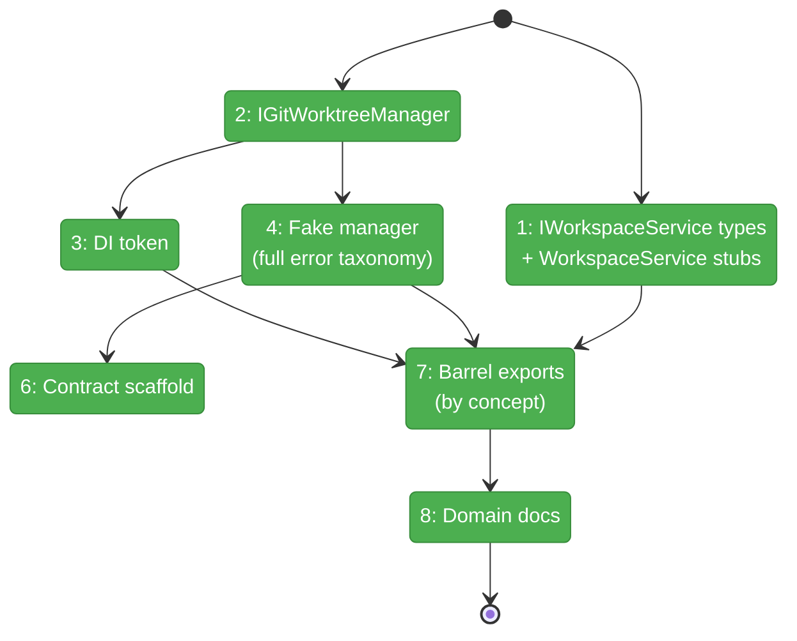
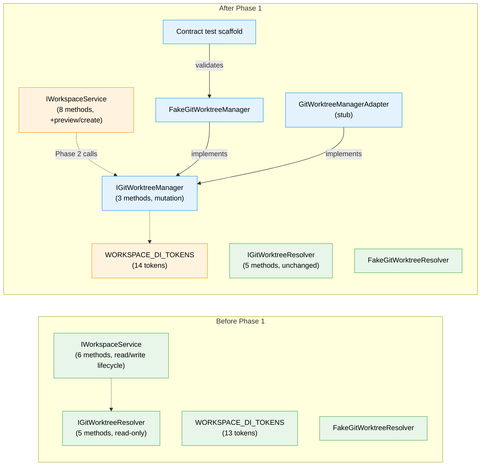

# Flight Plan: Phase 1 — Establish Workspace Contracts

**Plan**: [new-worktree-plan.md](../../new-worktree-plan.md)
**Phase**: Phase 1: Establish Workspace Contracts
**Generated**: 2026-03-07
**Status**: Landed

---

## Departure → Destination

**Where we are**: The `workspace` domain has been formally extracted with read-only contracts (`IWorkspaceService` for lifecycle, `IGitWorktreeResolver` for topology discovery). No write-side worktree operations exist anywhere in the codebase. The domain has 13 DI tokens, a complete fake/contract story for the resolver, and container registrations in both web and CLI.

**Where we're going**: A developer can write tests against `IWorkspaceService.previewCreateWorktree()` and `IWorkspaceService.createWorktree()` using `FakeGitWorktreeManager` for deterministic git mutation behavior — before any real git commands are implemented. Both containers can resolve `IGitWorktreeManager`, and the contract test scaffold verifies fake/real parity.

---

## Domain Context

### Domains We're Changing

| Domain | What Changes | Key Files |
|--------|-------------|-----------|
| workspace | Add preview/create types to `IWorkspaceService`, introduce `IGitWorktreeManager` interface, fake, stub adapter, contract scaffold, and domain doc updates | `packages/workflow/src/interfaces/workspace-service.interface.ts`, `packages/workflow/src/interfaces/git-worktree-manager.interface.ts`, `packages/workflow/src/fakes/fake-git-worktree-manager.ts` |
| workspace (DI) | Add `GIT_WORKTREE_MANAGER` token; register stub in web + CLI containers | `packages/shared/src/di-tokens.ts`, `apps/web/src/lib/di-container.ts`, `apps/cli/src/lib/container.ts` |

### Domains We Depend On (no changes)

| Domain | What We Consume | Contract |
|--------|----------------|----------|
| `_platform/shared` | DI token infrastructure, `IProcessManager` for stub injection | `WORKSPACE_DI_TOKENS`, `DI_TOKENS.PROCESS_MANAGER` |

---

## Flight Status

<!-- Updated by /plan-6-v2: pending → active → done. Use blocked for problems/input needed. -->

**Legend**: grey = pending | yellow = active | red = blocked/needs input | green = done

---

## Stages

<!-- Updated by /plan-6-v2 during implementation: [ ] → [~] → [x] -->

- [x] **Stage 1: Define write-side types** — Add preview/create request, result (discriminated union on `status`), and bootstrap status types to `workspace-service.interface.ts`; add method signatures to `IWorkspaceService`; add `NotImplementedError` stubs to `WorkspaceService` class (`workspace-service.interface.ts`, `workspace.service.ts`)
- [x] **Stage 2: Create mutation boundary** — Define `IGitWorktreeManager` with `checkMainStatus()`, `syncMain()`, `createWorktree()` and structured result types with full error taxonomy (`git-worktree-manager.interface.ts` — new file)
- [x] **Stage 3: Wire DI token** — Add `GIT_WORKTREE_MANAGER: 'IGitWorktreeManager'` to `WORKSPACE_DI_TOKENS` (`di-tokens.ts`)
- [x] **Stage 4: Build test double** — Create `FakeGitWorktreeManager` with call tracking, state setup covering all Workshop 002 scenarios (clean/dirty/ahead/diverged/lock-held/no-main-branch/fetch-failed/create-failed), and error injection (`fake-git-worktree-manager.ts` — new file)
- ~~**Stage 5: DROPPED**~~ — Stub adapter + container registration deferred to Phase 2 (nothing resolves the manager until then)
- [x] **Stage 6: Scaffold contract tests** — Create `gitWorktreeManagerContractTests()` factory and run against fake (`git-worktree-manager.contract.ts`, `git-worktree-manager.contract.test.ts` — new files)
- [x] **Stage 7: Update barrel exports** — Re-export all new types from `interfaces/index.ts` (positioned by concept adjacency), `fakes/index.ts`, and main `index.ts` (`index.ts` × 3)
- [x] **Stage 8: Sync domain docs** — Add new contracts, concept narrative, and composition entries to `workspace/domain.md` (`domain.md`)

---

## Architecture: Before & After

**Legend**: existing (green, unchanged) | changed (orange, modified) | new (blue, created)

---

## Acceptance Criteria

- [ ] The workspace domain exposes typed preview/create contracts without embedding `_platform/workspace-url` concerns.
- [ ] A dedicated git mutation interface exists alongside the read-only worktree resolver and is resolvable from the existing containers.
- [ ] The plan has a stable fake/contract path for git mutation testing before real command execution lands.

## Goals & Non-Goals

**Goals**:
- ✅ Typed write-side contracts for worktree creation
- ✅ Separate mutation boundary from read-only resolver
- ✅ DI-resolvable manager in both web and CLI
- ✅ Fake + contract scaffold for interface-first TDD
- ✅ Domain docs in sync with new contracts

**Non-Goals**:
- ❌ Real git command execution (Phase 2)
- ❌ Naming allocation or ordinal logic (Phase 2)
- ❌ Bootstrap hook execution (Phase 2)
- ❌ Web UI, forms, or server actions (Phase 3)
- ❌ Navigation or sidebar changes (Phase 4)

---

## Checklist

- [x] T001: Define worktree creation types, extend IWorkspaceService, add stubs to WorkspaceService
- [x] T002: Create IGitWorktreeManager interface (full error taxonomy)
- [x] T003: Add GIT_WORKTREE_MANAGER DI token
- [x] T004: Create FakeGitWorktreeManager (Workshop 002 state coverage)
- ~~T005: DROPPED — deferred to Phase 2~~
- [x] T006: Contract test scaffold
- [x] T007: Update barrel exports (positioned by concept)
- [x] T008: Update workspace domain docs
