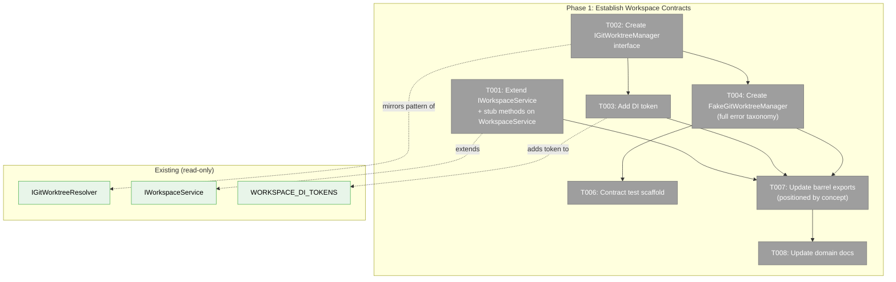
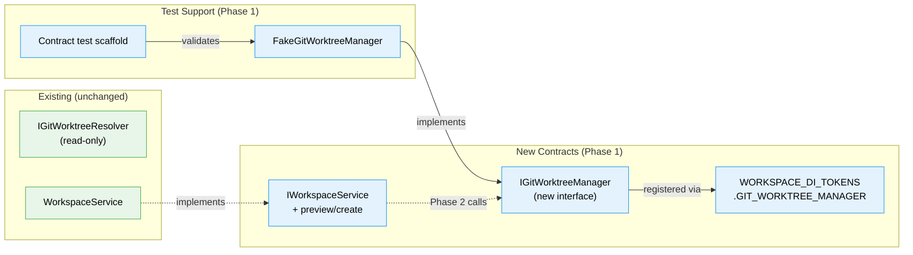
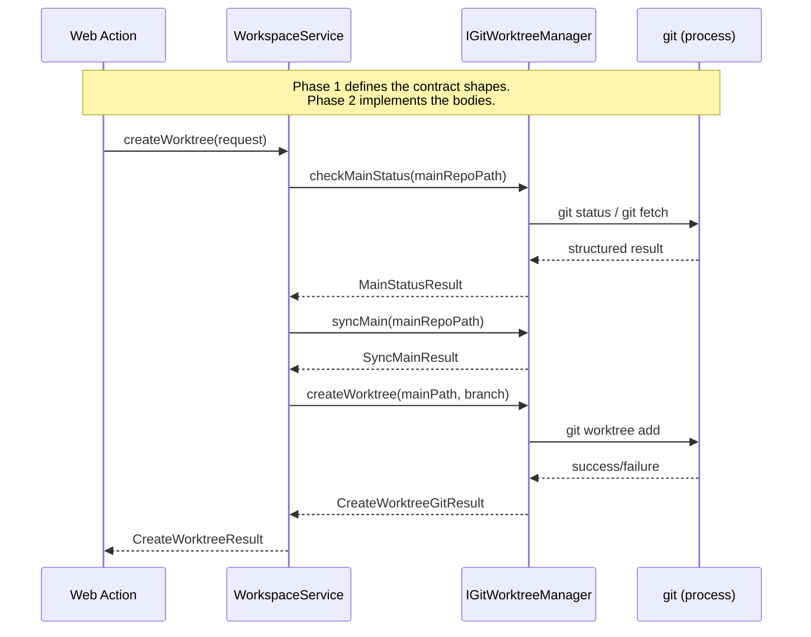

# Phase 1: Establish Workspace Contracts — Tasks Dossier

**Plan**: [new-worktree-plan.md](../../new-worktree-plan.md)
**Phase**: Phase 1: Establish Workspace Contracts
**Generated**: 2026-03-07
**Status**: Ready

---

## Executive Briefing

**Purpose**: Add the typed write-side workspace and git mutation boundaries that every later phase depends on. Without these contracts, Phase 2 cannot implement orchestration, Phase 3 cannot wire server actions, and git mutation logic will leak into the web layer.

**What We're Building**: Preview/create worktree request and result types on `IWorkspaceService`, a new `IGitWorktreeManager` interface with its DI token, a fake implementation for TDD, a contract test scaffold, and container registrations — all without writing any real git command execution.

**Goals**:
- ✅ Extend `IWorkspaceService` with preview/create worktree contracts
- ✅ Introduce `IGitWorktreeManager` as a separate mutation boundary from the read-only `IGitWorktreeResolver`
- ✅ Wire DI token and container registrations so later phases can resolve the manager
- ✅ Provide a fake and contract test scaffold for interface-first TDD
- ✅ Update workspace domain documentation to reflect the new contracts

**Non-Goals**:
- ❌ Implementing real git commands (Phase 2)
- ❌ Naming allocator or ordinal logic (Phase 2)
- ❌ Bootstrap hook execution (Phase 2)
- ❌ Web pages, forms, or server actions (Phase 3)
- ❌ Sidebar entrypoints or navigation (Phase 4)

---

## Prior Phase Context

_Phase 1 has no prior phases. This is the first phase._

---

## Pre-Implementation Check

| File | Exists? | Action | Domain Check | Notes |
|------|---------|--------|-------------|-------|
| `packages/workflow/src/interfaces/workspace-service.interface.ts` | ✅ Yes (170 lines) | Extend | workspace ✓ | Currently has 6 methods; add preview/create types and methods |
| `packages/workflow/src/services/workspace.service.ts` | ✅ Yes | Extend | workspace ✓ | Add NotImplementedError-throwing stubs for new methods so build compiles |
| `packages/workflow/src/interfaces/git-worktree-manager.interface.ts` | ❌ No | Create | workspace ✓ | New mutation interface alongside read-only resolver |
| `packages/shared/src/di-tokens.ts` | ✅ Yes (167 lines) | Extend | workspace ✓ | `WORKSPACE_DI_TOKENS` has 13 tokens; add `GIT_WORKTREE_MANAGER` |
| `packages/workflow/src/fakes/fake-git-worktree-manager.ts` | ❌ No | Create | workspace ✓ | Follows `FakeGitWorktreeResolver` pattern; full error taxonomy |
| `packages/workflow/src/interfaces/index.ts` | ✅ Yes (156 lines) | Extend | workspace ✓ | Barrel; add new type re-exports positioned by concept adjacency |
| `packages/workflow/src/fakes/index.ts` | ✅ Yes (109 lines) | Extend | workspace ✓ | Barrel; add fake + call type re-exports |
| `test/contracts/git-worktree-manager.contract.ts` | ❌ No | Create | workspace ✓ | Contract test factory for fake/real parity |
| `test/contracts/git-worktree-manager.contract.test.ts` | ❌ No | Create | workspace ✓ | Runs contract suite against fake |
| `docs/domains/workspace/domain.md` | ✅ Yes (167 lines) | Update | workspace ✓ | Add new contracts and concept narrative |
| ~~`packages/workflow/src/adapters/git-worktree-manager.adapter.ts`~~ | — | Deferred | — | DROPPED: stub adapter deferred to Phase 2 |
| ~~`apps/web/src/lib/di-container.ts`~~ | — | Deferred | — | DROPPED: container registration deferred to Phase 2 |
| ~~`apps/cli/src/lib/container.ts`~~ | — | Deferred | — | DROPPED: container registration deferred to Phase 2 |

**Concept search result**: No existing git mutation or worktree creation concept exists in the codebase. `IGitWorktreeResolver` is strictly read-only. Safe to create `IGitWorktreeManager`.

**Harness**: No agent harness configured. Implementation will use standard testing only.

---

## Architecture Map



---

## Tasks

| Status | ID | Task | Domain | Path(s) | Done When | Notes |
|--------|-----|------|--------|---------|-----------|-------|
| [ ] | T001 | Define worktree creation types and extend `IWorkspaceService` with `previewCreateWorktree()` and `createWorktree()` method signatures. Add `NotImplementedError`-throwing stub methods to the existing `WorkspaceService` class so the build compiles. | workspace | `packages/workflow/src/interfaces/workspace-service.interface.ts`, `packages/workflow/src/services/workspace.service.ts` | `IWorkspaceService` exports `PreviewCreateWorktreeRequest`, `PreviewCreateWorktreeResult`, `CreateWorktreeRequest`, `CreateWorktreeResult`, `BootstrapStatus` types and two new method signatures. `CreateWorktreeResult` is a discriminated union on `status: 'created' \| 'blocked'` — NOT an extension of `WorkspaceOperationResult`. The `created` variant carries `worktreePath`, `branchName`, and `bootstrapStatus` (informational, not blocking). The `blocked` variant carries structured errors and an optional `refreshedPreview`. `WorkspaceService` compiles with stub methods that throw `NotImplementedError`. No web URL fields in any result type. | Per findings 01, 04. Do NOT extend `WorkspaceOperationResult` — that pattern is binary and cannot express "created with bootstrap warning." Phase 2 replaces stubs with real orchestration. |
| [ ] | T002 | Create `IGitWorktreeManager` interface with method signatures for preflight checks, fetch/compare/fast-forward sync, and worktree creation | workspace | `packages/workflow/src/interfaces/git-worktree-manager.interface.ts` | Interface exports `IGitWorktreeManager` with methods: `checkMainStatus()`, `syncMain()`, `createWorktree()`. Each returns structured result types (`MainStatusResult`, `SyncMainResult`, `CreateWorktreeGitResult`). Error codes cover dirty, ahead, diverged, lock-held, no-main-branch, fetch-failed, and git-failure states. | Per finding 02. Mirror `IGitWorktreeResolver` structure. Keep methods focused on git plumbing — no naming or bootstrap logic. |
| [ ] | T003 | Add `GIT_WORKTREE_MANAGER` token to `WORKSPACE_DI_TOKENS` | workspace | `packages/shared/src/di-tokens.ts` | `WORKSPACE_DI_TOKENS.GIT_WORKTREE_MANAGER` exists with value `'IGitWorktreeManager'`. Follows existing key/value naming convention. | Place adjacent to existing `GIT_WORKTREE_RESOLVER` token. |
| [ ] | T004 | Create `FakeGitWorktreeManager` with call tracking, state setup, and error injection covering the full Workshop 002 error taxonomy | workspace | `packages/workflow/src/fakes/fake-git-worktree-manager.ts` | Fake implements `IGitWorktreeManager`. Exposes: call tracking getters per method (`checkMainStatusCalls`, `syncMainCalls`, `createWorktreeCalls`), state configuration (`setMainStatus()`, `setCreateResult()`), error injection (`injectCheckError`, `injectSyncError`, `injectCreateError`), and `reset()`. State model covers ALL Workshop 002 scenarios: clean, dirty, ahead, diverged, lock-held, no-main-branch, fetch-failed, create-failed. The fake's state enum IS the behavioral specification for the real adapter. | Follow `FakeGitWorktreeResolver` pattern exactly: `{Method}Call` types, immutable call copies, direct state setters. The fake is the most important deliverable — it defines what Phase 2 must implement. |
| ~~[ ]~~ | ~~T005~~ | ~~DROPPED — Stub adapter and container registration deferred to Phase 2~~ | — | — | — | Nothing resolves `IGitWorktreeManager` from the container until Phase 2 wires it into `WorkspaceService`. Creating a throwaway stub file adds git noise without value. Phase 2 creates the real adapter and adds container registrations in one clean commit. |
| [ ] | T006 | Create contract test scaffold for `IGitWorktreeManager` fake/real parity | workspace | `test/contracts/git-worktree-manager.contract.ts`, `test/contracts/git-worktree-manager.contract.test.ts` | Contract factory `gitWorktreeManagerContractTests(getManager)` defines behavioral expectations. Contract test file runs the suite against `FakeGitWorktreeManager`. Phase 2 adds the real adapter to the suite. | Follow existing contract test pattern if one exists; otherwise establish the pattern for this domain. |
| [ ] | T007 | Update barrel exports in `interfaces/index.ts` and `fakes/index.ts`, positioned by concept adjacency | workspace | `packages/workflow/src/interfaces/index.ts`, `packages/workflow/src/fakes/index.ts` | All new types from T001 re-exported from interfaces barrel. `IGitWorktreeManager` + result types re-exported. `FakeGitWorktreeManager` + call types re-exported from fakes barrel. Package compiles cleanly. | Place `IGitWorktreeManager` exports directly after `IGitWorktreeResolver`. Place `CreateWorktreeResult` / `PreviewCreateWorktreeResult` directly after existing workspace service result types. Barrel layout IS the public API surface — position tells the story. |
| [ ] | T008 | Update `workspace` domain documentation with new contracts and concepts | workspace | `docs/domains/workspace/domain.md` | Concepts table gains "Create worktree from canonical main" row with `IWorkspaceService.createWorktree` entry point. Contracts table gains `IGitWorktreeManager` row. Composition table gains `GitWorktreeManagerAdapter` row (noted as Phase 2). Concept narrative section added for worktree creation. History table gains Plan 069 Phase 1 row. | Keep existing concepts untouched. Add new rows only. |

---

## Decisions (from DYK review)

| # | Decision | Rationale |
|---|----------|-----------|
| D1 | Add `NotImplementedError`-throwing stubs to existing `WorkspaceService` in T001 | Adding methods to `IWorkspaceService` breaks compilation of the implementing class. Stubs keep the build green. Optional methods (`?`) would lie about the contract. |
| D2 | `CreateWorktreeResult` is a discriminated union on `status`, NOT an extension of `WorkspaceOperationResult` | The existing binary `success: true/false` pattern cannot express "created but bootstrap hook failed." A three-way status (`created`, `blocked`, plus bootstrap as informational data on `created`) lets Phase 3's form pattern-match cleanly. |
| D3 | `FakeGitWorktreeManager` must model the full Workshop 002 error taxonomy | The fake's configurable states (clean, dirty, ahead, diverged, lock-held, no-main-branch, fetch-failed, create-failed) ARE the behavioral specification. Phase 2's real adapter must handle every state the fake can express. |
| D4 | T005 DROPPED — no stub adapter, no container registration in Phase 1 | Nothing resolves `IGitWorktreeManager` from the container until Phase 2 wires it into `WorkspaceService`. A throwaway stub file adds git noise without value. Phase 2 creates the real adapter and adds registrations in one commit. |
| D5 | Barrel exports positioned by concept adjacency | `IGitWorktreeManager` exports placed directly after `IGitWorktreeResolver`. New result types placed directly after existing workspace service result types. Barrel layout IS the public API surface. |

---

## Context Brief

### Key findings from plan

- **Finding 01** (Critical): Workspace-domain write boundary is settled. Put preview/create orchestration in `IWorkspaceService`, keep web code as adapter only. → T001 defines the domain-side types.
- **Finding 02** (Critical): Git mutation must stay separate from read-only `IGitWorktreeResolver`. → T002 creates the dedicated `IGitWorktreeManager`.
- **Finding 04** (High): The web app's `useActionState` + Zod pattern needs richer result unions. → T001 defines structured page-state-friendly result shapes.

### Domain dependencies

- `workspace`: `IWorkspaceService` (`WORKSPACE_DI_TOKENS.WORKSPACE_SERVICE`) — extending with preview/create methods
- `workspace`: `IGitWorktreeResolver` (`WORKSPACE_DI_TOKENS.GIT_WORKTREE_RESOLVER`) — read-only reference; not modified, but new manager mirrors its pattern
- `_platform/shared`: `WORKSPACE_DI_TOKENS` (`packages/shared/src/di-tokens.ts`) — adding new token
- `_platform/shared`: `IProcessManager` (`DI_TOKENS.PROCESS_MANAGER`) — injected into stub adapter

### Domain constraints

- New types in `IWorkspaceService` MUST NOT embed web URL concepts (`redirectTo`, `href`) — redirect derivation stays in `apps/web/app/actions/`
- `IGitWorktreeManager` owns git plumbing only — no naming logic, no bootstrap execution, no workspace registration
- `IGitWorktreeResolver` is READ-ONLY — do not add methods or modify its interface
- All interfaces go in `packages/workflow/src/interfaces/` (documented deviation from "shared by default" — see plan deviation ledger)
- DI uses TSyringe `container.register()` with `useFactory`, no decorators (ADR-0004)
- Result types use `{ success: boolean; errors: WorkspaceError[] }` base pattern
- Fakes use call-tracking getters (return immutable copies), direct state setters, and error injection properties

### Naming conventions to follow

| Category | Pattern | Example |
|----------|---------|---------|
| Interface | `I{PascalCase}` | `IGitWorktreeManager` |
| Interface file | `{kebab-case}.interface.ts` | `git-worktree-manager.interface.ts` |
| Fake class | `Fake{Name}` | `FakeGitWorktreeManager` |
| Fake file | `fake-{kebab-case}.ts` | `fake-git-worktree-manager.ts` |
| Call types | `{Method}Call` | `CheckMainStatusCall`, `CreateWorktreeCall` |
| DI token key | `SCREAMING_SNAKE` | `GIT_WORKTREE_MANAGER` |
| DI token value | Interface name string | `'IGitWorktreeManager'` |
| Adapter file | `{kebab-case}.adapter.ts` | `git-worktree-manager.adapter.ts` |

### Reusable from prior phases

_Phase 1 is the first phase. No prior-phase artifacts to reuse._

Existing patterns to mirror:
- `IGitWorktreeResolver` → structural template for `IGitWorktreeManager`
- `FakeGitWorktreeResolver` → structural template for `FakeGitWorktreeManager`
- `AddWorkspaceResult` / `RemoveWorkspaceResult` → pattern for new result types
- `GitWorktreeResolver` adapter → registration pattern for containers

### System flow (Phase 1 scope — contracts only)



### Sequence diagram (Phase 2+ consumer perspective — shows why contracts matter)



---

## Discoveries & Learnings

_Populated during implementation by plan-6._

| Date | Task | Type | Discovery | Resolution | References |
|------|------|------|-----------|------------|------------|

---

## Directory Layout

```
docs/plans/069-new-worktree/
  ├── new-worktree-plan.md
  ├── new-worktree-spec.md
  ├── research-dossier.md
  ├── workshops/
  │   ├── 001-new-worktree-naming-and-post-create-hook.md
  │   ├── 002-main-sync-strategy-and-git-safety.md
  │   ├── 003-create-flow-ux-and-recovery-states.md
  │   └── 004-workspace-domain-and-service-boundary.md
  └── tasks/phase-1-establish-workspace-contracts/
      ├── tasks.md              ← this file
      ├── tasks.fltplan.md      ← flight plan (below)
      └── execution.log.md     # created by plan-6
```
