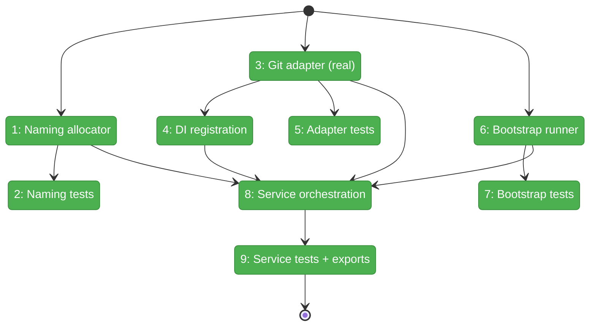
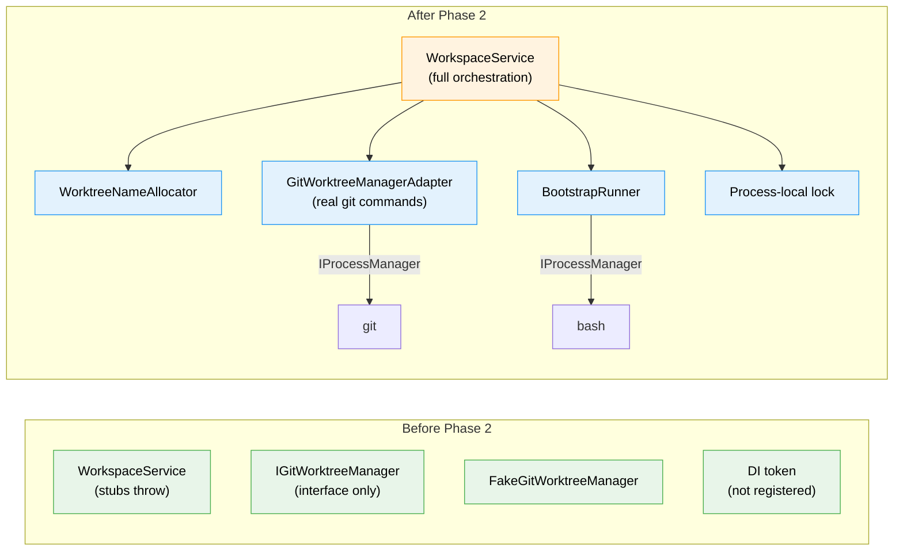

# Flight Plan: Phase 2 — Implement Workspace Orchestration

**Plan**: [new-worktree-plan.md](../../new-worktree-plan.md)
**Phase**: Phase 2: Implement Workspace Orchestration
**Generated**: 2026-03-07
**Status**: Landed

---

## Departure → Destination

**Where we are**: Phase 1 established typed contracts (`IWorkspaceService` with preview/create signatures, `IGitWorktreeManager` with full error taxonomy, `FakeGitWorktreeManager`, DI token, contract scaffold). `WorkspaceService` has `NotImplementedError` stubs. No real git commands execute.

**Where we're going**: A developer can call `workspaceService.createWorktree({ workspaceSlug, requestedName })` and get a real worktree created from refreshed canonical `main` with ordinal naming, safety checks, and optional bootstrap hook execution. All behavior is tested against fakes/fixtures with no broad mocking.

---

## Domain Context

### Domains We're Changing

| Domain | What Changes | Key Files |
|--------|-------------|-----------|
| workspace | Add naming allocator, real git adapter, bootstrap runner, orchestrate in WorkspaceService | `worktree-name.ts`, `git-worktree-manager.adapter.ts`, `worktree-bootstrap-runner.ts`, `workspace.service.ts` |
| workspace (DI) | Register real `GitWorktreeManagerAdapter` in both containers | `di-container.ts`, `container.ts` |

### Domains We Depend On (no changes)

| Domain | What We Consume | Contract |
|--------|----------------|----------|
| `_platform/shared` | `IProcessManager`, `IFileSystem`, DI tokens | `SHARED_DI_TOKENS.PROCESS_MANAGER`, `SHARED_DI_TOKENS.FILESYSTEM` |

---

## Flight Status

**Legend**: grey = pending | yellow = active | red = blocked | green = done

---

## Stages

- [ ] **Stage 1: Naming allocator** — Implement as pure functions: `normalizeSlug()`, `parseRequestedName()`, `allocateOrdinal({ localBranches, remoteBranches, planFolders })`, `buildWorktreeName()` (`worktree-name.ts`)
- [ ] **Stage 2: Naming tests** — Cover plain slugs, pasted ordinals, ordinal allocation, collision detection, edge cases — all with plain fixture arrays (`worktree-name.test.ts`)
- [ ] **Stage 3: Git adapter** — Implement `GitWorktreeManagerAdapter` with `execGit()` helper, preflight sequence, sync, create, **plus `listBranches()` and `listPlanFolders()`**. Also update `IGitWorktreeManager` interface, `FakeGitWorktreeManager`, and contract scaffold to add the 2 new methods (`git-worktree-manager.adapter.ts` + interface/fake updates)
- [ ] **Stage 4: DI registration** — Register real adapter in web + CLI containers. Update `WorkspaceService` factory to inject 4th dep (`di-container.ts`, `container.ts`)
- [ ] **Stage 5: Adapter tests** — Unit tests for all git states + extend contract suite with real adapter (`git-worktree-manager.test.ts`, contract test)
- [ ] **Stage 6: Bootstrap runner** — Hook detection, realpath validation, execution with env vars, log capture, timeout via spawn+timer+terminate (`worktree-bootstrap-runner.ts`)
- [ ] **Stage 7: Bootstrap tests** — Cover skipped, succeeded, failed, timeout, symlink escape (`worktree-bootstrap-runner.test.ts`)
- [ ] **Stage 8: Service orchestration** — Replace stubs with real flow: resolve → withLock → preflight → sync → name → create → bootstrap. Add `withLock()` async mutex (~10 lines, on the class). Silent re-allocation on ordinal drift, hard block if re-allocated also conflicts (`workspace.service.ts`)
- [ ] **Stage 9: Service tests + exports** — Add create/preview test cases, fix ALL existing `beforeEach` blocks for 4th constructor arg, update barrel exports (`workspace-service.test.ts`, index files)

---

## Architecture: Before & After

---

## Acceptance Criteria

- [ ] The workspace domain can preview and create new worktrees from refreshed local `main` using the agreed ordinal naming convention.
- [ ] Blocking git safety failures stop creation before any branch or worktree is created.
- [ ] Hook execution is sourced from `<mainRepoPath>/.chainglass/new-worktree.sh`, runs with structured environment variables, and reports `skipped`, `succeeded`, or `failed` without rolling back a created worktree.

## Checklist

- [x] T001: Worktree naming allocator
- [x] T002: Naming tests
- [x] T003: GitWorktreeManagerAdapter (real git commands)
- [x] T004: DI registration (web + CLI)
- [x] T005: Adapter tests + contract extension
- [x] T006: Bootstrap runner
- [x] T007: Bootstrap tests
- [x] T008: WorkspaceService orchestration (replace stubs)
- [x] T009: Service tests + barrel exports
