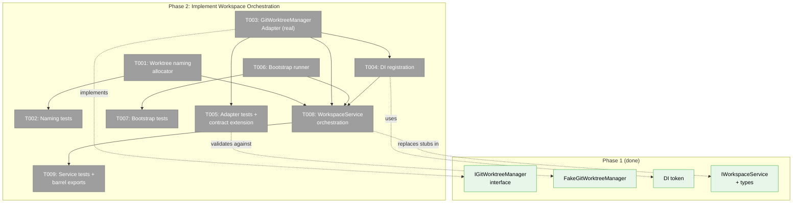
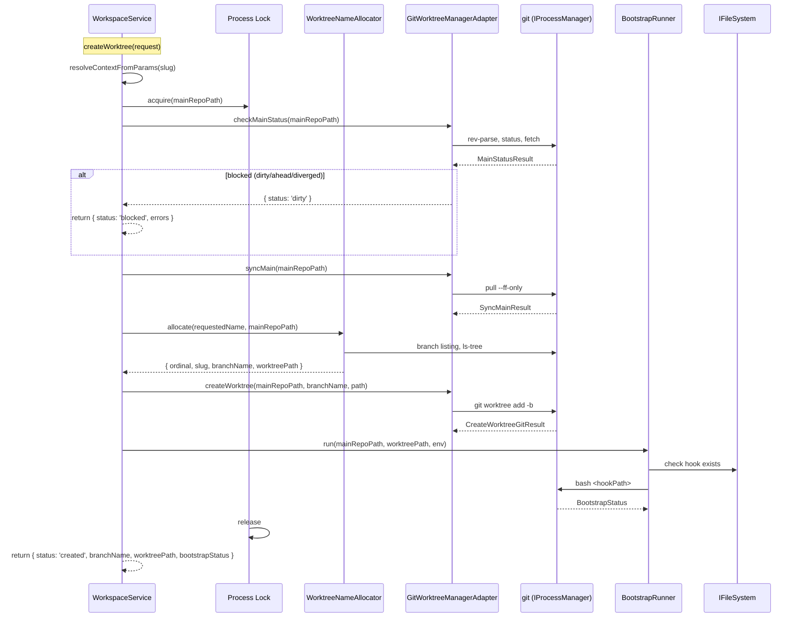

# Phase 2: Implement Workspace Orchestration — Tasks Dossier

**Plan**: [new-worktree-plan.md](../../new-worktree-plan.md)
**Phase**: Phase 2: Implement Workspace Orchestration
**Generated**: 2026-03-07
**Status**: Complete

---

## Executive Briefing

**Purpose**: Implement the workspace-domain logic that turns Phase 1's typed contracts into working behavior. This phase delivers the three internal components (naming allocator, git mutation adapter, bootstrap runner) and wires them into `WorkspaceService` orchestration, replacing the `NotImplementedError` stubs from Phase 1.

**What We're Building**:
- An in-repo ordinal naming allocator that mirrors `plan-ordinal.py` behavior
- A real `GitWorktreeManagerAdapter` that runs git commands through `IProcessManager`
- A bootstrap runner that executes `.chainglass/new-worktree.sh` from the main repo
- Full `previewCreateWorktree()` and `createWorktree()` orchestration in `WorkspaceService`
- DI container registrations for the real adapter
- High-value unit and contract test coverage

**Non-Goals**:
- ❌ Web pages, forms, or server actions (Phase 3)
- ❌ Sidebar entrypoints or navigation (Phase 4)
- ❌ Bootstrap retry mechanisms (v1 scope: "Open Worktree Anyway" only)
- ❌ Supporting any base branch other than `main` (v1 scope)

---

## Prior Phase Context

**Phase 1 delivered** (all verified passing):
- `IWorkspaceService` with `previewCreateWorktree()` / `createWorktree()` signatures and `NotImplementedError` stubs on `WorkspaceService`
- `IGitWorktreeManager` interface with `checkMainStatus()`, `syncMain()`, `createWorktree()` — full Workshop 002 error taxonomy
- `FakeGitWorktreeManager` with call tracking, state setup, error injection
- `GIT_WORKTREE_MANAGER` DI token in `WORKSPACE_DI_TOKENS`
- Contract test scaffold (4 tests, fake-only)
- `CreateWorktreeResult` as discriminated union on `status: 'created' | 'blocked'`
- `BootstrapStatus` with `outcome: 'skipped' | 'succeeded' | 'failed'` + optional `logTail`

**Phase 1 review notes** (non-blocking, from code review):
- Contract test coverage is shallow (4 basic shape assertions) — Phase 2 should deepen it when adding the real adapter
- Execution evidence could be stronger — ensure Phase 2 tests are thorough

---

## Pre-Implementation Check

| File | Exists? | Action | Domain | Notes |
|------|---------|--------|--------|-------|
| `packages/workflow/src/services/worktree-name.ts` | ❌ No | Create | workspace | Naming allocator |
| `packages/workflow/src/adapters/git-worktree-manager.adapter.ts` | ❌ No | Create | workspace | Real git adapter; follows `GitWorktreeResolver` pattern |
| `packages/workflow/src/services/worktree-bootstrap-runner.ts` | ❌ No | Create | workspace | Hook runner |
| `packages/workflow/src/services/workspace.service.ts` | ✅ Yes (340 lines) | Extend | workspace | Replace stubs, add new constructor dep |
| `apps/web/src/lib/di-container.ts` | ✅ Yes (805 lines) | Extend | workspace | Register real adapter |
| `apps/cli/src/lib/container.ts` | ✅ Yes (568 lines) | Extend | workspace | Register real adapter |
| `test/unit/workflow/workspace-service.test.ts` | ✅ Yes (493 lines) | Extend | workspace | Add preview/create tests |
| `test/unit/workflow/git-worktree-manager.test.ts` | ❌ No | Create | workspace | Adapter unit tests |
| `test/unit/workflow/worktree-name.test.ts` | ❌ No | Create | workspace | Naming allocator tests |
| `test/unit/workflow/worktree-bootstrap-runner.test.ts` | ❌ No | Create | workspace | Bootstrap runner tests |
| `test/contracts/git-worktree-manager.contract.test.ts` | ✅ Yes (8 lines) | Extend | workspace | Add real adapter to suite |
| `packages/workflow/src/services/index.ts` | ✅ Yes | Extend | workspace | Export new services |
| `packages/workflow/src/adapters/index.ts` | ✅ Yes | Extend | workspace | Export new adapter |
| `packages/workflow/src/index.ts` | ✅ Yes | Extend | workspace | Re-export for package consumers |

---

## Decisions (carried from DYK review + workshops)

| # | Decision | Source |
|---|----------|--------|
| D1 | `CreateWorktreeResult` is a discriminated union — stubs throw, not return partial data | Phase 1 DYK D1, D2 |
| D2 | Naming allocator scans 3 sources: local branches, remote branches, plan folders via git | Workshop 001 |
| D3 | Pasted `NNN-slug` bypasses allocation; plain slug triggers ordinal scan | Workshop 001 |
| D4 | Never silently suffix names (e.g., `-2`) — return structured conflict error with refreshed preview | Workshop 001 |
| D5 | Preflight sequence: resolve root → verify main branch → check dirty → check lock → fetch → compare | Workshop 002 |
| D6 | Fast-forward only when behind; block if ahead or diverged | Workshop 002 |
| D7 | Process-local mutex keyed by `mainRepoPath` serializes concurrent creates — implemented as ~10-line `withLock()` helper INSIDE `WorkspaceService`, not extracted to shared (YAGNI) | Workshop 002, Phase 2 DYK D4 |
| D8 | Bootstrap hook at `<mainRepoPath>/.chainglass/new-worktree.sh`, run via `bash`, cwd=newWorktreePath | Workshop 001 |
| D9 | Bootstrap failure is informational — never roll back the created worktree | Workshop 001 |
| D10 | `WorkspaceService` constructor gains `IGitWorktreeManager` as 4th dependency — T004 + T008 + existing test updates MUST land together | Phase 2 DYK D1 |
| D11 | Stub adapter dropped in Phase 1 — Phase 2 creates real adapter + DI registration in one pass | Phase 1 DYK D4 |
| D12 | Naming allocator is a **pure function** taking `{ localBranches, remoteBranches, planFolders }` as input — no process dependency, trivially testable with fixtures | Phase 2 DYK D2 |
| D13 | `IGitWorktreeManager` gains `listBranches()` and `listPlanFolders()` to serve the create workflow — these reads are part of the mutation lifecycle, not general discovery | Phase 2 DYK D5 |
| D14 | If the ordinal drifts between preview and create (unlikely single-user), silently re-allocate. If the re-allocated name also conflicts, that's a hard block (bug). | Phase 2 DYK D3 |

---

## Architecture Map

---

## Tasks

| Status | ID | Task | Domain | Path(s) | Done When | Notes |
|--------|-----|------|--------|---------|-----------|-------|
| [x] | T001 | Implement worktree naming allocator as **pure functions** taking pre-fetched branch/plan data: slug normalization, ordinal allocation, pasted `NNN-slug` detection, and conflict handling | workspace | `packages/workflow/src/services/worktree-name.ts` | `normalizeSlug(input)` produces lowercase hyphenated slugs. `allocateOrdinal({ localBranches, remoteBranches, planFolders })` finds `max+1` from all sources. `parseRequestedName(input)` detects pasted `NNN-slug` vs plain slug. `buildWorktreeName(ordinal, slug)` produces zero-padded `NNN-slug`. Never silently suffixes names. No process/git dependency — takes data as input. | Per D12: pure function, no IProcessManager. Per Workshop 001, Finding 03. |
| [x] | T002 | Add naming allocator unit tests | workspace | `test/unit/workflow/worktree-name.test.ts` | Tests cover: plain slug normalization, pasted `NNN-slug` parsing, ordinal allocation from branch/plan data, collision detection, edge cases (empty input, special chars, leading zeros, already-taken ordinal on pasted input). Uses plain fixtures — no fakes needed since allocator is pure. | Pure functions = trivially testable with fixture arrays. |
| [x] | T003 | Implement `GitWorktreeManagerAdapter` with real git commands for preflight, sync, create, **plus `listBranches()` and `listPlanFolders()`** for the naming allocator | workspace | `packages/workflow/src/adapters/git-worktree-manager.adapter.ts` | Adapter implements `IGitWorktreeManager` (which gains 2 new read methods per D13). Uses `IProcessManager.spawn()` via private `execGit()` helper. `checkMainStatus()` runs full Workshop 002 preflight. `syncMain()` runs `fetch + pull --ff-only`. `createWorktree()` runs `git worktree add -b`. `listBranches()` returns local + remote branch names. `listPlanFolders()` runs `git ls-tree --name-only main docs/plans/`. Returns structured results for every error state. | Per D13: add listBranches/listPlanFolders. Per Workshop 002. Constructor injects `IProcessManager`. **Also requires updating `IGitWorktreeManager` interface, `FakeGitWorktreeManager`, and contract scaffold from Phase 1.** |
| [x] | T004 | Register `GitWorktreeManagerAdapter` in web and CLI DI containers. **Must land with T008 since constructor signature changes.** | workspace | `apps/web/src/lib/di-container.ts`, `apps/cli/src/lib/container.ts` | Both containers register `IGitWorktreeManager` via `useFactory` with `IProcessManager` dependency. Registration pattern matches existing `GitWorktreeResolver`. Also update `WorkspaceService` registration to inject the new 4th dependency. | Per D10: T004 + T008 + existing test updates MUST land together. Per D11: deferred registration from Phase 1. |
| [x] | T005 | Add git worktree manager adapter unit tests and extend contract test suite | workspace | `test/unit/workflow/git-worktree-manager.test.ts`, `test/contracts/git-worktree-manager.contract.test.ts` | Unit tests cover: clean main, dirty main, ahead/diverged blocking, lock-held detection, fetch failure, fast-forward success/failure, worktree creation success/failure, branch-exists and path-exists errors, listBranches, listPlanFolders. Contract test file adds `GitWorktreeManagerAdapter` alongside fake to verify parity. | Uses `FakeProcessManager` to simulate git command outputs. |
| [x] | T006 | Implement worktree bootstrap runner: hook detection, validation, execution, and log capture | workspace | `packages/workflow/src/services/worktree-bootstrap-runner.ts` | Runner checks for `<mainRepoPath>/.chainglass/new-worktree.sh`. Validates realpath stays within `.chainglass/`. Executes via `bash` with `cwd=newWorktreePath`. Passes structured env vars (`CHAINGLASS_MAIN_REPO_PATH`, `CHAINGLASS_NEW_BRANCH_NAME`, etc.). Captures last 200 lines of combined output. Returns `BootstrapStatus` with `outcome` and optional `logTail`. 60s timeout via spawn + timer + terminate. | Per Workshop 001. Constructor injects `IProcessManager` and `IFileSystem`. Never rolls back on failure. |
| [x] | T007 | Add bootstrap runner unit tests | workspace | `test/unit/workflow/worktree-bootstrap-runner.test.ts` | Tests cover: hook not present (skipped), hook succeeds, hook fails (returns logTail), hook timeout, symlink escape attempt blocked, env vars passed correctly. Uses `FakeProcessManager` and `FakeFileSystem`. | The runner is pure side-effect management — test every outcome path. |
| [x] | T008 | Wire preview/create orchestration into `WorkspaceService`, replacing `NotImplementedError` stubs. Add `withLock()` async mutex. | workspace | `packages/workflow/src/services/workspace.service.ts` | `previewCreateWorktree()` resolves workspace, fetches branches via `IGitWorktreeManager.listBranches()`/`listPlanFolders()`, calls pure naming allocator, checks for bootstrap hook, returns `PreviewCreateWorktreeResult`. `createWorktree()` acquires `withLock(mainRepoPath)`, runs preflight, syncs, re-allocates name inside lock (silently re-allocate if ordinal drifted per D14; hard block if re-allocated name also conflicts), creates worktree, runs bootstrap, returns `CreateWorktreeResult`. Constructor gains `IGitWorktreeManager` as 4th dep. `withLock()` is a ~10-line `Map<string, Promise>` helper on the service class (per D7, not extracted to shared). | Per D10: constructor change breaks existing callers — update DI and tests simultaneously. Per D14: silent re-allocation on ordinal drift. |
| [x] | T009 | Add workspace service preview/create tests. Update barrel exports and service index. Fix existing test `beforeEach` blocks for 4th constructor param. | workspace | `test/unit/workflow/workspace-service.test.ts`, `packages/workflow/src/services/index.ts`, `packages/workflow/src/adapters/index.ts`, `packages/workflow/src/index.ts` | New test section covers: preview happy path, preview with pasted ordinal, create happy path (bootstrap skipped), create with bootstrap success, create with bootstrap failure (result still `'created'`), blocking errors (dirty main, naming conflict with refreshed preview, diverged), ordinal drift re-allocation. All existing tests (T036-T038) still pass with updated `beforeEach` that adds `FakeGitWorktreeManager` as 4th arg. Barrel exports updated. Package compiles cleanly. | Per D10: every existing `new WorkspaceService(...)` call must gain the 4th arg. |

---

## Context Brief

### Key findings from plan

- **Finding 01** (Critical): Put preview/create orchestration in `IWorkspaceService`, keep web code as adapter. → T008 is the central orchestration task.
- **Finding 02** (Critical): Git mutation stays behind `IGitWorktreeManager`. → T003 implements the real adapter.
- **Finding 03** (Critical): Dedicated naming allocator using 3-source ordinal scan. → T001 delivers this.

### Workshop 001: Naming Algorithm Summary

1. **Normalize**: lowercase, hyphenate, collapse separators, trim, validate `^[a-z0-9]+(-[a-z0-9]+)*$`
2. **Detect pasted ordinal**: if input matches `^\d{3,}-`, split into `providedOrdinal` + `slugPart`
3. **Scan 3 sources**: local branches (`git branch`), remote branches (`git branch -a`), plan folders (`git ls-tree <branch> docs/plans/`)
4. **Allocate**: `max(allOrdinals) + 1`, zero-padded to 3+ digits
5. **Build**: `${ordinal}-${normalizedSlug}`
6. **On conflict**: return structured error with refreshed suggestion — never suffix

### Workshop 002: Git Safety Sequence

1. `git rev-parse --show-toplevel` → resolve main repo root
2. `git rev-parse --abbrev-ref HEAD` → verify on `main`
3. `git status --porcelain=v1 --untracked-files=no` → check dirty
4. Check for in-progress git operations (lock files)
5. `git fetch origin main --prune` → refresh remote
6. `git rev-list --left-right --count main...origin/main` → compare
7. If behind: `git pull --ff-only origin main`
8. If ahead/diverged: BLOCK
9. `git worktree add -b <branch> <path> main` → create

### Workshop 001: Bootstrap Hook Contract

- Path: `<mainRepoPath>/.chainglass/new-worktree.sh`
- Execute: `bash <hookPath>` with `cwd=newWorktreePath`
- Env vars: `CHAINGLASS_MAIN_REPO_PATH`, `CHAINGLASS_WORKSPACE_SLUG`, `CHAINGLASS_REQUESTED_NAME`, `CHAINGLASS_NORMALIZED_SLUG`, `CHAINGLASS_NEW_WORKTREE_ORDINAL`, `CHAINGLASS_NEW_BRANCH_NAME`, `CHAINGLASS_NEW_WORKTREE_PATH`, `CHAINGLASS_TRIGGER`
- Timeout: 60s, capture last 200 lines
- Failure: informational only, return `BootstrapStatus.outcome = 'failed'` with `logTail`

### Existing code patterns to follow

- **`GitWorktreeResolver.execGit()`**: private helper wrapping `IProcessManager.spawn()` → use identical pattern in adapter
- **Constructor injection**: `WorkspaceService` currently has 3 deps → Phase 2 adds 4th (`IGitWorktreeManager`)
- **DI registration**: `container.register<IGitWorktreeManager>(WORKSPACE_DI_TOKENS.GIT_WORKTREE_MANAGER, { useFactory: (c) => new GitWorktreeManagerAdapter(c.resolve<IProcessManager>(...)) })`
- **Test pattern**: `beforeEach` creates fakes, constructs service. AAA pattern. No `vi.mock()`.
- **Service files**: `packages/workflow/src/services/{kebab}.ts`
- **Adapter files**: `packages/workflow/src/adapters/{kebab}.adapter.ts`

### Phase 1 artifacts reused

| Artifact | Reuse In |
|----------|----------|
| `IGitWorktreeManager` interface | T003 implements it |
| `FakeGitWorktreeManager` | T005 contract parity, T009 service tests |
| `GIT_WORKTREE_MANAGER` DI token | T004 container registration |
| `CreateWorktreeResult` discriminated union | T008 return type |
| `BootstrapStatus` type | T006 return type, T008 orchestration |
| Contract test scaffold | T005 extends with real adapter |

---

## System Flow

---

## Discoveries & Learnings

_Populated during implementation by plan-6._

| Date | Task | Type | Discovery | Resolution | References |
|------|------|------|-----------|------------|------------|
