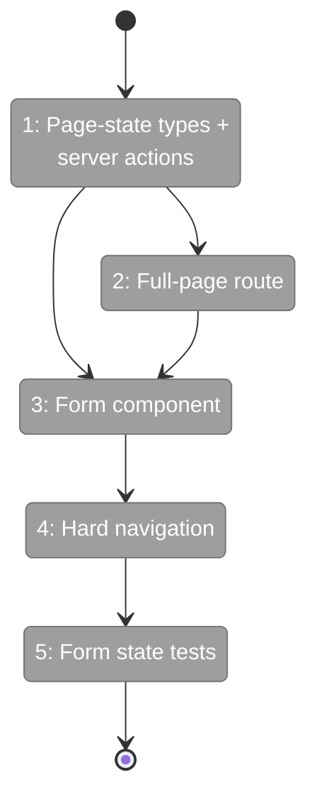
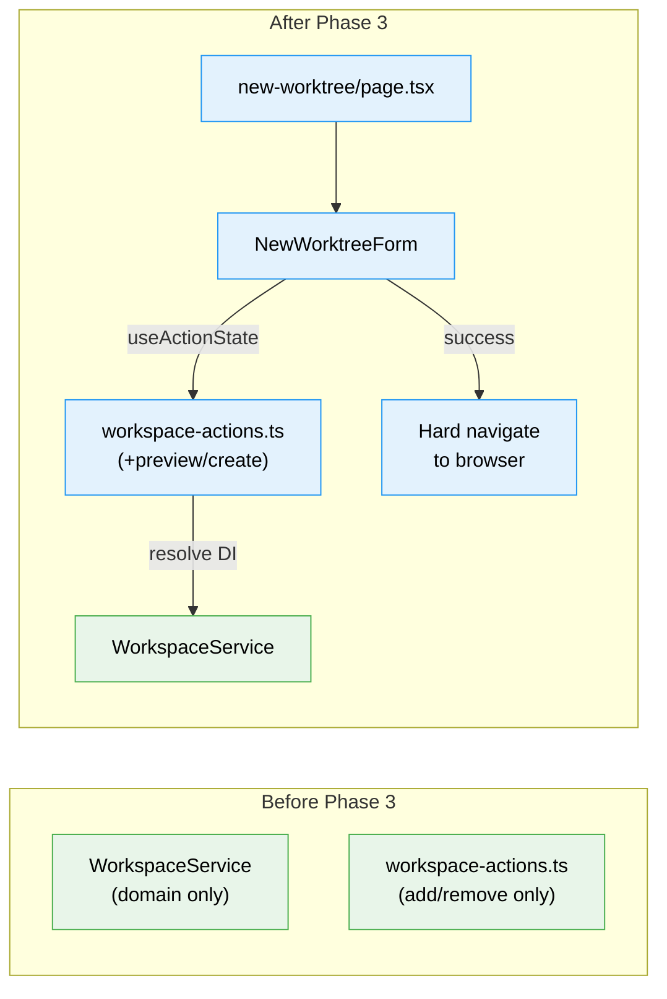

# Flight Plan: Phase 3 — Build the Full-Page Create Flow

**Plan**: [new-worktree-plan.md](../../new-worktree-plan.md)
**Phase**: Phase 3: Build the Full-Page Create Flow
**Generated**: 2026-03-08
**Status**: Landed

---

## Departure → Destination

**Where we are**: Phases 1+2 delivered the complete domain layer — `WorkspaceService.createWorktree()` returns a discriminated union (`'created'` with bootstrap status, or `'blocked'` with errors). The DI container wires everything. No web UI exists yet.

**Where we're going**: A user navigates to `/workspaces/[slug]/new-worktree`, types a name, sees a live preview, clicks "Create Worktree", and either lands in the new worktree's browser view or sees a clear error they can act on.

---

## Domain Context

### Domains We're Changing

| Domain | What Changes | Key Files |
|--------|-------------|-----------|
| workspace | Add full-page route, form component, server actions for preview/create | `page.tsx`, `new-worktree-form.tsx`, `workspace-actions.ts` |

### Domains We Depend On (no changes)

| Domain | What We Consume | Contract |
|--------|----------------|----------|
| workspace | `IWorkspaceService.previewCreateWorktree()` / `createWorktree()` | `PreviewCreateWorktreeResult`, `CreateWorktreeResult` |
| `_platform/workspace-url` | `workspaceHref()` | Derive redirect URL from slug + worktreePath |
| `_platform/auth` | `requireAuth()` | Protect server actions |

---

## Flight Status

**Legend**: grey = pending | yellow = active | red = blocked | green = done

---

## Stages

- [ ] **Stage 1: Server action** — Define `CreateWorktreePageState` union (4 variants), add `createNewWorktree` server action with auth, Zod validation, domain call, URL derivation, and revalidation. No preview action. (`workspace-actions.ts`)
- [ ] **Stage 2: Page route** — Create Server Component that calls `IWorkspaceService` directly for initial preview, renders form with idle state (`page.tsx` — new file)
- [ ] **Stage 3: Form component** — Create `'use client'` form with `useActionState`, client-side live slug preview via pure functions, 4 page states, pending progress, `useEffect` hard navigation on success, "Open Worktree Anyway" button (`new-worktree-form.tsx` — new file)
- ~~**Stage 4: Navigation** — Merged into Stage 3 (navigation is integral to form)~~
- [ ] **Stage 4: Tests** — Render form with each of 4 page-state variants, assert visual output. Don't test navigation side effect. (`new-worktree-form.test.tsx` — new file)

---

## Architecture: Before & After

---

## Acceptance Criteria

- [ ] Selecting the new-worktree action opens a dedicated full-page route at `/workspaces/[slug]/new-worktree`.
- [ ] The page shows a best-effort preview before submission and preserves user input on blocking failures.
- [ ] A bootstrap warning state stays on the page and offers an explicit "Open Worktree Anyway" action.

## Goals & Non-Goals

**Goals**:
- ✅ Full-page create route with preview and 4 page states
- ✅ Thin server actions mapping domain results to UI state
- ✅ Hard navigation on success
- ✅ Bootstrap warning with explicit continue action

**Non-Goals**:
- ❌ Sidebar entrypoints (Phase 4)
- ❌ Documentation (Phase 4)
- ❌ Manual ordinal override, skip-bootstrap, alternate base branch

---

## Checklist

- [x] T001: Page-state types + createNewWorktree server action (no preview action)
- [x] T002: Full-page route (Server Component, direct service call for preview)
- [x] T003: Form component (Client Component, 4 states, live preview, useEffect navigation)
- ~~T004: Merged into T003~~
- [x] T005: Form state tests (4 visual states, no navigation testing)
