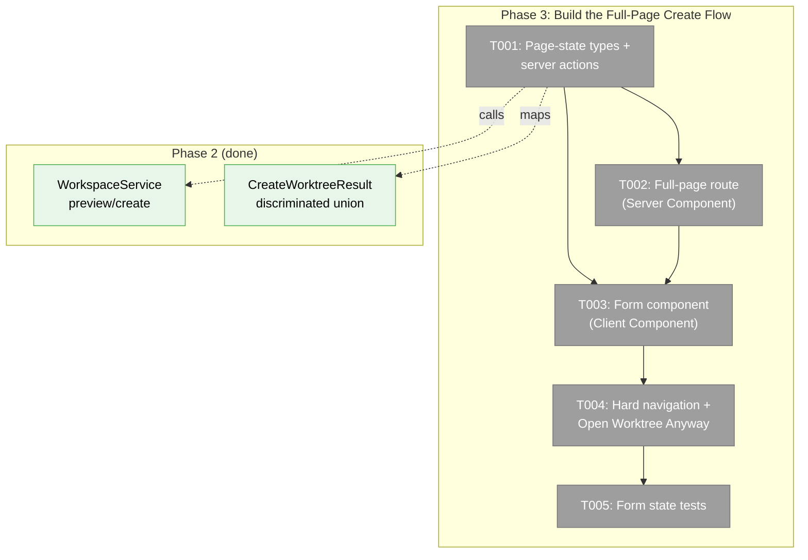
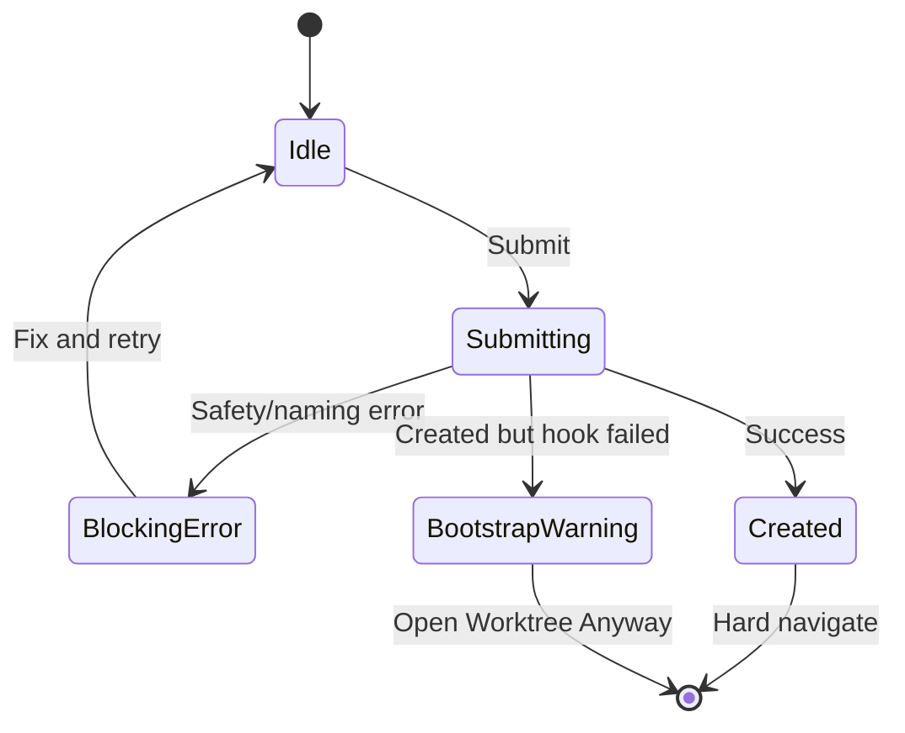
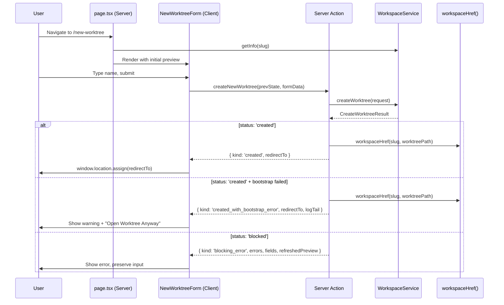

# Phase 3: Build the Full-Page Create Flow — Tasks Dossier

**Plan**: [new-worktree-plan.md](../../new-worktree-plan.md)
**Phase**: Phase 3: Build the Full-Page Create Flow
**Generated**: 2026-03-08
**Status**: Ready

---

## Executive Briefing

**Purpose**: Expose the workspace-domain preview/create behavior to the user through a full-page web route. This phase bridges the domain layer (Phases 1+2) to the browser, translating `CreateWorktreeResult` discriminated unions into visual states the user can act on.

**What We're Building**:
- A full-page route at `/workspaces/[slug]/new-worktree`
- A `useActionState`-driven form with 4 page states: idle, blocking error, created (redirect), and bootstrap warning
- Server actions that resolve `IWorkspaceService`, call preview/create, and map domain outcomes into page-state unions
- Hard navigation to the browser route on success

**Goals**:
- ✅ Full-page create route (not modal/drawer) per Workshop 003
- ✅ Best-effort preview with live slug normalization
- ✅ Blocking error display that preserves form fields and shows refreshed preview
- ✅ Bootstrap warning with "Open Worktree Anyway" action
- ✅ Hard navigation on success so sidebar remounts with new worktree

**Non-Goals**:
- ❌ Sidebar plus button entrypoints (Phase 4)
- ❌ Workspace detail page button (Phase 4)
- ❌ Documentation updates (Phase 4)
- ❌ Manual ordinal override, skip-bootstrap toggle, alternate base branch (v1 non-goals)

---

## Prior Phase Context

### Phase 1+2 Deliverables
- `IWorkspaceService.previewCreateWorktree()` → `PreviewCreateWorktreeResult`
- `IWorkspaceService.createWorktree()` → `CreateWorktreeResult` (discriminated union: `'created'` | `'blocked'`)
- `BootstrapStatus` with `outcome: 'skipped' | 'succeeded' | 'failed'` + optional `logTail`
- DI: `WORKSPACE_DI_TOKENS.WORKSPACE_SERVICE` resolves fully-wired `WorkspaceService` in web container

### Phase 1+2 Gotchas
- `CreateWorktreeResult` is NOT `WorkspaceOperationResult` — don't use `success: true/false`
- `refreshedPreview` is present on `'blocked'` results from branch/path conflicts
- Bootstrap failure returns `status: 'created'` with `bootstrapStatus.outcome: 'failed'` — it's informational
- No web URLs in domain result types — derive `redirectTo` in the web layer

### Patterns to Follow
- `useActionState` + `useFormStatus` pattern from `workspace-add-form.tsx`
- `requireAuth()` first in every server action
- `getContainer().resolve<IWorkspaceService>(WORKSPACE_DI_TOKENS.WORKSPACE_SERVICE)`
- `revalidatePath('/workspaces')` after successful create
- `state.fields` for input preservation on error
- Hard navigation via `window.location.assign()`

---

## Pre-Implementation Check

| File | Exists? | Action | Domain | Notes |
|------|---------|--------|--------|-------|
| `apps/web/app/(dashboard)/workspaces/[slug]/new-worktree/page.tsx` | ❌ No | Create | workspace | Full-page Server Component route |
| `apps/web/src/components/workspaces/new-worktree-form.tsx` | ❌ No | Create | workspace | Client Component with `'use client'` and `useActionState` |
| `apps/web/app/actions/workspace-actions.ts` | ✅ Yes | Extend | workspace | Add preview/create action functions |
| `test/unit/web/components/new-worktree-form.test.tsx` | ❌ No | Create | workspace | Form state tests |

**Harness**: No agent harness — implementation will use standard testing only.

---

## Architecture Map



---

## Decisions (from DYK review)

| # | Decision | Rationale |
|---|----------|-----------|
| D1 | Drop `previewWorktree` server action — page calls `IWorkspaceService.previewCreateWorktree()` directly during Server Component render | Server actions are for mutations. Initial data loading should use direct service calls in the Server Component. No unnecessary round-trip. |
| D2 | Hard navigation via `useEffect` + `window.location.assign()` — NOT `redirect()` | `redirect()` does soft navigation, sidebar won't remount. Full page reload is actually the right UX here — fresh workspace context. |
| D3 | Import pure `normalizeSlug()` + `buildWorktreeName()` client-side for live preview | These Phase 2 functions have zero server dependencies. Instant preview as user types. Ordinal stays at server-rendered value; "confirmed on submit." |
| D4 | Verify `workspaceHref()` supports `?worktree=` before implementation | If it doesn't, extend it or build URL directly. Either way it's 1 line. |
| D5 | Test the 4 visual states, NOT the navigation side effect | Render form with each page-state variant as initial state. Don't mock `window.location` — it's 3 lines of trivial code. |

---

## Tasks

| Status | ID | Task | Domain | Path(s) | Done When | Notes |
|--------|-----|------|--------|---------|-----------|-------|
| [ ] | T001 | Define `CreateWorktreePageState` union type and add `createNewWorktree` server action to workspace-actions.ts. **No preview action** — page calls service directly. | workspace | `apps/web/app/actions/workspace-actions.ts` | Page-state type has 4 variants: `idle`, `blocking_error`, `created`, `created_with_bootstrap_error`. Action calls `requireAuth()`, resolves `IWorkspaceService`, validates `requestedName` with Zod, maps domain `CreateWorktreeResult` to page-state variants, derives `redirectTo` via `workspaceHref()` (verify `?worktree=` support per D4), calls `revalidatePath()` on success. | Per D1: no preview action. Per findings 01+04. `redirectTo` derived in web layer only. |
| [ ] | T002 | Create the full-page route at `/workspaces/[slug]/new-worktree/page.tsx` (Server Component) that calls `IWorkspaceService.previewCreateWorktree()` directly for initial data | workspace | `apps/web/app/(dashboard)/workspaces/[slug]/new-worktree/page.tsx` | Page is a Server Component with `export const dynamic = 'force-dynamic'`. Resolves workspace context via DI container + `IWorkspaceService.getInfo()`. Calls `previewCreateWorktree()` directly (not via action) for initial preview. Renders `NewWorktreeForm` with initial `idle` state including preview data. Back link to workspace detail page. | Per D1: direct service call, not action. Async params (Next.js 16). |
| [ ] | T003 | Create `NewWorktreeForm` client component with `useActionState`, 4 page states, **client-side live slug preview**, and pending UX | workspace | `apps/web/src/components/workspaces/new-worktree-form.tsx` | `'use client'` component. Uses `useActionState(createNewWorktree, initialState)`. Live preview imports `normalizeSlug()` + `buildWorktreeName()` for instant slug display as user types (per D3). Renders: name input with live preview, preview card (ordinal, branch, path, hook status), pending progress card (disable all inputs), blocking error card (preserve fields, show refreshed preview), bootstrap warning card (log tail + "Open Worktree Anyway" + "Stay Here"). `useEffect` on `state.kind === 'created'` triggers `window.location.assign(state.redirectTo)` (per D2). | Per Workshop 003 page state machine. Follow `workspace-add-form.tsx` pattern. |
| [ ] | T004 | Merge T004 into T003 — navigation is integral to the form component, not a separate task | — | — | — | Per D2: `useEffect` for auto-navigate + button handler for "Open Worktree Anyway". Both live in the form component. No separate wiring task needed. |
| [ ] | T005 | Add targeted form state tests — test 4 visual states, not navigation side effects | workspace | `test/unit/web/components/new-worktree-form.test.tsx` | Tests render `NewWorktreeForm` with each of the 4 page-state variants as initial state. Assert: idle shows name input + preview card, blocking_error shows error message + preserved field values, created_with_bootstrap_error shows log tail + "Open Worktree Anyway" button. Do NOT test `window.location.assign()` (per D5). | Reuse existing component test patterns. |

---

## Context Brief

### Key findings from plan

- **Finding 01** (Critical): Put preview/create orchestration in `IWorkspaceService`, keep web code as adapter. → Server actions are thin wrappers.
- **Finding 04** (High): This flow needs richer result unions than generic `ActionState`. → `CreateWorktreePageState` has 4 variants.
- **Finding 05** (High): `WorkspaceNav` fetches once on mount → hard navigation required on success.

### Domain dependencies

- `workspace`: `IWorkspaceService.previewCreateWorktree()` / `createWorktree()` — the domain calls
- `_platform/workspace-url`: `workspaceHref()` — derive redirect URL from worktreePath
- `_platform/auth`: `requireAuth()` — protect actions

### Domain constraints

- Server actions MUST NOT embed domain logic — call `IWorkspaceService` and map results
- `redirectTo` is derived in the web layer from `result.worktreePath` — never in domain results
- Page component is Server Component; form is `'use client'` — only the form needs client directive
- `revalidatePath('/workspaces')` after successful create

### Workshop 003 page-state machine



### System flow (Phase 3 scope)



### Reusable from prior phases

| Artifact | Reuse In |
|----------|----------|
| `workspace-add-form.tsx` | Pattern template for `useActionState` + `useFormStatus` |
| `workspace-actions.ts` | Extend with new actions — same `requireAuth()` + `getContainer()` pattern |
| `PreviewCreateWorktreeResult` / `CreateWorktreeResult` types | Direct consumption in actions |
| `workspaceHref()` from `_platform/workspace-url` | Build redirect URLs |

---

## Discoveries & Learnings

_Populated during implementation by plan-6._

| Date | Task | Type | Discovery | Resolution | References |
|------|------|------|-----------|------------|------------|

---

## Directory Layout

```
docs/plans/069-new-worktree/
  ├── new-worktree-plan.md
  ├── new-worktree-spec.md
  ├── workshops/
  └── tasks/
      ├── phase-1-establish-workspace-contracts/
      ├── phase-2-implement-workspace-orchestration/
      └── phase-3-build-the-full-page-create-flow/
          ├── tasks.md              ← this file
          ├── tasks.fltplan.md      ← flight plan
          └── execution.log.md     # created by plan-6
```
