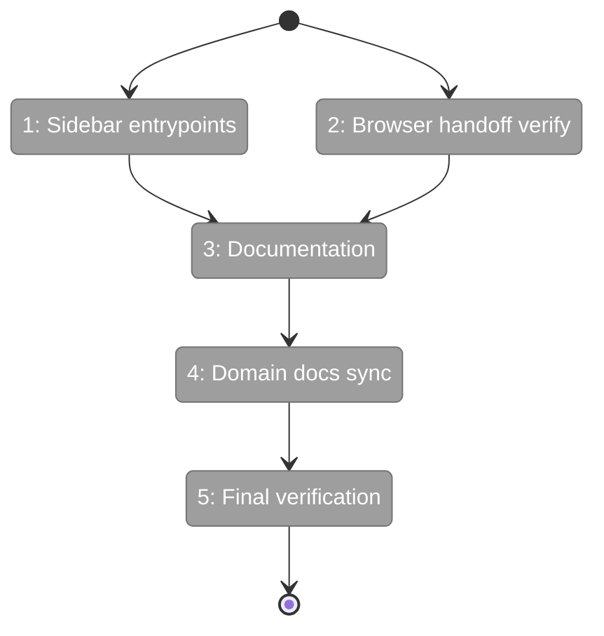

# Flight Plan: Phase 4 — Compose Navigation and Landing

**Plan**: [new-worktree-plan.md](../../new-worktree-plan.md)
**Phase**: Phase 4: Compose Navigation and Landing
**Generated**: 2026-03-09
**Status**: Ready for takeoff

---

## Departure → Destination

**Where we are**: The full create-worktree flow works end-to-end in the domain and web layers. But users can only reach it by typing the URL manually — no sidebar entrypoint, no documentation.

**Where we're going**: A user sees a `+` button next to "Worktrees" in the sidebar, clicks it, creates a worktree, and lands in the browser view. The docs explain how it works and what the bootstrap hook does.

---

## Flight Status

---

## Stages

- [ ] **Stage 1: Sidebar plus button** — Add plus icon next to "Worktrees" label in expanded sidebar only. No collapsed icon. No disabled state. (`dashboard-sidebar.tsx`)
- [ ] **Stage 2: Browser handoff** — Read-only verification that `browser/page.tsx` handles `?worktree=` correctly (no code changes)
- [ ] **Stage 3: Documentation** — Add "Creating a New Worktree" + detailed "Bootstrap Hook" authoring guide to `3-web-ui.md`; add pointer to `README.md`
- [ ] **Stage 4: Domain docs** — Phase 4 history row in workspace domain.md
- [ ] **Stage 5: Final verification** — Lint, test, commit and push

---

## Checklist

- [ ] T001: Sidebar plus button (expanded only, no collapsed icon)
- [ ] T002: Browser handoff verification (read-only)
- [ ] T003: Web-UI docs + bootstrap hook authoring guide + README
- [ ] T004: Workspace domain docs Phase 4 row
- [ ] T005: Final verification (lint, test, commit)
