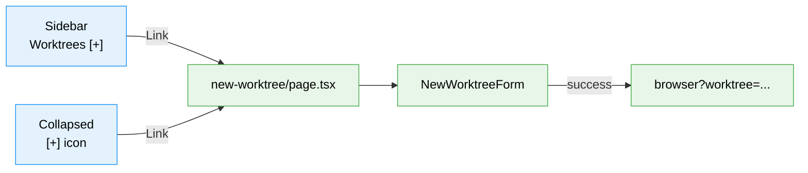

# Phase 4: Compose Navigation and Landing — Tasks Dossier

**Plan**: [new-worktree-plan.md](../../new-worktree-plan.md)
**Phase**: Phase 4: Compose Navigation and Landing
**Generated**: 2026-03-09
**Status**: Complete

---

## Executive Briefing

**Purpose**: Expose the create-worktree flow to users through always-available sidebar entrypoints, verify the browser handoff works end-to-end, and ship documentation. This is the composition phase — no new domain logic, just wiring the UI and docs.

**What We're Building**:
- Plus button next to "Worktrees" in the expanded sidebar
- Reachable action in the collapsed sidebar state
- Documentation of the new flow and bootstrap hook contract
- Final verification across all surfaces

**Non-Goals**:
- ❌ New domain logic (Phases 1-2 complete)
- ❌ New pages or server actions (Phase 3 complete)
- ❌ Workspace detail page button (out of v1 scope per clarification)

---

## Prior Phase Context

**Phase 3 delivered**:
- `/workspaces/[slug]/new-worktree` route (Server Component)
- `NewWorktreeForm` client component with 4 page states
- `createNewWorktree` server action with `CreateWorktreePageState` union
- Hard navigation on success via `window.location.assign()`

**Key finding from research**:
- `browser/page.tsx` already handles `?worktree=` query param correctly — **no code changes needed for the handoff** (task 4.2 is verification only)
- `dashboard-sidebar.tsx` has a "Worktrees" section label at line 164-169 with toggle chevron — the plus button goes next to it
- `workspace-nav.tsx` has collapsed state rendering at lines 128-144
- `docs/how/workspaces/3-web-ui.md` exists and needs a new section

---

## Decisions (from DYK review)

| # | Decision | Rationale |
|---|----------|-----------|
| D1 | No disable/hide of plus button when on `/new-worktree` page | Clicking it again just navigates to a fresh form. User's mistake, not worth special handling. |
| D2 | No separate collapsed-sidebar plus icon | Expanding the sidebar reveals the plus button. That IS the fallback. Keep it simple. |
| D3 | Bootstrap hook authoring guide is the key doc deliverable | Users need to know: where to put the hook, env vars, timeout, failure behavior, and a concrete example. The UI flow docs are secondary. |
| D4 | Integration testing follows Workshop 005 pattern | `mkdtemp` + `git init` + `execSync` + teardown worktrees before main repo. Fakes cover 90% — real git only for adapter verification. |

---

## Pre-Implementation Check

| File | Exists? | Action | Domain | Notes |
|------|---------|--------|--------|-------|
| `apps/web/src/components/dashboard-sidebar.tsx` | ✅ Yes (330 lines) | Extend | workspace | Add plus button next to "Worktrees" label (expanded only per D2) |
| `apps/web/app/(dashboard)/workspaces/[slug]/browser/page.tsx` | ✅ Yes (75 lines) | Verify only | file-browser | Already handles `?worktree=` — no code changes |
| `docs/how/workspaces/3-web-ui.md` | ✅ Yes | Extend | workspace | Add create-worktree flow + bootstrap hook authoring guide (D3) |
| `README.md` | ✅ Yes (293 lines) | Extend | workspace | Add web UI worktree creation pointer |
| `docs/domains/workspace/domain.md` | ✅ Yes | Extend | workspace | Phase 4 history row |
| `docs/c4/components/workspace.md` | ✅ Yes | Verify | workspace | Already has Phase 2 components — verify complete |

---

## Tasks

| Status | ID | Task | Domain | Path(s) | Done When | Notes |
|--------|-----|------|--------|---------|-----------|-------|
| [x] | T001 | Add plus button next to "Worktrees" in expanded sidebar only (no collapsed-state icon per D2) | workspace | `apps/web/src/components/dashboard-sidebar.tsx` | Plus icon button visible next to "Worktrees ▾" label in expanded sidebar, navigates to `/workspaces/[slug]/new-worktree` via `Link`. No special disabled state when on the page (per D1). No collapsed-sidebar icon (per D2). | Follow existing `Button variant="ghost" size="icon"` pattern with `h-7 w-7`. Use `Plus` from lucide-react. |
| [x] | T002 | Verify browser handoff — confirm `?worktree=` param lands correctly after creation | file-browser | `apps/web/app/(dashboard)/workspaces/[slug]/browser/page.tsx` | Verify (read-only): the browser route resolves the `worktree` search param, falls back to main path, and passes the correct path to file operations. No code changes expected — document verification in execution log. | Research confirmed browser page already handles `?worktree=` at line 48-50. |
| [x] | T003 | Update workspace web-ui docs with create-worktree flow AND detailed bootstrap hook authoring guide. Update README. | workspace | `docs/how/workspaces/3-web-ui.md`, `README.md` | `3-web-ui.md` gains: (a) "Creating a New Worktree" section covering sidebar entry point, full-page flow, naming convention, and main-only base branch. (b) "Bootstrap Hook" section covering hook file location, all env vars, 60s timeout, failure behavior, and a concrete example script (e.g., `pnpm install && cp .env.example .env`). `README.md` gains a pointer under existing Workspace Commands. | Per D3: bootstrap hook docs are the most valuable deliverable. Per hybrid documentation decision. |
| [x] | T004 | Update workspace domain docs with Phase 4 history row | workspace | `docs/domains/workspace/domain.md` | History table gains Plan 069 Phase 4 row. Verify Composition and C4 are current. | Keep in sync per domain rules. |
| [x] | T005 | Run final verification: lint, typecheck, tests, build, commit and push | workspace | — | `just lint`, `just typecheck`, `just test`, and `just build` all pass. All 069 artifacts committed. | Per acceptance criteria and project rules. |

---

## Context Brief

### Acceptance Criteria (from plan)

- [ ] The Worktrees plus action is available in both expanded and collapsed sidebar states while inside a workspace.
- [ ] Successful creation hard-navigates to `/workspaces/[slug]/browser?worktree=<new-path>` and the sidebar remounts with the new worktree visible.
- [ ] The shipped docs explain both the in-product flow and the repo-owned bootstrap hook.

### Key patterns

- Sidebar buttons: `Button variant="ghost" size="icon"` with `h-7 w-7`, using lucide-react icons
- Navigation: `<Link href={...}>` from `next/link` for the sidebar plus button
- The sidebar already knows the current workspace slug via URL detection
- Collapsed sidebar has a workspace header action cluster (lines 72-119 in dashboard-sidebar.tsx)

### System flow (Phase 4 scope — entry points only)

