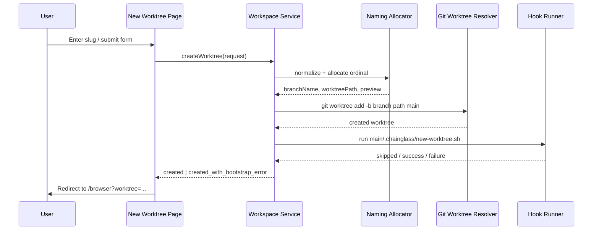
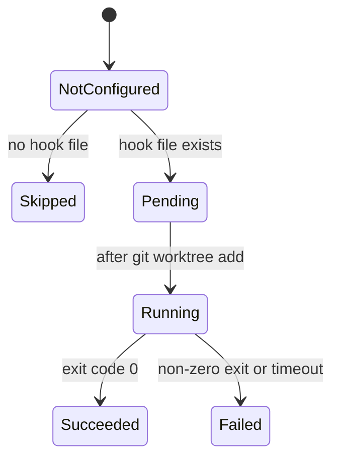

# Workshop: New Worktree Naming and Post-Create Hook

**Type**: Integration Pattern
**Plan**: 069-new-worktree
**Spec**: Pending — no spec file exists yet for this plan
**Created**: 2026-03-07T08:15:51.780Z
**Status**: Draft

**Related Documents**:
- [Research Dossier](../research-dossier.md)
- [File Browser Domain](../../../domains/file-browser/domain.md)
- [Workspace URL Domain](../../../domains/_platform/workspace-url/domain.md)

**Domain Context**:
- **Primary Domain**: Proposed `workspace` domain in `packages/workflow`
- **Related Domains**: `file-browser`, `_platform/workspace-url`, `_platform/auth`

---

## Purpose

This workshop settles the deterministic parts of new worktree creation before implementation: how the app derives the final `NNN-slug` name, and how the optional repo-owned bootstrap script is discovered, invoked, and reported.

It is meant to stay open during implementation of the create-worktree flow.

## Key Questions Addressed

- How do we reproduce the current `new-worktree.sh` naming behavior without calling that script?
- What input should the UI accept, and how is that transformed into branch name, worktree name, and filesystem path?
- What contract should `.chainglass/new-worktree.sh` receive, and when should it run?
- What happens when naming allocation collides or the post-create script fails?
- Which responsibilities stay in app core versus the repo-owned hook?

---

## Decision Summary

| Topic | Recommendation | Why |
|------|----------------|-----|
| User input | Slug-first UI, with optional advanced support for pasted `NNN-slug` | Keeps the happy path simple while staying compatible with the existing shell convention |
| Ordinal allocation | Port the `plan-ordinal.py` behavior in-repo | Removes environment coupling while preserving cross-branch collision avoidance |
| Final branch name | `NNN-normalized-slug` | Matches the existing repo convention |
| Worktree folder name | Same as branch name | Matches the existing sibling-worktree layout |
| Hook source | Always resolve from the main worktree: `<mainRepoPath>/.chainglass/new-worktree.sh` | Ensures one source of truth |
| Hook execution | Run with `bash`, `cwd = newWorktreePath`, structured environment variables | No executable-bit dependency, and relative script operations apply to the new checkout |
| Hook failure | Do **not** roll back the created worktree; surface logs and allow “Open anyway” | Safer than destructive rollback for potentially non-idempotent setup |
| Legacy copy/setup tasks | Move repo-specific setup into the hook instead of hard-coding it in app logic | Keeps app core generic and extensible |

---

## Overview

The create-worktree flow has four distinct stages:

1. **Normalize input** — turn user input into a stable slug candidate
2. **Allocate a name** — compute or validate the ordinal and derive branch/path
3. **Create the worktree** — run git from the main repo context
4. **Run repo bootstrap** — execute the optional `.chainglass/new-worktree.sh`

The first three stages belong in app core. The fourth stage is an extension point owned by the repository.

### Creation Sequence



---

## Part 1: Naming Algorithm

## Overview

The naming algorithm must preserve the current convention from `/Users/jordanknight/substrate/new-worktree.sh`:

- final branch name is `NNN-feature-slug`
- final worktree folder name matches the branch name
- if the user does **not** provide an ordinal, the system computes the next ordinal across local branches, remote branches, and plan folders

The app must reproduce this behavior in code rather than shelling out to the external script.

### Inputs and Outputs

| Item | Example | Notes |
|------|---------|-------|
| User input | `new-worktree` | Happy-path form value |
| Advanced input | `069-new-worktree` | Backward-compatible pasted full name |
| Normalized slug | `new-worktree` | Lowercase, hyphenated, no leading ordinal |
| Allocated ordinal | `069` | Zero-padded, derived from cross-branch scan unless explicitly provided |
| Branch name | `069-new-worktree` | Canonical git branch name |
| Worktree folder | `069-new-worktree` | Sibling directory next to main repo |
| Worktree path | `/Users/jordanknight/substrate/069-new-worktree` | Derived from main repo parent dir |

### Recommended UX Shape

Default UX should ask for the human part only: `Feature slug`.

- Input label: **New worktree name**
- Placeholder: `new-worktree`
- Preview block:
  - Ordinal: `069`
  - Branch: `069-new-worktree`
  - Path: `/path/to/069-new-worktree`

Advanced settings can allow:

- pasted `NNN-slug`
- manual override of the normalized slug
- visibility into how the ordinal was computed

The service layer should support both plain slugs and full `NNN-slug` input even if the first UI version only exposes the plain-slug path.

### Normalization Rules

1. Trim leading and trailing whitespace.
2. Accept either:
   - `slug`
   - `NNN-slug`
3. If input matches `^\d{3,}-`, split it into:
   - `providedOrdinal`
   - `slugPart`
4. Normalize `slugPart` to:
   - lowercase
   - hyphen-separated
   - collapse duplicate separators
   - trim leading/trailing hyphens
5. Reject empty results after normalization.
6. Final slug must match: `^[a-z0-9]+(?:-[a-z0-9]+)*$`

### Why this shape

- It preserves the current shell behavior.
- It avoids storing branch-specific formatting in the UI.
- It keeps the service contract flexible if the UI later gains advanced naming controls.

### Ordinal Sources

The in-repo allocator should preserve the same three signal sources as `plan-ordinal.py`.

| Source | How to scan | Why it matters |
|-------|-------------|----------------|
| Local branches | `git branch --format=%(refname:short)` or `git for-each-ref` | Catches local in-flight work not pushed yet |
| Remote branches | `git branch -a --format=%(refname:short)` or `git for-each-ref refs/remotes` | Prevents collisions with pushed work |
| Plan folders on branches | `git ls-tree --name-only <branch> docs/plans/` | Catches reserved ordinals from planning work |
| Branch names matching `NNN-*` | Regex on branch names | Preserves `plan-ordinal.py`’s extra branch-name safety net |

### Allocation Algorithm

#### Preview-time algorithm

Use current refs and current main repo location to generate a preview quickly.

```text
1. Parse requested input.
2. Normalize slugPart.
3. Resolve mainRepoPath from the selected workspace.
4. If providedOrdinal exists:
   a. Use it for preview.
5. Else:
   a. Scan known ordinals from local branches.
   b. Scan known ordinals from remote branches.
   c. Scan docs/plans/NNN-* folders on each branch via git ls-tree.
   d. Also parse ordinals from branch names matching ^NNN-.
   e. previewOrdinal = max(allOrdinals) + 1, zero-padded to at least 3 digits.
6. branchName = `${ordinal}-${normalizedSlug}`
7. worktreePath = join(dirname(mainRepoPath), branchName)
```

#### Submit-time algorithm

Preview is advisory. Final creation must re-check after refreshing refs.

```text
1. Re-parse and re-normalize input.
2. Refresh refs used by naming allocation.
3. Recompute the ordinal if the user did not provide one.
4. Rebuild branchName and worktreePath.
5. Fail if branchName already exists.
6. Fail if worktreePath already exists.
7. Proceed to git worktree creation.
```

### Recommended refresh policy

- **Preview**: use currently available refs
- **Create**: refresh refs before final allocation

This avoids a sluggish page while still making the final branch name collision-resistant.

### Contract Sketch

```ts
type NamingSource = 'computed' | 'provided';

interface WorktreeNamePreview {
  requestedInput: string;
  normalizedSlug: string;
  ordinal: string;
  ordinalSource: NamingSource;
  branchName: string;
  worktreeName: string;
  worktreePath: string;
}

interface CreateWorktreeRequest {
  workspaceSlug: string;
  requestedName: string;
}
```

### Collision Handling

Collisions can still happen if two creators allocate the same ordinal at nearly the same time.

Recommended behavior:

1. Detect branch/path collision during submit-time validation
2. Recompute once after a fresh ref refresh if ordinal was computed
3. If collision remains, return a structured naming conflict error
4. Show the newly computed suggestion in the response payload

Do **not** silently create `069-new-worktree-2` or any suffix-based fallback. The repo’s naming scheme is ordinal-first.

### Examples

#### Example A: Plain slug input

| Input | Known max ordinal | Result |
|------|-------------------|--------|
| `worktree-flow` | `068` | `069-worktree-flow` |

#### Example B: Pasted full branch name

| Input | Result |
|------|--------|
| `069-worktree-flow` | Use `069` as provided ordinal and `worktree-flow` as slug |

#### Example C: Messy user input

| Input | Normalized slug | Result |
|------|------------------|--------|
| `  New Worktree Flow  ` | `new-worktree-flow` | `069-new-worktree-flow` |

### Failure Modes

| Code | Meaning | Recommended UI message |
|------|---------|------------------------|
| `INVALID_WORKTREE_NAME` | Input could not be normalized into a valid slug | “Enter a name like `new-worktree-flow`.” |
| `ORDINAL_CONFLICT` | Final computed name already exists | “That name was just taken. Review the refreshed suggestion and try again.” |
| `WORKTREE_PATH_EXISTS` | Target directory already exists | “The target folder already exists. Choose a different name or remove the folder.” |
| `MAIN_REPO_NOT_FOUND` | Could not resolve the main worktree root | “Chainglass could not find the main repo for this workspace.” |

---

## Part 2: Post-Create Hook Concept

## Overview

The optional repo-owned script is the extension point for setup tasks that should happen **after** the worktree is created but **before** the UI redirects into it.

The key requirement is strict: always run the copy of the script that lives in the main worktree.

### Responsibilities Split

| Layer | Owns |
|------|------|
| App core | Detect hook, decide whether it runs, pass structured context, capture logs, report status |
| Repo-owned hook | Copy files, seed config, run lightweight repo-specific setup |

### Recommended Hook Location

```text
<mainRepoPath>/.chainglass/new-worktree.sh
```

Rules:

1. Resolve the path from the main repo, not the new worktree.
2. If the file does not exist, creation continues with `bootstrapStatus = "skipped"`.
3. If the file exists, run it with `bash` even if executable bits are absent.
4. Set `cwd` to the **new worktree path** so relative operations target the new checkout.

### Why this design

- The script source stays stable and reviewable in `main`.
- The script can still act on the new worktree naturally through `cwd`.
- The app remains generic; repo-specific behavior lives in the repo.

### Hook Execution State



### Hook Contract

The hook should receive environment variables rather than positional arguments. This is easier to extend without breaking older scripts.

| Variable | Example | Meaning |
|---------|---------|---------|
| `CHAINGLASS_MAIN_REPO_PATH` | `/Users/jordanknight/substrate/chainglass` | Resolved main repo root |
| `CHAINGLASS_MAIN_BRANCH` | `main` | Source branch for creation |
| `CHAINGLASS_WORKSPACE_SLUG` | `chainglass` | Workspace slug selected in the app |
| `CHAINGLASS_REQUESTED_NAME` | `worktree-flow` | Raw user input |
| `CHAINGLASS_NORMALIZED_SLUG` | `worktree-flow` | Slug after normalization |
| `CHAINGLASS_NEW_WORKTREE_ORDINAL` | `069` | Final ordinal |
| `CHAINGLASS_NEW_BRANCH_NAME` | `069-worktree-flow` | Final branch name |
| `CHAINGLASS_NEW_WORKTREE_NAME` | `069-worktree-flow` | Final worktree folder name |
| `CHAINGLASS_NEW_WORKTREE_PATH` | `/Users/.../069-worktree-flow` | Full path to created worktree |
| `CHAINGLASS_TRIGGER` | `chainglass-web` | Helps scripts branch behavior later if needed |

### Hook Runner Pseudocode

```text
1. hookPath = join(mainRepoPath, ".chainglass", "new-worktree.sh")
2. If hookPath does not exist:
   return skipped
3. Resolve realpath(hookPath)
4. Validate resolved hook stays inside realpath(join(mainRepoPath, ".chainglass"))
5. Run:
   command = ["bash", hookPath]
   cwd = newWorktreePath
   env += hook context
6. Capture stdout/stderr
7. If exitCode == 0:
   return succeeded
8. Else:
   return failed with logs
```

### Example Hook

```bash
#!/usr/bin/env bash
set -euo pipefail

echo "Bootstrapping ${CHAINGLASS_NEW_BRANCH_NAME}"
echo "Main repo: ${CHAINGLASS_MAIN_REPO_PATH}"
echo "New worktree: ${CHAINGLASS_NEW_WORKTREE_PATH}"

if [ -d "${CHAINGLASS_MAIN_REPO_PATH}/.fs2" ]; then
  mkdir -p "${CHAINGLASS_NEW_WORKTREE_PATH}/.fs2"
  cp -R "${CHAINGLASS_MAIN_REPO_PATH}/.fs2/." "${CHAINGLASS_NEW_WORKTREE_PATH}/.fs2/"
fi

if [ -f "${CHAINGLASS_MAIN_REPO_PATH}/apps/web/.env.local" ]; then
  mkdir -p "${CHAINGLASS_NEW_WORKTREE_PATH}/apps/web"
  cp "${CHAINGLASS_MAIN_REPO_PATH}/apps/web/.env.local" \
    "${CHAINGLASS_NEW_WORKTREE_PATH}/apps/web/.env.local"
fi
```

This example intentionally mirrors the current legacy shell behavior, but now the repo owns it.

### Failure Policy

If the hook fails:

1. Keep the worktree and branch intact
2. Return `status = "created_with_bootstrap_error"`
3. Persist the last chunk of stdout/stderr in the action response
4. Show:
   - worktree path
   - branch name
   - failure summary
   - “Open worktree anyway” action

Do **not** auto-delete the new worktree. Hook scripts may perform partial side effects, and rollback would be riskier than surfacing the failure.

### Timeout and Scope

This hook should remain a **lightweight bootstrap step**, not a full environment provisioning pipeline.

Recommended initial guardrails:

- timeout: 60 seconds
- capture: last 200 lines of combined stdout/stderr
- no interactive prompts
- no background daemons started by the web request

If future setup grows heavier than this, it should move to an asynchronous job or tmux-driven automation rather than extending the synchronous creation path indefinitely.

### Security Rules

1. Only resolve the hook from the main repo path.
2. Validate the resolved real path stays within `<mainRepoPath>/.chainglass/`.
3. Run the script via `bash`, not via shell interpolation.
4. Pass structured environment variables only.
5. Surface stderr to the user; do not swallow failures.

---

## Recommended Domain Result Shape

```ts
type BootstrapStatus = 'skipped' | 'succeeded' | 'failed';

interface CreateWorktreeResult {
  branchName: string;
  worktreePath: string;
  bootstrapStatus: BootstrapStatus;
  bootstrapLogTail?: string[];
}
```

This result shape is enough for:

- success redirect
- sidebar refresh
- warning banners when bootstrap fails
- future “retry bootstrap” actions if needed

The web layer should derive the redirect URL separately via `workspaceHref()`. The workspace domain should return raw branch/path/bootstrap data, not app-specific URLs.

---

## Implementation Notes for Architect Phase

### Keep in app core

- input normalization
- ordinal scanning and collision handling
- final branch/path derivation
- hook discovery rules
- hook execution policy and reporting
- redirect URL generation via `workspaceHref()`

### Keep out of app core

- `.fs2` copy logic
- `.env.local` copy logic
- tmux session startup
- any repo-specific setup that may change over time

Those belong in `.chainglass/new-worktree.sh`.

---

## Open Questions

### Q1: Should v1 expose manual ordinal override in the UI?

**RESOLVED**: Default UI should stay slug-first. Service support for pasted `NNN-slug` is enough for v1.

### Q2: Should hook failure roll back the created worktree?

**RESOLVED**: No. Preserve the worktree and surface a bootstrap error state.

### Q3: Should the app keep hard-coded copies of `.fs2` and `apps/web/.env.local`?

**RESOLVED**: No. Put repo-specific bootstrap in the hook.

### Q4: What exactly does “main is fully pulled” mean in the final implementation?

**OPEN**: The architecture phase should decide between:

- fast-forwarding the local `main` checkout before creation
- fetching remote refs and branching from the refreshed main ref without mutating the local checkout

This workshop assumes the allocator sees refreshed refs at submit time, but it does not lock the final sync strategy.

---

## Quick Reference

### Naming

```text
requested input -> normalized slug -> allocated ordinal -> branch name -> sibling worktree path
```

### Final name formula

```text
branchName = `${ordinal}-${normalizedSlug}`
worktreeName = branchName
worktreePath = join(dirname(mainRepoPath), worktreeName)
```

### Hook

```text
source: <mainRepoPath>/.chainglass/new-worktree.sh
runner: bash
cwd: newWorktreePath
on missing: skip
on failure: keep worktree, show warning, allow open anyway
```

### Implementation checklist

1. Build an in-repo ordinal allocator that mirrors `plan-ordinal.py`
2. Add preview and submit-time recomputation
3. Add structured collision errors
4. Add hook discovery from main repo
5. Add structured hook execution result
6. Redirect to `/browser?worktree=...`

---

## Recommendation to Carry Forward

Treat “naming” and “bootstrap” as two explicit subcontracts of a single `createWorktree()` service call:

- **Naming contract**: deterministic, collision-aware, repo-convention preserving
- **Bootstrap contract**: optional, repo-owned, main-sourced, non-destructive on failure

That split keeps the implementation clean and gives the repo a durable extension point without baking local setup behavior into Chainglass itself.
