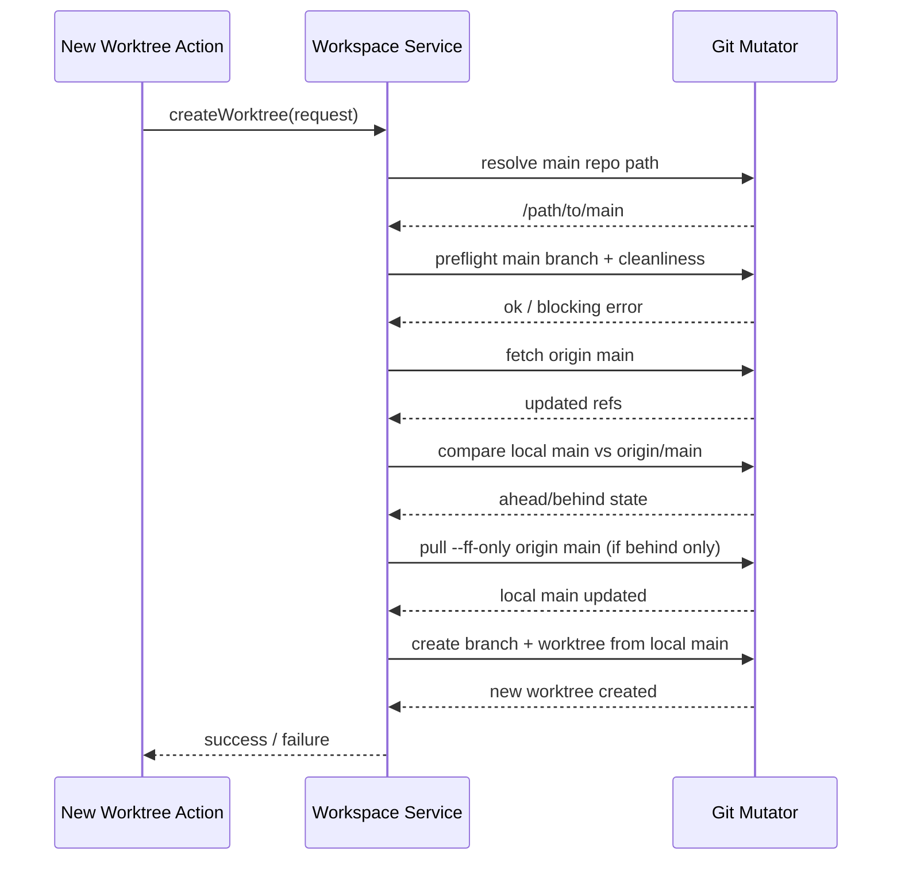
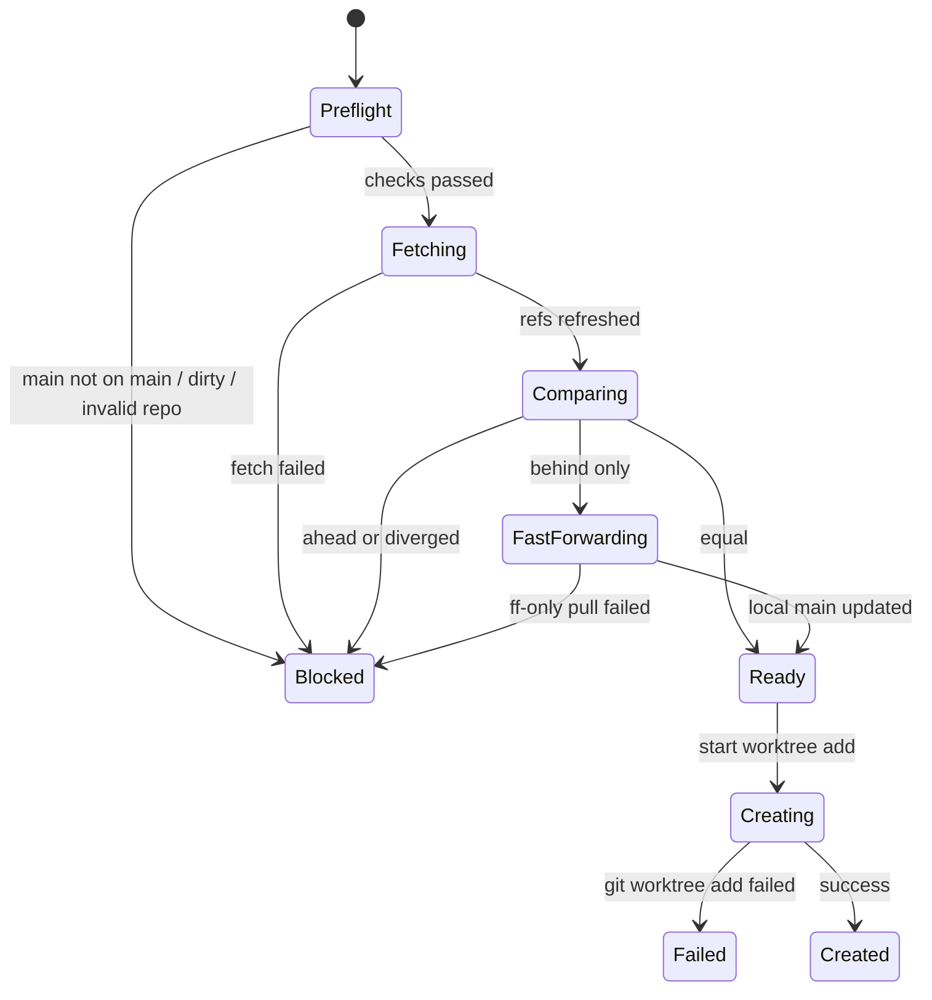

# Workshop: Main Sync Strategy and Git Safety

**Type**: Integration Pattern
**Plan**: 069-new-worktree
**Spec**: Pending — no spec file exists yet for this plan
**Created**: 2026-03-07T08:27:39.348Z
**Status**: Draft

**Related Documents**:
- [Research Dossier](../research-dossier.md)
- [001-new-worktree-naming-and-post-create-hook.md](./001-new-worktree-naming-and-post-create-hook.md)
- [Workspace URL Domain](../../../domains/_platform/workspace-url/domain.md)

**Domain Context**:
- **Primary Domain**: Proposed `workspace` domain in `packages/workflow`
- **Related Domains**: `_platform/auth`, `_platform/workspace-url`, `file-browser`

---

## Purpose

This workshop defines what it means to “go back to main, make sure that is fully pulled, and then create the branch from that” before a new worktree is created.

It settles the safety contract for mutating git state so implementation can be strict, predictable, and debuggable.

## Key Questions Addressed

- What is the authoritative source for new worktree creation: local `main`, `origin/main`, or the current worktree?
- What exact checks happen before we mutate git state?
- When do we fetch, fast-forward, and create the worktree?
- What should block creation versus warn and continue?
- How do we avoid creating a new worktree from a stale or locally diverged `main`?

---

## Decision Summary

| Topic | Recommendation | Why |
|------|----------------|-----|
| Authority checkout | Use the **main worktree root** resolved from the workspace | The user explicitly wants the flow to go back to main |
| Authority branch | Require the main worktree root to be checked out to local `main` | The hook source and branch base should both come from the same local authority |
| Remote baseline | `origin/main` | Matches the current repo convention and user language |
| Sync strategy | `fetch origin main` then fast-forward local `main` with `pull --ff-only origin main` when behind | Keeps local main current without allowing merge commits |
| Dirty-tree policy | Block on tracked staged/unstaged changes in the main worktree | Avoids mutating a checkout with local work in progress |
| Ahead/diverged policy | Block if local `main` is ahead of or diverged from `origin/main` | Prevents creating feature branches from unpublished local commits |
| Creation base | Create the new branch/worktree from the refreshed local `main` | Preserves the “go back to main” requirement and keeps hook source aligned |
| Sync failure behavior | Do not create a branch or worktree if sync/preflight fails | Git mutations should be all-or-nothing before creation starts |
| Concurrency | Serialize create-worktree operations per workspace/main repo path | Two concurrent creates should not race on `main` updates or ordinal allocation |

---

## Overview

The new worktree flow is not just a branch-creation helper. It is a **controlled mutation** of the local main checkout followed by a new worktree add.

That means the flow must answer two separate questions before it can create anything:

1. **Is local main safe to touch?**
2. **Is local main current enough to serve as the source of truth?**

This workshop recommends a strict answer:

- the app should mutate local `main` only when it is clean and on the `main` branch
- the app should refuse to create from a stale, ahead, or diverged `main`
- once those checks pass, the app should fast-forward local `main` and branch from that exact checkout

### Why not branch directly from `origin/main`?

That would avoid mutating local `main`, but it breaks two important parts of the requested behavior:

1. the user explicitly described the flow as “go back to main” and “make sure that is fully pulled”
2. Workshop 001 requires the post-create hook to come from the version of the script that sits in the main worktree

If we branch from `origin/main` while leaving local `main` stale, the hook source and branch base could drift apart.

---

## Recommended Creation Contract

### High-Level Rule

**Create only from a clean, local `main` that has been compared to and, if needed, fast-forwarded from `origin/main`.**

### Operation Sequence



---

## Preflight Checks

These checks happen **before** any creation-side git mutation.

| Check | Command Shape | Block? | Rationale |
|------|---------------|--------|-----------|
| Resolve main repo root | `git -C <path> rev-parse --show-toplevel` | Yes | All follow-up commands must run from the real main repo root |
| Ensure local branch is `main` | `git -C <mainRepoPath> rev-parse --abbrev-ref HEAD` | Yes | The user asked to go back to main, not to whatever branch happens to be in the main checkout |
| Ensure no tracked local changes | `git -C <mainRepoPath> status --porcelain=v1 --untracked-files=no` | Yes | Fast-forwarding or hook lookup should not run on top of local in-progress edits |
| Ensure no in-progress git operation | git plumbing / repo state checks | Yes | Merge/rebase/cherry-pick state makes sync unsafe |
| Ensure `origin/main` can be fetched | `git -C <mainRepoPath> fetch origin main --prune` | Yes | The “fully pulled” requirement implies a fresh remote view |
| Compare `main` vs `origin/main` | `git -C <mainRepoPath> rev-list --left-right --count main...origin/main` | Yes, if ahead or diverged | We must not create from unpublished or mixed histories |

### Why tracked changes block, but untracked files do not

Tracked staged/unstaged changes mean local `main` is already a work-in-progress checkout.

Untracked files are less dangerous:

- they do not alter the commit history used for branching
- they do not necessarily block a fast-forward
- git itself will still fail if a pull would overwrite them

So the preflight should ignore untracked files, but surface git’s native error if they become a real conflict.

---

## Sync Decision Matrix

After `fetch origin main`, compare local `main` to `origin/main`.

| Local main state | Meaning | Action |
|------------------|---------|--------|
| Equal | Already current | Continue |
| Behind only | Remote has new commits, local main is clean | Run `pull --ff-only origin main`, then continue |
| Ahead only | Local main contains unpublished commits | Block creation |
| Diverged | Both local and remote have unique commits | Block creation |

### Why ahead/diverged must block

If local `main` is ahead, then creating `069-something` from it would silently include unpublished local commits.

That breaks the user’s expectation that the new worktree starts from canonical main. Blocking is better than creating surprising ancestry.

---

## Concrete Command Sequence

The git mutator should effectively implement this flow:

```bash
# 1. Resolve authority checkout
git -C "$candidatePath" rev-parse --show-toplevel

# 2. Confirm local main checkout state
git -C "$mainRepoPath" rev-parse --abbrev-ref HEAD
git -C "$mainRepoPath" status --porcelain=v1 --untracked-files=no

# 3. Refresh remote refs
git -C "$mainRepoPath" fetch origin main --prune

# 4. Compare local main with origin/main
git -C "$mainRepoPath" rev-list --left-right --count main...origin/main

# 5. Fast-forward local main only when behind
git -C "$mainRepoPath" pull --ff-only origin main

# 6. Create new branch/worktree from refreshed local main
git -C "$mainRepoPath" worktree add -b "$branchName" "$worktreePath" main
```

### Notes

- Step 5 should run only when local `main` is behind.
- Step 6 should happen only after naming allocation has been finalized and collision checks have passed.
- Hook execution happens **after** step 6 and is covered by Workshop 001.

---

## State Machine



---

## Error Codes and Recovery

| Code | Meaning | User Action |
|------|---------|-------------|
| `MAIN_REPO_NOT_FOUND` | Could not resolve the main repo root | Verify the selected workspace is a git repo |
| `MAIN_NOT_ON_MAIN_BRANCH` | Main checkout is not on branch `main` | Switch the main checkout back to `main` |
| `MAIN_HAS_LOCAL_CHANGES` | Tracked changes exist in main checkout | Commit, stash outside the app, or discard them manually |
| `MAIN_GIT_OPERATION_IN_PROGRESS` | Merge/rebase/cherry-pick state detected | Finish or abort the in-progress git operation |
| `MAIN_FETCH_FAILED` | `git fetch origin main` failed | Check network/auth/remote configuration |
| `MAIN_DIVERGED_FROM_ORIGIN` | Local `main` is ahead of or diverged from `origin/main` | Reconcile local main manually before creating |
| `MAIN_FAST_FORWARD_FAILED` | `pull --ff-only` failed | Resolve why local main cannot be fast-forwarded |
| `WORKTREE_CREATE_FAILED` | `git worktree add` failed | Review stderr and retry after fixing the git issue |

### Blocking vs Non-Blocking

All sync/preflight errors are **blocking**. No branch or worktree should be created if any of them occur.

This keeps creation failure modes easy to understand:

- either we never started creating
- or worktree creation itself failed

The only non-blocking post-create problem is the bootstrap hook failure from Workshop 001.

---

## Concurrency Guard

Because the flow may update local `main`, it should not run twice at the same time for the same workspace.

### Recommendation

Use a workspace-scoped create lock keyed by `mainRepoPath`.

For v1, a process-local mutex is sufficient because Chainglass is running as a local app in a single dev environment.

### Lock Scope

The lock should cover:

1. main preflight
2. fetch / compare / fast-forward
3. final naming allocation
4. `git worktree add`

That prevents two requests from:

- both selecting the same next ordinal
- both trying to fast-forward local `main`
- both creating the same branch/path

---

## What the UI Should Say

The create page should use user-facing copy that matches these safety rules.

### Pending copy

```text
Preparing main…
Fetching latest changes from origin/main…
Creating new worktree…
```

### Blocking error copy examples

```text
Your main checkout has local tracked changes.
Clean up the main worktree, then try again.
```

```text
Your local main branch has diverged from origin/main.
Chainglass will not create a new worktree from a non-canonical main.
```

---

## Implementation Notes for Architect Phase

### Recommended ownership

- **Workspace service**
  - orchestrates sync policy
  - interprets ahead/behind/diverged state
  - maps git failures into domain-specific errors

- **Git mutation adapter**
  - executes the actual commands
  - returns structured results, not UI strings

- **Web action/page**
  - converts structured errors into user-facing messages

### Tests that should exist

1. clean + up-to-date main → creation proceeds
2. clean + behind main → fast-forward then create
3. dirty main → blocked before fetch
4. ahead main → blocked
5. diverged main → blocked
6. fetch failure → blocked
7. ff-only pull failure → blocked
8. worktree add failure → creation failure after sync

---

## Open Questions

### Q1: Should “origin” be configurable in v1?

**RESOLVED**: No. Use `origin/main` in v1 because the requirement, scripts, and repo convention all assume it.

### Q2: Should the app try to auto-fix a main checkout that is not on `main`?

**RESOLVED**: No. The app should block and explain the problem instead of silently changing the user’s main checkout branch.

### Q3: Should the app allow creating from `origin/main` when local `main` is ahead/diverged?

**RESOLVED**: No. That would make the hook source and branch source disagree, and it would violate the “go back to main” requirement.

### Q4: Should we block on untracked files in the main checkout?

**RESOLVED**: No. Ignore untracked files in the preflight, but surface any real git conflict if `pull --ff-only` refuses to proceed.

---

## Quick Reference

### Recommended rule

```text
clean local main + fetch origin/main + fast-forward if behind + create from local main
```

### Block when

- main repo root cannot be resolved
- main checkout is not on branch `main`
- tracked local changes exist in main
- a merge/rebase/cherry-pick is in progress
- local main is ahead of or diverged from origin/main
- fetch or ff-only pull fails

### Create when

- local main is clean
- local main is equal to or safely fast-forwarded from origin/main
- name/path collisions have been cleared

---

## Recommendation to Carry Forward

Treat “fully pulled main” as a strict, local-main safety contract, not a vague freshness hint.

That gives implementation one clear path:

1. validate local main
2. fetch `origin/main`
3. fast-forward local main if needed
4. create the new worktree from refreshed local main

Anything less will produce surprising ancestry, stale hook execution, or unsafe checkout mutation.
