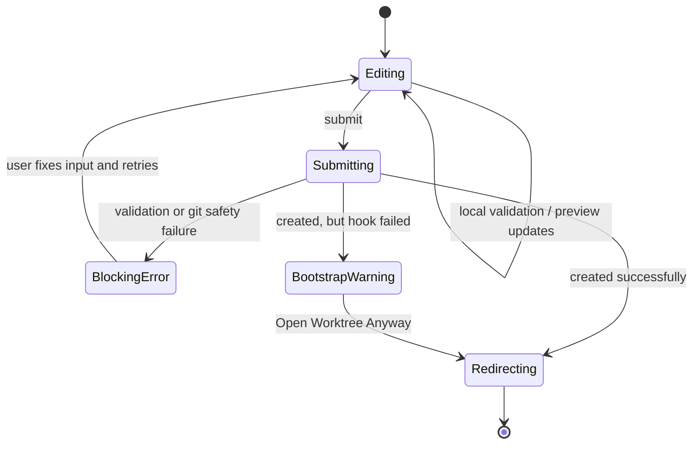

# Workshop: Create Flow UX and Recovery States

**Type**: State Machine / Integration Pattern
**Plan**: 069-new-worktree
**Spec**: Pending — no spec file exists yet for this plan
**Created**: 2026-03-07T08:27:39.348Z
**Status**: Draft

**Related Documents**:
- [Research Dossier](../research-dossier.md)
- [001-new-worktree-naming-and-post-create-hook.md](./001-new-worktree-naming-and-post-create-hook.md)
- [002-main-sync-strategy-and-git-safety.md](./002-main-sync-strategy-and-git-safety.md)

**Domain Context**:
- **Primary Domain**: `apps/web` as the web adapter for the proposed `workspace` domain
- **Related Domains**: `file-browser`, `_platform/workspace-url`, `_platform/auth`

---

## Purpose

This workshop defines the end-user flow for creating a new worktree: where the entry point lives, what the full-page form shows, what pending and error states look like, and how the app lands the user inside the new worktree.

It turns the earlier research into a practical UI contract the implementation can follow without improvising mid-build.

## Key Questions Addressed

- Where does the “new worktree” entry point live in expanded and collapsed sidebar states?
- What should the full-page route show before submission?
- How does the UI handle create success, blocking failures, and bootstrap warnings?
- How do we guarantee the sidebar reflects the new worktree after creation?
- Which states should be inline validation, blocking banners, or non-blocking warnings?

---

## Decision Summary

| Topic | Recommendation | Why |
|------|----------------|-----|
| Primary entry point | Inline plus button next to **Worktrees** in the workspace sidebar | Matches the user request exactly |
| Collapsed-sidebar behavior | Show a tooltip-labeled “New worktree” icon button in the workspace header actions | Keeps the action available even when the label row is hidden |
| Secondary entry point | Add a page-level “New Worktree” button on `/workspaces/[slug]` | Gives users a discoverable fallback outside the sidebar |
| Route | `/workspaces/[slug]/new-worktree` | Clean full-page route, avoids the deprecated `/worktree` landing shim |
| Form style | Full-page `useActionState` form patterned after `WorkspaceAddForm` | Matches existing mutation conventions |
| Preview strategy | Best-effort preview card with current ordinal estimate and final path | Users need to understand what will be created before submission |
| Pending UX | Single blocking progress panel with static steps, not live streamed step transitions | Server Actions do not naturally stream fine-grained progress updates |
| Success navigation | Hard navigate to `/workspaces/[slug]/browser?worktree=<path>` | Forces sidebar remount/refetch because `WorkspaceNav` only fetches on mount |
| Hook failure UX | Stay on the page, show warning details, and offer **Open Worktree Anyway** | Hook failure is non-blocking after creation succeeds |
| Retry model | Blocking errors keep the user on the form with preserved input | Fits the existing `ActionState` pattern |

---

## Overview

The create flow is a **full page**, not a modal and not a popover.

That matters because the flow needs room for:

- name input
- generated preview
- advanced settings / diagnostics
- sync and bootstrap expectations
- error recovery when git safety checks fail

### Primary Navigation Path

```text
Sidebar Worktrees + button
  -> /workspaces/[slug]/new-worktree
  -> submit create action
  -> success: /workspaces/[slug]/browser?worktree=<newPath>
```

---

## Entry Points

### 1. Sidebar: Expanded state

Inside `DashboardSidebar`, the Worktrees group label becomes a two-part row:

```text
Worktrees                        [+]
```

Behavior:

- clicking **Worktrees** still toggles open/closed
- clicking **+** navigates to `/workspaces/[slug]/new-worktree`
- the plus button is visible whenever the user is inside a workspace

### 2. Sidebar: Collapsed state

When the sidebar is collapsed, there is no visible “Worktrees” label.

Recommendation:

- add a `Plus` icon button to the workspace header action cluster
- tooltip / aria label: `New worktree`

This preserves the “available at all times” requirement without inventing a second hidden navigation concept.

### 3. Workspace detail page

Add a secondary `New Worktree` button to the header or Worktrees card on `/workspaces/[slug]`.

This is not the primary entry point, but it is useful for:

- discoverability
- mobile / narrow layouts
- workflows where the sidebar is closed

---

## Full-Page Route Design

### Recommended route

```text
/workspaces/[slug]/new-worktree
```

### Why this route

- it is clearly a page-level creation flow
- it sits beside other workspace pages
- it avoids reusing the deprecated `/worktree` landing route
- it maps naturally to the sidebar entry point

### Page shell

- Server Component page
- `export const dynamic = 'force-dynamic'`
- async `params` pattern, matching the rest of the workspace route family

---

## Page Layout

```text
┌────────────────────────────────────────────────────────────────────┐
│ Back to Workspace                                                 │
│                                                                    │
│ New Worktree                                                       │
│ Create a new branch + git worktree from main for this workspace.  │
│                                                                    │
│ ┌──────────────────────────────────────────────────────────────┐   │
│ │ Name                                                        │   │
│ │ [ new-worktree-flow                               ]          │   │
│ │ Enter the feature name. Chainglass adds the ordinal.        │   │
│ └──────────────────────────────────────────────────────────────┘   │
│                                                                    │
│ ┌──────────────── Preview ────────────────────────────────────┐   │
│ │ Ordinal:   069                                              │   │
│ │ Branch:    069-new-worktree-flow                            │   │
│ │ Path:      /Users/.../069-new-worktree-flow                 │   │
│ │ Source:    main -> origin/main checked + refreshed          │   │
│ └──────────────────────────────────────────────────────────────┘   │
│                                                                    │
│ ▸ Advanced settings                                                │
│   - pasted NNN-slug support                                        │
│   - main repo path                                                 │
│   - hook detected / not detected                                   │
│                                                                    │
│ [Cancel]                                     [Create Worktree]     │
└────────────────────────────────────────────────────────────────────┘
```

### Page sections

| Section | Purpose |
|--------|---------|
| Header | Back link, title, short description |
| Name field | User enters slug or pasted `NNN-slug` |
| Preview card | Shows best-effort ordinal, branch, and path |
| Advanced settings | Technical details and future settings surface |
| Action row | Cancel + Create |
| Result region | Banners/cards for blocking errors or bootstrap warnings |

---

## Preview Behavior

Workshop 001 already defines the naming algorithm. The UX layer only needs to expose it clearly.

### Recommendation

Use a **best-effort preview**, not a guaranteed reservation.

#### On initial render

The page loads:

- workspace name / slug
- current best next ordinal
- whether a bootstrap hook is detected in main
- the resolved main repo path

#### As the user types

- normalized slug updates immediately in the preview
- ordinal stays on the best-known current value
- helper text explains that the final name is revalidated on submit

### Why not reserve the ordinal on page load

- it would create stale reservations if the user abandons the page
- it adds state management we do not currently have
- submit-time recomputation is already required for correctness

---

## Pending State

The create action may do several things:

- validate input
- sync main
- allocate final name
- run `git worktree add`
- run optional bootstrap hook

That can take noticeable time, but Server Actions do not give us a simple live progress stream.

### Recommendation

Use a **single blocking pending card** with static stages:

```text
Creating worktree…

This may take up to a minute if main needs to sync or bootstrap runs.

Steps:
  1. Validate input
  2. Prepare main
  3. Allocate final name
  4. Create worktree
  5. Run bootstrap
```

### Pending behavior

- disable all form inputs
- disable the sidebar plus button when already on the page
- keep the page in place; do not navigate until the action resolves

---

## Result State Machine



---

## Action Result Shapes

The page can keep the existing `useActionState` pattern, but it needs richer outcomes than the current generic `ActionState`.

### Recommended web-layer result union

```ts
type CreateWorktreePageState =
  | {
      kind: 'idle';
      fields?: { requestedName?: string };
      preview?: WorktreeNamePreview;
    }
  | {
      kind: 'blocking_error';
      code: string;
      message: string;
      fields: { requestedName: string };
      preview?: WorktreeNamePreview;
      logTail?: string[];
    }
  | {
      kind: 'created';
      branchName: string;
      worktreePath: string;
      redirectTo: string;
    }
  | {
      kind: 'created_with_bootstrap_error';
      branchName: string;
      worktreePath: string;
      redirectTo: string;
      bootstrapLogTail: string[];
    };
```

### Why this shape

- `blocking_error` preserves input and any refreshed preview
- `created` can immediately navigate away
- `created_with_bootstrap_error` supports the required “Open anyway” path

---

## Error Presentation Rules

| Error Category | UI Shape | Example |
|---------------|----------|---------|
| Invalid input | Inline field error | “Enter a name like `new-worktree-flow`.” |
| Naming conflict | Inline + preview refresh | “That name was just taken. Review the updated preview.” |
| Main sync safety error | Blocking banner/card | “Your main checkout has local changes.” |
| Worktree create failure | Blocking error card with stderr tail | “Git could not create the new worktree.” |
| Hook failure | Warning card with explicit continue action | “The worktree exists, but bootstrap failed.” |

### Blocking error card

```text
We couldn’t create the worktree.

Reason
Your local main branch has diverged from origin/main.

What to do
Reconcile the main checkout manually, then retry.
```

### Bootstrap warning card

```text
Worktree created, but bootstrap failed.

Branch: 069-new-worktree-flow
Path:   /Users/.../069-new-worktree-flow

Last output:
  cp: cannot stat ...
  ...

[Open Worktree Anyway]
[Stay Here]
```

---

## Success Navigation

### Recommended landing page

```text
/workspaces/[slug]/browser?worktree=<newWorktreePath>
```

Why:

- the browser page is the most mature worktree-aware surface today
- the old `/worktree` page is already redirect-only
- it immediately places the user in a useful, clearly scoped workspace

### Recommended navigation method

Use a **hard navigation** once the action returns `created`.

Example:

```ts
window.location.assign(redirectTo);
```

### Why hard navigation instead of client router push

`WorkspaceNav` currently loads `/api/workspaces?include=worktrees` once on mount and stores it in client state.

A hard navigation guarantees:

- sidebar remount
- fresh workspace/worktree fetch
- fresh workspace context in the layout

This is the simplest way to avoid landing in the new worktree while the sidebar still shows the old list.

---

## Sidebar Refresh Implications

This page design deliberately compensates for current sidebar behavior.

### Current limitation

`WorkspaceNav`:

- fetches once in `useEffect`
- does not refetch automatically after creation

### UX decision

Do not rely on subtle client cache invalidation for v1.

Instead:

- navigate away only after the action resolves
- use hard navigation on success

If implementation later upgrades `WorkspaceNav` to a refreshable data source, this page can switch to client navigation.

---

## Advanced Settings Panel

V1 should keep advanced settings minimal, but it should still reserve space for technical transparency.

### Recommended initial contents

| Field | Purpose |
|------|---------|
| Resolved main repo path | Reassures the user which checkout is authoritative |
| Hook detected | Shows whether `.chainglass/new-worktree.sh` will run |
| Manual name entry note | Explains that pasted `NNN-slug` is accepted |

### Not in v1

- manual ordinal override UI
- toggle to skip bootstrap
- alternate base branch
- tmux/session startup controls

Those can be added later without redesigning the page.

---

## Cancel and Back Behavior

### Cancel

- returns to `/workspaces/[slug]`
- does not preserve draft state across navigation in v1

### Browser back button

- returns to the previous workspace page
- safe because the page has no side effects until submit

### After bootstrap warning

If the user chooses **Stay Here**, keep the warning card visible and allow them to copy the path/logs before navigating manually.

---

## Implementation Notes for Architect Phase

### Web layer responsibilities

- route definition
- page data loading
- `useActionState` form
- preview rendering
- pending / error / warning UI
- final redirect

### Domain result the page needs

The page should receive enough data to render:

- final branch name
- final worktree path
- bootstrap status
- optional log tail

The web layer can then derive `redirectTo` using `_platform/workspace-url`.

---

## Open Questions

### Q1: Should the page show a live server-backed preview as the user types?

**RESOLVED**: No for v1. Use best-effort preview with submit-time recomputation.

### Q2: Should bootstrap warnings auto-redirect after a timeout?

**RESOLVED**: No. The user should explicitly choose **Open Worktree Anyway**.

### Q3: Should the sidebar plus button be visible outside a workspace?

**RESOLVED**: No. This feature creates a new worktree for a specific workspace, so the primary entry point appears only when a workspace is active.

### Q4: Should the action redirect directly on success from the server?

**RESOLVED**: No. The page needs a separate non-blocking warning state for bootstrap failures, so the client should decide when navigation happens.

---

## Quick Reference

### Primary UX path

```text
Sidebar + button -> /workspaces/[slug]/new-worktree -> submit -> browser?worktree=<path>
```

### Blocking states

- invalid name
- naming conflict
- main sync failure
- git creation failure

### Non-blocking state

- bootstrap failed after worktree creation

### Navigation rule

```text
Success = hard navigate
Bootstrap warning = stay, then explicit "Open Worktree Anyway"
```

---

## Recommendation to Carry Forward

Treat this flow as a page-level creation experience with an explicit recovery model, not a tiny sidebar action.

That gives users enough room to understand:

- what will be created
- what main sync rules apply
- why creation failed
- when the worktree already exists but bootstrap needs attention
