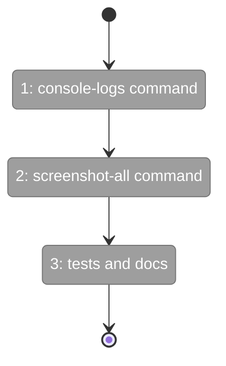

# Flight Plan: Fix FX002 — Smoke-test retrospective CLI improvements

**Fix**: [FX002-smoke-test-retrospective-cli-improvements.md](FX002-smoke-test-retrospective-cli-improvements.md)
**Status**: Ready

## What → Why

**Problem**: The smoke-test agent identified 3 CLI gaps: no console-logs command (biggest friction), no multi-viewport screenshot, and pnpm workspace gotcha undocumented.

**Fix**: Add `console-logs` and `screenshot-all` commands following existing CLI patterns, update docs.

## Domain Context

| Domain | Relationship | What Changes |
|--------|-------------|-------------|
| external (harness/) | modify | 2 new CLI commands + tests |
| cross-domain | modify | harness.md, CLAUDE.md, smoke-test instructions |

## Flight Status

**Legend**: grey = pending | yellow = active | red = blocked/needs input | green = done

## Stages

- [ ] **Stage 1: console-logs command** — Create command, register in CLI, add E126 error code (FX002-1, FX002-2)
- [ ] **Stage 2: screenshot-all command** — Create command, register in CLI (FX002-3, FX002-4)
- [ ] **Stage 3: tests and docs** — Unit tests for both commands, update harness.md/CLAUDE.md/instructions, error code range (FX002-5, FX002-6, FX002-7)

## Acceptance

- [ ] `just harness console-logs` returns console messages as JSON
- [ ] `just harness console-logs --filter errors` filters to errors only
- [ ] `just harness screenshot-all homepage` captures all viewports
- [ ] harness.md and CLAUDE.md updated
- [ ] `just fft` green
