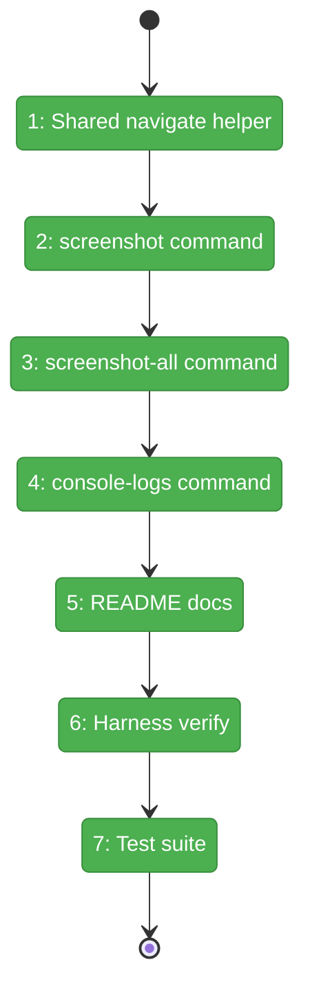
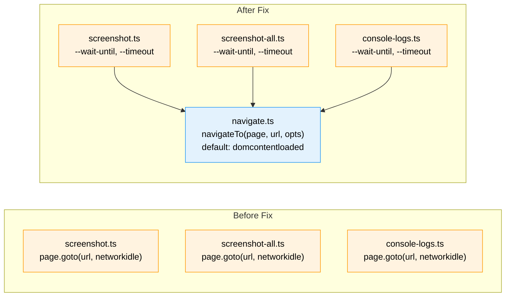

# Flight Plan: Fix FX003 — Add `--wait-until` Navigation Flag

**Fix**: [FX003-wait-until-navigation-flag.md](FX003-wait-until-navigation-flag.md)
**Status**: Landed

## What → Why

**Problem**: Harness CLI commands hardcode `waitUntil: 'networkidle'` which never fires on SSE-enabled workspace pages, causing 30s timeouts on every screenshot/console-log capture.

**Fix**: Add `--wait-until` flag (default: `domcontentloaded`) and `--timeout` to all 3 navigation commands via a shared helper. Update README for discoverability.

## Domain Context

| Domain | Relationship | What Changes |
|--------|-------------|-------------|
| `_platform/harness` | Modify | New `navigate.ts` helper, update 3 commands, update README |

## Flight Status

**Legend**: grey = pending | yellow = active | red = blocked | green = done

## Stages

- [x] **Stage 1: Create helper** — `navigateTo()` with `WaitUntilValue` type, defaults (`harness/src/cdp/navigate.ts` — new file)
- [x] **Stage 2: Update screenshot** — Add flags, validate, use helper (`screenshot.ts`)
- [x] **Stage 3: Update screenshot-all** — Same pattern (`screenshot-all.ts`)
- [x] **Stage 4: Update console-logs** — Same pattern (`console-logs.ts`)
- [x] **Stage 5: README** — Page Navigation section with strategy guide (`harness/README.md`)
- [x] **Stage 6: Harness verify** — Screenshot agents page succeeds with default
- [x] **Stage 7: Test suite** — `just fft` green

## Architecture: Before & After

**Legend**: green = unchanged | orange = modified | blue = new

## Acceptance

- [ ] `just harness screenshot agents --url .../agents` succeeds (domcontentloaded default)
- [ ] `just harness screenshot --help` shows `--wait-until` and `--timeout`
- [ ] Invalid `--wait-until` returns E108 with available values
- [ ] `harness/README.md` Page Navigation section present
- [ ] `just fft` passes

## Checklist

- [ ] FX003-1: Create shared `navigateTo` helper
- [ ] FX003-2: Update `screenshot` command
- [ ] FX003-3: Update `screenshot-all` command
- [ ] FX003-4: Update `console-logs` command
- [ ] FX003-5: Update README with Page Navigation section
- [ ] FX003-6: Verify with harness
- [ ] FX003-7: `just fft` green
