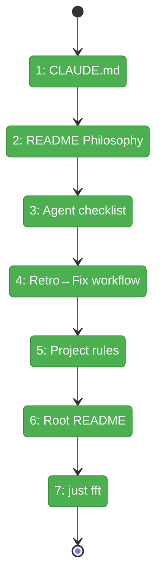

# Flight Plan: Fix FX004 — Lock In the Harness Feedback Loop Philosophy

**Fix**: [FX004-harness-feedback-loop-docs.md](FX004-harness-feedback-loop-docs.md)
**Status**: Landed

## What → Why

**Problem**: The harness feedback loop philosophy is operational but invisible — scattered across agent prompt files, not in CLAUDE.md, README, or project rules where developers and agents would find it.

**Fix**: Add the philosophy to every documentation surface. ~120 lines of prose across 4 files. No code changes.

## Domain Context

| Domain | Relationship | What Changes |
|--------|-------------|-------------|
| `_platform/harness` | Modify | CLAUDE.md, harness/README.md, project-rules/harness.md, root README.md |

## Flight Status

**Legend**: grey = pending | green = done

## Stages

- [x] **Stage 1: CLAUDE.md** — Add "Harness Feedback Loop" section
- [x] **Stage 2: README Philosophy** — Add "Philosophy: Agents Improving the Product" with proof table
- [x] **Stage 3: Agent checklist** — Update "Creating a New Agent" with mandatory retrospective
- [x] **Stage 4: Retro→Fix workflow** — Add "From Retrospective to Fix" section
- [x] **Stage 5: Project rules** — Expand feedback loop section in harness.md
- [x] **Stage 6: Root README** — Add repo differentiator paragraph
- [x] **Stage 7: just fft** — All passing

## Acceptance

- [ ] CLAUDE.md explains the feedback loop
- [ ] harness/README.md has Philosophy + proof table + mandatory checklist + workflow
- [ ] docs/project-rules/harness.md has expanded guidance
- [ ] Root README mentions it
- [ ] `just fft` passes
