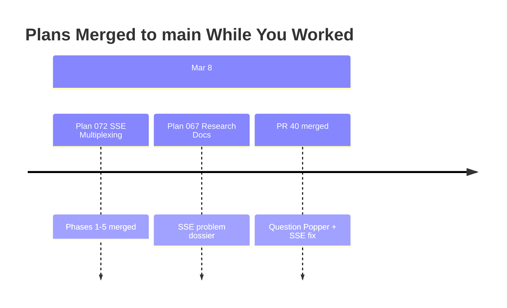

# Merge Plan: Integrating Upstream Changes (SSE Multiplexing)

**Generated**: 2026-03-09
**Your Branch**: `066-wf-real-agents` @ `60d47496`
**Merging From**: `origin/main` @ `7d6c78fe`
**Common Ancestor**: `cbba473d` (2026-03-08)

---

## Executive Summary

### What Happened While You Worked

You branched from main **~1 day ago**. Since then, **2 plans** landed in main:

| Plan | Purpose | Risk to You | Domains Affected |
|------|---------|-------------|------------------|
| 067 Question Popper (research only) | SSE problem research dossier + HTTP/2 feasibility study | None | question-popper, _platform/events |
| 072 SSE Multiplexing | Replace per-consumer EventSource with single multiplexed SSE endpoint | Low | _platform/events, _platform/state, question-popper, file-browser, workflow-ui |

### Conflict Summary

- **Direct File Conflicts**: 4 files (3 auto-resolvable, 1 manual)
- **Semantic Conflicts**: 0 real (see analysis below)
- **Regression Risks**: Low overall

### Recommended Approach

```
Single git merge — most conflicts are complementary (different areas of same file).
One test file needs manual integration. Expect clean merge with minor fixups.
```

---

## Timeline



---

## Upstream Plans Analysis

### Plan 072: SSE Multiplexing (PRIMARY)

**Purpose**: Replace per-consumer EventSource connections with a single multiplexed SSE endpoint to solve the HTTP/1.1 6-connection-per-origin browser limit that caused app lockups with 3+ tabs.

| Attribute | Value |
|-----------|-------|
| Commits | 5 implementation + 1 merge |
| Files Changed | 32 |
| Tests Added | 3 new suites (~844 lines) |
| Files Deleted | 2 (useSSE.ts, kanban integration test) |
| Conflicts with Us | 4 files |

**Key Changes**:
- New `apps/web/src/lib/sse/` library (5 files): MultiplexedSSEProvider, useChannelEvents, useChannelCallback
- New `/api/events/mux` endpoint — single SSE connection, channel-tagged events
- Migrated all consumers: FileChangeProvider, QuestionPopper, WorkflowSSE, WorkunitCatalog
- Re-enabled GlobalStateConnector (was disabled due to connection limits)
- Deleted legacy `useSSE` hook
- Updated workspace `layout.tsx` to mount MultiplexedSSEProvider

### Plan 067: Question Popper (Research Docs Only)

**Purpose**: Research documentation for the SSE connection problem. No code changes — only added 2 markdown files to `docs/plans/067-question-popper/`.

| Attribute | Value |
|-----------|-------|
| Files Changed | 2 (docs only) |
| Conflicts with Us | 0 |

---

## Conflict Analysis

### Conflict 1: `browser-client.tsx`

**Conflict Type**: Complementary (different areas) — **Auto-Resolvable**

**Our Changes**:
- Removed stale biome-ignore comment (line 114)
- Added `handleFileSelect` wrapper with `overlay:close-all` dispatch
- Fixed `useMemo` dependency (`handleFileSelect` instead of `fileNav.handleSelect`)

**Upstream Changes**:
- Re-enabled `GlobalStateConnector` (uncommented, line ~82)
- Added `QuestionPopperIndicator` import and usage in right actions

**Resolution**: Both change sets are in completely different code regions. Git should auto-merge. Both changes coexist safely.

**Verification**:
- [ ] Overlay close-all still fires on file select
- [ ] GlobalStateConnector reconnects without hitting connection limits
- [ ] QuestionPopperIndicator renders in toolbar

---

### Conflict 2: `biome.json`

**Conflict Type**: Complementary (different ignore patterns) — **Auto-Resolvable**

**Our Changes**: Added `"harness"` and `".pnpm-store"` to linter ignore

**Upstream Changes**: Added `"packages/*/src/**/*.d.ts"`, `.d.ts.map`, `.js`, `.js.map` to linter ignore

**Resolution**: Both add entries to the same `ignore` array. Git may produce a textual conflict at the array boundary, but resolution is trivial — include all entries.

---

### Conflict 3: `CLAUDE.md`

**Conflict Type**: Complementary (different sections) — **Auto-Resolvable**

**Our Changes**: Added Harness Commands documentation section

**Upstream Changes**: Added SSE Multiplexing documentation + Event Popper CLI section

**Resolution**: Both sections belong in the file. Keep both.

---

### Conflict 4: `use-tree-directory-changes.test.tsx` ⚠️

**Conflict Type**: Contradictory — **Manual Merge Required**

**Our Changes**:
- Renamed `newPaths` → `glowPaths` in test assertions
- Added new test case `"should populate glowPaths for change events"`

**Upstream Changes**:
- Rewrote entire test infrastructure from `FakeEventSource` → `MultiplexedSSEProvider` + `createFakeMultiplexedSSEFactory`
- Changed test setup/helpers (`simulateSSE`, `fakeMux.simulateOpen`)

**Resolution**: Take upstream's test infrastructure (MultiplexedSSE setup), then:
1. Apply our `newPaths` → `glowPaths` renames to upstream's assertions
2. Port our new `"should populate glowPaths for change events"` test case using upstream's test helpers

**Verification**:
- [ ] All tree-directory-changes tests pass
- [ ] New glowPaths test case works with multiplexed SSE infrastructure

---

## Semantic Conflict Analysis

### Previously Flagged — Now Cleared

The C2 subagent flagged concerns about `useSSE` references and missing `MultiplexedSSEProvider`. These are **false positives** because:

1. **useSSE references**: Files like `use-workunit-catalog-changes.ts` and `use-workflow-sse.ts` exist on our branch in their OLD form, but **we did not modify them**. Upstream's versions (already migrated to `useChannelEvents`) will replace them cleanly during merge.

2. **Missing MultiplexedSSEProvider in layout.tsx**: We did NOT modify `layout.tsx`'s provider structure. Upstream's version with MultiplexedSSEProvider will come in without conflict.

3. **file-change-provider.tsx**: We did NOT modify this file. Upstream's multiplexed version replaces ours cleanly.

**Net result**: Zero real semantic conflicts. All SSE migration changes are in files we didn't touch.

---

## Regression Risk Analysis

| Risk | Direction | Likelihood | Notes |
|------|-----------|------------|-------|
| Sidebar z-index | Safe | None | CSS-only, zero SSE dependency |
| Terminal Ctrl+V | Safe | None | Standalone feature, no overlap |
| Dashboard header | Safe | None | Layout change, isolated |
| File selection overlay:close-all | Us→Upstream | Low | Monitor interaction with re-enabled GlobalStateConnector |
| glowPaths naming | Bidirectional | Low | Both branches converged independently on same rename |
| Pre-existing test failures (9) | N/A | Medium | 7 question-popper tests may be fixed by SSE migration |

### Pre-Existing Test Failures Status

| Test Group | Count | Expected After Merge |
|------------|-------|---------------------|
| question-popper API route tests | 7 | Likely **FIXED** (SSE infrastructure now complete) |
| file-tree `tree-entry-glow` class | 1 | May still fail (CSS class mismatch from Plan 068) |
| file-tree metafile SVG count | 1 | May still fail (SVG rendering from Plan 068) |

---

## Merge Execution Plan

### Phase 1: Pre-Merge Backup

```bash
# Create backup branch
git branch backup-20260309-pre-merge

# Verify clean state (commit uncommitted changes first)
git add -A && git commit -m "Pre-merge: uncommitted plan doc updates"
```

### Phase 2: Execute Merge

```bash
# Merge main
git merge origin/main --no-edit

# Check for conflicts
git status
```

**Expected outcome**: 1-4 files with merge conflicts (likely just biome.json array boundary + test file + possibly CLAUDE.md). Browser-client.tsx should auto-merge.

### Phase 3: Resolve Conflicts

For each conflicted file:

**biome.json**: Include all ignore patterns from both branches.

**CLAUDE.md**: Include both Harness Commands and SSE Multiplexing sections.

**use-tree-directory-changes.test.tsx**:
1. Take upstream's test infrastructure (MultiplexedSSE setup)
2. Apply `glowPaths` naming to all assertions
3. Port our new test case using upstream's `fakeMux` helpers

**browser-client.tsx** (if conflicted): Keep both our overlay:close-all wrapper AND upstream's GlobalStateConnector + QuestionPopperIndicator.

### Phase 4: Validation

```bash
# Full quality check
just fft

# Specific SSE test suites
pnpm test -- events-mux-route
pnpm test -- multiplexed-sse-provider
pnpm test -- use-channel-hooks
pnpm test -- use-tree-directory-changes

# Check no orphaned useSSE imports
grep -r "useSSE" apps/web/src --include="*.ts" --include="*.tsx" -l
```

### Phase 5: Post-Merge Verification

- [ ] `just fft` passes (lint + format + typecheck + test)
- [ ] No `useSSE` imports remain
- [ ] Browser loads without SSE connection errors
- [ ] File selection overlay:close-all still works
- [ ] Sidebar collapsed icons still visible above content
- [ ] Terminal Ctrl+V paste still works
- [ ] SSE connection count = 1 per tab (check Network tab)

---

## Human Approval Required

Before executing this merge plan, please review:

### Summary Review
- [ ] I understand that 2 upstream plans changed SSE infrastructure
- [ ] I understand the 4 file conflicts (3 auto-resolve, 1 manual test file)
- [ ] I understand 0 real semantic conflicts exist

### Risk Acknowledgment
- [ ] I will run `just fft` after merging
- [ ] The pre-existing 7 question-popper test failures may resolve
- [ ] I have a rollback branch (`backup-20260309-pre-merge`)

---

**Proceed with merge execution?**

Type "PROCEED" to begin merge execution, or "ABORT" to cancel.
