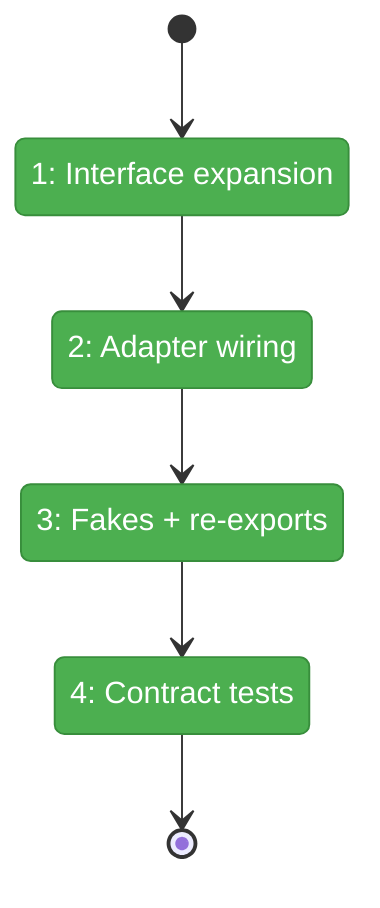
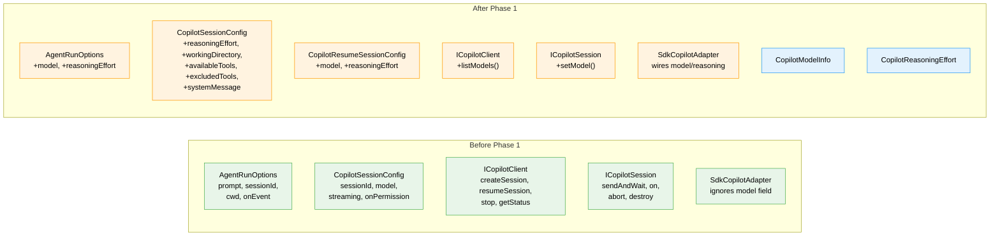

# Flight Plan: Phase 1 — SdkCopilotAdapter Improvements

**Plan**: [agent-runner-plan.md](../../agent-runner-plan.md)
**Phase**: Phase 1: SdkCopilotAdapter Improvements
**Generated**: 2026-03-07
**Status**: Landed

---

## Departure → Destination

**Where we are**: The `SdkCopilotAdapter` works for basic prompt execution (POC validated), but `AgentRunOptions` has no `model`/`reasoningEffort` fields, `ICopilotClient` has no `listModels()`, `ICopilotSession` has no `setModel()`, and `CopilotSessionConfig` is missing 5 SDK-supported fields. The harness cannot select models or reasoning effort through the typed interface.

**Where we're going**: A developer can import `CopilotModelInfo`, `CopilotReasoningEffort` from `@chainglass/shared`, call `client.listModels()` to discover available models, pass `model` and `reasoningEffort` to `adapter.run()`, and have them wired through to the SDK session. All fakes support the new methods, contract tests validate the options pass through, and `just fft` stays green.

---

## Domain Context

### Domains We're Changing

| Domain | What Changes | Key Files |
|--------|-------------|-----------|
| agents | Add `model`, `reasoningEffort` to `AgentRunOptions`; expand `CopilotSessionConfig` with 5 fields; add `listModels()` to `ICopilotClient`, `setModel()` to `ICopilotSession`; add `CopilotModelInfo` + `CopilotReasoningEffort` types; wire adapter; update fakes; extend contract tests; re-export types | `packages/shared/src/interfaces/agent-types.ts`, `copilot-sdk.interface.ts`, `sdk-copilot-adapter.ts`, `fake-copilot-client.ts`, `fake-copilot-session.ts`, `index.ts`, `test/contracts/agent-adapter.contract.ts` |

### Domains We Depend On (no changes)

| Domain | What We Consume | Contract |
|--------|----------------|----------|
| _platform/sdk | `@github/copilot-sdk` `SessionConfig` shape (20 fields) | SDK types — we mirror a subset in our local interfaces per R-ARCH-001 |

---

## Flight Status

<!-- Updated by /plan-6-v2: pending → active → done. Use blocked for problems/input needed. -->

**Legend**: grey = pending | yellow = active | red = blocked/needs input | green = done

---

## Stages

<!-- Updated by /plan-6-v2 during implementation: [ ] → [~] → [x] -->

- [x] **Stage 0: Verify approveAll** — Confirm `approveAll` already returns `{kind:'approved'}` (T001 — already done)
- [x] **Stage 1: Interface expansion** — Add types, expand configs, add `listModels()` and `setModel()` (`copilot-sdk.interface.ts`, `agent-types.ts`)
- [x] **Stage 2: Adapter wiring** — Wire `model`/`reasoningEffort` into `createSession()` and `resumeSession()` (`sdk-copilot-adapter.ts`)
- [x] **Stage 3: Fakes + re-exports** — Update `FakeCopilotClient.listModels()`, `FakeCopilotSession.setModel()`, re-export types (`fake-*.ts`, `index.ts`)
- [x] **Stage 4: Contract tests + verify** — Add contract tests for model/reasoning, run `just fft` (`agent-adapter.contract.ts`)

---

## Architecture: Before & After

**Legend**: existing (green, unchanged) | changed (orange, modified) | new (blue, created)

---

## Acceptance Criteria

- [x] `AgentRunOptions` has optional `model` and `reasoningEffort` fields
- [x] `CopilotSessionConfig` has 5 new optional fields (reasoningEffort, workingDirectory, availableTools, excludedTools, systemMessage)
- [x] `CopilotResumeSessionConfig` has optional `model` and `reasoningEffort` fields
- [x] `ICopilotClient` has `listModels(): Promise<CopilotModelInfo[]>` method
- [x] `ICopilotSession` has `setModel(model: string): Promise<void>` method
- [x] `SdkCopilotAdapter.run()` passes `model` and `reasoningEffort` to `createSession()` when provided
- [x] `SdkCopilotAdapter.run()` passes `model` and `reasoningEffort` to `resumeSession()` when provided
- [x] `FakeCopilotClient.listModels()` returns canned model list
- [x] `FakeCopilotSession.setModel()` is a no-op stub
- [x] `CopilotModelInfo` and `CopilotReasoningEffort` importable from `@chainglass/shared`
- [x] `ICopilotClient` and `ICopilotSession` importable from `@chainglass/shared`
- [x] Contract tests pass for model and reasoningEffort options
- [x] `just fft` passes with zero regressions (4996 passed, 77 skipped)

## Goals & Non-Goals

**Goals**: Model selection through typed interface; reasoning effort support; `listModels()` discovery; fake parity; contract test coverage; clean re-exports

**Non-Goals**: Real SDK integration tests; `systemMessage` wiring in adapter; `availableTools` on `AgentRunOptions`; any web app or CLI changes

---

## Checklist

- [x] T001: Verify approveAll already returns `{kind:'approved'}`
- [x] T002: Add `model`, `reasoningEffort` to `AgentRunOptions`
- [x] T003: Expand `CopilotSessionConfig` with 5 new fields
- [x] T004: Update `CopilotResumeSessionConfig` with `model`, `reasoningEffort`
- [x] T005: Wire `model`/`reasoningEffort` into adapter `createSession()`/`resumeSession()`
- [x] T006: Add `CopilotReasoningEffort` type and `CopilotModelInfo` interface
- [x] T007: Add `listModels()` to `ICopilotClient`
- [x] T008: Add `setModel()` to `ICopilotSession`
- [x] T009: Update `FakeCopilotClient` with `listModels()`
- [x] T010: Update `FakeCopilotSession` with `setModel()`
- [x] T011: Re-export new types from shared index
- [x] T012: Add contract tests for model/reasoning options
