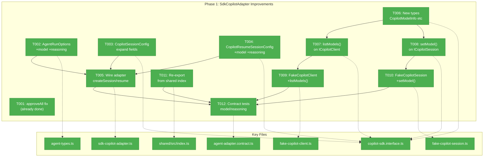
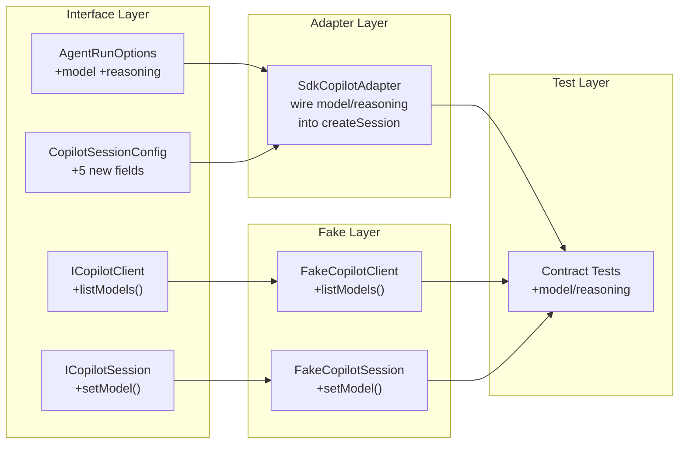
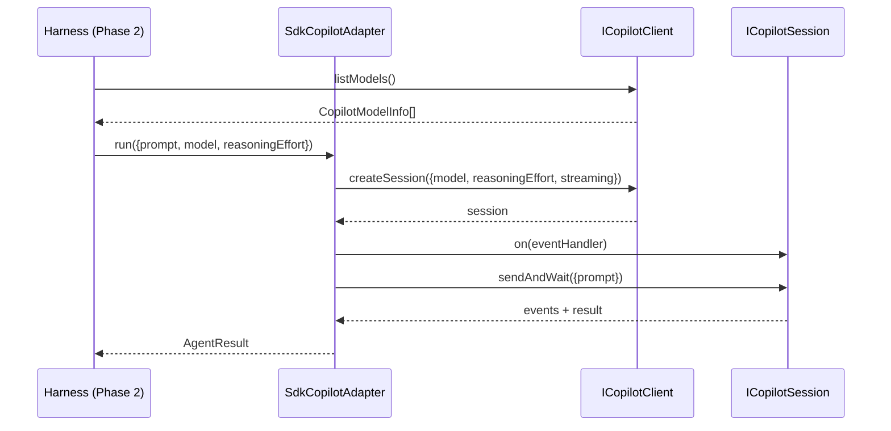

# Phase 1: SdkCopilotAdapter Improvements — Tasks Dossier

**Plan**: [agent-runner-plan.md](../../agent-runner-plan.md)
**Phase**: Phase 1: SdkCopilotAdapter Improvements
**Generated**: 2026-03-07
**Status**: Ready for implementation

---

## Executive Briefing

- **Purpose**: Close the gaps between the Copilot SDK capabilities and our adapter/interface layer so the harness agent runner (Phase 2) can use model selection, reasoning effort, and `listModels()` without bypassing the typed interface.
- **What We're Building**: Additive improvements to `CopilotSessionConfig`, `AgentRunOptions`, `ICopilotClient`, and `ICopilotSession` interfaces; wiring changes in `SdkCopilotAdapter`; fake updates; contract test extensions.
- **Goals**:
  - ✅ `AgentRunOptions` accepts `model` and `reasoningEffort` (per-run)
  - ✅ `CopilotSessionConfig` includes `reasoningEffort`, `workingDirectory`, `availableTools`, `excludedTools`, `systemMessage`
  - ✅ `ICopilotClient` exposes `listModels()` returning `CopilotModelInfo[]`
  - ✅ `ICopilotSession` exposes `setModel()` for mid-conversation model switching
  - ✅ Adapter wires `model`/`reasoningEffort` into `createSession()` and `resumeSession()`
  - ✅ Fakes updated — no test drift
  - ✅ Contract tests validate new options pass through
  - ✅ New types re-exported from `@chainglass/shared`
- **Non-Goals**:
  - ❌ Not adding `systemMessage` wiring to the adapter (interface only — harness wires directly)
  - ❌ Not adding `availableTools`/`excludedTools` to `AgentRunOptions` (interface only — Phase 2 uses config)
  - ❌ Not modifying the web app, CLI, or any domain other than `agents`
  - ❌ Not adding real SDK integration tests (fake-only for `just fft`)

---

## Pre-Implementation Check

| File | Exists? | Domain Check | Notes |
|------|---------|-------------|-------|
| `packages/shared/src/interfaces/agent-types.ts` | ✅ Yes | agents ✅ | Modify — add `model`, `reasoningEffort` to `AgentRunOptions` |
| `packages/shared/src/interfaces/copilot-sdk.interface.ts` | ✅ Yes | agents ✅ | Modify — add types, expand configs, add `listModels()`, `setModel()` |
| `packages/shared/src/adapters/sdk-copilot-adapter.ts` | ✅ Yes | agents ✅ | Modify — wire `model`/`reasoningEffort` into session creation |
| `packages/shared/src/fakes/fake-copilot-client.ts` | ✅ Yes | agents ✅ | Modify — add `listModels()` stub |
| `packages/shared/src/fakes/fake-copilot-session.ts` | ✅ Yes | agents ✅ | Modify — add `setModel()` stub |
| `packages/shared/src/interfaces/index.ts` | ✅ Yes | agents ✅ | Modify — re-export new types |
| `packages/shared/src/index.ts` | ✅ Yes | agents ✅ | Modify — re-export `ICopilotClient`, `ICopilotSession`, new types |
| `test/contracts/agent-adapter.contract.ts` | ✅ Yes | agents ✅ | Modify — add model/reasoning contract tests |
| `test/contracts/agent-adapter.contract.test.ts` | ✅ Yes | agents ✅ | No changes needed — factory already wires SdkCopilotAdapter |

**Pre-existing condition**: `approveAll` at line 15 of `sdk-copilot-adapter.ts` already returns `{kind: 'approved'}`. Plan task 1.1 is already complete — no code change needed. The bug was fixed during earlier work.

**Harness context**: Harness container is STOPPED (not needed for Phase 1 — all changes are in `packages/shared/` and `test/`).

---

## Architecture Map



---

## Tasks

| Status | ID | Task | Domain | Path(s) | Done When | Notes |
|--------|-----|------|--------|---------|-----------|-------|
| [x] | T001 | Verify `approveAll` returns `{kind:'approved'}` | agents | `/packages/shared/src/adapters/sdk-copilot-adapter.ts` | Line 15 already correct | Plan 1.1 — already fixed; Finding 01 resolved |
| [x] | T002 | Add `model` and `reasoningEffort` to `AgentRunOptions` | agents | `/packages/shared/src/interfaces/agent-types.ts` | New optional fields compile; existing callers unaffected | Plan 1.2 — per Workshop 002 C2. DYK-04: `model` is cross-adapter (honored by SdkCopilot + ClaudeCode). `reasoningEffort` is Copilot-SDK-specific — add JSDoc noting this. |
| [x] | T002b | Wire `model` into ClaudeCodeAdapter `_buildArgs()` | agents | `/packages/shared/src/adapters/claude-code.adapter.ts` | `--model` flag passed to `claude` CLI when `options.model` is set | DYK-04: Prevents silent-ignore footgun. 3 lines: add param to `_buildArgs()`, conditional push, pass from `run()`. CopilotCLIAdapter gets JSDoc "model not supported" note. |
| [x] | T003 | Add `reasoningEffort`, `workingDirectory`, `availableTools`, `excludedTools`, `systemMessage` to `CopilotSessionConfig` | agents | `/packages/shared/src/interfaces/copilot-sdk.interface.ts` | Config interface matches SDK capabilities; all optional | Plan 1.3 — per Workshop 002 C4/H1/H2/H3. DYK-03: `workingDirectory`, `availableTools`, `excludedTools`, `systemMessage` are interface-only (not wired in adapter Phase 1). Add JSDoc noting `workingDirectory` is not wired — use `AgentRunOptions.cwd` for now. |
| [x] | T004 | Update `CopilotResumeSessionConfig` with `model`, `reasoningEffort` | agents | `/packages/shared/src/interfaces/copilot-sdk.interface.ts` | Resume config accepts model/reasoning; fields optional | Plan 1.4 — per Workshop 002 H5 |
| [x] | T005 | Wire `model`, `reasoningEffort`, `workingDirectory`, `availableTools`, `excludedTools`, `systemMessage` into adapter `createSession()` and `resumeSession()` | agents | `/packages/shared/src/adapters/sdk-copilot-adapter.ts` | Conditional spread — only passes when provided; existing behavior unchanged when omitted | Plan 1.5 + DYK-05: Wire all 6 config fields (not just model/reasoning). Same pattern: `...(field && { field })`. `systemMessage` especially valuable for Phase 2 agent runner. Depends on T002-T004 |
| [x] | T006 | Add `CopilotReasoningEffort` type and `CopilotModelInfo` interface | agents | `/packages/shared/src/interfaces/copilot-sdk.interface.ts` | Types exported; match SDK `ModelInfo` shape exactly | Plan 1.6 — per Workshop 002 C5. DYK-01: Match SDK `ModelInfo` exactly — include `capabilities` (nested `supports`/`limits`), optional `policy`/`billing`, optional `supportedReasoningEfforts`. Drop our invented `supportsReasoningEffort` boolean — consumers use `capabilities.supports.reasoningEffort` or `(model.supportedReasoningEfforts?.length ?? 0) > 0`. |
| [x] | T007 | Add `listModels()` to `ICopilotClient` interface | agents | `/packages/shared/src/interfaces/copilot-sdk.interface.ts` | Method returns `Promise<CopilotModelInfo[]>` | Plan 1.7 — per Workshop 002 C5. Depends on T006 |
| [x] | T008 | Add `setModel()` to `ICopilotSession` interface | agents | `/packages/shared/src/interfaces/copilot-sdk.interface.ts` | Method accepts `model: string`, returns `Promise<void>` | Plan 1.8 — per Workshop 002 H4 |
| [x] | T009 | Update `FakeCopilotClient` with `listModels()` + `getLastSessionConfig()` | agents | `/packages/shared/src/fakes/fake-copilot-client.ts` | Returns canned `CopilotModelInfo[]`; captures full config from `createSession()`/`resumeSession()` for test assertions | Plan 1.9 — per Workshop 002 C6. DYK-02: Add `getLastSessionConfig()` helper so unit tests can verify adapter forwards model/reasoning. Currently `createSession()` only reads `config?.sessionId` and discards everything else. Depends on T007 |
| [x] | T010 | Update `FakeCopilotSession` with `setModel()` | agents | `/packages/shared/src/fakes/fake-copilot-session.ts` | No-op stub that records model for test verification | Plan 1.10 — per Workshop 002 H4. Depends on T008 |
| [x] | T011 | Re-export `ICopilotClient`, `ICopilotSession`, `CopilotModelInfo`, `CopilotReasoningEffort` from shared index | agents | `/packages/shared/src/index.ts`, `/packages/shared/src/interfaces/index.ts` | Types importable via `@chainglass/shared` | Plan 1.11 — per Finding 09. `interfaces/index.ts` already exports ICopilotClient/Session; main index.ts needs them added |
| [x] | T012 | Add contract tests for model/reasoning options | agents | `/test/contracts/agent-adapter.contract.ts` | Tests pass with FakeAdapter; verify model + reasoningEffort accepted | Plan 1.12 — per Workshop 002 §6. Depends on T005, T009, T010, T011 |

---

## Context Brief

**Key findings from plan**:
- Finding 01 (Critical): `approveAll` bug → **Already resolved** — code shows `'approved'` at line 15
- Finding 04 (High): `model` exists on config but adapter doesn't pass it → T005 wires it through
- Finding 05 (High): `listModels()` and `ReasoningEffort` not in our interface → T006, T007
- Finding 07 (Medium): `CopilotClient` cast via `as any` → Interface alignment in T003/T004/T006 reduces need
- Finding 09 (Medium): `ICopilotClient` not re-exported from shared index → T011 fixes this

**Domain dependencies** (concepts and contracts this phase consumes):
- `agents`: `IAgentAdapter.run(options)` — existing contract; we add optional fields to `AgentRunOptions`
- `agents`: `ICopilotClient.createSession(config)` — existing contract; we expand `CopilotSessionConfig`
- `agents`: `ICopilotSession` — existing contract; we add `setModel()`
- `_platform/sdk`: `@github/copilot-sdk` `SessionConfig` — upstream SDK types we mirror (not import)

**Domain constraints**:
- All changes are **additive** — new optional fields, new methods. No breaking changes.
- Interfaces import local types (per R-ARCH-001) — NOT SDK types directly
- Fakes must implement new methods to satisfy `implements ICopilotClient`/`ICopilotSession`
- Contract tests use `@chainglass/shared` imports (not path imports)

**Harness context**: No agent harness needed for Phase 1. All testing via `just fft` with fake adapters.

**Reusable from prior phases**: N/A (Phase 1 is first phase)

**Workshop references**:
- Workshop 002 §2: Gap analysis table — definitive source for SDK vs interface comparison
- Workshop 002 §3: Exact code snippets for each change
- Workshop 002 §4: Priority-ordered task list (C1-C6 critical, H1-H5 high)





---

## Discoveries & Learnings

_Populated during implementation by plan-6._

| Date | Task | Type | Discovery | Resolution | References |
|------|------|------|-----------|------------|------------|
| 2026-03-07 | T001 | insight | `approveAll` already fixed — code shows `'approved'` at line 15 of sdk-copilot-adapter.ts | No change needed; mark T001 done | Finding 01, Workshop 002 C1 |
| 2026-03-07 | T009 | decision | Add `getLastSessionConfig()` to `FakeCopilotClient` so unit tests can verify adapter wiring. Currently `createSession()` discards all config except `sessionId`. Without this, T005 wiring is untestable. | Add `_lastSessionConfig` field + getter to FakeCopilotClient; capture full config in `createSession()` and `resumeSession()` | DYK-02 insight |
| 2026-03-07 | T006 | decision | `CopilotModelInfo` must match SDK's `ModelInfo` shape exactly. SDK has `capabilities.supports.reasoningEffort` (nested boolean), optional `supportedReasoningEfforts`, `policy`, `billing`. Our planned `supportsReasoningEffort: boolean` top-level field doesn't exist on SDK shape — `as any` cast would cause runtime `undefined`. | Match SDK shape: include `capabilities` object, make `supportedReasoningEfforts` optional, drop invented `supportsReasoningEffort` | DYK-01 insight; SDK source at `~/github/copilot-sdk/nodejs/src/types.ts` |

---

## Directory Layout

```
docs/plans/070-harness-agent-runner/
  ├── agent-runner-plan.md
  ├── agent-runner-spec.md
  ├── exploration.md
  ├── workshops/
  │   ├── 001-copilot-sdk-adapter-reuse-and-agent-runner-design.md
  │   └── 002-sdk-adapter-improvements.md
  └── tasks/phase-1-sdk-copilot-adapter-improvements/
      ├── tasks.md                 ← this file
      ├── tasks.fltplan.md         ← flight plan
      └── execution.log.md        ← created by plan-6
```
