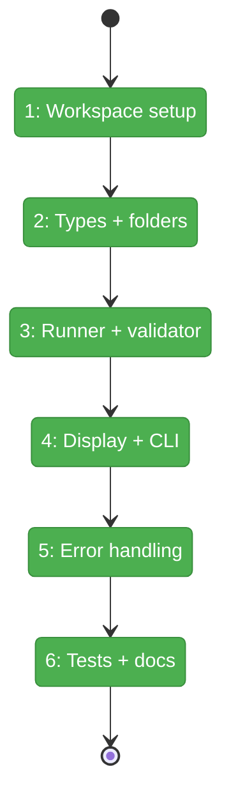
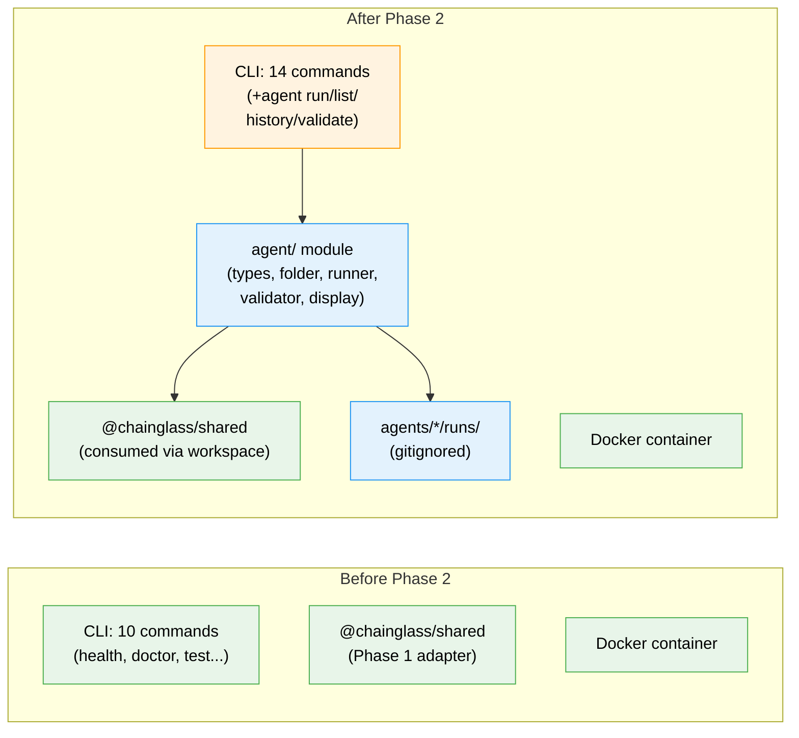

# Flight Plan: Phase 2 — Agent Runner Infrastructure

**Plan**: [agent-runner-plan.md](../../agent-runner-plan.md)
**Phase**: Phase 2: Agent Runner Infrastructure
**Generated**: 2026-03-07
**Status**: Landed

---

## Departure → Destination

**Where we are**: The adapter layer (Phase 1) supports model selection, reasoning effort, and `listModels()`. The harness has 10 CLI commands, Docker container management, and Playwright/CDP browser automation. But there's no way to dispatch autonomous agents — no agent folder format, no execution engine, no event logging, no output validation.

**Where we're going**: A developer runs `just harness agent run smoke-test` and the harness discovers the agent folder, creates an ISO-dated run directory, executes the prompt via SdkCopilotAdapter, streams events to NDJSON in real-time, validates the output against a JSON Schema, writes `completed.json` with full metadata, and returns a structured JSON envelope. `agent list`, `agent history`, and `agent validate` provide management. All unit tests pass in `just fft` using FakeCopilotClient (no real SDK calls).

---

## Domain Context

### Domains We're Changing

| Domain | What Changes | Key Files |
|--------|-------------|-----------|
| external (harness/) | 6 new agent modules, 1 CLI command group, error codes, unit tests | `harness/src/agent/*.ts`, `harness/src/cli/commands/agent.ts`, `harness/tests/unit/agent/*.test.ts` |
| _platform | Workspace config, gitignore, governance docs | `pnpm-workspace.yaml`, `.gitignore`, `docs/project-rules/harness.md`, `CLAUDE.md` |

### Domains We Depend On (no changes)

| Domain | What We Consume | Contract |
|--------|----------------|----------|
| agents (`@chainglass/shared`) | `IAgentAdapter`, `SdkCopilotAdapter`, `AgentEvent`, `AgentResult`, `FakeCopilotClient` | Phase 1 exports — model/reasoning support |
| _platform/sdk (`@github/copilot-sdk`) | `CopilotClient`, `approveAll` | SDK instantiation in runner |

---

## Flight Status

**Legend**: grey = pending | yellow = active | red = blocked/needs input | green = done

---

## Stages

- [x] **Stage 1: Workspace setup** — Add harness to pnpm-workspace, add deps, gitignore runs, error codes (`pnpm-workspace.yaml`, `.gitignore`, `output.ts`)
- [x] **Stage 2: Types + folders** — Agent definition types and folder management (`agent/types.ts`, `agent/folder.ts` — new files)
- [x] **Stage 3: Runner + validator** — Core execution engine and schema validation (`agent/runner.ts`, `agent/validator.ts` — new files)
- [x] **Stage 4: Display + CLI** — Rich terminal output and Commander.js commands (`agent/display.ts`, `commands/agent.ts` — new files; `cli/index.ts` — modify)
- [x] **Stage 5: Error handling** — Pre-flight checks, not-found errors, timeout (integrated in runner.ts + agent.ts)
- [x] **Stage 6: Tests + docs** — Unit tests and documentation updates (`tests/unit/agent/*.test.ts` — new; `harness.md`, `CLAUDE.md` — modify)

---

## Architecture: Before & After

**Legend**: existing (green, unchanged) | changed (orange, modified) | new (blue, created)

---

## Acceptance Criteria

- [ ] `pnpm install` resolves with harness in workspace; `@chainglass/shared` importable
- [ ] `harness/agents/*/runs/` gitignored
- [ ] Error codes E120-E125 available in `output.ts`
- [ ] `just harness agent run <slug>` creates run folder, executes agent, returns JSON envelope
- [ ] `just harness agent list` shows available agents
- [ ] `just harness agent history <slug>` lists past runs
- [ ] `just harness agent validate <slug>` re-validates output
- [ ] Events written to `events.ndjson` incrementally (appendFileSync)
- [ ] `completed.json` has session ID, timing, validation, event/tool counts
- [ ] Output validated against `output-schema.json` via ajv
- [ ] Validation failure = `status: "degraded"` (not error)
- [ ] GH_TOKEN check returns E122 with fix command
- [ ] Agent not found returns E121 with available agents
- [ ] Timeout returns E123 with `completed.json` result: "timeout"
- [ ] Rich terminal output: header, events, summary (to stderr)
- [ ] Unit tests pass in `just fft` with fake adapter
- [ ] `docs/project-rules/harness.md` updated with agent commands + workspace rationale
- [ ] `CLAUDE.md` updated with agent runner commands

## Goals & Non-Goals

**Goals**: Full agent runner CLI with folder management, SDK execution, NDJSON logging, JSON Schema validation, rich display, error handling, unit tests, documentation

**Non-Goals**: Real SDK integration tests, agent definitions (Phase 3), multi-agent orchestration, web UI, CI/CD integration

---

## Checklist

- [x] T001: Add harness to pnpm-workspace + deps
- [x] T002: Add runs/ to .gitignore
- [x] T003: Add error codes E120-E125
- [x] T004: Create agent/types.ts
- [x] T005: Create agent/folder.ts
- [x] T006: Create agent/runner.ts
- [x] T007: Create agent/validator.ts
- [x] T008: Create agent/display.ts
- [x] T009: Create cli/commands/agent.ts
- [x] T010: Register agent command in cli/index.ts
- [x] T011: Pre-flight checks (GH_TOKEN + health)
- [x] T012: Agent not found error
- [x] T013: Timeout handling
- [x] T014: Unit tests (runner, validator, folder)
- [x] T015: Update harness.md + CLAUDE.md
