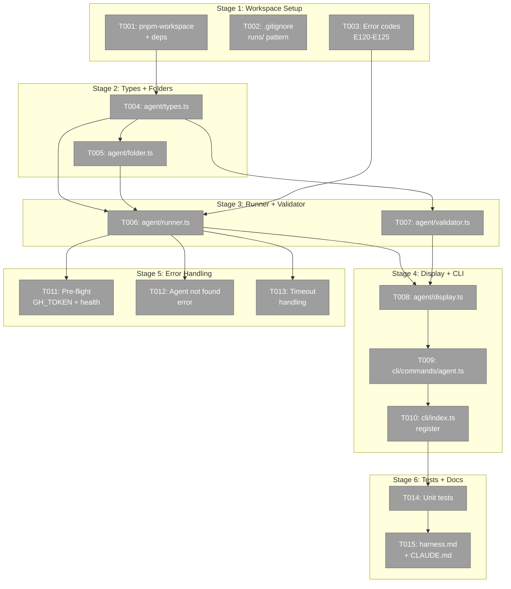
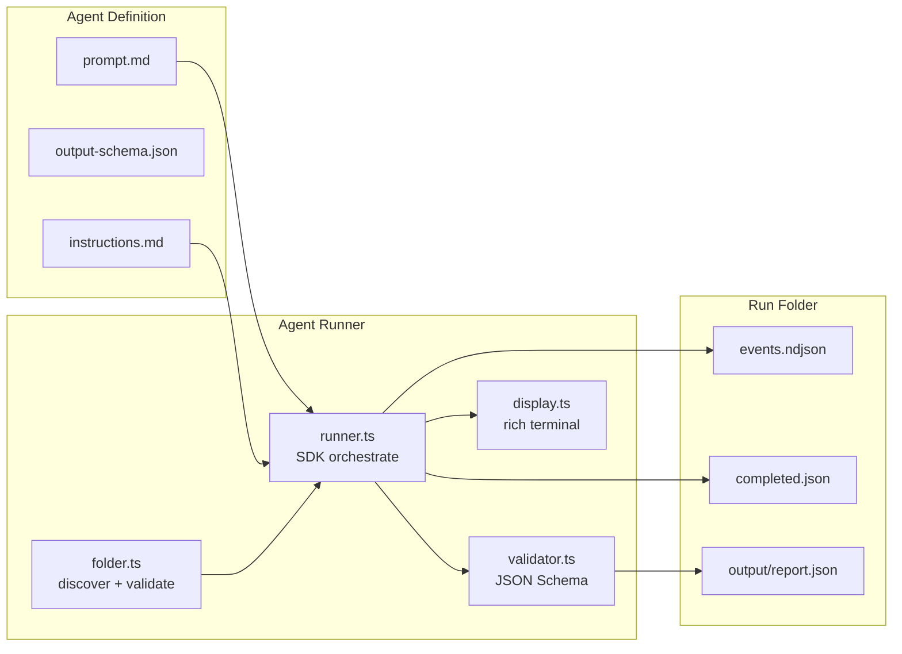
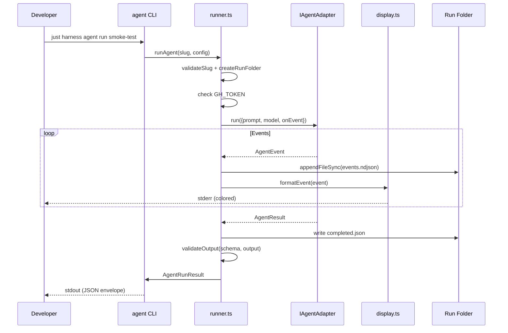

# Phase 2: Agent Runner Infrastructure — Tasks Dossier

**Plan**: [agent-runner-plan.md](../../agent-runner-plan.md)
**Phase**: Phase 2: Agent Runner Infrastructure
**Generated**: 2026-03-07
**Status**: Ready for implementation

---

## Executive Briefing

- **Purpose**: Build the harness CLI agent runner — the execution engine that takes a declarative agent folder (prompt + schema + instructions), runs it via the Copilot SDK adapter, streams events to NDJSON, validates output against JSON Schema, and returns structured results.
- **What We're Building**: 6 new modules in `harness/src/agent/`, 1 new CLI command group (`agent run/list/history/validate`), error codes E120-E125, unit tests, and doc updates. Also workspace integration so harness can import `@chainglass/shared`.
- **Goals**:
  - ✅ `just harness agent run <slug>` executes an agent from a versioned folder
  - ✅ `just harness agent list` discovers available agents
  - ✅ `just harness agent history <slug>` shows past runs
  - ✅ `just harness agent validate <slug>` re-validates output
  - ✅ Events streamed to NDJSON + rich terminal output
  - ✅ Output validated against JSON Schema via ajv
  - ✅ Run folders with frozen copies, completed.json, event logs
  - ✅ Pre-flight checks (GH_TOKEN, harness health)
  - ✅ Unit tests pass in `just fft` with fake adapter
- **Non-Goals**:
  - ❌ No real SDK calls in `just fft` — all tests use FakeCopilotClient
  - ❌ No agent definitions yet — Phase 3 creates the first one
  - ❌ No multi-agent orchestration — single linear execution only
  - ❌ No web UI — terminal only

---

## Prior Phase Context

### Phase 1: SdkCopilotAdapter Improvements (Complete ✅)

**A. Deliverables**:
- `packages/shared/src/interfaces/agent-types.ts` — `model`, `reasoningEffort` on `AgentRunOptions`
- `packages/shared/src/interfaces/copilot-sdk.interface.ts` — `CopilotModelInfo`, `CopilotReasoningEffort`, `listModels()`, `setModel()`, expanded configs
- `packages/shared/src/adapters/sdk-copilot-adapter.ts` — wires model/reasoning into createSession/resumeSession
- `packages/shared/src/adapters/claude-code.adapter.ts` — `--model` flag passthrough
- `packages/shared/src/fakes/fake-copilot-client.ts` — `listModels()`, `getLastSessionConfig()`, `getLastResumeConfig()`
- `packages/shared/src/fakes/fake-copilot-session.ts` — `setModel()`, `getCurrentModel()`
- `test/contracts/agent-adapter.contract.ts` — 2 new contract tests

**B. Dependencies Exported** (available for Phase 2):
- `import { SdkCopilotAdapter, FakeCopilotClient, FakeCopilotSession, ICopilotClient, CopilotModelInfo, CopilotReasoningEffort } from '@chainglass/shared'`
- `AgentRunOptions` accepts `model`, `reasoningEffort`
- `FakeCopilotClient.getLastSessionConfig()` — verify adapter wiring in tests
- `FakeCopilotClient.listModels()` — returns canned model list for tests

**C. Gotchas & Debt**:
- `workingDirectory` on `CopilotSessionConfig` is interface-only; use `AgentRunOptions.cwd` for actual cwd
- `CopilotModelInfo` matches SDK `ModelInfo` exactly — use `capabilities.supports.reasoningEffort` (nested), not a top-level boolean
- `CopilotClient` → `ICopilotClient` still requires `as any` cast — interface alignment is close but not perfect

**D. Incomplete Items**: None — 13/13 tasks complete.

**E. Patterns to Follow**:
- Conditional spread for optional config: `...(model && { model })`
- Fake config capture: `getLastSessionConfig()` pattern for test verification
- JSDoc for interface-only fields
- Re-export new public types from `packages/shared/src/index.ts`

---

## Pre-Implementation Check

| File | Exists? | Domain Check | Notes |
|------|---------|-------------|-------|
| `pnpm-workspace.yaml` | ✅ Yes | _platform | Modify — add `harness` to packages list |
| `harness/package.json` | ✅ Yes | external | Modify — add `@chainglass/shared`, `ajv` deps |
| `.gitignore` | ✅ Yes | _platform | Modify — add `harness/agents/*/runs/` |
| `harness/src/cli/output.ts` | ✅ Yes | external | Modify — add E120-E125 error codes |
| `harness/src/agent/types.ts` | ❌ No | external | **Create** — AgentDefinition, AgentRunConfig, AgentRunResult |
| `harness/src/agent/folder.ts` | ❌ No | external | **Create** — agent discovery, slug validation, run folder creation |
| `harness/src/agent/runner.ts` | ❌ No | external | **Create** — SDK orchestration, event streaming, completed.json |
| `harness/src/agent/validator.ts` | ❌ No | external | **Create** — JSON Schema validation via ajv |
| `harness/src/agent/display.ts` | ❌ No | external | **Create** — rich terminal event formatting |
| `harness/src/cli/commands/agent.ts` | ❌ No | external | **Create** — Commander.js subcommands |
| `harness/src/cli/index.ts` | ✅ Yes | external | Modify — register agent command |
| `harness/tests/unit/agent/runner.test.ts` | ❌ No | external | **Create** — runner unit tests |
| `harness/tests/unit/agent/validator.test.ts` | ❌ No | external | **Create** — schema validation tests |
| `harness/tests/unit/agent/folder.test.ts` | ❌ No | external | **Create** — folder management tests |
| `docs/project-rules/harness.md` | ✅ Yes | _platform | Modify — document agent commands + workspace rationale |
| `CLAUDE.md` | ✅ Yes | _platform | Modify — add agent runner commands |

**Harness context**: Container is STOPPED. Phase 2 builds the runner infrastructure — harness container not needed until Phase 3 smoke-test. Unit tests use FakeCopilotClient.

---

## Architecture Map



---

## Tasks

| Status | ID | Task | Domain | Path(s) | Done When | Notes |
|--------|-----|------|--------|---------|-----------|-------|
| [ ] | T001 | Add `harness` to `pnpm-workspace.yaml`; add `@chainglass/shared` and `ajv` to `harness/package.json`; run `pnpm install` | _platform, external | `pnpm-workspace.yaml`, `harness/package.json` | `pnpm install` resolves; `import { SdkCopilotAdapter } from '@chainglass/shared'` compiles in harness | Plan 2.1, Finding 02. ADR-0014 amendment documented in plan. DYK-04: `just fft` safe (root vitest ignores harness/). But `pnpm turbo test` would discover harness — add comment in package.json noting tests require Docker. |
| [ ] | T002 | Add `harness/agents/*/runs/` to `.gitignore` | _platform | `.gitignore` | Run folders excluded from git; `git status` shows no runs/ | Plan 2.2. Existing pattern: `harness/results/` already gitignored. |
| [ ] | T003 | Add error codes E120-E125 to `harness/src/cli/output.ts` | external | `harness/src/cli/output.ts` | Error codes available: E120=execution failed, E121=not found, E122=auth missing, E123=timeout, E124=validation failed, E125=run folder creation failed | Plan 2.3, Finding 06. Existing codes: E100-E110. Follow same `ErrorCodes` const pattern. |
| [ ] | T004 | Create `harness/src/agent/types.ts` — AgentDefinition, AgentRunConfig, AgentRunResult | external | `harness/src/agent/types.ts` | Types compile; AgentDefinition has slug, promptPath, schemaPath, instructionsPath; AgentRunConfig has slug, model, timeout, reasoningEffort; AgentRunResult extends HarnessEnvelope pattern | Plan 2.4. Foundation for all agent code. Import `AgentEvent`, `AgentResult` from `@chainglass/shared`. |
| [ ] | T005 | Create `harness/src/agent/folder.ts` — agent discovery, slug validation, run folder creation | external | `harness/src/agent/folder.ts` | `listAgents()` scans `harness/agents/*/prompt.md`; `validateSlug()` rejects `../`, `/`, `\`, null bytes, allows `[a-zA-Z0-9_-]{1,64}`; `createRunFolder()` creates ISO-dated dir with random suffix (`YYYY-MM-DDTHH-MM-SS-mmmZ-xxxx`) to prevent collisions, copies prompt + instructions into it | Plan 2.5, AC-01/03/04. DYK-02: Use milliseconds + 4-char random suffix in folder name to prevent collision on parallel/fast-retry runs. |
| [ ] | T006 | Create `harness/src/agent/runner.ts` — SDK orchestration, event streaming, completed.json | external | `harness/src/agent/runner.ts` | Pure orchestration function: `runAgent(adapter: IAgentAdapter, definition: AgentDefinition, config: AgentRunConfig)`. Streams events via `onEvent`; writes `events.ndjson` incrementally (appendFileSync per event); writes `completed.json` with session ID, timing, validation, event/tool counts. Zero SDK imports — adapter-agnostic. | Plan 2.6, AC-04/09/10/11/12, Finding 08. DYK-01: Runner is a pure function, NOT a class with SDK construction. CLI command is the composition root that creates CopilotClient → SdkCopilotAdapter → passes to runner. Tests pass FakeAgentAdapter. No SDK imports in runner.ts. |
| [ ] | T007 | Create `harness/src/agent/validator.ts` — JSON Schema validation via ajv | external | `harness/src/agent/validator.ts` | `validateOutput(schemaPath, outputPath)` returns `{valid, errors}`; uses ajv v8 with `allErrors: true`; validation failure = "degraded" not "error" | Plan 2.7, AC-13/14/15/16. DYK-03: Pre-validate before ajv — return early with descriptive errors for: file not found, file empty, not valid JSON (SyntaxError). All map to `status: "degraded"` with helpful messages, not crashes. |
| [ ] | T008 | Create `harness/src/agent/display.ts` — rich terminal event formatting | external | `harness/src/agent/display.ts` | Header box with agent name + run ID; real-time event streaming (tool calls show name + truncated input, tool results show ✓/✗ + truncated output, thinking shows snippet); completion summary with timing, session ID, validation result, artifact listing | Plan 2.8, AC-17/18/19. Output to stderr (stdout is JSON envelope). |
| [ ] | T009 | Create `harness/src/cli/commands/agent.ts` — Commander.js subcommands + composition root | external | `harness/src/cli/commands/agent.ts` | Exports `registerAgentCommand(program)`; creates parent `agent` command via `.addCommand()`; registers `run <slug>`, `list`, `history <slug>`, `validate <slug>` subcommands. `run` handler is the composition root: creates CopilotClient → SdkCopilotAdapter → calls runAgent(adapter, def, config). Only file that imports `@github/copilot-sdk` directly. | Plan 2.9, AC-02/20/21, Finding 06. DYK-01: CLI command is the composition root. Use `.addCommand()` per Finding 06 — NOT `.command().command()` chaining. |
| [ ] | T010 | Register agent command in `harness/src/cli/index.ts` | external | `harness/src/cli/index.ts` | `registerAgentCommand(program)` called in `createCli()`; `just harness agent --help` shows subcommands | Plan 2.10. Follow existing pattern: import + call in `createCli()`. |
| [ ] | T011 | Pre-flight checks: GH_TOKEN and harness health | external | `harness/src/agent/runner.ts` | Error E122 if `GH_TOKEN` not set (with fix command); calls `doctor --wait` before agent launch if harness is running | Plan 2.11, AC-27/28. GH_TOKEN check is mandatory; doctor check is best-effort (harness may not be running for all agent tasks). |
| [ ] | T012 | Agent not found error with available agents listing | external | `harness/src/agent/runner.ts` or `harness/src/cli/commands/agent.ts` | Error E121 with message listing available agents from `listAgents()` | Plan 2.12, AC-26. |
| [ ] | T013 | Timeout handling: kill adapter on `--timeout` expiry | external | `harness/src/agent/runner.ts` | Default 300s; `completed.json` with `result:"timeout"`; error E123; calls `adapter.terminate()` | Plan 2.13, AC-08. |
| [ ] | T014 | Unit tests: runner, validator, folder | external | `harness/tests/unit/agent/runner.test.ts`, `validator.test.ts`, `folder.test.ts` | Tests pass in `just fft` using FakeCopilotClient + FakeAgentAdapter (no real SDK); validator tests use fixture schemas | Plan 2.14. Follow existing test pattern in `harness/tests/unit/`. |
| [ ] | T015 | Update `docs/project-rules/harness.md` and `CLAUDE.md` | _platform | `docs/project-rules/harness.md`, `CLAUDE.md` | harness.md: agent runner commands, workspace membership rationale (per ADR amendment), error codes E120-E125. CLAUDE.md: agent runner commands in Harness Commands section | Plan 2.15. |

---

## Context Brief

**Key findings from plan**:
- Finding 02 (Critical): Harness not in pnpm-workspace — T001 adds it (ADR-0014 amendment)
- Finding 06 (High): Commander.js nested subcommands require `.addCommand()` — T009 uses this
- Finding 08 (Medium): NDJSON writes must be incremental (appendFileSync per event) — T006 implements this
- Finding 07 (Medium): CopilotClient → ICopilotClient cast via `as any` — runner accepts `IAgentAdapter` for testability

**Domain dependencies** (from Phase 1):
- `agents` (`@chainglass/shared`): `IAgentAdapter` (run/terminate), `SdkCopilotAdapter` (real impl), `FakeCopilotClient`/`FakeCopilotSession` (tests), `AgentEvent`/`AgentResult` (types), `CopilotModelInfo` (listModels)
- `_platform/sdk` (`@github/copilot-sdk`): `CopilotClient` (instantiated in runner), `approveAll` (permission handler)

**Domain constraints**:
- Harness is NOT a registered domain — it's external tooling at `harness/`
- Adding to `pnpm-workspace.yaml` is a build-system concern, not domain promotion (per ADR amendment)
- All agent types live in `harness/src/agent/types.ts` — not exported to other domains
- Runner takes `IAgentAdapter` via constructor for testability (DI pattern from ClaudeCodeAdapter)

**Harness context**:
- **Boot**: `just harness dev` — health check: `just harness health`
- **Interact**: CLI commands returning HarnessEnvelope JSON to stdout
- **Observe**: `harness/results/` for test results; `harness/agents/*/runs/` for agent runs
- **Maturity**: L3 (Boot + Browser + CLI SDK)
- **Pre-phase validation**: Container not needed for Phase 2 unit tests. Phase 3 requires it.

**Reusable from Phase 1**:
- `FakeCopilotClient` with `listModels()` + `getLastSessionConfig()` — ready for runner unit tests
- `FakeCopilotSession` with `setModel()` + `getCurrentModel()` — ready for session tests
- Conditional spread pattern for optional config: `...(model && { model })`
- Contract test pattern: verify options accepted without error

**Existing harness patterns**:
- CLI: `registerXCommand(program)` exported function → `program.command('name').action(async () => {...})`
- Output: `formatSuccess(command, data)` / `formatError(command, code, message)` → `exitWithEnvelope()`
- Error codes: const object `ErrorCodes` with string values (E100-E110)
- Tests: `harness/tests/unit/` for Vitest unit tests





---

## Discoveries & Learnings

_Populated during implementation by plan-6._

| Date | Task | Type | Discovery | Resolution | References |
|------|------|------|-----------|------------|------------|

---

## Directory Layout

```
docs/plans/070-harness-agent-runner/
  ├── agent-runner-plan.md
  ├── agent-runner-spec.md
  ├── exploration.md
  ├── workshops/
  │   ├── 001-copilot-sdk-adapter-reuse-and-agent-runner-design.md
  │   └── 002-sdk-adapter-improvements.md
  └── tasks/
      ├── phase-1-sdk-copilot-adapter-improvements/  (complete ✅)
      └── phase-2-agent-runner-infrastructure/
          ├── tasks.md                 ← this file
          ├── tasks.fltplan.md         ← flight plan
          └── execution.log.md        ← created by plan-6
```
