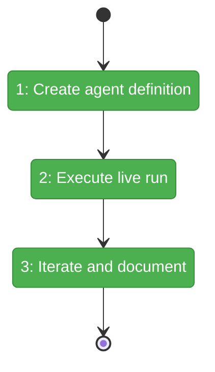
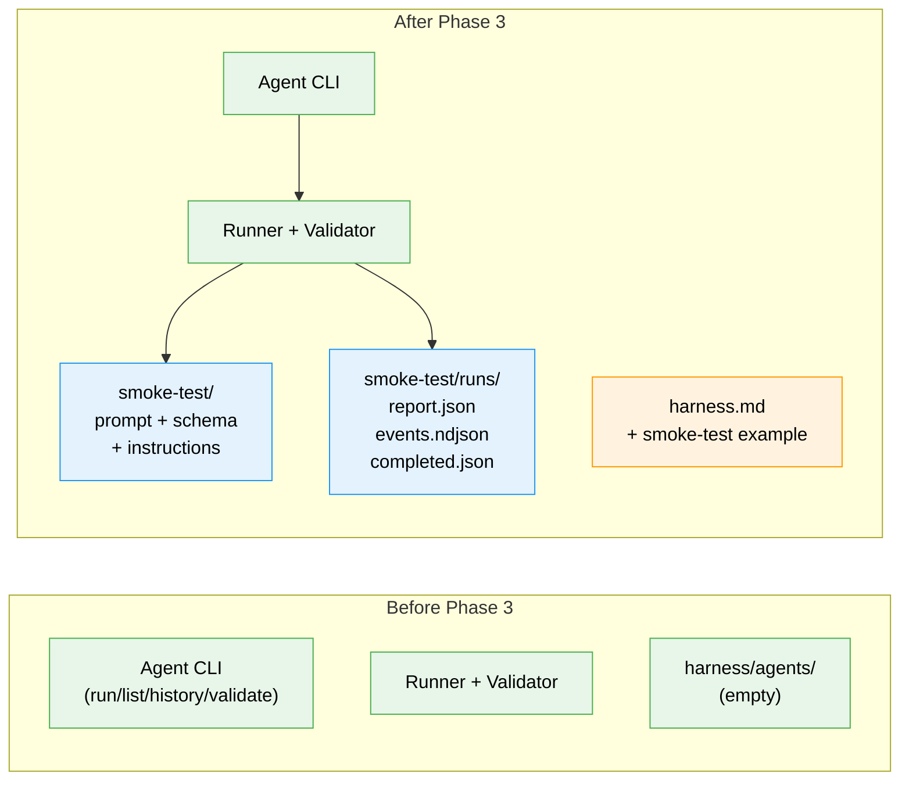

# Flight Plan: Phase 3 — Smoke Test Agent

**Plan**: [agent-runner-plan.md](../../agent-runner-plan.md)
**Phase**: Phase 3: Smoke Test Agent
**Generated**: 2026-03-07
**Status**: Landed

---

## Departure → Destination

**Where we are**: The agent runner infrastructure is fully built (Phases 1-2). The CLI can discover, execute, validate, and display agent runs — but no agent definitions exist yet. `just harness agent list` returns an empty list.

**Where we're going**: A developer can run `just harness agent run smoke-test` and get a validated report with health checks, screenshots at 3 viewports, console error analysis, server log summary, pass/fail verdict, and an honest retrospective about the harness experience.

---

## Domain Context

### Domains We're Changing

| Domain | What Changes | Key Files |
|--------|-------------|-----------|
| external (harness/) | Create first agent definition — 3 content files | `harness/agents/smoke-test/prompt.md`, `output-schema.json`, `instructions.md` |
| cross-domain | Document smoke-test as reference example | `docs/project-rules/harness.md` |

### Domains We Depend On (no changes)

| Domain | What We Consume | Contract |
|--------|----------------|----------|
| agents | `IAgentAdapter`, `SdkCopilotAdapter`, `AgentEvent` | `@chainglass/shared` exports |
| _platform/sdk | `CopilotClient` | `@github/copilot-sdk` |
| external (harness/) | Runner, validator, folder, display, CLI | Phase 2 modules |

---

## Flight Status

<!-- Updated by /plan-6-v2: pending → active → done. Use blocked for problems/input needed. -->

**Legend**: grey = pending | yellow = active | red = blocked/needs input | green = done

---

## Stages

<!-- Updated by /plan-6-v2 during implementation: [ ] → [~] → [x] -->

- [x] **Stage 1: Create agent definition files** — prompt.md, output-schema.json, instructions.md in `harness/agents/smoke-test/` (T001, T002, T003)
- [x] **Stage 2: Execute and validate** — boot harness, set GH_TOKEN, run `just harness agent run smoke-test`, observe events and output (T004)
- [x] **Stage 3: Iterate and document** — fix prompt/schema issues from run results, achieve 1 validated run, update harness.md (T005, T006)

---

## Architecture: Before & After

**Legend**: existing (green, unchanged) | changed (orange, modified) | new (blue, created)

---

## Acceptance Criteria

- [ ] AC-22: `smoke-test` agent definition exists at `harness/agents/smoke-test/` with prompt, output schema, and instructions
- [ ] AC-23: Smoke-test performs: health check, 3-viewport screenshots, console error check, server log check, writes structured report
- [ ] AC-24: Report includes `retrospective` with `workedWell`, `confusing`, `magicWand` fields
- [ ] AC-25: Smoke-test runs successfully and produces a validated report
- [ ] `events.ndjson` shows tool calls (doctor, screenshot, etc.)
- [ ] `completed.json` has `validated: true`

## Goals & Non-Goals

**Goals**:
- Create the reference smoke-test agent definition
- Validate end-to-end runner pipeline with a real Copilot SDK execution
- Capture honest agent retrospective for harness improvement
- Document smoke-test as the example agent in harness.md

**Non-Goals**:
- Building additional agents beyond smoke-test
- Automated CI execution
- Modifying runner infrastructure
- Testing ClaudeCode adapter

---

## Checklist

- [x] T001: Create smoke-test prompt.md
- [x] T002: Create smoke-test output-schema.json
- [x] T003: Create smoke-test instructions.md
- [~] T004: Run smoke-test against live harness
- [ ] T005: Iterate on prompt/schema for validated run
- [ ] T006: Update harness.md with smoke-test example
