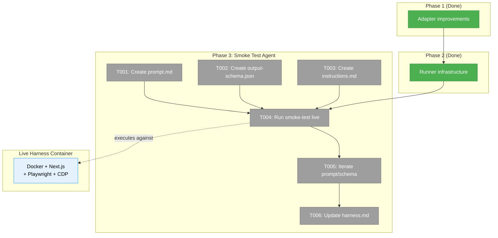
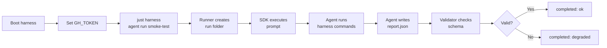
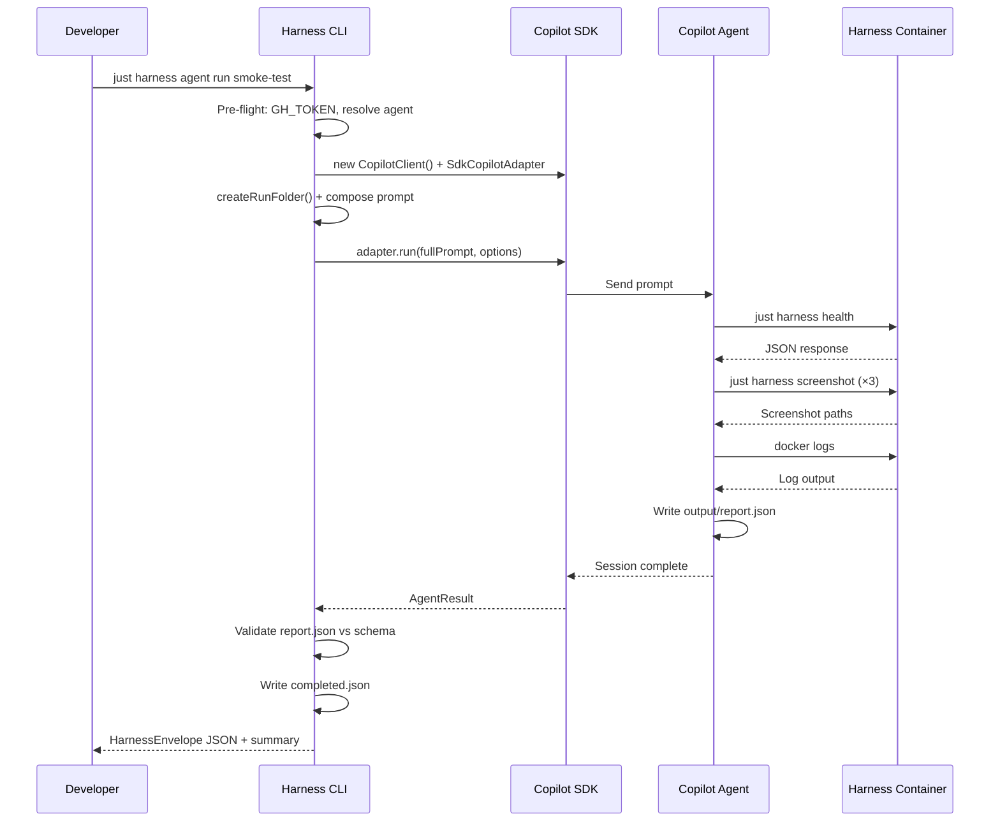

# Phase 3: Smoke Test Agent — Tasks Dossier

**Plan**: [agent-runner-plan.md](../../agent-runner-plan.md)
**Spec**: [agent-runner-spec.md](../../agent-runner-spec.md)
**Phase**: Phase 3: Smoke Test Agent
**Domain**: external (harness/)
**Generated**: 2026-03-07
**Status**: Landed

---

## Executive Briefing

- **Purpose**: Create the first real agent definition and validate the entire agent runner pipeline end-to-end against the live harness container. This is the capstone phase — everything from Phases 1-2 converges here.
- **What We're Building**: A `smoke-test` agent folder with prompt, output schema, and instructions files, then executing it live to produce a validated `report.json` with health checks, screenshots, console logs, server log summary, verdict, and retrospective.
- **Goals**:
  - ✅ Create `harness/agents/smoke-test/` agent definition (prompt.md, output-schema.json, instructions.md)
  - ✅ Execute smoke-test against running harness container via `just harness agent run smoke-test`
  - ✅ Produce a validated report with health, screenshots, verdict, and retrospective
  - ✅ Iterate on prompt/schema until at least 1 successful validated run
  - ✅ Update harness.md with smoke-test as the reference agent example
- **Non-Goals**:
  - ❌ Not building multiple agents — just the one smoke-test
  - ❌ Not running in CI — manual execution only
  - ❌ Not modifying the runner infrastructure (Phase 2 is done)
  - ❌ Not testing ClaudeCode adapter — Copilot SDK only

---

## Prior Phase Context

### Phase 1: SdkCopilotAdapter Improvements (✅ COMPLETE — `699fe8f`)

**A. Deliverables**:
- Modified `packages/shared/src/interfaces/copilot-sdk.interface.ts` — added `CopilotModelInfo`, `CopilotReasoningEffort`, `listModels()`, `setModel()`, expanded session configs
- Modified `packages/shared/src/adapters/sdk-copilot-adapter.ts` — wired model/reasoningEffort/workingDirectory/availableTools/excludedTools/systemMessage via conditional spread
- Modified `packages/shared/src/adapters/claude-code.adapter.ts` — `--model` flag passthrough
- Updated fakes with `listModels()`, `getLastSessionConfig()`, `setModel()`
- Added 2 contract tests (8 test runs across 4 adapters)

**B. Dependencies Exported**: `ICopilotClient`, `ICopilotSession`, `CopilotModelInfo`, `CopilotReasoningEffort`, `AgentRunOptions.model`, `AgentRunOptions.reasoningEffort` — all importable via `@chainglass/shared`

**C. Gotchas**: SDK ModelInfo uses nested `capabilities.supports.reasoningEffort` (not top-level boolean). `workingDirectory` in config is interface-only (not wired in adapter — use `AgentRunOptions.cwd`). `systemMessage` also interface-only.

**D. Incomplete**: None — all 12 tasks complete.

**E. Patterns**: Conditional spread `...(model && { model })`. Fake config capture via `getLastSessionConfig()`. Exact SDK shape matching for external types.

### Phase 2: Agent Runner Infrastructure (✅ COMPLETE — `dfd69b2` + review fixes `970c30a`)

**A. Deliverables**:
- 6 new modules: `types.ts`, `folder.ts`, `runner.ts`, `validator.ts`, `display.ts`, `commands/agent.ts`
- CLI commands: `agent run`, `agent list`, `agent history`, `agent validate`
- Error codes E120-E125 in `output.ts`
- 27 unit tests (folder: 12, runner: 8, validator: 7) — all with 5-field Test Doc blocks
- Workspace integration: `pnpm-workspace.yaml` + `.gitignore`
- Documentation: `harness.md` + `CLAUDE.md`

**B. Dependencies Exported** (for Phase 3):
- `AgentDefinition` — `{slug, dir, promptPath, schemaPath, instructionsPath}`
- `AgentRunConfig` — `{slug, model?, timeout?, reasoningEffort?}`
- `runAgent(adapter, definition, config, onEvent?)` — pure orchestrator
- `validateOutput(schemaPath, outputPath)` — ajv validation
- `listAgents()`, `resolveAgent()`, `createRunFolder()` — folder management
- CLI composition pattern: `CopilotClient` → `SdkCopilotAdapter` → `runAgent()`

**C. Gotchas**:
- Review found 6 issues (all fixed in `970c30a`): harness root resolution, report.json persistence, stderr.log collection, session ID capture for timeout, date separators in run IDs, Test Doc compliance
- `CopilotClient` → `ICopilotClient` still uses `as any` cast (acceptable until interface alignment)
- Run folder: `YYYY-MM-DDTHH-mm-ss-SSSZ-XXXX` format with 4-char hex suffix

**D. Incomplete**: None — all 15 tasks complete, review fixes applied.

**E. Patterns**:
- Composition root in CLI: only file importing `@github/copilot-sdk`
- Runner is pure function taking `IAgentAdapter` — testable with fakes
- `.addCommand()` for Commander.js nested subcommands
- Pre-validation before ajv (missing/empty/non-JSON)
- Incremental NDJSON: `appendFileSync` per event
- All display output to stderr; JSON envelope to stdout

---

## Pre-Implementation Check

| File | Exists? | Domain Check | Notes |
|------|---------|-------------|-------|
| `harness/agents/smoke-test/prompt.md` | ❌ Create | external (harness/) | Agent definition — main prompt |
| `harness/agents/smoke-test/output-schema.json` | ❌ Create | external (harness/) | JSON Schema for report validation |
| `harness/agents/smoke-test/instructions.md` | ❌ Create | external (harness/) | Agent-specific rules |
| `docs/project-rules/harness.md` | ✅ Modify | cross-domain | Add smoke-test as reference example |

**Concept Duplication**: No risk — agent definitions are content files (markdown + JSON schema), not code. No existing smoke-test or health-check agent exists anywhere.

**Harness Health Check**: ⚠️ Harness container not currently running. Phase 3 requires `just harness dev` + `just harness doctor --wait` before agent execution. Implementation agent MUST validate harness at start.

---

## Architecture Map



---

## Tasks

| Status | ID | Task | Domain | Path(s) | Done When | Notes |
|--------|-----|------|--------|---------|-----------|-------|
| [x] | T001 | Create smoke-test prompt.md | external | `/Users/jordanknight/substrate/066-wf-real-agents/harness/agents/smoke-test/prompt.md` | Prompt instructs agent to: health check, 3-viewport screenshots, console logs, server logs, report, retrospective | Workshop 001 §2 has reference prompt |
| [x] | T002 | Create smoke-test output-schema.json | external | `/Users/jordanknight/substrate/066-wf-real-agents/harness/agents/smoke-test/output-schema.json` | JSON Schema validates report with health, screenshots, verdict, retrospective fields; ajv passes | Workshop 001 §2 has reference schema |
| [x] | T003 | Create smoke-test instructions.md | external | `/Users/jordanknight/substrate/066-wf-real-agents/harness/agents/smoke-test/instructions.md` | Agent rules: output to run folder, no git commits, retry limits ≤2, honest retrospective | Workshop 001 §2 has reference instructions |
| [x] | T004 | Run smoke-test agent against live harness | external | `harness/agents/smoke-test/runs/<timestamp>/` | `just harness agent run smoke-test` completes with result "completed" or "degraded"; events.ndjson has tool calls; completed.json written | Requires: harness running, GH_TOKEN set |
| [x] | T005 | Iterate on prompt/schema based on run results | external | Same files as T001-T003 | At least 1 successful validated run with verdict pass or partial | May need multiple iterations — agent autonomy risk |
| [x] | T006 | Update harness.md with smoke-test example | cross-domain | `/Users/jordanknight/substrate/066-wf-real-agents/docs/project-rules/harness.md` | Smoke-test documented as reference agent with folder structure, execution command, and expected output | |

---

## Context Brief

### Key Findings from Plan

- **Finding 05 (High)**: SDK `listModels()` and `ReasoningEffort` type now exposed — smoke-test can optionally specify model via `--model` flag
- **Finding 06 (High)**: Commander.js `.addCommand()` pattern used — `just harness agent run smoke-test` is the execution command
- **Finding 08 (Medium)**: NDJSON writes are incremental — `events.ndjson` will show real-time tool calls during smoke-test

### Domain Dependencies

- `agents` domain: `IAgentAdapter`, `SdkCopilotAdapter`, `AgentEvent`, `AgentResult` — consumed by runner (Phase 2)
- `_platform/sdk`: `CopilotClient` from `@github/copilot-sdk` — instantiated in CLI composition root

### Domain Constraints

- Agent definitions are content files in `harness/agents/` — no code imports, no domain contracts
- `harness/agents/*/runs/` is gitignored — only definitions are committed
- Agent output path injected by runner as hint in the prompt: `"Write output to: <runDir>/output/report.json"`

### Harness Context

- **Boot**: `just harness dev` — health check: `just harness doctor --wait`
- **Interact**: CLI (`just harness health`, `just harness screenshot`), Browser via CDP, Docker logs
- **Observe**: Run folder artifacts — `events.ndjson`, `completed.json`, `output/report.json`, `stderr.log`
- **Maturity**: L3 (auto boot + browser interaction + structured evidence + CLI SDK)
- **Pre-phase validation**: Agent MUST boot harness and verify health before running smoke-test

### Reusable from Prior Phases

- Workshop 001 §2 has complete reference prompt, schema, and instructions — use as starting point
- Runner handles output path hint injection automatically
- Validator pre-validates (missing/empty/non-JSON) before ajv — helpful for first-run debugging
- Display shows real-time events to stderr — useful for monitoring agent progress

### Agent Execution Flow



### Smoke-Test Agent Interaction Sequence



---

## Discoveries & Learnings

_Populated during implementation by plan-6._

| Date | Task | Type | Discovery | Resolution | References |
|------|------|------|-----------|------------|------------|

---

## Directory Layout

```
docs/plans/070-harness-agent-runner/
  ├── agent-runner-plan.md
  ├── agent-runner-spec.md
  └── tasks/phase-3-smoke-test-agent/
      ├── tasks.md                  ← this file
      ├── tasks.fltplan.md          ← flight plan
      └── execution.log.md          # created by plan-6
```
