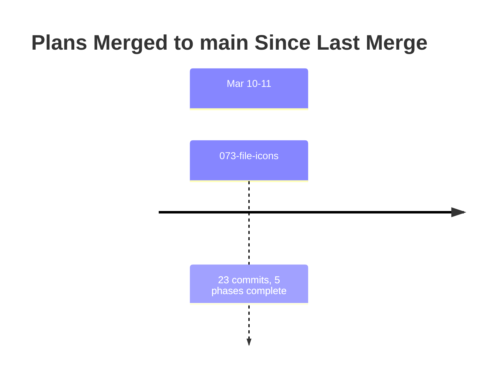
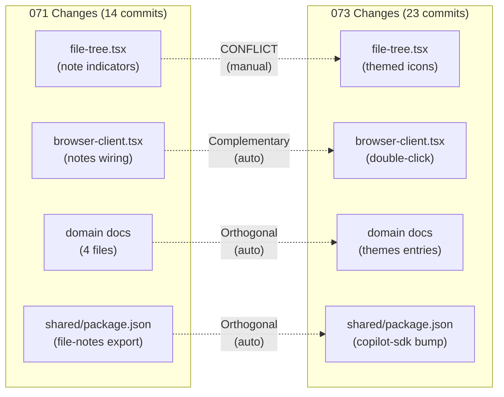

# Merge Plan: Integrating Upstream Changes (Round 2)

**Generated**: 2026-03-11T08:12Z
**Your Branch**: 071-pr-view @ 91893810
**Merging From**: origin/main @ 27d15d6d
**Common Ancestor**: b166271f (last merge point from Round 1)

---

## Executive Summary

### What Happened While You Worked

Since the last merge (Round 1), **1 plan** landed in main:

| Plan | Merged | Purpose | Risk to You | Domains Affected |
|------|--------|---------|-------------|------------------|
| 073-file-icons | ~10h ago | File-type icons across all surfaces using Material Icon Theme | **Medium** | _platform/themes (NEW), file-browser, _platform/panel-layout |

### Conflict Summary

- **Direct Conflicts**: 7 files (1 requires manual resolution, 6 auto-mergeable)
- **Semantic Conflicts**: 2 (FileTree icon swap + onDoubleSelect prop)
- **Regression Risks**: 2 (test mock divergence, icon import chain)

### Recommended Approach

```
1. Create backup branch
2. git merge origin/main (single merge — only 1 upstream plan)
3. Manually resolve file-tree.tsx (keep 071 note props + adopt 073 icons)
4. Auto-merge remaining 6 files
5. Run just fft to validate
```

---

## Timeline



---

## Upstream Plan Analysis

### Plan 073-file-icons

**Purpose**: Add file-type-specific icons across all file-presenting surfaces using Material Icon Theme (MIT, 1,117 SVGs) via a new `_platform/themes` infrastructure domain.

| Attribute | Value |
|-----------|-------|
| Merged | ~10 hours ago |
| Files Changed | 92 |
| Tests Added | 590 (icon-resolver + icon-components) |
| Conflicts with You | 7 files |
| Domains Affected | _platform/themes (NEW), file-browser, _platform/panel-layout |

**Key Changes**:
- Created entire `_platform/themes` infrastructure domain (icon resolver, manifest loader, FileIcon/FolderIcon components)
- Replaced Lucide `File`/`Folder`/`FolderOpen` icons with themed `FileIcon`/`FolderIcon` in FileTree, ChangesView, BinaryPlaceholder, AudioViewer
- Added `onDoubleSelect` prop to FileTree for double-click-to-edit behavior
- Added `rawFileBaseUrl` prop to FileViewerPanel
- Added `handleFileDoubleSelect` handler in browser-client.tsx
- Patched `@github/copilot-sdk` to 0.1.32 (ESM fix)
- Added Material Icon Theme dependency
- Added cache headers for `/icons/*` in next.config.mjs
- Added agent harness framework (code-review agent, justfile recipes)

---

## Conflict Map



---

## Conflict Analysis

### Conflict 1: file-tree.tsx (MANUAL RESOLUTION REQUIRED)

**Conflict Type**: Contradictory

**Your Change (071)**:
- Added `NoteIndicatorDot` import from `@/features/071-file-notes/components/note-indicator-dot`
- Added `filesWithNotes` and `onAddNote` props to FileTreeProps
- Added `StickyNote` to Lucide imports for context menu
- Added note indicator dot rendering next to file/folder names
- Added "Add Note" context menu item

**Upstream Change (073)**:
- Replaced Lucide `File`, `Folder`, `FolderOpen` imports with `FileIcon`, `FolderIcon` from `@/features/_platform/themes`
- Added `onDoubleSelect` prop to FileTreeProps
- Added `selectedOnMouseDownRef` + double-click detection logic
- Changed icon rendering from `<File />` to `<FileIcon filename={name} />` and `<Folder/FolderOpen />` to `<FolderIcon name={name} expanded={bool} />`

**Resolution Strategy**: Keep ALL 071 note props/logic + adopt ALL 073 icon changes:
1. Import `FileIcon`, `FolderIcon` from `_platform/themes` (replace Lucide File/Folder/FolderOpen)
2. Keep `NoteIndicatorDot` import and `StickyNote` from Lucide
3. Keep `filesWithNotes`, `onAddNote` props
4. Add `onDoubleSelect` prop from 073
5. Replace all `<File />` with `<FileIcon filename={name} />`
6. Replace all `<Folder />` / `<FolderOpen />` with `<FolderIcon name={name} expanded={bool} />`
7. Add double-click detection (selectedOnMouseDownRef, event.detail === 2)

**Verification**:
- [ ] TypeScript compiles with 0 errors
- [ ] Note indicator dots still render next to files with notes
- [ ] FileIcon/FolderIcon render themed icons
- [ ] Context menu "Add Note" still works
- [ ] Double-click fires onDoubleSelect

---

### Conflict 2: browser-client.tsx (AUTO-MERGEABLE)

**Conflict Type**: Complementary

**Your Change**: Added note management (useNotesOverlay, noteFilePaths, filter toggle, onAddNote handler)
**Upstream Change**: Added double-click handling (handleFileDoubleSelect, lastFileSelectionRef, rawFileBaseUrl)

**Resolution**: Git auto-merge — changes are in different code sections.

**Verification**:
- [ ] Both note management and double-click handlers present
- [ ] No import conflicts

---

### Conflict 3: docs/domains/file-browser/domain.md (AUTO-MERGEABLE)

**Conflict Type**: Complementary — both append different entries to same sections.

### Conflict 4: docs/domains/domain-map.md (AUTO-MERGEABLE)

**Conflict Type**: Orthogonal — non-overlapping content additions.

### Conflict 5: docs/c4/README.md (AUTO-MERGEABLE)

**Conflict Type**: Orthogonal — separate single-line additions.

### Conflict 6: docs/domains/registry.md (AUTO-MERGEABLE)

**Conflict Type**: Orthogonal — different registry entries appended.

### Conflict 7: packages/shared/package.json (AUTO-MERGEABLE)

**Conflict Type**: Orthogonal — 071 added `./file-notes` export, 073 bumped copilot-sdk version.

---

## Regression Risk Analysis

| Risk | Direction | Plan | Your Change | Likelihood | Test Command |
|------|-----------|------|-------------|------------|--------------|
| FileTree icon swap breaks note dots | Upstream->You | 073 | Note indicators use Lucide icons | Medium | `pnpm test -- file-tree` |
| Test mock divergence (FileIcon vi.mock) | Upstream->You | 073 | 073 adds vi.mock for FileIcon | High | `pnpm test -- file-tree.test` |
| Icon import chain (themes domain) | Upstream->You | 073 | New _platform/themes domain | Low | `pnpm build` |
| onDoubleSelect not wired | Upstream->You | 073 | 071 lacks double-click | Low | Manual test |

**Recommended Test Sequence:**
1. `just fft` — full lint + format + typecheck + test (catches everything)
2. Manual: verify file tree shows icons + note dots together

---

## Merge Execution Plan

### Phase 1: Backup + Merge

```bash
# Create backup branch
git branch backup-20260311-before-merge-b

# Fetch and merge
git fetch origin main
git merge origin/main

# If conflicts, resolve file-tree.tsx manually (see Conflict 1 resolution)
# Auto-resolve remaining 6 files
```

### Phase 2: Conflict Resolution (file-tree.tsx)

Resolution approach:
1. Accept upstream (073) as base for icon changes
2. Re-apply 071 additions (NoteIndicatorDot, filesWithNotes, onAddNote, context menu)
3. Keep both onDoubleSelect (073) and onAddNote (071) props

### Phase 3: Test File Updates

If file-tree.test.tsx conflicts:
- Accept 073's vi.mock for FileIcon/FolderIcon
- Keep 071's note-related test assertions
- Update icon queries from `'svg'` to `'svg, img'` if needed

### Phase 4: Validation

```bash
# Full quality check
just fft

# Expected: all tests pass including 590 new icon tests + 071 tests
```

---

## Human Approval Required

Before executing this merge plan, please review:

### Summary Review
- [ ] I understand Plan 073 added file-type icons via _platform/themes domain
- [ ] I understand file-tree.tsx needs manual conflict resolution
- [ ] I understand 6 other files auto-merge cleanly

### Risk Acknowledgment
- [ ] I will run `just fft` after merging
- [ ] Backup branch provides rollback path

---

**Proceed with merge execution?**

Type "PROCEED" to begin merge execution, or "ABORT" to cancel.

---

## Post-Merge Validation Checklist

- [ ] All tests pass: `just fft`
- [ ] No new linting errors
- [ ] Type checks pass
- [ ] FileTree renders themed icons + note indicator dots
- [ ] PR View overlay still works
- [ ] Notes overlay still works
- [ ] Domain docs reconciled (registry.md, domain-map.md reflect both 071 + 073)
