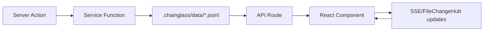
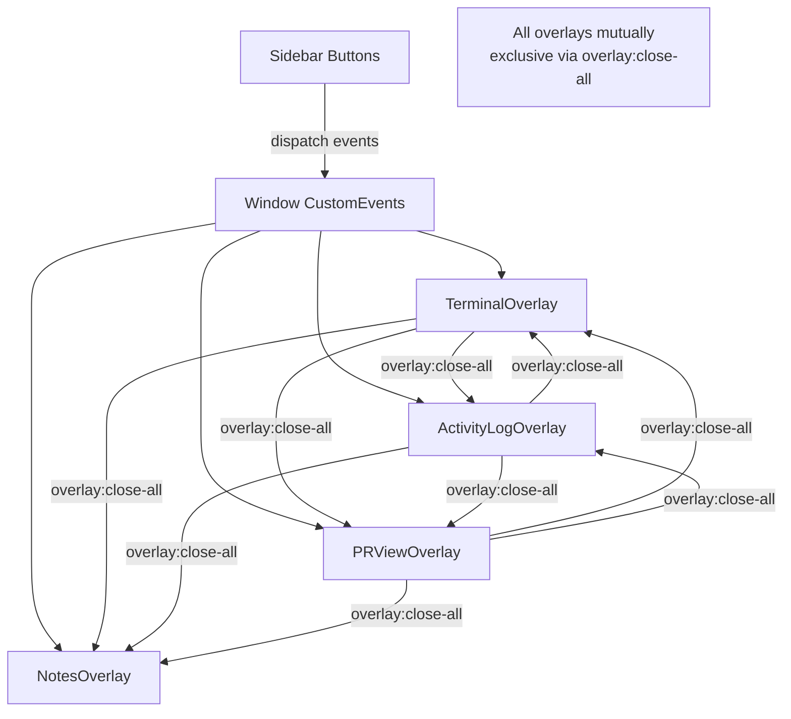
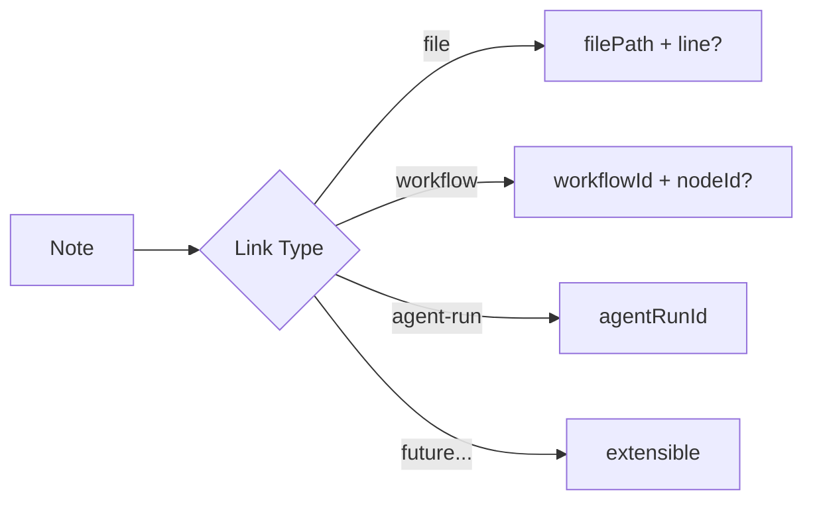

# Research Report: PR View & File Notes

**Generated**: 2026-03-08T00:05:00Z
**Research Query**: "PR View (GitHub-style diff overlay) and File Notes (generic annotation system)"
**Mode**: Pre-Plan (branch-detected: `071-pr-view`)
**Location**: `docs/plans/071-pr-view/research-dossier.md`
**FlowSpace**: Available
**Findings**: 74 total (IA:10, DC:10, PS:10, QT:10, IC:11, DE:10, PL:15, DB:8)

## Executive Summary

### What It Does
Two new business domains: (1) **PR View** — a GitHub-style pull request diff overlay showing all changed files with collapsible diffs, mark-as-reviewed tracking, and dynamic updates; (2) **File Notes** — a generic annotation system allowing humans and agents to attach markdown notes to files, lines, workflow nodes, or agent runs, with CLI integration, threading, and completion tracking.

### Business Purpose
PR View gives developers a single-screen view of all worktree changes with review tracking, replacing the current flat ChangesView. File Notes enables human↔agent collaboration by letting either party annotate code with context that persists across sessions and merges across worktrees.

### Key Insights
1. **Both features follow proven overlay patterns** — Terminal (Plan 064) and Activity Log (Plan 065) established the exact overlay + mutual exclusion + sidebar button + SDK command pattern needed. ~90% of structural code can be adapted from these exemplars.
2. **Per-worktree JSONL persistence is production-proven** — Activity Log's append-only JSONL pattern with dedup, filtering, and API routes provides the data layer template. ADR-0008 (split storage) and ADR-0010 (central event notification) govern how to extend `.chainglass/data/`.
3. **File Notes requires a generic link-type design** — The "to" field (human/agent), link types (file/workflow/agent-run), and threading model make this a cross-cutting annotation system. It should be a provider domain consumed by file-browser, workflow-ui, and agents — following the `workflow-events` pattern.

### Quick Stats
- **Reusable Components**: DiffViewer, ChangesView, FileTree, PanelShell, overlay providers
- **Existing Dependencies**: 24 domains in registry, 11 key interfaces documented
- **Test Infrastructure**: 422 test files, contract test pattern, 8 test fakes
- **Prior Learnings**: 15 relevant discoveries from Plans 041–068
- **Domains**: 2 new business domains recommended (pr-view, file-notes)
- **Complexity**: High (cross-domain, CLI + web + SDK, per-worktree data)

## How It Currently Works

### Entry Points (Relevant Existing Code)

| Entry Point | Type | Location | Purpose |
|------------|------|----------|---------|
| ChangesView | Component | `041-file-browser/components/changes-view.tsx` | Flat file list with status badges (M/A/D/?/R) |
| Working changes service | Service | `041-file-browser/services/working-changes.ts` | Parses `git status --porcelain=v1` |
| Changed-files service | Service | `041-file-browser/services/changed-files.ts` | `git diff --name-only` for filter |
| DiffViewer | Component | `components/viewers/diff-viewer.tsx` | Split/unified diff via `@git-diff-view/react` |
| fetchGitDiff | Server Action | `app/actions/file-actions.ts` | `getGitDiff(filePath, cwd)` → diff string |
| fetchDiffStats | Server Action | `app/actions/file-actions.ts` | `getDiffStats(worktreePath)` → { files, insertions, deletions } |
| TerminalOverlay | Overlay | `064-terminal/hooks/use-terminal-overlay.tsx` | Reference overlay pattern |
| ActivityLogOverlay | Overlay | `065-activity-log/hooks/use-activity-log-overlay.tsx` | Reference overlay + JSONL pattern |
| Activity Log Writer | Service | `065-activity-log/lib/activity-log-writer.ts` | JSONL append with dedup |
| Activity Log Reader | Service | `065-activity-log/lib/activity-log-reader.ts` | JSONL read with filtering |

### Core Execution Flow — Overlay Pattern

1. **Provider mounts in layout** — `apps/web/app/(dashboard)/workspaces/[slug]/layout.tsx` wraps workspace pages with overlay providers (terminal, activity-log)
2. **Sidebar button dispatches toggle event** — Custom window event (e.g., `terminal:toggle`)
3. **Provider listens and toggles state** — `useEffect` listens for toggle event; dispatches `overlay:close-all` before opening (mutual exclusion); uses `isOpeningRef` guard to prevent self-close during synchronous dispatch
4. **Panel renders conditionally** — Fixed-position panel anchored to `data-terminal-overlay-anchor` element in workspace layout
5. **Panel fetches data** — API route call (e.g., `GET /api/activity-log?worktree=...`)
6. **SDK command registered** — `registerCommand('activity-log.toggleOverlay', ...)` in sdk-bootstrap.ts

### Data Flow — Per-Worktree JSONL Persistence



1. **Write**: Server action → service function → append JSONL line to `.chainglass/data/` file
2. **Read**: API route → service function → read + filter JSONL lines → return to client
3. **Live updates**: FileChangeHub watches `.chainglass/data/`, SSE broadcasts changes, client refetches

### State Management
- **Overlay open/close**: React context + custom window events (not GlobalStateSystem)
- **File change tracking**: `useFileChanges` hook from `_platform/events` (SSE-based)
- **Reviewed status (PR View)**: Per-worktree JSONL in `.chainglass/data/pr-view-state.jsonl`
- **Notes data**: Per-worktree JSONL in `.chainglass/data/notes.jsonl`

## Architecture & Design

### Component Map — PR View

| Component | Role | Location (Planned) |
|-----------|------|-------------------|
| PRViewOverlayProvider | Context + toggle + mutual exclusion | `features/071-pr-view/hooks/use-pr-view-overlay.tsx` |
| PRViewOverlayPanel | Fixed-position overlay rendering all diffs | `features/071-pr-view/components/pr-view-overlay-panel.tsx` |
| PRViewFileList | Left sidebar: changed files with status badges | `features/071-pr-view/components/pr-view-file-list.tsx` |
| PRViewDiffSection | Collapsible diff per file with reviewed checkbox | `features/071-pr-view/components/pr-view-diff-section.tsx` |
| PRViewState service | Read/write reviewed status, JSONL persistence | `features/071-pr-view/lib/pr-view-state.ts` |
| API route | `GET /api/pr-view?worktree=...` | `app/api/pr-view/route.ts` |
| SDK contribution | Toggle command, keybinding | `features/071-pr-view/sdk/contribution.ts` |

### Component Map — File Notes

| Component | Role | Location (Planned) |
|-----------|------|-------------------|
| INoteService | Interface: CRUD + query + threading | `packages/shared/src/interfaces/note.interface.ts` |
| NoteWriter | Append note to JSONL | `features/071-file-notes/lib/note-writer.ts` |
| NoteReader | Read + filter notes | `features/071-file-notes/lib/note-reader.ts` |
| useNotes hook | Fetch notes for a target | `features/071-file-notes/hooks/use-notes.ts` |
| useNoteIndicator hook | Boolean: does this file have notes? | `features/071-file-notes/hooks/use-note-indicator.ts` |
| NoteModal | Add/view note dialog | `features/071-file-notes/components/note-modal.tsx` |
| NotesOverlayPanel | All notes collated view | `features/071-file-notes/components/notes-overlay-panel.tsx` |
| NotesOverlayProvider | Context + toggle | `features/071-file-notes/hooks/use-notes-overlay.tsx` |
| NoteIndicatorDot | Tree decoration | `features/071-file-notes/components/note-indicator-dot.tsx` |
| API routes | CRUD endpoints | `app/api/file-notes/route.ts` |
| CLI command | `cg notes list/add/complete` | `apps/cli/src/commands/notes.command.ts` |
| SDK contribution | Add Note, List Notes, keybindings | `features/071-file-notes/sdk/contribution.ts` |

### Design Patterns Identified

1. **Overlay Mutual Exclusion** (PS-01): Provider dispatches `overlay:close-all` CustomEvent before opening; all overlays listen and self-close; `isOpeningRef` guard prevents self-close during synchronous dispatch. Z-index map: 44=terminal/activity/pr-view, 45=agent, 50=CRT.

2. **JSONL Append-Only Persistence** (PS-04): Activity Log's proven pattern — append with dedup (last 50 lines lookback), read with filtering (limit, since, source). Located in `.chainglass/data/`.

3. **Feature Folder Convention** (PS-02): `apps/web/src/features/NNN-feature-name/` with subdirs: `components/`, `hooks/`, `services/`, `lib/`, `sdk/`, `types.ts`, `index.ts`.

4. **Server Action + Service Layer** (PS-03): `'use server'` action → `requireAuth()` → service function (pure, testable) → `IFileSystem` abstraction. Return `{ ok: true; data } | { ok: false; error }`.

5. **SDK Contribution Manifest** (PS-05): Static `SDKContribution` with commands[], settings[], keybindings[]. Register in `sdk-bootstrap.ts`.

6. **First-Class Domain Concepts** (DE-06, ADR-0011): "If explaining to a new developer, do I say 'use the service' or 'call these 4 functions'?" — Both features warrant first-class services (INoteService, IPRViewService).

### System Boundaries

- **PR View boundary**: Owns overlay, reviewed-file tracking, diff aggregation. Does NOT own DiffViewer rendering (consumes from `_platform/viewer`), file change detection (consumes from `file-browser` services), or file tree (consumes/adapts from `file-browser`).
- **File Notes boundary**: Owns note CRUD, link-type system, threading, CLI commands. Does NOT own tree rendering (provides indicator component consumed by `file-browser`), workflow integration (provides hooks consumed by `workflow-ui`), or agent integration (provides hooks consumed by `agents`).

## Dependencies & Integration

### PR View Dependencies

| Dependency | Type | Contract Used | Risk if Changed |
|------------|------|---------------|-----------------|
| _platform/viewer | Required | DiffViewer | Medium — core rendering |
| _platform/panel-layout | Required | PanelShell, overlay anchor | Low — stable |
| _platform/events | Required | useFileChanges, toast() | Low — stable |
| _platform/sdk | Required | registerCommand, keybinding | Low — stable |
| _platform/file-ops | Required | IFileSystem (JSONL read/write) | Low — stable |
| _platform/workspace-url | Required | workspaceHref | Low — stable |
| file-browser | Required | working-changes service, changed-files service | Medium — may need to extract shared service |

### File Notes Dependencies

| Dependency | Type | Contract Used | Risk if Changed |
|------------|------|---------------|-----------------|
| _platform/file-ops | Required | IFileSystem (JSONL persistence) | Low |
| _platform/events | Required | ICentralEventNotifier, toast() | Low |
| _platform/sdk | Required | registerCommand, keybinding | Low |
| _platform/workspace-url | Required | workspaceHref | Low |
| _platform/panel-layout | Required | PanelShell, overlay anchor | Low |

### Domains That Will Consume File Notes

| Consumer | Contract | How |
|----------|----------|-----|
| file-browser | useNoteIndicator, NoteIndicatorDot | Tree decoration, filter |
| workflow-ui | useNotes(linkType='workflow', targetId) | Workflow node notes |
| agents | useNotes(linkType='agent-run', targetId) | Agent run notes |
| CLI | INoteService via DI | `cg notes list/add/complete` |

### Integration Architecture — Overlay Group



### File Notes Link Type System



**Note Data Model**:
```typescript
interface Note {
  id: string;                         // uuid
  linkType: 'file' | 'workflow' | 'agent-run';  // extensible
  target: string;                     // file path, workflow ID, etc.
  targetMeta?: {                      // link-type-specific
    line?: number;                    // for file notes
    nodeId?: string;                  // for workflow notes
  };
  content: string;                    // markdown
  to?: 'human' | 'agent';            // optional addressee
  status: 'open' | 'complete';
  completedBy?: 'human' | 'agent';
  author: 'human' | 'agent';
  authorId?: string;                  // agent ID if applicable
  threadId?: string;                  // for replies
  createdAt: string;                  // ISO-8601
  updatedAt: string;                  // ISO-8601
}
```

**PR View State Data Model**:
```typescript
interface PRViewFileState {
  filePath: string;
  reviewed: boolean;
  reviewedAt?: string;               // ISO-8601
  reviewedContentHash?: string;      // detect changes since review
  collapsed: boolean;
}
```

## Quality & Testing

### Testing Strategy (from QT findings)

| Aspect | Pattern | Reference |
|--------|---------|-----------|
| Overlay UI | React Testing Library + fixture data | `activity-log-overlay.test.tsx` |
| JSONL services | tmpdir fixtures + helper functions | `activity-log-{reader,writer}.test.ts` |
| Test fakes | Class-based doubles implementing interfaces | `test/fakes/fake-pty.ts` |
| Contract tests | Factory pattern: same tests against real + fake | `state-system.contract.ts` |
| React hooks | `renderHook()` + `makeFakeFetch()` | `use-file-filter.test.ts` |
| Git integration | Real git (no mocking) | `git-diff-action.test.ts` |
| CLI commands | Injectable output + fake services | `cli-drive-handler.test.ts` |
| All tests | Test Doc comments (Why/Contract/Usage/Contribution/Example) | Constitution P4 |

### Key Testing Rules
- **No `vi.mock()`** — use fakes (Constitution P4)
- **Contract tests required** — factory runs same tests against real + fake implementations
- **Test docs are spec** — every test documents Why/Contract/Usage/Contribution/Example
- **Export provider context for testing** — tests inject fakes via `<Context.Provider value={fake}>`

### Recommended Test Files

| Feature | Test Location | Focus |
|---------|--------------|-------|
| PR View overlay | `test/unit/web/features/071-pr-view/` | Overlay toggle, mutual exclusion |
| PR View state | `test/unit/web/features/071-pr-view/` | JSONL read/write, reviewed status |
| File Notes writer | `test/unit/web/features/071-file-notes/` | Append, dedup, threading |
| File Notes reader | `test/unit/web/features/071-file-notes/` | Filter by linkType, target, to, status |
| File Notes hooks | `test/unit/web/features/071-file-notes/` | useNotes, useNoteIndicator |
| File Notes CLI | `test/unit/cli/commands/` | notes list, add, complete |
| Contracts | `test/contracts/note-service.contract.ts` | INoteService real + fake parity |
| Fakes | `test/fakes/fake-note-service.ts` | State setup, call inspection |

## Modification Considerations

### ✅ Safe to Modify
1. **Workspace layout** — Adding overlay providers/wrappers (proven pattern, done 3x before)
2. **Sidebar navigation** — Adding buttons to `WORKSPACE_NAV_ITEMS` array
3. **SDK bootstrap** — Adding command registrations (append-only)
4. **CLI index** — Adding `registerNotesCommand(program)` (append-only)

### ⚠️ Modify with Caution
1. **FileTree component** — Adding note indicator dots requires careful prop threading; review PL-05 (Radix focus race), PL-10 (state closure vs useRef)
2. **BrowserClient** — Complex component; any new wiring should follow PL-07 (async state ordering), PL-15 (root-level refresh gap)
3. **Changed-files services** — PR View may need to extract shared services from file-browser domain; coordinate boundary carefully

### 🚫 Danger Zones
1. **DiffViewer internals** — Uses `@git-diff-view/react` with Shiki singleton (FIX-002); extend via wrapper, not modification
2. **GlobalStateSystem internals** — Stable but subtle; review PL-02 (pin defaults), PL-03 (pattern subscriptions), PL-11 (useCallback deps)

### Extension Points
1. **Overlay system** — Designed for new overlays (dispatch `overlay:close-all`, wire provider + panel)
2. **PanelMode** — Extensible union type: `'tree' | 'changes' | 'sessions' | ...`
3. **CLI command registration** — `registerXyzCommand(program: Command)` pattern
4. **SDK contribution** — Static manifest with commands[], settings[], keybindings[]
5. **`.chainglass/data/`** — Designed for new JSONL data files per ADR-0008
6. **CentralEventNotifier** — Add new domain event adapters per ADR-0010
7. **Link types** — File Notes link-type system is extensible by design

## Prior Learnings (From Previous Implementations)

### 📚 PL-01: React State Registration Order
**Source**: Plan 053 Phase 5 (Worktree Exemplar)
**Type**: gotcha
**What**: Use `useState` initializers (not useEffect) for domain registration to ensure it fires before children render. Make idempotent with `.some()` guard for StrictMode/HMR safety.
**Action**: When registering PR View or File Notes state domains, use `useState(() => { system.registerDomain(...) })` pattern.

### 📚 PL-02: Pin Default Values in Hooks
**Source**: Plan 053 Phase 4 (React Integration)
**Type**: gotcha
**What**: Inline defaults create new object identity each render. Wrap in `useRef(defaultValue).current` to prevent infinite re-render loops in useSyncExternalStore.
**Action**: Any `useGlobalState(path, defaultValue)` calls must pin the default.

### 📚 PL-03: Pattern Subscriptions, Not Wildcards
**Source**: Plan 053 Phase 4
**Type**: unexpected-behavior
**What**: `subscribe('*', cb)` triggers getSnapshot on EVERY publish across ALL domains. Always subscribe with actual pattern.
**Action**: PR View and File Notes state subscriptions must use specific patterns like `pr-view:**` or `file-notes:*:status`.

### 📚 PL-04: Export Provider Context for Testing
**Source**: Plan 053 Phase 4
**Type**: decision
**What**: Tests can't inject fakes if provider creates context internally. Export the context object.
**Action**: Export `PRViewContext` and `FileNotesContext` from their providers.

### 📚 PL-05: Radix ContextMenu Focus Race
**Source**: Plan 068 Phase 2 (FileTree UI)
**Type**: gotcha
**What**: Menu restores focus to trigger after closing, racing with InlineEditInput auto-focus. Use `requestAnimationFrame(() => inputRef.current?.focus())`.
**Action**: If adding context menu to notes or PR view file list, defer focus with rAF.

### 📚 PL-06: String Prefix Matching False-Positives
**Source**: Plan 068 Phase 2
**Type**: gotcha
**What**: `"src-utils".startsWith("src")` is true. Always use `startsWith(path + '/')` for path ancestor checks.
**Action**: Note indicator dot matching must use `startsWith(path + '/')` for directory-level note detection.

### 📚 PL-07: Async State Update Ordering
**Source**: Plan 068 Phase 3 (BrowserClient Integration)
**Type**: gotcha
**What**: If `handleRefreshDir` is async, immediately calling `handleSelect` without await will fail because tree doesn't have new entry yet. Always `await` before dependent ops.
**Action**: After adding a note, `await` the refresh before navigating to the note's file.

### 📚 PL-08: Overlay Mutual Exclusion Pattern
**Source**: Plan 065 Phase 3 (Activity Log)
**Type**: decision
**What**: Dispatch `overlay:close-all` CustomEvent before opening. All overlays listen and self-close. Use `isOpeningRef` guard to prevent self-close during dispatch (synchronous, race-free). Z-index: 44=terminal/activity, 45=agent, 50=CRT.
**Action**: PR View and File Notes overlays must follow this exact pattern. Use z-index 44.

### 📚 PL-09: Overlay Response Caching
**Source**: Plan 065 Phase 3
**Type**: insight
**What**: Cache API responses with 10s staleness window using `useRef` + timestamp. Reopens within 10s show cache immediately.
**Action**: PR View overlay should cache diff data; File Notes overlay should cache note lists.

### 📚 PL-10: State Closure vs. useRef
**Source**: Plan 068 Phase 3
**Type**: gotcha
**What**: Mount-only useEffect captures initial state in closure. Use `useRef` pattern to read current value.
**Action**: Any mount-only effects in PR View/File Notes must use refs for mutable state access.

### 📚 PL-11: useCallback Deps for useSyncExternalStore
**Source**: Plan 053 Phase 4
**Type**: gotcha
**What**: If subscribe/getSnapshot aren't wrapped in `useCallback([system, path])`, React re-subscribes every render.
**Action**: All `useSyncExternalStore` usage must memoize subscribe and getSnapshot.

### 📚 PL-12: Shared Pkg Build Order
**Source**: Plan 059 Subtask 001
**Type**: workaround
**What**: After adding type exports to `packages/shared`, run `pnpm --filter @chainglass/shared build` BEFORE web typecheck.
**Action**: After adding INoteService to packages/shared, rebuild shared before running typecheck.

### 📚 PL-13: Biome Rejects Invalid ARIA
**Source**: Plan 068 Phase 2
**Type**: gotcha
**What**: `div[role="option"]` fails; use `<button>` with `aria-current` or semantic elements instead.
**Action**: Note list items and PR view file list items should use semantic elements.

### 📚 PL-14: Create vs. Rename Blur Behavior
**Source**: Plan 068 Phase 2
**Type**: decision
**What**: Create should cancel on blur (`commitOnBlur={false}`), rename should commit (`commitOnBlur={true}`).
**Action**: Note editing should commit on blur (editing existing content).

### 📚 PL-15: Root-Level Tree Refresh Gap
**Source**: Plan 068 Phase 3
**Type**: debt
**What**: `handleRefreshDir` updates childEntries but root entries come from server prop. Need `handleRefreshRoot` for root-level changes.
**Action**: If notes change the tree at root level, ensure refresh mechanism covers root entries.

### Prior Learnings Summary

| ID | Type | Source Plan | Key Insight | Action |
|----|------|-------------|-------------|--------|
| PL-01 | gotcha | 053-P5 | useState init for registration | Use useState initializer |
| PL-02 | gotcha | 053-P4 | Pin defaults in hooks | useRef for defaults |
| PL-03 | unexpected | 053-P4 | Specific patterns, not wildcards | Use domain-scoped patterns |
| PL-04 | decision | 053-P4 | Export context for testing | Export contexts |
| PL-05 | gotcha | 068-P2 | Radix focus race | rAF for focus |
| PL-06 | gotcha | 068-P2 | Path prefix false positives | Append '/' to path |
| PL-07 | gotcha | 068-P3 | Async ordering | Await before dependent ops |
| PL-08 | decision | 065-P3 | Overlay mutual exclusion | isOpeningRef guard pattern |
| PL-09 | insight | 065-P3 | Cache overlay responses | 10s staleness window |
| PL-10 | gotcha | 068-P3 | Closure captures initial | Use useRef |
| PL-11 | gotcha | 053-P4 | Memoize subscribe/snapshot | useCallback with deps |
| PL-12 | workaround | 059-ST1 | Shared pkg build order | Build shared first |
| PL-13 | gotcha | 068-P2 | Biome ARIA validation | Semantic elements |
| PL-14 | decision | 068-P2 | Blur behavior | Commit on blur for edits |
| PL-15 | debt | 068-P3 | Root refresh gap | Handle root-level refresh |

## Domain Context

### Existing Domains Relevant to This Research

| Domain | Relationship | Relevant Contracts | Key Components |
|--------|-------------|-------------------|----------------|
| file-browser | Directly relevant | ChangesView, FileTree, working-changes, changed-files, fileBrowserParams | Tree decoration, changed file data, panel modes |
| _platform/viewer | Directly relevant | DiffViewer, FileViewer, highlightCodeAction, detectContentType | Diff rendering |
| _platform/panel-layout | Directly relevant | PanelShell, LeftPanel, MainPanel, PanelMode, overlay anchor | Layout structure |
| terminal | Reference pattern | TerminalOverlayPanel, useTerminalOverlay, overlay:close-all | Overlay exemplar |
| activity-log | Reference pattern | appendActivityLogEntry, readActivityLog, JSONL persistence | Data + overlay exemplar |
| _platform/events | Directly relevant | ICentralEventNotifier, useFileChanges, useSSE, toast() | Live updates |
| _platform/sdk | Directly relevant | IUSDK, ICommandRegistry, SDKContribution | Commands, keybindings |
| _platform/state | Tangential | IStateService, useGlobalState | Optional for reactive state |
| _platform/file-ops | Directly relevant | IFileSystem, IPathResolver | File read/write for JSONL |
| agents | Consumer (future) | useAgentOverlay | Notes on agent runs |
| workflow-ui | Consumer (future) | Workflow canvas | Notes on workflow nodes |

### Domain Map Position

PR View sits as a **leaf consumer** — it depends downward on viewer, events, panel-layout, file-ops, and sdk but nothing depends on it. It also consumes changed-files services from file-browser.

File Notes sits as a **provider domain** — it exposes contracts (INoteService, useNotes, NoteIndicatorDot) consumed by file-browser (tree indicators), workflow-ui (node notes), agents (agent-run notes), and CLI.

### Potential Domain Actions

- **Create new domain: `pr-view`** — New business domain owning overlay, reviewed-file tracking, diff aggregation
- **Create new domain: `file-notes`** — New business domain owning note CRUD, link-type system, threading, CLI commands
- **Update `file-browser`** — Consume NoteIndicatorDot for tree decoration, add notes filter to left panel
- **Update `docs/domains/registry.md`** — Add 2 new rows
- **Update `docs/domains/domain-map.md`** — Add 2 new nodes + contract arrows

## Critical Discoveries

### 🚨 Critical Finding 01: Overlay Mutual Exclusion Is Proven But Manual
**Impact**: Critical
**Source**: IA-02, PL-08, PS-01, DE-02
**What**: The overlay system uses browser CustomEvents for coordination. Each overlay must manually implement the `overlay:close-all` listener + `isOpeningRef` guard. There is no shared abstraction — each overlay re-implements this.
**Why It Matters**: Adding 2 more overlays (PR View, File Notes) increases the risk of subtle bugs in the mutual exclusion. The pattern works but is duplicated.
**Recommendation**: Consider extracting a shared `createOverlayProvider(name)` factory. However, this is optional — the existing copy-paste pattern is working fine for 3 overlays and would work for 5.

### 🚨 Critical Finding 02: File Notes Link-Type System Needs Upfront Design
**Impact**: Critical
**Source**: DB-02, DB-04, IC-07
**What**: The user requires notes on files, workflow nodes, and agent runs. The link-type must be designed generically from day one to avoid refactoring later. The `workflow-events` domain provides a good model for a domain that touches many others without circular dependencies.
**Why It Matters**: If link types are hardcoded to files only, adding workflow/agent links later will require schema migration.
**Required Action**: Design the `linkType` + `target` + `targetMeta` schema before implementation.

### 🚨 Critical Finding 03: PR View Data Must Survive Git Operations
**Impact**: Critical
**Source**: DE-01, IA-03
**What**: User specifies PR View data is per-worktree and committed. The "reviewed" status must invalidate when a file changes. This means storing a content hash alongside the reviewed flag, and re-checking on each view.
**Why It Matters**: If reviewed status doesn't auto-invalidate, users see stale "reviewed" badges on changed files.
**Required Action**: Store `reviewedContentHash` (git blob SHA or similar) and compare on display.

### 🚨 Critical Finding 04: Dangerous Delete Operations Need Extra Confirmation
**Impact**: High
**Source**: User requirement
**What**: "Delete all notes for file" and "Delete all notes across the whole project" must be behind a very clear dialogue — user suggested "type Y E E S" rather than simple yes/no.
**Why It Matters**: Accidental bulk deletion of notes is unrecoverable.
**Required Action**: Implement a type-to-confirm dialog (like GitHub's repository deletion confirmation).

### 🚨 Critical Finding 05: PR View Left Tree Should Use Existing ChangesView
**Impact**: High
**Source**: User requirement, IA-01
**What**: User explicitly says "exists already, but is not tree form — but that is fine for now, just use what we have already" for the left changed-files view. Don't build a tree form — reuse/adapt the existing flat ChangesView.
**Why It Matters**: Avoids scope creep. The flat list with status badges is sufficient for v1.
**Required Action**: Reuse ChangesView (possibly with minor adaptations) in PR View's left panel.

## Supporting Documentation

### Related ADRs
- **ADR-0008**: Workspace split storage data model — governs `.chainglass/data/` structure
- **ADR-0010**: Central domain event notification — governs domain event adapters + SSE broadcasting
- **ADR-0011**: First-class domain concepts — signals for when to create a service vs. loose functions

### Key Code References
| File | Relevance |
|------|-----------|
| `apps/web/src/features/065-activity-log/lib/activity-log-writer.ts` | JSONL writer exemplar |
| `apps/web/src/features/065-activity-log/lib/activity-log-reader.ts` | JSONL reader exemplar |
| `apps/web/src/features/064-terminal/hooks/use-terminal-overlay.tsx` | Overlay provider exemplar |
| `apps/web/src/features/065-activity-log/hooks/use-activity-log-overlay.tsx` | Overlay provider exemplar |
| `apps/web/src/components/viewers/diff-viewer.tsx` | DiffViewer component |
| `apps/web/src/features/041-file-browser/components/changes-view.tsx` | ChangesView component |
| `apps/web/src/features/041-file-browser/services/working-changes.ts` | Git status parser |
| `apps/web/src/features/041-file-browser/components/file-tree.tsx` | FileTree component |
| `apps/web/app/(dashboard)/workspaces/[slug]/layout.tsx` | Workspace layout (mount overlays) |
| `apps/web/src/lib/sdk/sdk-bootstrap.ts` | SDK command registration |
| `apps/cli/src/commands/workflow.command.ts` | CLI command pattern |
| `docs/how/workspaces/4-adding-domains.md` | 9-step domain creation guide |

## Recommendations

### If Building PR View
1. **Start with overlay shell** — Provider, panel, sidebar button, SDK command (copy terminal pattern)
2. **Wire changed-files data** — Reuse existing services, fetch all changed files + diff stats
3. **Render collapsible diff sections** — Wrap DiffViewer in collapsible containers per file
4. **Add reviewed tracking** — JSONL state with content hash invalidation
5. **Add dynamic updates** — Subscribe to useFileChanges for live refresh
6. **Add left panel file list** — Reuse/adapt ChangesView with click-to-scroll

### If Building File Notes
1. **Design data model first** — Note type with generic link-type system
2. **Build JSONL persistence** — Writer + reader following activity-log pattern
3. **Build API routes** — CRUD endpoints with workspace/worktree scoping
4. **Build INoteService interface** — In packages/shared for CLI + web consumption
5. **Build CLI commands** — `cg notes list/add/complete`
6. **Build web UI** — Modal for add/view, overlay for all-notes, tree indicator dots
7. **Wire consumers** — File tree indicators, tree filter, sidebar button

### Build Order Recommendation
Build File Notes first — it's the more foundational system (consumed by multiple domains). PR View can consume notes for inline commenting on diffs (future).

## External Research Opportunities

No external research gaps identified — all patterns are well-established in the codebase with proven exemplars.

## Appendix: File Inventory

### Exemplar Files (Copy-Adapt)

| File | Purpose | Lines |
|------|---------|-------|
| `features/064-terminal/hooks/use-terminal-overlay.tsx` | Overlay provider pattern | ~60 |
| `features/065-activity-log/lib/activity-log-writer.ts` | JSONL writer | ~80 |
| `features/065-activity-log/lib/activity-log-reader.ts` | JSONL reader | ~60 |
| `features/065-activity-log/hooks/use-activity-log-overlay.tsx` | Overlay + toggle | ~50 |
| `features/065-activity-log/components/activity-log-overlay-panel.tsx` | Overlay panel UI | ~100 |
| `features/041-file-browser/components/changes-view.tsx` | Changed files list | ~100 |
| `features/041-file-browser/sdk/contribution.ts` | SDK manifest | ~50 |
| `features/041-file-browser/sdk/register.ts` | SDK register | ~30 |
| `app/api/activity-log/route.ts` | API route pattern | ~40 |
| `cli/src/commands/workflow.command.ts` | CLI command pattern | ~100 |

### Configuration Files
| File | Relevance |
|------|-----------|
| `vitest.config.ts` | Test configuration |
| `biome.json` | Lint rules |
| `tsconfig.json` | TypeScript config |
| `packages/shared/package.json` | Shared package exports |

## Next Steps

1. Run `/plan-1b-specify` to create the feature specification
2. Or `/plan-2c-workshop` if deep design exploration is needed for the note link-type system or PR View data model

---

**Research Complete**: 2026-03-08T00:05:00Z
**Report Location**: `docs/plans/071-pr-view/research-dossier.md`
