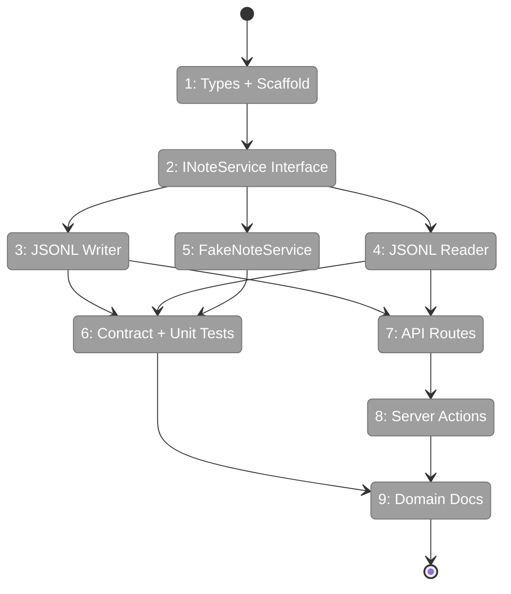
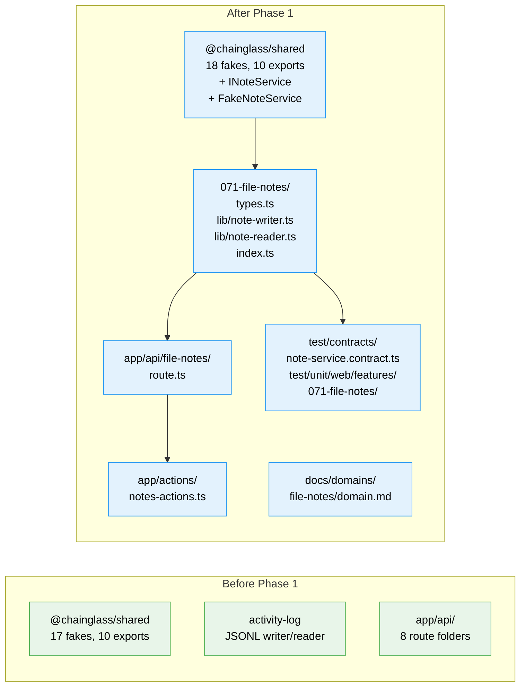

# Flight Plan: Phase 1 — File Notes Data Layer

**Plan**: [pr-view-plan.md](../../pr-view-plan.md)
**Phase**: Phase 1: File Notes Data Layer
**Generated**: 2026-03-08
**Status**: Landed

---

## Departure → Destination

**Where we are**: No file-notes domain exists. The codebase has a proven JSONL persistence pattern (activity-log) and contract test factory pattern (state-system), but no note/annotation/comment system. The `@chainglass/shared` package has 17 fakes and 10 export paths, but no INoteService.

**Where we're going**: A developer can import `INoteService` from `@chainglass/shared/interfaces`, use `FakeNoteService` from `@chainglass/shared/fakes` in tests, call `POST /api/file-notes` to create notes with generic link types, `GET /api/file-notes?worktree=...&linkType=file` to query them, and all data persists in `.chainglass/data/notes.jsonl` with append-only concurrency safety. Contract tests verify real/fake parity.

---

## Domain Context

### Domains We're Changing

| Domain | What Changes | Key Files |
|--------|-------------|-----------|
| file-notes (NEW) | Create entire domain: types, JSONL writer/reader, API routes, server actions, barrel exports | `apps/web/src/features/071-file-notes/`, `apps/web/app/api/file-notes/route.ts`, `apps/web/app/actions/notes-actions.ts` |
| @chainglass/shared | Add INoteService interface + FakeNoteService | `packages/shared/src/interfaces/note-service.interface.ts`, `packages/shared/src/fakes/fake-note-service.ts` |

### Domains We Depend On (no changes)

| Domain | What We Consume | Contract |
|--------|----------------|----------|
| _platform/auth | Auth guard for server actions | requireAuth() |
| activity-log (reference) | JSONL writer/reader pattern | Pattern only — no code import |

---

## Flight Status

<!-- Updated by /plan-6-v2: pending → active → done. Use blocked for problems/input needed. -->

**Legend**: grey = pending | yellow = active | red = blocked/needs input | green = done

---

## Stages

<!-- Updated by /plan-6-v2 during implementation: [ ] → [~] → [x] -->

- [x] **Stage 1: Types + scaffold** — Create feature folder, Note/LinkType/NoteFilter types, barrel export (`types.ts`, `index.ts` — new files)
- [x] **Stage 2: INoteService interface** — Define 8-method interface in shared package, export via barrel, rebuild shared (`note-service.interface.ts` — new file)
- [x] **Stage 3: JSONL writer** — Append for new notes, read-modify-rewrite with atomic rename for edits/deletes (`note-writer.ts` — new file)
- [x] **Stage 4: JSONL reader** — Read + filter notes from JSONL (`note-reader.ts` — new file)
- [x] **Stage 5: FakeNoteService** — In-memory fake with inspection methods, export via fakes barrel (`fake-note-service.ts` — new file)
- [x] **Stage 6: Contract + unit tests** — Factory pattern (real + fake parity), writer/reader unit tests with tmpdir fixtures (`note-service.contract.ts`, `note-writer.test.ts`, `note-reader.test.ts` — new files)
- [x] **Stage 7: API routes** — GET/POST/PATCH/DELETE with auth + worktree scoping + filters (`route.ts` — new file)
- [x] **Stage 8: Server actions** — requireAuth() + Result types delegating to service layer (`notes-actions.ts` — new file)
- [x] **Stage 9: Domain docs** — domain.md + registry.md update (`domain.md` — new file)

---

## Architecture: Before & After

**Legend**: existing (green, unchanged) | new (blue, created this phase)

---

## Acceptance Criteria

- [ ] AC-34: All note data persists in `.chainglass/data/notes.jsonl` and is committed to git
- [ ] AC-35: Notes use a `linkType` field that supports "file", "workflow", and "agent-run" values
- [ ] AC-36: Each link type has its own `targetMeta` shape (e.g., `line` for files, `nodeId` for workflows)
- [ ] AC-37: Adding a new link type requires no schema migration — only new code to produce/consume that type
- [ ] AC-38: CLI and API routes support filtering by link type

## Goals & Non-Goals

**Goals**:
- Complete data infrastructure for File Notes domain
- INoteService interface in shared package for CLI + web consumption
- Append-only JSONL persistence with versioned edit model
- Contract tests verifying real/fake parity
- API routes with auth + worktree scoping

**Non-Goals**:
- No UI components (Phase 2)
- No CLI commands (Phase 3)
- No overlay or sidebar (Phase 2)
- No FileTree integration (Phase 7)

---

## Checklist

- [x] T001: Types + feature scaffold (types.ts, index.ts)
- [x] T002: INoteService interface (note-service.interface.ts) + shared rebuild
- [x] T003: Note writer — append + read-modify-rewrite (note-writer.ts)
- [x] T004: Note reader — parse + filter (note-reader.ts)
- [x] T005: FakeNoteService (fake-note-service.ts) + shared rebuild
- [x] T006: Contract test factory + unit tests (note-service.contract.ts, *.test.ts)
- [x] T007: API route — GET/POST/PATCH/DELETE (route.ts)
- [x] T008: Server actions — notes-actions.ts
- [x] T009: Domain docs + registry update (domain.md, registry.md)
