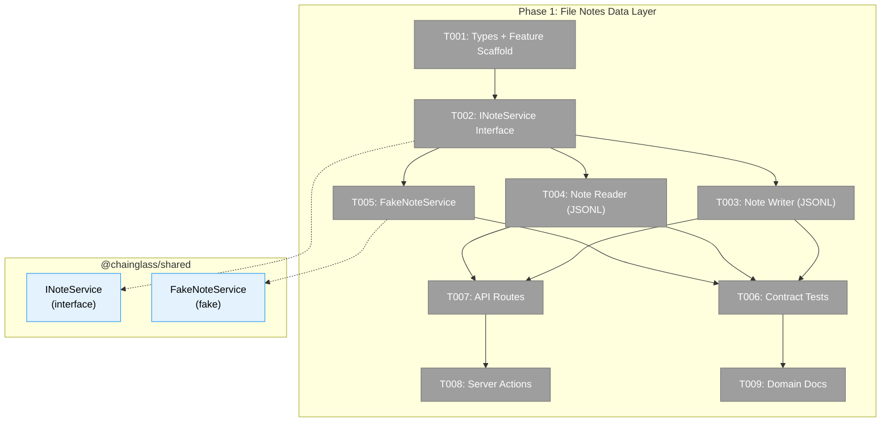
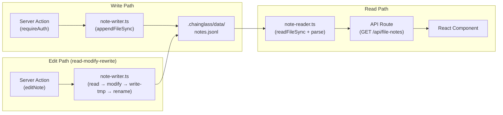
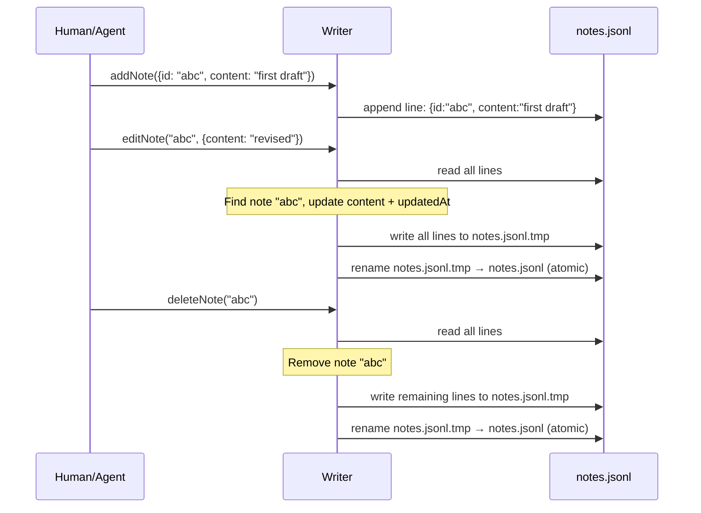

# Phase 1: File Notes Data Layer — Tasks

**Plan**: [pr-view-plan.md](../../pr-view-plan.md)
**Phase**: Phase 1: File Notes Data Layer
**Domain**: file-notes (NEW)
**Generated**: 2026-03-08
**Status**: Ready

---

## Executive Briefing

**Purpose**: Build the complete data infrastructure for the File Notes domain — a generic annotation system where humans and agents attach markdown notes to files, workflow nodes, or agent runs. This phase delivers everything below the UI: types, interface, JSONL persistence, API routes, fakes, and contract tests.

**What We're Building**: A new `file-notes` business domain with an `INoteService` interface in `@chainglass/shared`, JSONL persistence (append for new notes, read-modify-rewrite with atomic rename for edits), a `FakeNoteService` for testing, contract tests verifying real/fake parity, API routes with worktree scoping, server actions, and domain documentation. The generic link-type system (`file | workflow | agent-run`) is designed from day one so future link types require no schema migration.

**Goals**:
- ✅ Note type with generic link-type system (file/workflow/agent-run) and typed targetMeta per link type
- ✅ INoteService interface in `@chainglass/shared` with full CRUD + query methods
- ✅ JSONL writer — append for new notes, read-modify-rewrite with atomic rename for edits
- ✅ JSONL reader with filtering (linkType, target, status, to)
- ✅ FakeNoteService with inspection methods, zero adapter/service imports
- ✅ Contract tests (real + fake parity) with Test Doc comments
- ✅ API routes (GET/POST/PATCH/DELETE) with auth + worktree scoping
- ✅ Server actions delegating to service layer
- ✅ Domain scaffold (feature folder, domain.md, registry entry)

**Non-Goals**:
- ❌ No UI components (Phase 2)
- ❌ No CLI commands (Phase 3)
- ❌ No overlay or sidebar buttons (Phase 2)
- ❌ No FileTree integration (Phase 7)
- ❌ No PR View integration (Phase 5+)

---

## Prior Phase Context

Phase 1 has no prior phases — this is the starting phase.

---

## Pre-Implementation Check

| File | Exists? | Domain Check | Notes |
|------|---------|-------------|-------|
| `apps/web/src/features/071-file-notes/` | ❌ Create | ✅ file-notes | New feature folder |
| `apps/web/src/features/071-file-notes/types.ts` | ❌ Create | ✅ file-notes | Note, NoteFilter, LinkType types |
| `packages/shared/src/interfaces/note-service.interface.ts` | ❌ Create | ✅ shared/interfaces | INoteService interface + types |
| `packages/shared/src/interfaces/index.ts` | ✅ Modify | ✅ shared | Add note-service exports (147 lines currently) |
| `packages/shared/src/fakes/fake-note-service.ts` | ❌ Create | ✅ shared/fakes | 17 existing fakes follow `fake-{name}.ts` pattern |
| `packages/shared/src/fakes/index.ts` | ✅ Modify | ✅ shared | Add FakeNoteService export |
| `apps/web/src/features/071-file-notes/lib/note-writer.ts` | ❌ Create | ✅ file-notes | Pure function, follows activity-log-writer.ts |
| `apps/web/src/features/071-file-notes/lib/note-reader.ts` | ❌ Create | ✅ file-notes | Pure function, follows activity-log-reader.ts |
| `apps/web/app/api/file-notes/route.ts` | ❌ Create | ✅ app/api | Follows activity-log/route.ts pattern |
| `apps/web/app/actions/notes-actions.ts` | ❌ Create | ✅ app/actions | `'use server'` + requireAuth() pattern |
| `apps/web/src/features/071-file-notes/index.ts` | ❌ Create | ✅ file-notes | Barrel exports |
| `test/contracts/note-service.contract.ts` | ❌ Create | ✅ test/contracts | Factory pattern from state-system.contract.ts |
| `test/contracts/note-service.contract.test.ts` | ❌ Create | ✅ test/contracts | Runs contract against real + fake |
| `test/unit/web/features/071-file-notes/` | ❌ Create | ✅ test/unit | Unit tests for writer/reader |
| `docs/domains/file-notes/domain.md` | ❌ Create | ✅ docs/domains | Domain documentation |
| `docs/domains/registry.md` | ✅ Modify | ✅ docs/domains | Add file-notes row |

**Concept Duplication Check**: ✅ No existing note/annotation/comment system found in any domain. No `INoteService` or link-type pattern exists. Clean start.

**Harness**: No agent harness configured. Agent will use standard testing approach from plan.

---

## Architecture Map



---

## Tasks

| Status | ID | Task | Domain | Path(s) | Done When | Notes |
|--------|-----|------|--------|---------|-----------|-------|
| [x] | T001 | Create feature folder scaffold + `types.ts` with Note, NoteFilter, LinkType, NoteTarget, and `index.ts` barrel | file-notes | `apps/web/src/features/071-file-notes/types.ts`, `apps/web/src/features/071-file-notes/index.ts` | Types compile. `LinkType = 'file' \| 'workflow' \| 'agent-run'`. `targetMeta` uses discriminated conditional type per link type. `Note` has: id (UUID), linkType, target, targetMeta, content (markdown), to? ('human'\|'agent'), status ('open'\|'complete'), completedBy?, author ('human'\|'agent'), authorId?, threadId? (for replies), createdAt, updatedAt. `NoteFilter` has: linkType?, target?, status?, to?, threadId?. NOTES_FILE = 'notes.jsonl', NOTES_DIR = '.chainglass/data'. | Per AC-35, AC-36, AC-37. Use const + typeof pattern for LinkType (cf. WorkflowEventType). |
| [x] | T002 | Create `INoteService` interface in `packages/shared` + export via interfaces barrel | file-notes | `packages/shared/src/interfaces/note-service.interface.ts`, `packages/shared/src/interfaces/index.ts` | Interface has 8 methods: `addNote`, `editNote`, `completeNote`, `deleteNote`, `listNotes`, `listFilesWithNotes`, `deleteAllForTarget`, `deleteAll`. All return `Promise<Result>` types. Exported via `@chainglass/shared/interfaces` using `export type`. `.interface.ts` suffix. | Per ADR-0011 (first-class service). R-CODE-003 (.interface.ts). After creating, run `pnpm --filter @chainglass/shared build` (PL-12). |
| [x] | T003 | Create note writer `lib/note-writer.ts` — append for new notes, read-modify-rewrite for edits/deletes | file-notes | `apps/web/src/features/071-file-notes/lib/note-writer.ts` | `appendNote(worktreePath, note)` appends JSON line to `.chainglass/data/notes.jsonl`. `editNote(worktreePath, noteId, updates)` reads all lines, updates matching entry in memory, writes to temp file, atomic renames over original. `deleteNote(worktreePath, noteId)` same read-modify-rewrite removing the entry. `mkdirSync({ recursive: true })` for first write. | Simple approach. Atomic rename prevents corruption. |
| [x] | T004 | Create note reader `lib/note-reader.ts` — read JSONL, parse, filter | file-notes | `apps/web/src/features/071-file-notes/lib/note-reader.ts` | `readNotes(worktreePath, filter?)` reads all JSONL lines, parses each, applies filters (linkType, target, status, to). Returns `Note[]` newest-first. Gracefully skips malformed lines. Returns `[]` if file doesn't exist. | Per AC-25, AC-38. Follows activity-log-reader.ts pattern. Straightforward — no version resolution needed. |
| [x] | T005 | Create `FakeNoteService` in `packages/shared/src/fakes/` + export via fakes barrel | file-notes | `packages/shared/src/fakes/fake-note-service.ts`, `packages/shared/src/fakes/index.ts` | Implements `INoteService`. In-memory `Map<string, Note>` store. Inspection methods: `getAdded()`, `getEdited()`, `getCompleted()`, `getAllNotes()`, `reset()`. Imports ONLY from `@chainglass/shared/interfaces` — zero .adapter.ts or service imports. Passes contract tests. | Constitution P4, R-ARCH-001. After creating, rebuild shared (PL-12). |
| [x] | T006 | Create contract test factory + runner + unit tests for writer/reader | file-notes | `test/contracts/note-service.contract.ts`, `test/contracts/note-service.contract.test.ts`, `test/unit/web/features/071-file-notes/note-writer.test.ts`, `test/unit/web/features/071-file-notes/note-reader.test.ts` | Contract factory: `NoteServiceFactory` type + `noteServiceContractTests(name, factory)` function. Runner runs against real JSONL + FakeNoteService. Unit tests: writer appends correctly, edit rewrites file correctly, reader filters work, deleted notes removed, malformed lines skipped. All tests include Test Doc comments (Why/Contract/Usage/Contribution/Example per R-TEST-002). `just test-feature 071` passes. | Follow state-system.contract.ts pattern exactly. Writer tests use tmpdir fixtures (cf. activity-log tests). |
| [x] | T007 | Create API route `app/api/file-notes/route.ts` — GET (list+filter), POST (add), PATCH (edit/complete), DELETE | file-notes | `apps/web/app/api/file-notes/route.ts` | GET: auth guard, query params (worktree required, linkType/status/to/target optional), path validation (no `..`, must start with `/`), delegates to `readNotes()`, returns JSON array. POST: auth guard, JSON body with note data, delegates to `appendNote()`, returns created note. PATCH: auth guard, body with noteId + updates, delegates to `editNote()` or `completeNote()`. DELETE: auth guard, body with noteId or scope ('file'/'all'), delegates to writer. All return proper HTTP status codes. | Follows activity-log/route.ts pattern exactly. Per ADR-0008 (worktree scoping). |
| [x] | T008 | Create server actions `app/actions/notes-actions.ts` — addNote, editNote, completeNote, deleteNotes | file-notes | `apps/web/app/actions/notes-actions.ts` | Each action: `'use server'` directive, `requireAuth()` guard, accepts worktreePath + data, delegates to writer/reader service functions, returns `{ ok: true; data } \| { ok: false; error }` Result type. | Follows file-actions.ts pattern. |
| [x] | T009 | Create `docs/domains/file-notes/domain.md` + add row to `docs/domains/registry.md` | file-notes | `docs/domains/file-notes/domain.md`, `docs/domains/registry.md` | domain.md follows standard format (Purpose, Boundary, Contracts, Composition, Source Location, Dependencies, History). Registry row: `File Notes \| file-notes \| business \| — \| Plan 071 Phase 1 \| active`. | Domain creation workflow. |

---

## Context Brief

### Key findings from plan

- **Finding 02 (Critical)**: JSONL edit approach — simple read-modify-rewrite with atomic rename (write to temp, rename over original). No versioning/supersedes complexity. Notes volume is modest (10s–100s per worktree), concurrent edits are rare.
- **Finding 03 (Critical)**: CLI requires INoteService in shared package — interface must be created and shared package rebuilt before Phase 3 CLI work.
- **Finding 06 (High)**: Working changes services not exported from file-browser barrel — PR View (Phase 5) will import directly. Not relevant to Phase 1 but important context.

### Domain dependencies

This phase creates a new domain with minimal dependencies:
- `_platform/file-ops`: IFileSystem concept — NOT consumed directly. Writer/reader use Node.js `fs` directly (same as activity-log pattern). IFileSystem is for web server-side operations. Pure functions use `fs.appendFileSync`/`fs.readFileSync`.
- `_platform/auth`: requireAuth() — consumed by server actions for auth guard.
- Activity Log (065): Reference pattern only — JSONL writer/reader code structure, types pattern, API route pattern.

### Domain constraints

- **Import direction**: `apps/web` → `@chainglass/shared` (never reverse)
- **FakeNoteService**: imports ONLY from `@chainglass/shared/interfaces` and types — zero imports from .adapter.ts or service files (R-ARCH-001)
- **Barrel exports**: Use `export type` for interface re-exports in `packages/shared/src/interfaces/index.ts` (R-CODE-004, isolatedModules)
- **File naming**: `.interface.ts` suffix for interfaces, `fake-` prefix for fakes, kebab-case (R-CODE-003)
- **Build order**: After modifying `packages/shared`, run `pnpm --filter @chainglass/shared build` before web typecheck (PL-12)
- **JSONL location**: `.chainglass/data/notes.jsonl` per ADR-0008 (split storage, per-worktree)

### Harness context

No agent harness configured. Agent will use standard testing approach from plan.

### Reusable from prior phases

None (Phase 1 is the starting phase). However, exemplar code exists:
- `apps/web/src/features/065-activity-log/lib/activity-log-writer.ts` — JSONL append pattern with `appendFileSync`, `mkdirSync`, dedup lookback
- `apps/web/src/features/065-activity-log/lib/activity-log-reader.ts` — JSONL read pattern with line-by-line parsing, filter, graceful skip
- `apps/web/src/features/065-activity-log/types.ts` — constants + entry type pattern
- `test/contracts/state-system.contract.ts` — contract test factory pattern (`StateServiceFactory` type + `globalStateContractTests()` function)
- `apps/web/app/api/activity-log/route.ts` — API route with auth guard, worktree query param, path validation, error handling

### Data flow diagram



### Edit flow



---

## Discoveries & Learnings

| Date | Task | Type | Discovery | Resolution | References |
|------|------|------|-----------|------------|------------|
| 2026-03-08 | T002 | architecture | Shared types must live in `packages/shared`, not `apps/web` — INoteService imports them and shared can't depend on apps | Created `packages/shared/src/file-notes/types.ts` + `./file-notes` export path. Web `types.ts` re-exports from shared. | R-ARCH: packages depend on shared, not reverse |
| 2026-03-08 | T006 | gotcha | Tests must use `@/features/...` path alias, not deep relative paths (`../../../../apps/web/...`). Vitest can't resolve the latter. | Changed imports to `@/features/071-file-notes/lib/note-writer` | Matches activity-log test pattern |

---

## Directory Layout

```
docs/plans/071-pr-view/
  ├── pr-view-spec.md
  ├── pr-view-plan.md
  ├── research-dossier.md
  ├── workshops/
  │   └── 001-ui-design-github-inspired.md
  └── tasks/phase-1-file-notes-data-layer/
      ├── tasks.md                    ← this file
      ├── tasks.fltplan.md            ← flight plan (below)
      └── execution.log.md            # created by plan-6
```
