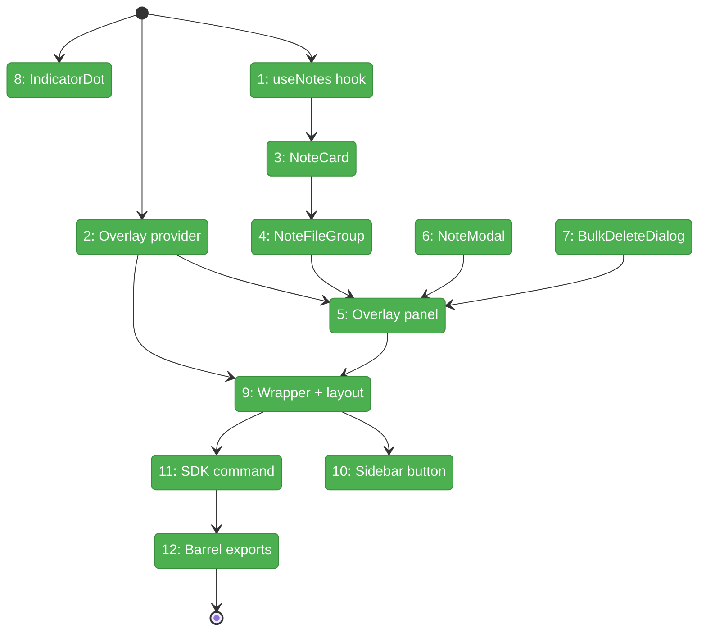
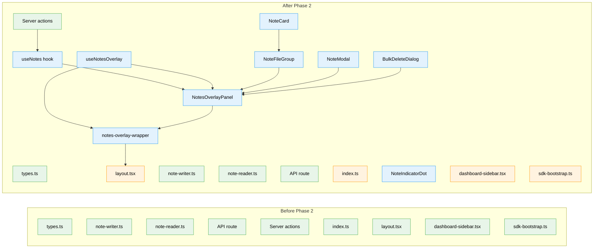

# Flight Plan: Phase 2 — File Notes Web UI

**Plan**: [pr-view-plan.md](../../pr-view-plan.md)
**Phase**: Phase 2: File Notes Web UI
**Generated**: 2026-03-08
**Status**: Landed

---

## Departure → Destination

**Where we are**: Phase 1 delivered the complete File Notes data layer — types with discriminated union link-type system, JSONL persistence (writer/reader with atomic rename), INoteService interface in shared package, FakeNoteService, API routes (GET/POST/PATCH/DELETE), server actions, and 38 passing tests. All data plumbing works but there is zero UI — notes can only be created/queried via API calls or tests.

**Where we're going**: A developer can click "Notes" in the sidebar (or press Ctrl+Shift+L) to open an overlay panel showing all worktree notes grouped by file. They can add notes via a modal dialog, mark notes complete, reply to notes (flat threading), filter by status/addressee, and bulk-delete with "YEES" confirmation. A reusable NoteIndicatorDot component is ready for FileTree integration in Phase 7.

---

## Domain Context

### Domains We're Changing

| Domain | What Changes | Key Files |
|--------|-------------|-----------|
| file-notes | New: overlay provider, panel, note cards, modal, bulk delete dialog, indicator dot, data hook, SDK commands | `hooks/use-notes-overlay.tsx`, `hooks/use-notes.ts`, `components/*.tsx`, `sdk/*.ts` |
| _platform/sdk | Modify: add notes.toggleOverlay command + keybinding | `sdk-bootstrap.ts` |
| — (cross-domain layout) | Modify: mount overlay wrapper, add sidebar button | `layout.tsx`, `dashboard-sidebar.tsx` |

### Domains We Depend On (no changes)

| Domain | What We Consume | Contract |
|--------|----------------|----------|
| file-notes (Phase 1) | Note types, server actions, API routes | addNote, fetchNotes, completeNote, deleteNotes, fetchFilesWithNotes |
| _platform/panel-layout | Overlay anchor element | `[data-terminal-overlay-anchor]` |
| _platform/workspace-url | File navigation | `workspaceHref()` |
| _platform/events | User feedback | `toast()` from sonner |

---

## Flight Status

<!-- Updated by /plan-6-v2: pending → active → done. Use blocked for problems/input needed. -->

**Legend**: grey = pending | yellow = active | red = blocked/needs input | green = done

---

## Stages

<!-- Updated by /plan-6-v2 during implementation: [ ] → [~] → [x] -->

- [x] **Stage 1: Data hook** — Create `useNotes` hook with server action calls, 10s cache, filter state (`use-notes.ts`)
- [x] **Stage 2: Overlay provider** — Create `useNotesOverlay` with mutual exclusion, toggle event, modal state (`use-notes-overlay.tsx`)
- [x] **Stage 3: NoteCard** — Render note with metadata, content, actions (`note-card.tsx` — new file)
- [x] **Stage 4: NoteFileGroup** — Collapsible file section with note count and NoteCard list (`note-file-group.tsx` — new file)
- [x] **Stage 5: Overlay panel** — Fixed-position panel with header, filter, grouped list, empty state (`notes-overlay-panel.tsx` — new file)
- [x] **Stage 6: NoteModal** — Add/edit dialog with textarea, "To" selector, save via server action (`note-modal.tsx` — new file)
- [x] **Stage 7: BulkDeleteDialog** — Type-to-confirm "YEES" dialog (`bulk-delete-dialog.tsx` — new file)
- [x] **Stage 8: NoteIndicatorDot** — 6px blue dot component for tree decoration (`note-indicator-dot.tsx` — new file)
- [x] **Stage 9: Wrapper + layout** — Dynamic import wrapper with error boundary, mount in layout.tsx (`notes-overlay-wrapper.tsx` — new file, `layout.tsx` — modify)
- [x] **Stage 10: Sidebar button** — Add Notes toggle button to dashboard sidebar (`dashboard-sidebar.tsx` — modify)
- [x] **Stage 11: SDK command** — Register notes.toggleOverlay + Ctrl+Shift+L keybinding (`sdk-bootstrap.ts` — modify)
- [x] **Stage 12: Barrel exports** — Update feature barrel with all new exports (`index.ts` — modify)

---

## Architecture: Before & After

**Legend**: existing (green, unchanged) | changed (orange, modified) | new (blue, created)

---

## Acceptance Criteria

- [ ] AC-15: Users can add a markdown note to any file via keyboard shortcut
- [ ] AC-16: Notes can optionally target a specific line number
- [ ] AC-17: Notes can optionally be addressed "to human" or "to agent"
- [ ] AC-18: Notes display author, time, addressee, and line reference
- [ ] AC-19: Notes can be marked as complete
- [ ] AC-20: Notes support replies (flat threading)
- [ ] AC-21: NoteIndicatorDot component created (wiring to tree in Phase 7)
- [ ] AC-23: Notes button in sidebar opens notes overlay
- [ ] AC-24: Each note has "Go to" link navigating to file+line
- [ ] AC-25: Notes overlay supports filtering
- [ ] AC-26: Bulk delete guarded by "YEES" confirmation

## Goals & Non-Goals

**Goals**:
- Notes overlay with grouped-by-file display
- NoteCard with full metadata and actions
- NoteModal for add/edit with "To" selector
- BulkDeleteDialog with "YEES" safety gate
- NoteIndicatorDot component (cross-domain contract)
- Sidebar button + SDK command (Ctrl+Shift+L)
- Filter dropdown in overlay header

**Non-Goals**:
- FileTree integration wiring (Phase 7)
- PR View integration (Phase 5+)
- CLI commands (Phase 3)
- SSE live updates (Phase 6)
- Context menu "Add Note" (Phase 7)
- Explorer panel button (Phase 8)

---

## Checklist

- [x] T001: useNotes data-fetching hook with cache and filter
- [x] T002: useNotesOverlay provider with mutual exclusion
- [x] T003: NoteCard component with metadata and actions
- [x] T004: NoteFileGroup collapsible per-file section
- [x] T005: NotesOverlayPanel with header, filter, grouped list
- [x] T006: NoteModal add/edit dialog with "To" selector
- [x] T007: BulkDeleteDialog with "YEES" confirmation
- [x] T008: NoteIndicatorDot component (cross-domain contract)
- [x] T009: Overlay wrapper + layout mount
- [x] T010: Sidebar button (notes:toggle)
- [x] T011: SDK command + Ctrl+Shift+L keybinding
- [x] T012: Update feature barrel exports
