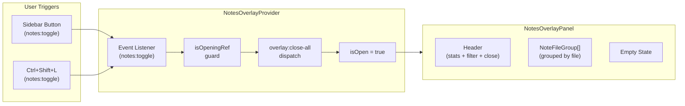
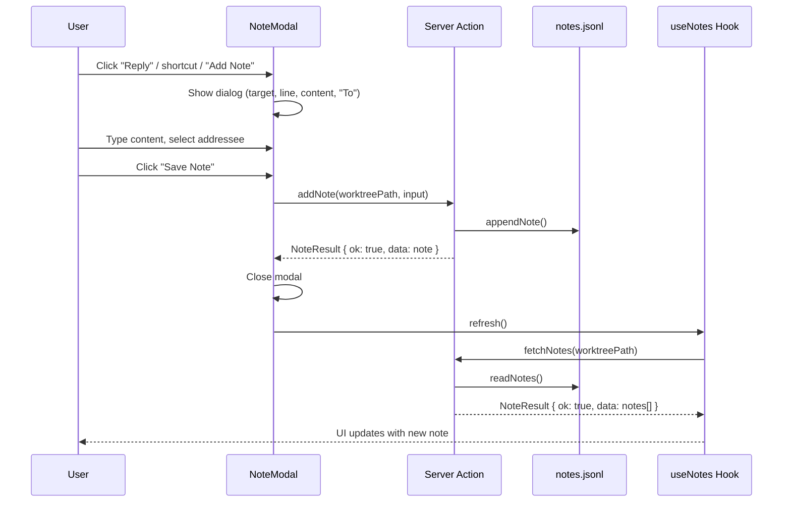

# Phase 2: File Notes Web UI — Tasks

**Plan**: [pr-view-plan.md](../../pr-view-plan.md)
**Phase**: Phase 2: File Notes Web UI
**Domain**: file-notes
**Generated**: 2026-03-08
**Status**: Ready

---

## Executive Briefing

**Purpose**: Build the complete web UI for the File Notes domain — an overlay panel showing all worktree notes grouped by file, a modal for creating/editing notes, a type-to-confirm bulk delete dialog, a reusable indicator dot component, sidebar/SDK integration, and a data-fetching hook. This phase makes the Phase 1 data layer visible and interactive in the browser.

**What We're Building**: A notes overlay (following the proven Terminal/Activity Log overlay pattern) with grouped-by-file note cards, a note creation/edit modal with "To" addressee selector, a `BulkDeleteDialog` requiring "YEES" confirmation, a `NoteIndicatorDot` component for tree decoration (wired in Phase 7), filtering by status/addressee, a sidebar toggle button, and SDK command registration with `Ctrl+Shift+L` keybinding. The overlay mounts via a wrapper in `layout.tsx` with error boundary protection.

**Goals**:
- ✅ Notes overlay panel showing all notes grouped by file with collapsible file groups
- ✅ NoteCard rendering with author, time, addressee, line reference, markdown content, actions (Go to, Complete, Reply, Edit)
- ✅ NoteModal for add/edit with markdown textarea, optional line number, and "To" selector (Anyone/Human/Agent)
- ✅ BulkDeleteDialog with type-to-confirm "YEES" safety gate (per-file and all-notes modes)
- ✅ NoteIndicatorDot component (wiring to FileTree deferred to Phase 7)
- ✅ Data-fetching hook (`useNotes`) with caching and refresh
- ✅ Overlay provider with `overlay:close-all` mutual exclusion and `isOpeningRef` guard
- ✅ Sidebar button dispatching `notes:toggle` CustomEvent
- ✅ SDK command + `Ctrl+Shift+L` keybinding
- ✅ Filter dropdown (All/Open/Complete/To Human/To Agent) in overlay header

**Non-Goals**:
- ❌ No FileTree integration wiring (Phase 7 — NoteIndicatorDot is created but not plugged into FileTree)
- ❌ No PR View integration (Phase 5+)
- ❌ No CLI commands (Phase 3)
- ❌ No SSE/live updates (Phase 6)
- ❌ No context menu "Add Note" in FileTree (Phase 7)
- ❌ No explorer panel toggle button (Phase 8)

---

## Prior Phase Context

### Phase 1: File Notes Data Layer — Completed

**A. Deliverables**:
- `packages/shared/src/file-notes/types.ts` — Note discriminated union (FileNote|WorkflowNote|AgentRunNote), NoteLinkType, NoteFilter, CreateNoteInput, EditNoteInput, NoteResult, runtime guards
- `packages/shared/src/interfaces/note-service.interface.ts` — INoteService (8 methods)
- `packages/shared/src/fakes/fake-note-service.ts` — FakeNoteService with inspection methods
- `apps/web/src/features/071-file-notes/types.ts` — Re-exports + NOTES_FILE/NOTES_DIR constants
- `apps/web/src/features/071-file-notes/lib/note-writer.ts` — appendNote, editNote, completeNote, deleteNote, deleteAllForTarget, deleteAll
- `apps/web/src/features/071-file-notes/lib/note-reader.ts` — readNotes (filter + newest-first), listFilesWithNotes
- `apps/web/src/features/071-file-notes/index.ts` — Feature barrel
- `apps/web/app/api/file-notes/route.ts` — GET/POST/PATCH/DELETE with auth + validation
- `apps/web/app/actions/notes-actions.ts` — 6 server actions (addNote, editNote, completeNote, deleteNotes, fetchNotes, fetchFilesWithNotes)
- `docs/domains/file-notes/domain.md` — Domain documentation
- 38 tests passing (22 unit + 16 contract)

**B. Dependencies Exported for Phase 2**:
- Server actions: `addNote`, `editNote`, `completeNote`, `deleteNotes`, `fetchNotes`, `fetchFilesWithNotes` — all return `NoteResult<T>`
- Types: `Note`, `NoteFilter`, `CreateNoteInput`, `EditNoteInput`, `NoteResult`, `NoteLinkType`, `NoteStatus`, `NoteAddressee`, `NoteAuthor`
- Constants: `NOTES_FILE`, `NOTES_DIR`
- Runtime guards: `isNoteLinkType()`, `isNoteAuthor()`, `isNoteAddressee()`

**C. Gotchas & Debt**:
- `readNotes()` returns newest-first (reversed); UI must account for this ordering
- `listFilesWithNotes()` defaults to `status: 'open'` filter — only open notes count for indicators
- ThreadId support is partial: filter works but no `replyTo()` helper — replies must set `threadId` manually in `CreateNoteInput`
- Reader skips malformed JSONL lines silently — no logging
- Note `targetMeta` for file type has optional `line` field — UI must handle file-level (no line) vs line-level notes

**D. Incomplete Items**: None — all 9 tasks complete.

**E. Patterns to Follow**:
- Result pattern: `if (result.ok) { use result.data } else { show result.error }`
- Server action invocation from client components
- `'use client'` directive on all interactive components
- Overlay provider: Context + `isOpeningRef` guard + `overlay:close-all` dispatch (copy Terminal/Activity Log pattern exactly)
- Overlay panel: `[data-terminal-overlay-anchor]` positioning with ResizeObserver, z-index 44, Escape key handler
- Overlay wrapper: dynamic import with `{ ssr: false }`, error boundary around panel
- Sidebar button: `window.dispatchEvent(new CustomEvent('notes:toggle'))` with `currentWorktree` guard
- SDK command: register in `sdk-bootstrap.ts` with event dispatch handler

---

## Pre-Implementation Check

| File | Exists? | Domain Check | Notes |
|------|---------|-------------|-------|
| `apps/web/src/features/071-file-notes/hooks/use-notes-overlay.tsx` | ❌ Create | ✅ file-notes | Overlay provider — follow use-activity-log-overlay.tsx |
| `apps/web/src/features/071-file-notes/hooks/use-notes.ts` | ❌ Create | ✅ file-notes | Data fetching hook |
| `apps/web/src/features/071-file-notes/components/notes-overlay-panel.tsx` | ❌ Create | ✅ file-notes | Overlay panel — follow activity-log-overlay-panel.tsx |
| `apps/web/src/features/071-file-notes/components/note-card.tsx` | ❌ Create | ✅ file-notes | Individual note rendering |
| `apps/web/src/features/071-file-notes/components/note-file-group.tsx` | ❌ Create | ✅ file-notes | Collapsible per-file group |
| `apps/web/src/features/071-file-notes/components/note-modal.tsx` | ❌ Create | ✅ file-notes | Add/edit dialog using Dialog from ui |
| `apps/web/src/features/071-file-notes/components/bulk-delete-dialog.tsx` | ❌ Create | ✅ file-notes | Type-to-confirm YEES |
| `apps/web/src/features/071-file-notes/components/note-indicator-dot.tsx` | ❌ Create | ✅ file-notes | Blue dot — cross-domain contract |
| `apps/web/src/features/071-file-notes/sdk/contribution.ts` | ❌ Create | ✅ file-notes | SDK command manifest |
| `apps/web/src/features/071-file-notes/sdk/register.ts` | ❌ Create | ✅ file-notes | SDK registration |
| `apps/web/app/(dashboard)/workspaces/[slug]/notes-overlay-wrapper.tsx` | ❌ Create | ✅ cross-domain | Wrapper with dynamic import + error boundary |
| `apps/web/app/(dashboard)/workspaces/[slug]/layout.tsx` | ✅ Modify | ✅ cross-domain | Mount NotesOverlayWrapper (78 lines) |
| `apps/web/src/components/dashboard-sidebar.tsx` | ✅ Modify | ✅ cross-domain | Add Notes sidebar button (329 lines) |
| `apps/web/src/lib/sdk/sdk-bootstrap.ts` | ✅ Modify | ✅ _platform/sdk | Add notes.toggleOverlay command (129 lines) |
| `apps/web/src/features/071-file-notes/index.ts` | ✅ Modify | ✅ file-notes | Add component + hook exports |

**Concept Duplication Check**: ✅ No existing notes overlay, note modal, or note indicator dot found. NoteIndicatorDot is a new cross-domain contract. Overlay pattern follows 3 proven exemplars.

**Harness**: No agent harness configured. Agent will use standard testing approach from plan.

---

## Architecture Map

```mermaid
flowchart TD
    classDef pending fill:#9E9E9E,stroke:#757575,color:#fff
    classDef completed fill:#4CAF50,stroke:#388E3C,color:#fff
    classDef existing fill:#E8F5E9,stroke:#4CAF50,color:#000

    subgraph Phase1["Phase 1 (Completed)"]
        P1_types["types.ts"]:::completed
        P1_writer["note-writer.ts"]:::completed
        P1_reader["note-reader.ts"]:::completed
        P1_api["API route"]:::completed
        P1_actions["Server actions"]:::completed
    end

    subgraph Phase2["Phase 2: File Notes Web UI"]
        T001["T001: useNotes hook"]:::pending
        T002["T002: useNotesOverlay<br/>provider"]:::pending
        T003["T003: NoteCard"]:::pending
        T004["T004: NoteFileGroup"]:::pending
        T005["T005: NotesOverlayPanel"]:::pending
        T006["T006: NoteModal"]:::pending
        T007["T007: BulkDeleteDialog"]:::pending
        T008["T008: NoteIndicatorDot"]:::pending
        T009["T009: Overlay wrapper<br/>+ layout mount"]:::pending
        T010["T010: Sidebar button"]:::pending
        T011["T011: SDK command"]:::pending
        T012["T012: Barrel exports"]:::pending

        T001 --> T003
        T001 --> T005
        T002 --> T005
        T003 --> T004
        T004 --> T005
        T006 --> T005
        T007 --> T005
        T002 --> T009
        T005 --> T009
        T009 --> T010
        T009 --> T011
        T011 --> T012
    end

    subgraph ExistingOverlay["Proven Overlay Pattern"]
        EX1["use-terminal-overlay"]:::existing
        EX2["use-activity-log-overlay"]:::existing
        EX3["terminal-overlay-panel"]:::existing
    end

    P1_actions -.-> T001
    EX1 -.->|"pattern"| T002
    EX3 -.->|"pattern"| T005

    subgraph Files["New Files"]
        F1["hooks/use-notes.ts"]:::pending
        F2["hooks/use-notes-overlay.tsx"]:::pending
        F3["components/note-card.tsx"]:::pending
        F4["components/note-file-group.tsx"]:::pending
        F5["components/notes-overlay-panel.tsx"]:::pending
        F6["components/note-modal.tsx"]:::pending
        F7["components/bulk-delete-dialog.tsx"]:::pending
        F8["components/note-indicator-dot.tsx"]:::pending
        F9["notes-overlay-wrapper.tsx"]:::pending
    end

    T001 -.-> F1
    T002 -.-> F2
    T003 -.-> F3
    T004 -.-> F4
    T005 -.-> F5
    T006 -.-> F6
    T007 -.-> F7
    T008 -.-> F8
    T009 -.-> F9
```



---

## Tasks

| Status | ID | Task | Domain | Path(s) | Done When | Notes |
|--------|-----|------|--------|---------|-----------|-------|
| [x] | T001 | Create `hooks/use-notes.ts` — data-fetching hook calling `fetchNotes` and `fetchFilesWithNotes` server actions, with 10s cache, filter state, refresh trigger, and thread-aware grouping | file-notes | `apps/web/src/features/071-file-notes/hooks/use-notes.ts` | Hook returns `{ notes, noteFilePaths, loading, error, refresh, filter, setFilter, groupedByFile }`. Calls server actions on mount and when filter/worktreePath changes. 10s cache prevents redundant fetches on rapid overlay toggle. `noteFilePaths` is a `Set<string>` of targets with open notes. **Thread grouping algorithm** (in `groupedByFile`): (1) partition notes into roots (no `threadId`) and replies (have `threadId`), (2) group by `target` (file path), (3) within each file group build `{ root: Note, replies: Note[] }[]` by matching reply.threadId to root.id, (4) sort roots newest-first, replies chronologically (oldest-first = conversation order), (5) orphan replies (parent missing/filtered) appear as standalone roots with a visual hint. Returns `Map<string, { root: Note, replies: Note[] }[]>`. | Follow activity-log overlay cache pattern (DYK-04). Grouping logic lives in hook so NoteFileGroup receives pre-grouped data. |
| [x] | T002 | Create `hooks/use-notes-overlay.tsx` — overlay provider with `overlay:close-all` mutual exclusion, `notes:toggle` event listener, `isOpeningRef` guard, Escape key handler | file-notes | `apps/web/src/features/071-file-notes/hooks/use-notes-overlay.tsx` | Provider context exposes `{ isOpen, openNotes, closeNotes, toggleNotes, modalTarget, openModal, closeModal }`. Opening dispatches `overlay:close-all` with `isOpeningRef` guard. Listens for `notes:toggle` CustomEvent. Escape closes. Also manages modal state (target file/line for NoteModal). | Copy use-activity-log-overlay.tsx pattern exactly. Per PL-08. Add modal state management (openModal(target, line?), closeModal). |
| [x] | T003 | Create `components/note-card.tsx` — renders note with header (author emoji, line, time, addressee tag), markdown content, action buttons (Go to, Complete, Reply, Edit) | file-notes | `apps/web/src/features/071-file-notes/components/note-card.tsx` | Card displays author (🧑/🤖), optional line number, relative time, addressee tag (→ Human blue / → Agent purple). Content rendered via `MarkdownInline` component (`src/components/markdown-inline.tsx` — react-markdown + remark-gfm, already in codebase) with `text-sm prose prose-sm dark:prose-invert max-w-none` classes. Actions: "Go to" **closes overlay first** (`closeNotes()`) then navigates via `workspaceHref` (overlay covers the destination at z-44, so must close before navigating), "Complete" calls `completeNote` server action, "Reply" opens modal with threadId, "Edit" opens modal with existing content. Completed notes show `opacity-50`. | Per AC-18, AC-19, AC-24. Per workshop 4.4 + Flow 3 (close before navigate). Use lucide-react icons: Check, ExternalLink, MessageSquare, Pencil. |
| [x] | T004 | Create `components/note-file-group.tsx` — collapsible section grouping notes by file target, with file path header, note count, and per-file delete button | file-notes | `apps/web/src/features/071-file-notes/components/note-file-group.tsx` | Group shows file path (mono, truncated), note count badge, collapse/expand toggle (ChevronDown/ChevronRight), per-file trash button (opens BulkDeleteDialog with `scope='file'`). Receives pre-grouped `{ root: Note, replies: Note[] }[]` from useNotes hook. Renders NoteCard for each root, with replies indented below (ml-4 border-l-2 border-muted). Expanded by default. | Per workshop layout. Consumes groupedByFile from T001. Per-file delete enables BulkDeleteDialog `scope='file'` mode from T007. |
| [x] | T005 | Create `components/notes-overlay-panel.tsx` — fixed-position overlay panel anchored to `[data-terminal-overlay-anchor]`, z-index 44, with header (title, stats, "Add Note" button, filter dropdown, clear-all, close), scrollable grouped-by-file list, empty state | file-notes | `apps/web/src/features/071-file-notes/components/notes-overlay-panel.tsx` | Panel positions via ResizeObserver on anchor element. Header shows "Notes" + open/complete counts + **"+" Add Note button** (opens NoteModal with empty target — user types file path) + filter dropdown + trash button + close button. Body renders NoteFileGroup[] or empty state. Re-measures on open. Lazy-loads on first open (`hasOpened` guard). | Per AC-23, AC-25, AC-26. Follow terminal-overlay-panel.tsx anchor pattern exactly. Per workshop 4.3. Add Note button ensures notes can be created without tree context menu (Phase 7). |
| [x] | T006 | Create `components/note-modal.tsx` — Dialog for add/edit note with target display, markdown textarea, optional line number input, "To" selector (Anyone/Human/Agent), Cancel/Save buttons. When opened without a pre-filled target (e.g., from overlay "Add Note" button), show a file path text input so user can type/paste the target path. | file-notes | `apps/web/src/features/071-file-notes/components/note-modal.tsx` | Modal shows target path (mono) + optional line when target is pre-filled. When target is empty, shows a text input for file path. Textarea with placeholder "Leave a note... (markdown supported)". "To" selector with 3 pill buttons (Anyone=undefined, Human, Agent). Save calls `addNote` or `editNote` server action. Save disabled when content empty or target empty. Edit mode pre-fills content and addressee. Thread reply mode sets threadId. Toast on success. | Per AC-15, AC-16, AC-17. Uses Dialog/DialogContent from ui. Per workshop 4.1. |
| [x] | T007 | Create `components/bulk-delete-dialog.tsx` — type-to-confirm dialog requiring "YEES", supports per-file (`scope='file'`) and all-notes (`scope='all'`) modes | file-notes | `apps/web/src/features/071-file-notes/components/bulk-delete-dialog.tsx` | Delete button disabled until input exactly matches "YEES". Warning shows note count and scope. Calls `deleteNotes` server action on confirm. Resets confirmation input when dialog closes. Toast on success. | Per AC-26. Per workshop 4.5. CONFIRMATION_WORD = 'YEES'. |
| [x] | T008 | Create `components/note-indicator-dot.tsx` — 6px blue dot component (contract: consumed by file-browser in Phase 7) | file-notes | `apps/web/src/features/071-file-notes/components/note-indicator-dot.tsx` | `NoteIndicatorDot({ hasNotes })` renders `w-1.5 h-1.5 rounded-full bg-blue-500` when hasNotes is true, null otherwise. Has `title="Has notes"` and `aria-label="File has notes"`. Exported from feature barrel. | Per AC-21. Per workshop 4.2. Cross-domain contract — file-browser consumes in Phase 7. |
| [x] | T009 | Create `notes-overlay-wrapper.tsx` + mount in workspace `layout.tsx` — provider wrapper with dynamic import (ssr: false) and error boundary around panel | file-notes | `apps/web/app/(dashboard)/workspaces/[slug]/notes-overlay-wrapper.tsx`, `apps/web/app/(dashboard)/workspaces/[slug]/layout.tsx` | Wrapper wraps children in NotesOverlayProvider, renders NotesOverlayPanel (dynamically imported) inside error boundary. Mounted in layout.tsx between ActivityLogOverlayWrapper and WorkspaceAgentChrome (or wrapping ActivityLogOverlayWrapper — match nesting order). | Per finding 08. Follow terminal-overlay-wrapper.tsx pattern exactly. Error boundary returns null on error. |
| [x] | T010 | Add "Notes" sidebar button in `dashboard-sidebar.tsx` — dispatches `notes:toggle` CustomEvent, visible when `currentWorktree` is set | file-notes | `apps/web/src/components/dashboard-sidebar.tsx` | Button appears below Activity Log button. Uses StickyNote icon from lucide-react. Dispatches `window.dispatchEvent(new CustomEvent('notes:toggle'))`. Only rendered when `currentWorktree` is truthy. Tooltip: "Toggle Notes". | Per AC-23. Follow Activity Log sidebar button pattern. |
| [x] | T011 | Register SDK command `notes.toggleOverlay` in `sdk-bootstrap.ts` + `Ctrl+Shift+L` keybinding | file-notes | `apps/web/src/lib/sdk/sdk-bootstrap.ts` | Command registered with id `notes.toggleOverlay`, title "Toggle Notes", domain "file-notes". Handler dispatches `notes:toggle` CustomEvent. Keybinding: `{ key: 'KeyL', modifiers: ['Ctrl', 'Shift'], command: 'notes.toggleOverlay' }`. | Follow terminal.toggleOverlay pattern in same file. Per workshop keyboard shortcuts. |
| [x] | T012 | Update feature barrel `index.ts` — export all new components, hooks, and SDK modules | file-notes | `apps/web/src/features/071-file-notes/index.ts` | Barrel exports: NoteIndicatorDot, NoteCard, NoteModal, BulkDeleteDialog, NotesOverlayPanel, NoteFileGroup, useNotes, useNotesOverlay, NotesOverlayProvider, SDK contribution/register. All components importable via `@/features/071-file-notes`. | Keep existing exports (types, writer, reader). Add new. |

---

## Context Brief

### Key findings from plan

- **Finding 02 (Critical)**: JSONL edit approach is simple read-modify-rewrite with atomic rename. Phase 2 UI should never call writer functions directly — always go through server actions which handle auth + error wrapping.
- **Finding 07 (High)**: Multiple DiffViewer instances are safe (Shiki singleton). Not directly relevant to Phase 2 but good context — Notes overlay does NOT use DiffViewer.
- **Finding 08 (Medium)**: Overlay mounting pattern is mature — 3 wrappers in layout.tsx. Phase 2 adds a 4th wrapper (notes). Nest between ActivityLogOverlayWrapper and WorkspaceAgentChrome.
- **PL-08 (Prior Learning)**: Overlay mutual exclusion requires `isOpeningRef` guard — set flag before dispatching `overlay:close-all`, clear after, skip self-close when flag is true.
- **PL-09 (Prior Learning)**: Cache API responses for 10s to prevent redundant fetches on rapid overlay toggle.

### Domain dependencies

- `file-notes` (self): Types, server actions, API routes from Phase 1 — addNote, editNote, completeNote, deleteNotes, fetchNotes, fetchFilesWithNotes
- `_platform/panel-layout`: `[data-terminal-overlay-anchor]` element for overlay positioning (no changes to domain)
- `_platform/workspace-url`: `workspaceHref()` for "Go to" navigation links (no changes to domain)
- `_platform/sdk`: `ICommandRegistry`, `IKeybindingRegistry` for SDK command registration (no changes to domain)
- `_platform/events`: `toast()` from sonner for success/error feedback (no changes to domain)

### Domain constraints

- **All new components are `'use client'`** — overlay, modal, dialog, cards all require interactivity
- **Import direction**: Components import from `@/features/071-file-notes` barrel or from `@chainglass/shared/file-notes` for types
- **Server actions invoked via import**: `import { addNote, fetchNotes } from '@/app/actions/notes-actions'`
- **Cross-domain contract**: `NoteIndicatorDot` is the only export consumed by other domains (file-browser in Phase 7) — keep props minimal (`{ hasNotes: boolean }`)
- **No direct fs/writer imports in components** — all data flows through server actions

### Harness context

No agent harness configured. Agent will use standard testing approach from plan.

### Reusable from Phase 1

- Server actions in `app/actions/notes-actions.ts` — complete CRUD + query API
- Types from `@chainglass/shared/file-notes` — Note, NoteFilter, CreateNoteInput, etc.
- FakeNoteService for testing (if needed for component unit tests)
- Test patterns: Test Doc comments (Why/Contract/Usage/Contribution/Example per R-TEST-002)

### Overlay provider flow



### Note modal interaction flow



---

## Discoveries & Learnings

_Populated during implementation by plan-6._

| Date | Task | Type | Discovery | Resolution | References |
|------|------|------|-----------|------------|------------|
| 2026-03-09 | T012 | gotcha | `NoteTargetMeta` doesn't exist as exported type — correct name is `TargetMetaFor<T>` | Fixed barrel to export `TargetMetaFor` instead | types.ts line 28 |
| 2026-03-09 | T005 | gotcha | `useRef<() => void>()` without initial value causes TS2554 in strict mode | Use `useRef<(() => void) \| undefined>(undefined)` | TypeScript strict null checks |
| 2026-03-09 | T001 | architecture | Relative imports needed for hooks importing server actions — `@/app/actions` alias doesn't resolve with standalone tsc | Used `../../../../app/actions/notes-actions` relative path | Same pattern as note-writer.ts |

---

## Directory Layout

```
docs/plans/071-pr-view/
  ├── pr-view-spec.md
  ├── pr-view-plan.md
  ├── research-dossier.md
  ├── workshops/
  │   └── 001-ui-design-github-inspired.md
  ├── tasks/phase-1-file-notes-data-layer/
  │   ├── tasks.md
  │   ├── tasks.fltplan.md
  │   ├── execution.log.md
  │   └── reviews/
  └── tasks/phase-2-file-notes-web-ui/
      ├── tasks.md                    ← this file
      ├── tasks.fltplan.md            ← flight plan (below)
      └── execution.log.md            # created by plan-6
```
