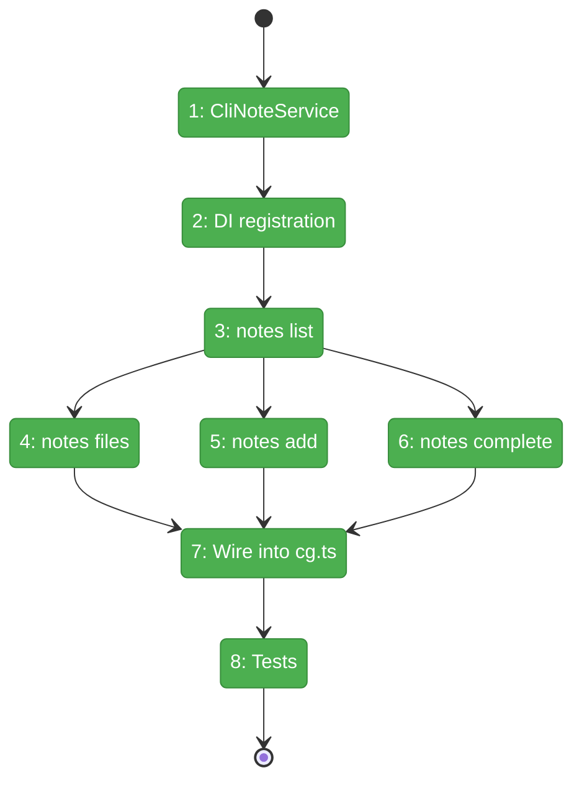
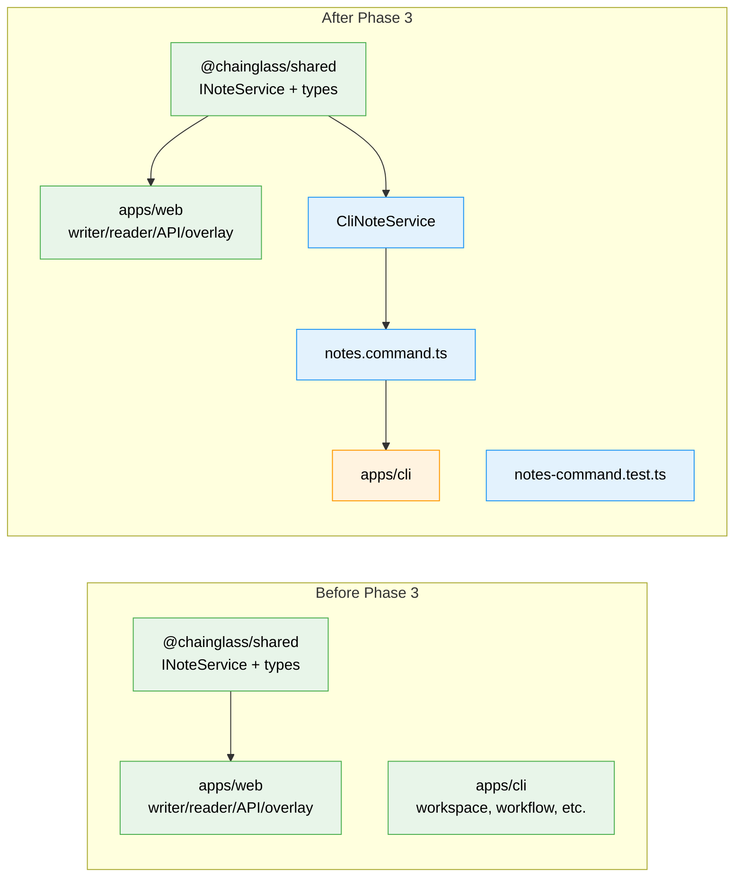

# Flight Plan: Phase 3 — File Notes CLI

**Plan**: [pr-view-plan.md](../../pr-view-plan.md)
**Phase**: Phase 3: File Notes CLI
**Generated**: 2026-03-09
**Status**: Landed

---

## Departure -> Destination

**Where we are**: Phase 1 delivered the complete data layer (types, INoteService interface, JSONL persistence, FakeNoteService, API routes, 38 tests). Phase 2 delivered the web UI (overlay, modal, card components, sidebar button, SDK command). Notes can be created and viewed through the web app. But there is no CLI access — agents and power users have no terminal-based way to interact with notes.

**Where we're going**: A developer or agent can run `cg notes list` to see all worktree notes, `cg notes add src/app.ts --content "Fix auth" --to human` to create a note, `cg notes complete <id>` to mark it done, and `cg notes list --json` to get machine-readable output. The CLI becomes the primary interface for agent-to-human communication via notes.

---

## Domain Context

### Domains We're Changing

| Domain | What Changes | Key Files |
|--------|-------------|-----------|
| file-notes | New CLI commands, CLI-local CliNoteService | `notes.command.ts`, `cli-note-service.ts` |
| — (CLI infra) | Register notes in DI container + entry point | `container.ts`, `cg.ts`, `commands/index.ts` |

### Domains We Depend On (no changes)

| Domain | What We Consume | Contract |
|--------|----------------|----------|
| file-notes (shared) | INoteService, Note types, FakeNoteService | `@chainglass/shared/interfaces`, `@chainglass/shared/file-notes`, `@chainglass/shared/fakes` |
| _platform/file-ops | Concept: JSONL at `.chainglass/data/notes.jsonl` | Direct `fs` usage |

---

## Flight Status

**Legend**: grey = pending | yellow = active | red = blocked/needs input | green = done

---

## Stages

- [x] **Stage 1: CliNoteService** -- Moved writer/reader to `packages/shared/src/file-notes/`. Updated all web imports. 38/38 tests pass.
- [x] **Stage 2: DI registration** -- JsonlNoteService moved to shared. NOTE_SERVICE token added to SHARED_DI_TOKENS. 38/38 tests pass.
- [x] **Stage 3: notes list** -- All 4 subcommands in notes.command.ts (list, files, add, complete)
- [x] **Stage 4: notes files** -- Included in stage 3
- [x] **Stage 5: notes add** -- Included in stage 3
- [x] **Stage 6: notes complete** -- Included in stage 3
- [x] **Stage 7: Wire into cg.ts** -- Import + register in cg.ts, export from index.ts
- [x] **Stage 8: Tests** -- 16 unit tests for all subcommands using FakeNoteService

---

## Architecture: Before & After

**Legend**: existing (green, unchanged) | changed (orange, modified) | new (blue, created)

---

## Acceptance Criteria

- [ ] AC-28: `cg notes list` shows all notes with file paths, line numbers, content preview, and status
- [ ] AC-29: `cg notes list --file <path>` filters to a specific file
- [ ] AC-30: `cg notes files` lists all files that have notes
- [ ] AC-31: `cg notes add <file> --content "..." [--line N] [--to human|agent]` creates a note
- [ ] AC-32: `cg notes complete <id>` marks a note as complete
- [ ] AC-33: `cg notes list --json` outputs machine-readable JSON for agent consumption

## Goals & Non-Goals

**Goals**:
- All `cg notes` subcommands functional (list, files, add, complete)
- JSON output mode for agent consumption
- Filter support (--file, --status, --to, --link-type)
- CLI-local CliNoteService with JSONL persistence
- DI container integration
- Tests with FakeNoteService

**Non-Goals**:
- No edit/delete CLI commands (web-only with YEES confirmation)
- No interactive prompts
- No threading/reply via CLI (future)
- No web UI changes

---

## Checklist

- [x] T001: CliNoteService implementing INoteService
- [x] T002: DI container registration
- [x] T003: notes.command.ts with list subcommand + filters
- [x] T004: notes files subcommand
- [x] T005: notes add subcommand
- [x] T006: notes complete subcommand
- [x] T007: Wire into cg.ts + commands/index.ts
- [x] T008: Unit tests for all subcommands
