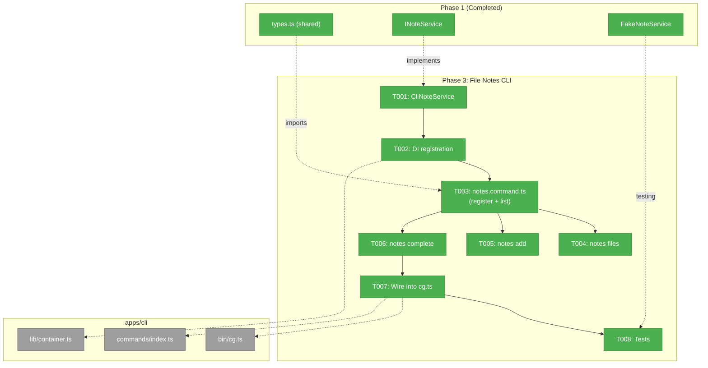
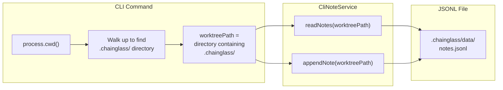
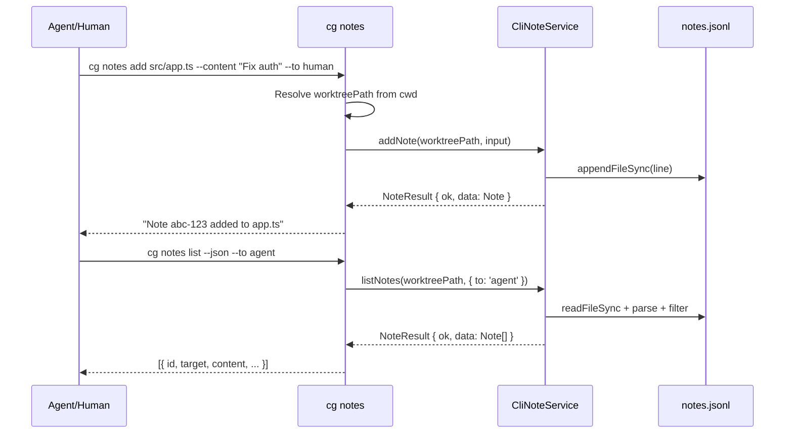

# Phase 3: File Notes CLI — Tasks

**Plan**: [pr-view-plan.md](../../pr-view-plan.md)
**Phase**: Phase 3: File Notes CLI
**Domain**: file-notes
**Generated**: 2026-03-09
**Status**: Ready

---

## Executive Briefing

**Purpose**: Add `cg notes` CLI commands so humans and agents can create, list, complete, and query file notes from the terminal. This is the primary interface for agent-driven note workflows — agents use `cg notes list --json` to read notes addressed to them and `cg notes add` to leave responses.

**What We're Building**: A `notes` command group registered with Commander.js following the `workspace.command.ts` pattern — `cg notes list` (with filters for --file, --status, --to, --link-type, --json), `cg notes files` (list files with notes), `cg notes add <file>` (create note with --content, --line, --to), and `cg notes complete <id>`. A CLI-local `CliNoteService` implementing `INoteService` handles JSONL persistence directly (since the web writer/reader live in `apps/web/` and can't be imported by CLI). Registered in the DI container, tested with FakeNoteService.

**Goals**:
- ✅ `cg notes list` with filters (--file, --status, --to, --link-type)
- ✅ `cg notes list --json` for machine-readable agent consumption
- ✅ `cg notes files` showing file paths with note counts
- ✅ `cg notes add <file>` with --content, --line, --to flags
- ✅ `cg notes complete <id>` marking notes as done
- ✅ CLI-local `CliNoteService` implementing INoteService with JSONL persistence
- ✅ DI container registration
- ✅ Tests using FakeNoteService

**Non-Goals**:
- ❌ No `cg notes edit` (edit content after creation — future)
- ❌ No `cg notes delete` (bulk delete is web-only with YEES confirmation)
- ❌ No `cg notes reply` (threading via CLI — can use `add --thread-id` later)
- ❌ No interactive prompts (per DYK-P5-02: no confirmation prompts)
- ❌ No web UI changes

---

## Prior Phase Context

### Phase 1: File Notes Data Layer — Completed

**A. Deliverables**:
- `packages/shared/src/file-notes/types.ts` — Note discriminated union, all types, runtime guards
- `packages/shared/src/interfaces/note-service.interface.ts` — INoteService (8 methods)
- `packages/shared/src/fakes/fake-note-service.ts` — FakeNoteService with inspection methods
- `apps/web/src/features/071-file-notes/lib/note-writer.ts` — JSONL writer (sync, in web)
- `apps/web/src/features/071-file-notes/lib/note-reader.ts` — JSONL reader (sync, in web)
- `apps/web/app/api/file-notes/route.ts` — API routes
- `apps/web/app/actions/notes-actions.ts` — Server actions
- 38 tests passing

**B. Dependencies Exported**:
- `INoteService` interface from `@chainglass/shared/interfaces`
- All types from `@chainglass/shared/file-notes` (Note, CreateNoteInput, EditNoteInput, NoteFilter, NoteResult, etc.)
- `FakeNoteService` from `@chainglass/shared/fakes`
- Runtime guards: `isNoteLinkType()`, `isNoteAuthor()`, `isNoteAddressee()`

**C. Gotchas & Debt**:
- Writer/reader live in `apps/web/`, NOT in `packages/shared` — CLI cannot import them directly
- Writer functions are **synchronous** (appendFileSync, etc.) — INoteService is **async**
- `listFilesWithNotes()` defaults to `status: 'open'` only
- Reader skips malformed JSONL lines silently
- Atomic rename pattern (write .tmp → rename) prevents corruption

**D. Incomplete Items**: None.

**E. Patterns to Follow**:
- Result pattern: `NoteResult<T> = { ok: true; data: T } | { ok: false; error: string }`
- JSONL format: one JSON line per note, `.chainglass/data/notes.jsonl`
- UUID-based IDs (`crypto.randomUUID()`)
- Newest-first ordering from reader

### Phase 2: File Notes Web UI — Completed

**A. Deliverables**: Notes overlay, NoteCard, NoteModal, BulkDeleteDialog, NoteIndicatorDot, useNotes hook, SDK command. All UI components.

**B. Dependencies Exported**: No new exports relevant to CLI (all UI components).

**C. Gotchas**: Thread grouping algorithm in `useNotes` hook — CLI may want similar grouping for display.

---

## Pre-Implementation Check

| File | Exists? | Domain Check | Notes |
|------|---------|-------------|-------|
| `apps/cli/src/commands/notes.command.ts` | ❌ Create | ✅ file-notes | New command file |
| `apps/cli/src/services/cli-note-service.ts` | ❌ Create | ✅ file-notes | CLI-local INoteService implementation |
| `apps/cli/src/bin/cg.ts` | ✅ Modify | ✅ CLI entry | Register notes command (~240 lines) |
| `apps/cli/src/commands/index.ts` | ✅ Modify | ✅ CLI barrel | Export registerNotesCommands |
| `apps/cli/src/lib/container.ts` | ✅ Modify | ✅ CLI DI | Register INoteService token |
| `test/unit/cli/notes-command.test.ts` | ❌ Create | ✅ test | Tests for all subcommands |

**Concept Duplication Check**: ✅ No existing notes/annotation commands in CLI. No INoteService registration in CLI container.

**Harness**: No agent harness configured.

---

## Architecture Map



---

## Tasks

| Status | ID | Task | Domain | Path(s) | Done When | Notes |
|--------|-----|------|--------|---------|-----------|-------|
| [x] | T001 | Move `note-writer.ts` and `note-reader.ts` from `apps/web/src/features/071-file-notes/lib/` to `packages/shared/src/file-notes/`. Update web imports to use `@chainglass/shared/file-notes`. Add to shared barrel + package.json export path. Rebuild shared. Run contract tests to verify parity. | file-notes | `packages/shared/src/file-notes/note-writer.ts`, `packages/shared/src/file-notes/note-reader.ts`, `packages/shared/src/file-notes/index.ts`, `packages/shared/package.json`, `apps/web/app/actions/notes-actions.ts`, `apps/web/app/api/file-notes/route.ts`, `apps/web/src/features/071-file-notes/lib/jsonl-note-service.ts` | Writer/reader in shared, web imports updated, `pnpm --filter @chainglass/shared build` succeeds, 38 existing tests still pass. CLI and web both import from `@chainglass/shared/file-notes`. | Eliminates duplication. Pure Node.js functions — no web framework dependency. Both apps share one implementation. |
| [x] | T002 | Create `JsonlNoteService` adapter in `packages/shared/src/file-notes/jsonl-note-service.ts` implementing `INoteService` by wrapping the shared writer/reader (sync→async). Register in CLI DI container with a `NOTE_SERVICE` token. Move existing `apps/web/.../jsonl-note-service.ts` to shared if it exists, or create fresh. | file-notes | `packages/shared/src/file-notes/jsonl-note-service.ts`, `apps/cli/src/lib/container.ts` | `container.resolve<INoteService>(NOTE_DI_TOKEN)` returns JsonlNoteService. Contract tests pass against it. Both CLI and web can use same adapter. | Follow WORKSPACE_DI_TOKENS pattern. JsonlNoteService wraps sync functions in async + NoteResult error handling. |
| [x] | T003 | Improve shared `noContextError()` in `command-helpers.ts` to detect `.chainglass/` folder when workspace isn't registered — then create `notes.command.ts` with `list` subcommand. List supports --file, --status, --to, --link-type, --json, --workspace-path. Console output truncates content to 80 chars. JSON outputs `{ errors: [], notes: [...], count: N }`. | file-notes | `apps/cli/src/commands/command-helpers.ts`, `apps/cli/src/commands/notes.command.ts` | Updated `noContextError()`: when context is null, checks `fs.existsSync(path/.chainglass)` — if found, action message says "A .chainglass/ folder was found at {path}. Register it first: cg workspace add \<name\> {path}". This benefits ALL CLI commands, not just notes. Then: `cg notes list` works with all filters. Empty state shows "No notes found." | Cross-cutting improvement. Per AC-28, AC-29, AC-33. Follow workspace.command.ts pattern. |
| [x] | T004 | Implement `cg notes files` subcommand — lists all files that have open notes with note counts | file-notes | `apps/cli/src/commands/notes.command.ts` | Shows file paths sorted alphabetically with note count per file. JSON mode outputs `{ errors: [], files: [{ path, count }] }`. Empty shows "No files with notes." | Per AC-30. Same workspace resolution as T003. |
| [x] | T005 | Implement `cg notes add <file>` subcommand — creates a new note with --content (required), --line (optional), --to (optional: human\|agent), --author (optional, default: human) flags | file-notes | `apps/cli/src/commands/notes.command.ts` | Creates note with `linkType: 'file'`, `author: 'human'` (default — override with --author agent for programmatic use). Prints note ID + confirmation. JSON outputs `{ errors: [], note: Note }`. | Per AC-31. Default author is 'human'. Agents pass --author agent explicitly. |
| [x] | T006 | Implement `cg notes complete <id>` subcommand — marks a note as complete | file-notes | `apps/cli/src/commands/notes.command.ts` | Marks note complete with `completedBy: 'human'` (default for CLI). Prints confirmation. Returns exit code 1 if note not found. JSON outputs `{ errors: [], note: Note }`. | Per AC-32. completedBy defaults to 'human'. Override with --by agent. |
| [x] | T007 | Wire notes command into CLI entry — import + register in `cg.ts` and export from `commands/index.ts` | file-notes | `apps/cli/src/bin/cg.ts`, `apps/cli/src/commands/index.ts` | `cg notes --help` shows all subcommands. `cg notes list` works end-to-end. | Add import + registerNotesCommands(program) call. Add export to index.ts barrel. |
| [x] | T008 | Write tests — unit tests for all subcommands using FakeNoteService, verify console and JSON output formatting | file-notes | `test/unit/cli/notes-command.test.ts` | Tests cover: list (empty, with notes, filters), files (empty, with notes), add (basic, with line, with to), complete (success, not found). All tests include Test Doc comments. `just test-feature 071` passes. | Follow workflow-command.test.ts pattern. Use FakeNoteService. Verify output adapter formatting. |

---

## Context Brief

### Key findings from plan

- **Finding 03 (Critical)**: CLI requires INoteService in shared package before notes.command.ts can be created — interface already exists in shared. CLI needs its own implementation since writer/reader are in web.
- **Finding 02 (Critical)**: JSONL edit approach is simple read-modify-rewrite with atomic rename. CLI implementation must mirror this.

### Domain dependencies

- `file-notes` (self): `INoteService` interface, Note types, FakeNoteService — all from `@chainglass/shared`
- `_platform/file-ops`: Concept only — CLI uses Node.js `fs` directly (same as web writer/reader)

### Domain constraints

- **Cross-app boundary**: CLI (`apps/cli`) CANNOT import from web (`apps/web`). All shared code must live in `packages/shared`.
- **Types from shared**: All Note types, CreateNoteInput, NoteFilter etc. import from `@chainglass/shared/file-notes`
- **INoteService from shared**: Interface from `@chainglass/shared/interfaces`
- **DI pattern**: Per ADR-0004, services resolved from container, not instantiated directly
- **No confirmation prompts**: Per DYK-P5-02, CLI uses --force flag pattern, not interactive prompts
- **Author defaulting**: CLI-created notes default to `author: 'agent'` since CLI is the primary agent interface

### Harness context

No agent harness configured. Agent will use standard testing approach from plan.

### Reusable from prior phases

- `FakeNoteService` from `@chainglass/shared/fakes` — for testing
- Contract test factory `test/contracts/note-service.contract.ts` — can run against CliNoteService
- `ConsoleOutputAdapter` / `JsonOutputAdapter` from `@chainglass/shared` — for output formatting
- `createCliProductionContainer()` from `apps/cli/src/lib/container.ts` — DI container pattern

### Worktree resolution flow



### Command interaction flow



---

## Discoveries & Learnings

_Populated during implementation by plan-6._

| Date | Task | Type | Discovery | Resolution | References |
|------|------|------|-----------|------------|------------|

---

## Directory Layout

```
docs/plans/071-pr-view/
  ├── pr-view-spec.md
  ├── pr-view-plan.md
  ├── research-dossier.md
  ├── workshops/
  │   └── 001-ui-design-github-inspired.md
  ├── tasks/phase-1-file-notes-data-layer/
  │   ├── tasks.md
  │   ├── tasks.fltplan.md
  │   └── execution.log.md
  ├── tasks/phase-2-file-notes-web-ui/
  │   ├── tasks.md
  │   ├── tasks.fltplan.md
  │   └── execution.log.md
  └── tasks/phase-3-file-notes-cli/
      ├── tasks.md                    ← this file
      ├── tasks.fltplan.md            ← flight plan (below)
      └── execution.log.md            # created by plan-6
```
