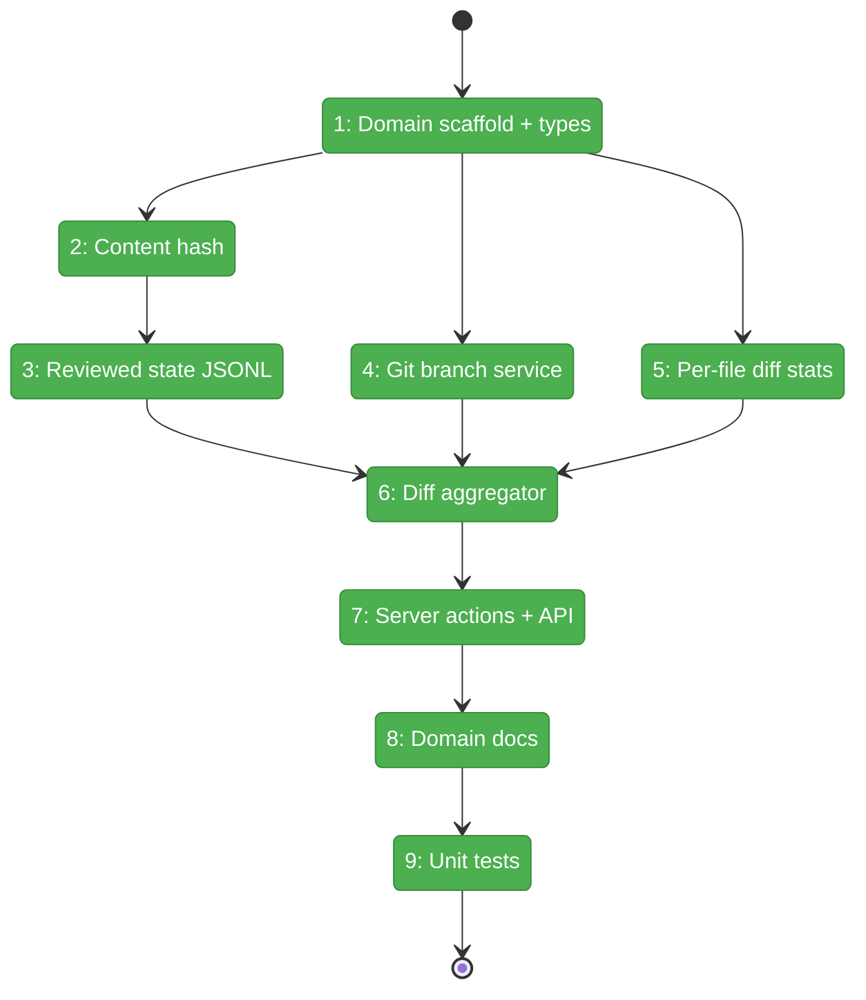
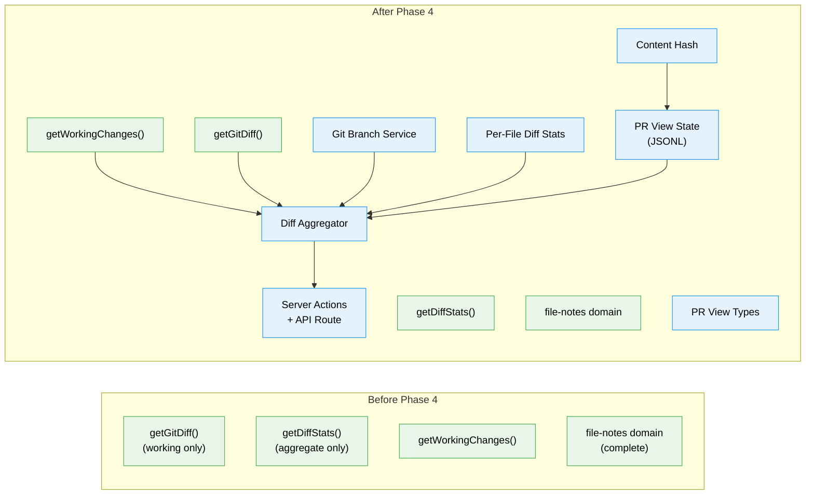

# Flight Plan: Phase 4 — PR View Data Layer

**Plan**: [pr-view-plan.md](../../pr-view-plan.md)
**Phase**: Phase 4: PR View Data Layer
**Generated**: 2026-03-09
**Status**: Landed

---

## Departure -> Destination

**Where we are**: Phases 1-3 delivered the complete File Notes system (data layer, web UI, CLI). The `pr-view` domain does not exist yet — no types, no services, no persistence, no git branch support. The existing `getGitDiff()` only supports working-tree-to-HEAD comparison and `getDiffStats()` returns aggregate-only statistics. There is no reviewed-file tracking or content-hash invalidation.

**Where we're going**: A complete data layer where `aggregatePRViewData(worktree, 'working')` returns a typed `PRViewData` object containing every changed file with its diff content, per-file insertion/deletion stats, and reviewed status loaded from `.chainglass/data/pr-view-state.jsonl`. Content hashes detect when a reviewed file has changed on disk. Both Working (vs HEAD) and Branch (vs main) comparison modes are supported. Phase 5 can render the PR View overlay by simply consuming this data.

---

## Domain Context

### Domains We're Changing

| Domain | What Changes | Key Files |
|--------|-------------|-----------|
| pr-view (NEW) | Create entire domain: types, git services, JSONL state, diff aggregator, server actions, API route | `apps/web/src/features/071-pr-view/`, `apps/web/app/actions/pr-view-actions.ts`, `apps/web/app/api/pr-view/route.ts` |
| — (docs) | Register new pr-view domain | `docs/domains/pr-view/domain.md`, `docs/domains/registry.md`, `docs/domains/domain-map.md` |

### Domains We Depend On (no changes)

| Domain | What We Consume | Contract |
|--------|----------------|----------|
| file-browser | `getWorkingChanges()` — changed file listing | Direct import from `041-file-browser/services/working-changes.ts` |
| — (server lib) | `getGitDiff()` — per-file diff content | `src/lib/server/git-diff-action.ts` |
| _platform/auth | `requireAuth()` — server action auth guard | `@/features/063-login/lib/require-auth` |

---

## Flight Status

<!-- Updated by /plan-6-v2: pending → active → done. Use blocked for problems/input needed. -->

**Legend**: grey = pending | yellow = active | red = blocked/needs input | green = done

---

## Stages

<!-- Updated by /plan-6-v2 during implementation: [ ] → [~] → [x] -->

- [x] **Stage 1: Domain scaffold + types** -- types.ts + index.ts created -- Create feature folder, types.ts (PRViewFile, PRViewFileState, ComparisonMode), barrel index.ts (`apps/web/src/features/071-pr-view/` -- new folder)
- [x] **Stage 2: Content hash** -- `computeContentHash()` via git hash-object
- [x] **Stage 3: Reviewed state JSONL** -- load/save/mark/clear with pruning
- [x] **Stage 4: Git branch service** -- getCurrentBranch, getDefaultBaseBranch, getMergeBase, getChangedFilesBranch
- [x] **Stage 5: Per-file diff stats** -- parseNumstat from git diff --numstat
- [x] **Stage 6: Diff aggregator** -- aggregatePRViewData + getAllDiffs (single git command)
- [x] **Stage 7: Server actions + API** -- fetchPRViewData, markFileAsReviewed, unmarkFileAsReviewed, clearAllReviewedState + GET/POST/DELETE route
- [x] **Stage 8: Domain docs** -- domain.md, registry.md, domain-map.md, C4 diagram, C4 README
- [x] **Stage 9: Unit tests** -- 42 tests (content-hash: 4, pr-view-state: 9, git-branch: 10, diff-stats: 8, get-all-diffs: 11)

---

## Architecture: Before & After

**Legend**: existing (green, unchanged) | changed (orange, modified) | new (blue, created)

---

## Acceptance Criteria

- [ ] AC-12: Viewed state persists across page refreshes (JSONL in `.chainglass/data/`)
- [ ] AC-14a: Two comparison modes supported (Working vs HEAD, Branch vs main)
- [ ] AC-08: Content hash invalidation — reviewed file that changes on disk resets to unreviewed

## Goals & Non-Goals

**Goals**:
- PRViewFile, PRViewFileState, ComparisonMode types
- Reviewed state JSONL persistence with content hash
- Git branch service (getCurrentBranch, getMergeBase, getChangedFilesBranch)
- Per-file diff stats via git diff --numstat
- Diff aggregator assembling complete PRViewData
- Server actions + API route with auth
- Domain documentation + registration
- Unit tests with real git repos

**Non-Goals**:
- No UI components or overlay (Phase 5)
- No SSE/live updates (Phase 6)
- No file tree integration (Phase 7)
- No SDK commands (Phase 5)

---

## Checklist

- [x] T001: Domain scaffold + types.ts
- [x] T002: content-hash.ts (git hash-object)
- [x] T003: pr-view-state.ts (JSONL reviewed state)
- [x] T004: git-branch-service.ts (branch + merge-base)
- [x] T005: per-file-diff-stats.ts (--numstat parser)
- [x] T006: diff-aggregator.ts (assemble PRViewFile[])
- [x] T007: Server actions + API route
- [x] T008: Domain docs (domain.md, registry, domain-map, C4)
- [x] T009: Unit tests
